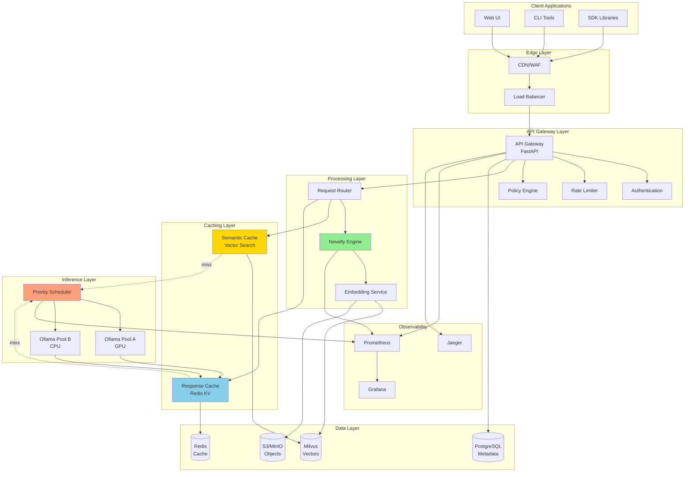
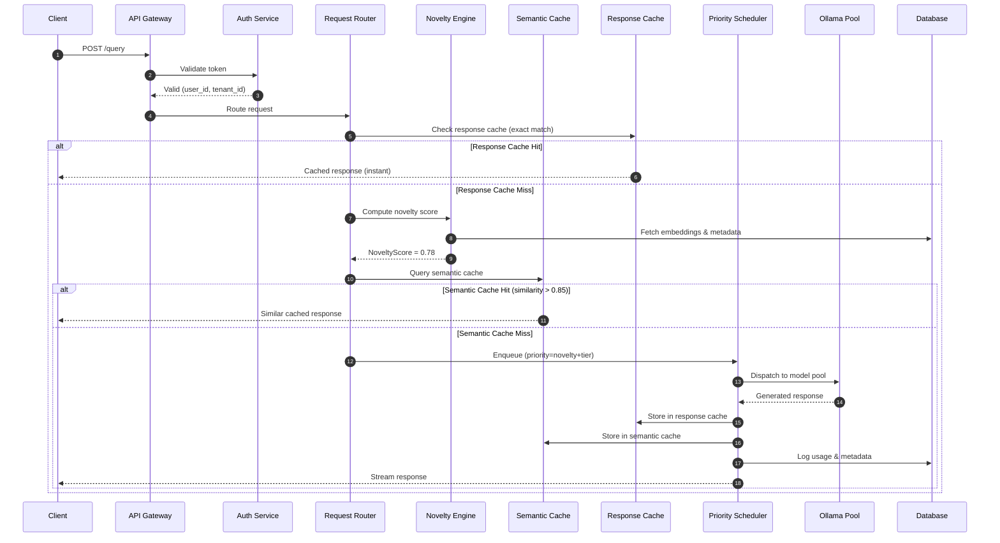
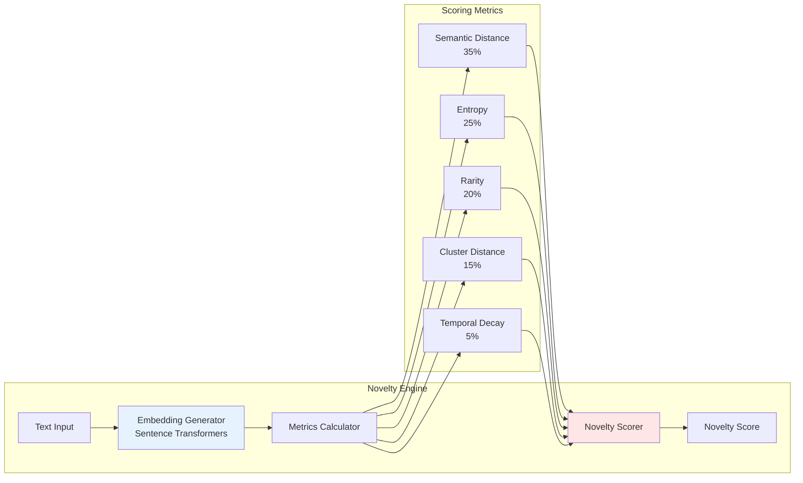
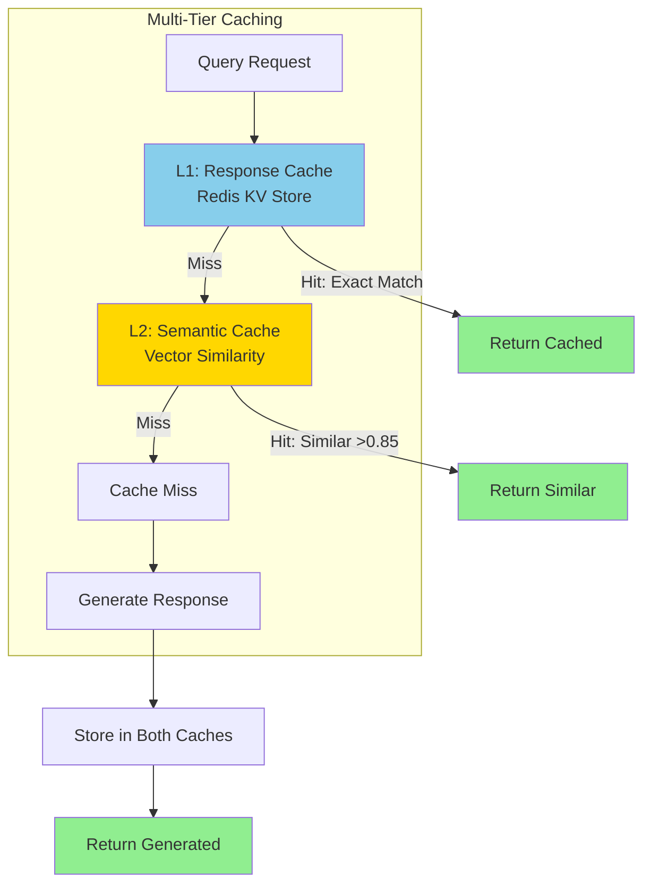
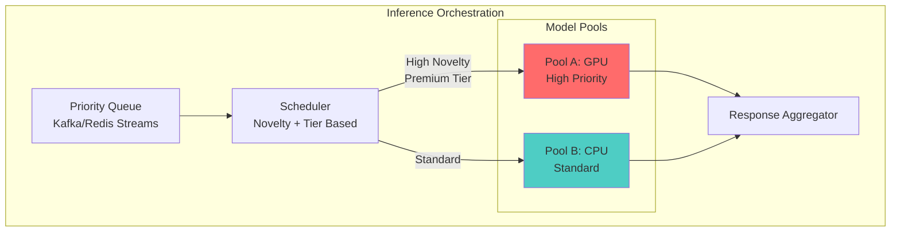
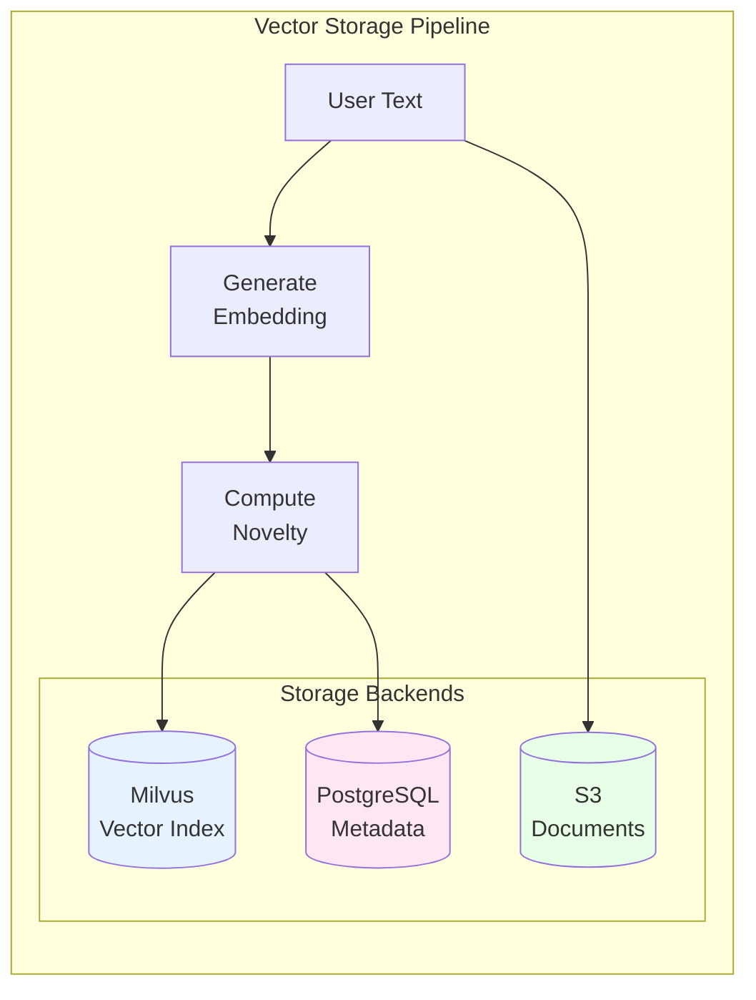
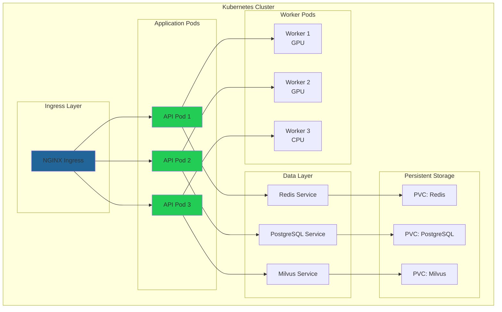
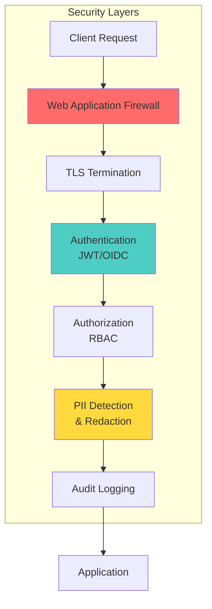

# Architecture Documentation

## System Overview

The Novelty LLM System is designed as a distributed, microservices-based platform that provides intelligent LLM query routing, novelty detection, and multi-tier caching.

## Architecture Diagram

## Request Flow Sequence

## Component Architecture

### 1. Novelty Engine

### 2. Caching System

### 3. Inference Orchestration

## Data Flow

### Embedding Storage

## Deployment Architecture

### Kubernetes Deployment

## Security Architecture

## Scalability Patterns

### Horizontal Scaling

- **API Layer**: Stateless pods behind load balancer
- **Worker Pools**: Auto-scaling based on queue depth
- **Caching**: Redis cluster with sharding
- **Vector DB**: Milvus distributed deployment

### Vertical Scaling

- **GPU Workers**: Scale up for large models
- **Database**: Increase resources for high throughput

### Data Partitioning

- **Tenant Isolation**: Separate collections per tenant
- **Time-based Partitioning**: Archive old data
- **Geographic Distribution**: Multi-region deployment

## Performance Optimization

### Cache Hit Rate Optimization

1. **Semantic Similarity Threshold**: 0.85-0.90
2. **TTL Strategy**: Longer TTL for high-novelty queries
3. **Cache Warming**: Pre-populate with common queries

### Query Optimization

1. **Batch Processing**: Group similar queries
2. **Embedding Reuse**: Cache embeddings
3. **Index Optimization**: Regular FAISS index optimization

## Monitoring & Observability

### Key Metrics

- Request latency (p50, p95, p99)
- Cache hit rates (semantic, response)
- Novelty score distribution
- Model inference time
- Queue depth and wait time

### Dashboards

- System health overview
- Cache performance
- Novelty metrics
- Resource utilization

## Disaster Recovery

### Backup Strategy

- **Database**: Continuous WAL archiving
- **Vector Index**: Daily snapshots
- **Configuration**: Version controlled

### Recovery Procedures

1. Database point-in-time recovery
2. Vector index rebuild from backups
3. Cache warm-up from logs

## Future Enhancements

1. **Multi-Model Support**: A/B testing framework
2. **Fine-tuning Pipeline**: Custom model training
3. **Knowledge Graph**: Novelty-weighted entity graph
4. **Advanced RAG**: Document retrieval integration
5. **Cost Optimization**: Intelligent model routing
