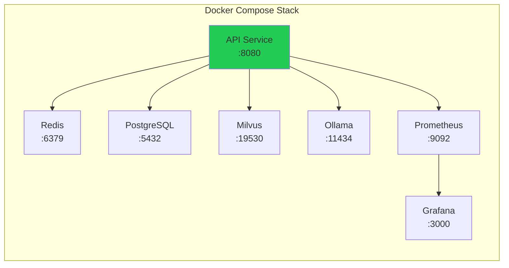
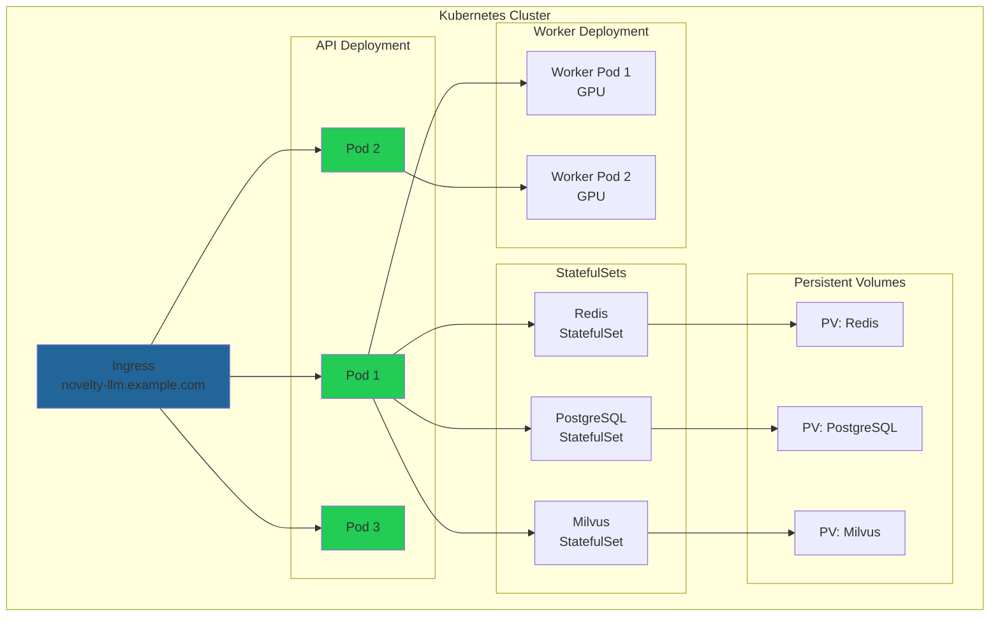

# Deployment Guide

## Table of Contents

- [Prerequisites](#prerequisites)
- [Docker Deployment](#docker-deployment)
- [Kubernetes Deployment](#kubernetes-deployment)
- [Production Deployment](#production-deployment)
- [Configuration](#configuration)
- [Monitoring](#monitoring)
- [Troubleshooting](#troubleshooting)

## Prerequisites

### System Requirements

**Minimum Requirements:**
- CPU: 4 cores
- RAM: 16 GB
- Storage: 100 GB
- OS: Ubuntu 22.04+ / RHEL 8+ / Debian 11+

**Recommended Requirements:**
- CPU: 8+ cores
- RAM: 32+ GB
- GPU: NVIDIA GPU with 8+ GB VRAM (for production)
- Storage: 500+ GB SSD
- OS: Ubuntu 22.04 LTS

### Software Dependencies

- Docker 24.0+
- Docker Compose 2.20+
- Kubernetes 1.28+ (for K8s deployment)
- Python 3.11+
- Git

## Docker Deployment

### Quick Start

```bash
# Clone repository
git clone https://github.com/danindiana/GRYPHGEN.git
cd GRYPHGEN/calisota-ai/August_2025/novelty-llm-system

# Copy environment file
cp .env.example .env

# Edit configuration
nano .env

# Build and start services
make docker-build
make docker-up
```

### Service Access

After deployment, services will be available at:

- **API**: http://localhost:8080
- **Swagger UI**: http://localhost:8080/docs
- **Metrics**: http://localhost:8080/metrics
- **Grafana**: http://localhost:3000 (admin/admin)
- **Prometheus**: http://localhost:9092

### Docker Compose Services



### Service Management

```bash
# View logs
make docker-logs

# View specific service logs
docker-compose -f docker/docker-compose.yml logs -f novelty-llm-api

# Restart services
make docker-down
make docker-up

# Access container shell
make docker-shell

# Clean up
make docker-clean
```

## Kubernetes Deployment

### Prerequisites

- kubectl configured for your cluster
- Helm 3.0+ installed
- Storage class configured
- Ingress controller installed

### Deployment Steps

1. **Create namespace:**

```bash
kubectl create namespace novelty-llm
```

2. **Create secrets:**

```bash
kubectl create secret generic novelty-secrets \
  --from-literal=jwt-secret=your-secret-key \
  --from-literal=postgres-password=your-password \
  --from-literal=redis-password=your-password \
  -n novelty-llm
```

3. **Deploy services:**

```bash
kubectl apply -f docs/kubernetes/ -n novelty-llm
```

4. **Verify deployment:**

```bash
kubectl get pods -n novelty-llm
kubectl get services -n novelty-llm
```

### Kubernetes Architecture



### Auto-scaling Configuration

```yaml
apiVersion: autoscaling/v2
kind: HorizontalPodAutoscaler
metadata:
  name: novelty-llm-api-hpa
spec:
  scaleTargetRef:
    apiVersion: apps/v1
    kind: Deployment
    name: novelty-llm-api
  minReplicas: 3
  maxReplicas: 10
  metrics:
  - type: Resource
    resource:
      name: cpu
      target:
        type: Utilization
        averageUtilization: 70
  - type: Resource
    resource:
      name: memory
      target:
        type: Utilization
        averageUtilization: 80
```

## Production Deployment

### Pre-deployment Checklist

- [ ] Configure production environment variables
- [ ] Set up SSL/TLS certificates
- [ ] Configure backup strategy
- [ ] Set up monitoring and alerting
- [ ] Configure log aggregation
- [ ] Review security settings
- [ ] Set resource limits
- [ ] Configure auto-scaling
- [ ] Test disaster recovery procedures
- [ ] Document runbooks

### Environment Configuration

```bash
# Production environment variables
ENVIRONMENT=production
LOG_LEVEL=INFO

# Security
JWT_SECRET=<strong-random-secret>
RATE_LIMIT_ENABLED=true

# Scaling
API_WORKERS=4
REDIS_MAX_CONNECTIONS=100
POSTGRES_POOL_SIZE=20

# Performance
NOVELTY_DEVICE=cuda
SEMANTIC_CACHE_THRESHOLD=0.90
```

### SSL/TLS Configuration

```nginx
server {
    listen 443 ssl http2;
    server_name novelty-llm.example.com;

    ssl_certificate /etc/ssl/certs/novelty-llm.crt;
    ssl_certificate_key /etc/ssl/private/novelty-llm.key;
    ssl_protocols TLSv1.2 TLSv1.3;
    ssl_ciphers HIGH:!aNULL:!MD5;

    location / {
        proxy_pass http://novelty-llm-api:8080;
        proxy_set_header Host $host;
        proxy_set_header X-Real-IP $remote_addr;
    }
}
```

### Database Migration

```bash
# Run migrations
make db-upgrade

# Create migration
make db-migrate msg="Add new table"

# Rollback
make db-downgrade
```

### Backup Strategy

```bash
# PostgreSQL backup
pg_dump -h localhost -U novelty novelty_db | gzip > backup_$(date +%Y%m%d).sql.gz

# Milvus backup
# Using Milvus Backup tool
milvus-backup create --collection-name novelty_embeddings

# Redis backup
redis-cli BGSAVE
```

## Monitoring

### Prometheus Metrics

Key metrics to monitor:

```
# Request metrics
novelty_llm_requests_total{endpoint, status}
novelty_llm_request_duration_seconds{endpoint}

# Cache metrics
novelty_llm_cache_hits_total{cache_type}
novelty_llm_cache_misses_total{cache_type}

# Novelty metrics
novelty_llm_novelty_score{bucket}

# System metrics
process_cpu_seconds_total
process_resident_memory_bytes
```

### Grafana Dashboards

Import pre-configured dashboards:

1. **System Overview** - Overall health and performance
2. **Cache Performance** - Hit rates and efficiency
3. **Novelty Metrics** - Score distributions
4. **Resource Usage** - CPU, memory, storage

### Alerting Rules

```yaml
groups:
  - name: novelty_llm_alerts
    rules:
      - alert: HighErrorRate
        expr: rate(novelty_llm_requests_total{status="error"}[5m]) > 0.05
        for: 5m
        labels:
          severity: critical
        annotations:
          summary: High error rate detected

      - alert: LowCacheHitRate
        expr: rate(novelty_llm_cache_hits_total[5m]) / rate(novelty_llm_requests_total[5m]) < 0.3
        for: 10m
        labels:
          severity: warning
        annotations:
          summary: Cache hit rate is low
```

## Troubleshooting

### Common Issues

#### Service Won't Start

```bash
# Check logs
make docker-logs

# Check container status
docker-compose -f docker/docker-compose.yml ps

# Verify environment variables
docker-compose -f docker/docker-compose.yml config
```

#### High Memory Usage

```bash
# Check Redis memory
redis-cli INFO memory

# Clear caches
curl -X DELETE http://localhost:8080/cache/clear

# Adjust cache TTL in config
```

#### Slow Response Times

```bash
# Check cache stats
curl http://localhost:8080/cache/stats

# Monitor metrics
curl http://localhost:8080/metrics | grep duration

# Check database connections
psql -h localhost -U novelty -d novelty_db -c "SELECT count(*) FROM pg_stat_activity;"
```

#### Vector Database Issues

```bash
# Check Milvus status
curl http://localhost:9091/healthz

# Rebuild index
# Connect to Milvus and run maintenance
```

### Performance Tuning

#### API Server

```python
# Increase workers
API_WORKERS=8

# Enable keep-alive
uvicorn src.api.gateway:create_app --workers 8 --keep-alive 30
```

#### Redis Optimization

```bash
# In redis.conf
maxmemory 4gb
maxmemory-policy allkeys-lru
tcp-backlog 511
```

#### PostgreSQL Optimization

```sql
-- Increase connections
ALTER SYSTEM SET max_connections = 200;

-- Optimize shared buffers
ALTER SYSTEM SET shared_buffers = '4GB';

-- Enable query parallelism
ALTER SYSTEM SET max_parallel_workers = 8;
```

### Health Checks

```bash
# API health
curl http://localhost:8080/health

# Redis health
redis-cli ping

# PostgreSQL health
pg_isready -h localhost -U novelty

# Milvus health
curl http://localhost:9091/healthz
```

## Security Hardening

### Network Security

- Use private networks for service communication
- Enable TLS for all external connections
- Configure firewall rules
- Implement network policies in Kubernetes

### Application Security

- Rotate JWT secrets regularly
- Enable PII detection and redaction
- Implement rate limiting
- Use RBAC for access control
- Regular security scanning

### Data Security

- Encrypt data at rest
- Encrypt data in transit
- Regular backups
- Secure backup storage
- Test recovery procedures

## Disaster Recovery

### Backup Procedures

```bash
# Full system backup
./scripts/backup.sh --full

# Database only
./scripts/backup.sh --database

# Vector index only
./scripts/backup.sh --vectors
```

### Recovery Procedures

```bash
# Restore from backup
./scripts/restore.sh --backup-file backup_20241118.tar.gz

# Database point-in-time recovery
pg_restore -d novelty_db backup.sql
```

### High Availability

- Multi-region deployment
- Database replication
- Redis clustering
- Load balancer failover
- Regular DR drills
