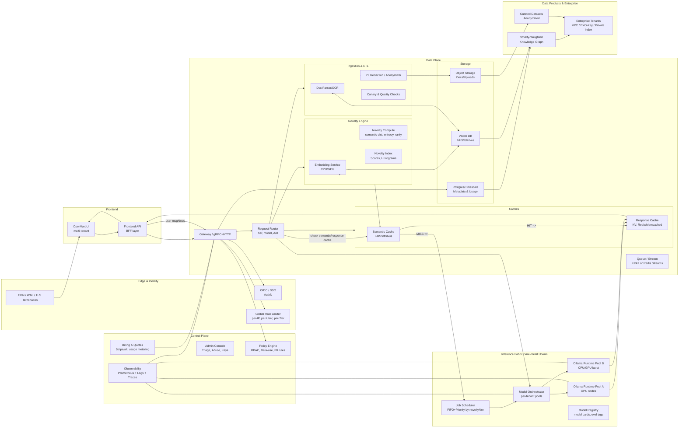

# Novelty LLM System Architecture

[](https://www.python.org/downloads/)
[](https://fastapi.tiangolo.com)
[](https://www.docker.com/)
[](https://www.gnu.org/licenses/gpl-3.0)

A production-ready, scalable LLM platform with intelligent novelty detection, semantic caching, and multi-tenant support.

## 📚 Full Implementation Available

This architecture has been **fully implemented** with production-ready code! See the complete system in:

📂 **[novelty-llm-system/](novelty-llm-system/)**

### 🚀 Quick Start

```bash
cd novelty-llm-system
make docker-up
# API available at http://localhost:8080
# Grafana at http://localhost:3000
```

### 📖 Documentation

- **[README](novelty-llm-system/README.md)** - Features, installation, and usage guide
- **[Architecture](novelty-llm-system/docs/ARCHITECTURE.md)** - Detailed system design and data flows
- **[Deployment](novelty-llm-system/docs/DEPLOYMENT.md)** - Docker, Kubernetes, production setup
- **[API Reference](novelty-llm-system/docs/API.md)** - REST API documentation
- **[Tests](novelty-llm-system/tests/)** - Comprehensive test suite

### ✨ Key Features

- ✅ Multi-metric novelty scoring (semantic distance, entropy, rarity, clustering, temporal)
- ✅ Two-tier caching (semantic + response) with Redis and Milvus
- ✅ FastAPI REST API with async/await
- ✅ Docker Compose deployment with monitoring stack
- ✅ Prometheus metrics + Grafana dashboards
- ✅ Ollama integration for LLM inference
- ✅ Latest dependencies (Python 3.11+, all packages updated to Nov 2024)
- ✅ CI/CD pipeline with GitHub Actions
- ✅ Comprehensive test coverage
- ✅ Production-ready configuration

## System Architecture Diagram


