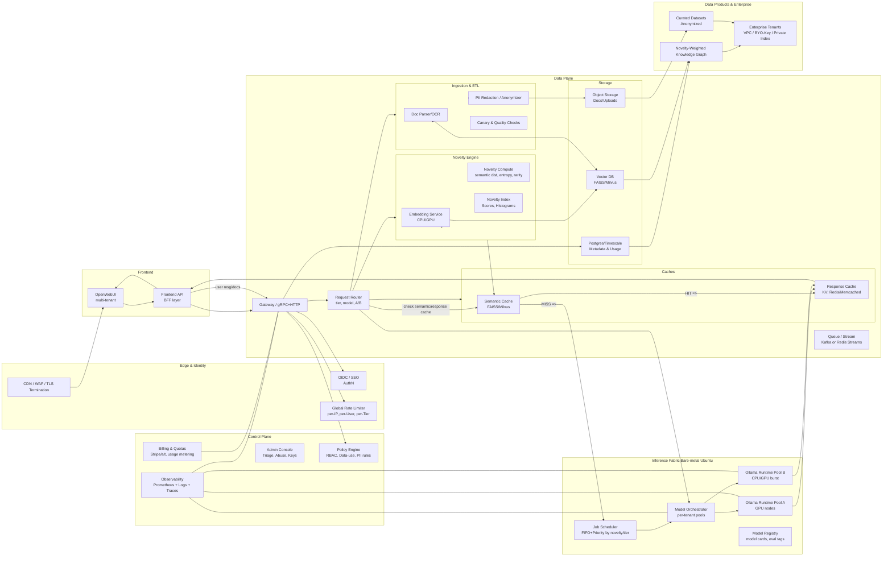

```mermaid
flowchart LR
  %% ==== CLIENT & EDGE ====
  subgraph EDGE["Edge & Identity"]
    CDN[CDN / WAF / TLS Termination]
    OIDC[OIDC / SSO<br/>AuthN]
    RATEL[Global Rate Limiter<br/>per-IP, per-User, per-Tier]
  end

  %% ==== FRONTEND ====
  subgraph FE["Frontend"]
    OWUI[OpenWebUI<br/>multi-tenant]
    FE_API[Frontend API<br/>BFF layer]
  end

  %% ==== CONTROL PLANE ====
  subgraph CP["Control Plane"]
    POL[Policy Engine<br/>RBAC, Data-use, PII rules]
    BILL[Billing & Quotas<br/>Stripe/alt, usage metering]
    ADMIN[Admin Console<br/>Triage, Abuse, Keys]
    OBS[Observability<br/>Prometheus + Logs + Traces]
  end

  %% ==== DATA PLANE ====
  subgraph DP["Data Plane"]
    API[Gateway / gRPC+HTTP]
    Q[Queue / Stream<br/>Kafka or Redis Streams]
    ROUTER[Request Router<br/>tier, model, A/B]
    subgraph NOV["Novelty Engine"]
      EMB[Embedding Service<br/>CPU/GPU]
      NCOMP[Novelty Compute<br/>semantic dist, entropy, rarity]
      NIDX[Novelty Index<br/>Scores, Histograms]
    end
    subgraph CACHE["Caches"]
      SCACHE[Semantic Cache<br/>FAISS/Milvus]
      RCACHE[Response Cache<br/>KV: Redis/Memcached]
    end
    subgraph STO["Storage"]
      PG[Postgres/Timescale<br/>Metadata & Usage]
      OBJ[Object Storage<br/>Docs/Uploads]
      IDX[Vector DB<br/>FAISS/Milvus]
    end
    subgraph ETL["Ingestion & ETL"]
      PARSE[Doc Parser/OCR]
      CLN[PII Redaction / Anonymizer]
      CAN[Canary & Quality Checks]
    end
  end

  %% ==== INFERENCE FABRIC ====
  subgraph INF["Inference Fabric Bare-metal Ubuntu"]
    ORCH[Model Orchestrator<br/>per-tenant pools]
    OLLAMA1[Ollama Runtime Pool A<br/>GPU nodes]
    OLLAMA2[Ollama Runtime Pool B<br/>CPU/GPU burst]
    REG[Model Registry<br/>model cards, eval tags]
    SCH[Job Scheduler<br/>FIFO+Priority by novelty/tier]
  end

  %% ==== DATA PRODUCTS ====
  subgraph PROD["Data Products & Enterprise"]
    KGRAPH[Novelty-Weighted Knowledge Graph]
    DATAKIT[Curated Datasets<br/>Anonymized]
    ENT[Enterprise Tenants<br/>VPC / BYO-Key / Private Index]
  end

  %% ==== FLOWS ====
  CDN --> OWUI
  OWUI --> FE_API --> API
  API --> RATEL
  API --> OIDC
  API --> POL
  API --> ROUTER

  ROUTER --> NOV
  ROUTER --> CACHE
  ROUTER --> ETL
  ROUTER --> ORCH

  %% Novelty path
  FE_API -- user msg/docs --> API
  NOV --> EMB
  EMB --> IDX
  NOV --> NIDX
  NOV --> SCACHE

  %% Cache decision
  ROUTER -- "check semantic/response cache" --> SCACHE
  SCACHE -- "HIT =>" --> RCACHE
  SCACHE -- "MISS =>" --> SCH

  %% Inference
  SCH --> ORCH
  ORCH --> OLLAMA1
  ORCH --> OLLAMA2
  OLLAMA1 --> RCACHE
  OLLAMA2 --> RCACHE

  %% Storage and telemetry
  ETL --> CLN --> OBJ
  ETL --> PARSE --> IDX
  API --> PG
  RCACHE --> FE_API
  FE_API --> OWUI

  %% Control plane connections
  OBS --- API
  OBS --- ORCH
  OBS --- OLLAMA1
  OBS --- OLLAMA2
  BILL --- API
  ADMIN --- CP

  %% Productization
  PG --> KGRAPH
  IDX --> KGRAPH
  OBJ --> DATAKIT
  KGRAPH --> ENT
  DATAKIT --> ENT
```
