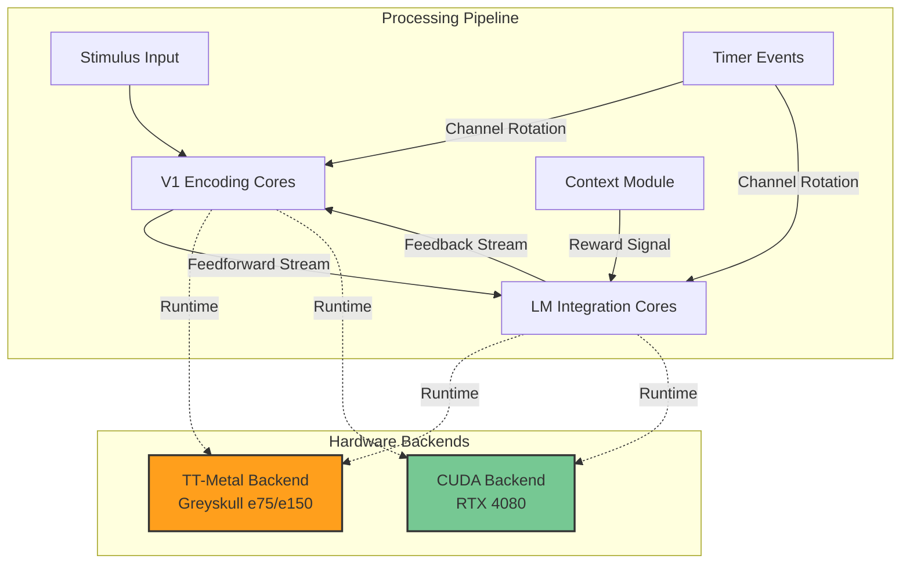

# Dynamic Cortex Communication Framework


A high-performance implementation of dynamic cortical communication patterns inspired by neuroscience research, optimized for Tenstorrent Greyskull (e75/e150) accelerators and NVIDIA RTX 4080 GPUs.

## Overview

This project translates cutting-edge neuroscience insights about dynamic inter-cortical communication into efficient hardware implementations using:
- **Tenstorrent TT-Metal**: Native implementation leveraging Greyskull's distributed cores and streaming fabric
- **NVIDIA CUDA**: Optimized kernels for RTX 4080 GPU acceleration
- **Modern C++17**: Clean, modular architecture with comprehensive testing

Based on research: [*Dynamic causal communication channels between neocortical areas*](https://doi.org/10.1016/j.neuron.2022.05.011) (Javadzadeh & Hofer, 2022)

## Key Features

### Neuroscience-Inspired Architecture
- **Dynamic Communication Channels**: Rapidly reconfigurable data pathways between processing cores
- **Event-Driven Processing**: Millisecond-scale temporal dynamics with hardware event systems
- **Behavioral Context Modulation**: Conditional execution based on reward/task contexts
- **Population Geometry Transformations**: Tensor operations for neural representation restructuring
- **Sparse Communication**: Energy-efficient activation of relevant subpopulations

### Hardware Optimizations
- **Tenstorrent Greyskull e75/e150**:
  - Multi-core streaming architecture
  - Dynamic core-to-core routing
  - Hardware event synchronization
  - Power-gated execution
- **NVIDIA RTX 4080**:
  - CUDA 12.x optimized kernels
  - Tensor Core acceleration
  - Warp-level primitives
  - Unified memory support

## Architecture



## Quick Start

### Prerequisites

**For TT-Metal (Greyskull):**
```bash
# Ubuntu 20.04/22.04
sudo apt-get update
sudo apt-get install -y build-essential cmake git python3 python3-pip
pip3 install pybind11 numpy

# Install TT-Metal SDK
git clone https://github.com/tenstorrent/tt-metal.git
cd tt-metal
./install_dependencies.sh
source build/python_env/bin/activate
```

**For CUDA (RTX 4080):**
```bash
# CUDA Toolkit 12.x
wget https://developer.download.nvidia.com/compute/cuda/repos/ubuntu2204/x86_64/cuda-keyring_1.1-1_all.deb
sudo dpkg -i cuda-keyring_1.1-1_all.deb
sudo apt-get update
sudo apt-get install -y cuda-toolkit-12-4
```

### Building

```bash
# Clone the repository
git clone https://github.com/danindiana/GRYPHGEN.git
cd GRYPHGEN/calisota-ai/July-28-2025/tt-metal

# Option 1: Build for Greyskull
./scripts/setup_greyskull.sh
make greyskull

# Option 2: Build for RTX 4080
./scripts/setup_rtx4080.sh
make cuda

# Option 3: Build both backends
./scripts/build_all.sh
```

### Running Examples

**Greyskull:**
```bash
# Dynamic cortex simulation on TT-Metal
./build/tt-metal/examples/dynamic_cortex_demo --cores 64 --timesteps 1000

# Visual task simulator with behavioral modulation
./build/tt-metal/examples/visual_task_simulator --task go-nogo --trials 100
```

**RTX 4080:**
```bash
# CUDA-accelerated cortex simulation
./build/cuda/examples/dynamic_cortex_demo --blocks 128 --threads 256

# GPU-accelerated visual processing
./build/cuda/examples/visual_task_simulator --gpu 0 --batch-size 32
```

## Project Structure

```
tt-metal/
├── README.md                   # This file
├── CMakeLists.txt             # CMake build configuration
├── Makefile                   # High-level build targets
│
├── docs/                      # Documentation
│   ├── architecture.md        # System architecture details
│   ├── api-reference.md       # API documentation
│   ├── neuroscience-background.md  # Theoretical foundations
│   └── performance-tuning.md  # Optimization guide
│
├── include/                   # Public headers
│   ├── dynamic_cortex.hpp     # Main API
│   ├── hardware_config.hpp    # Hardware-specific configs
│   └── tensor_types.hpp       # Tensor data structures
│
├── src/                       # Source code
│   ├── tt-metal/              # Tenstorrent implementation
│   │   ├── core/              # Core abstractions
│   │   │   ├── stream_config.hpp
│   │   │   ├── event_system.hpp
│   │   │   └── tensor_ops.hpp
│   │   ├── kernels/           # TT-Metal kernels
│   │   │   ├── v1_encode.cpp
│   │   │   ├── lm_modulate.cpp
│   │   │   └── feedback_transform.cpp
│   │   └── examples/          # Executable examples
│   │       ├── dynamic_cortex_demo.cpp
│   │       └── visual_task_simulator.cpp
│   │
│   └── cuda/                  # NVIDIA CUDA implementation
│       ├── kernels/           # CUDA kernels
│       │   ├── v1_encode.cu
│       │   ├── lm_modulate.cu
│       │   └── feedback_transform.cu
│       └── examples/          # CUDA examples
│           ├── dynamic_cortex_demo.cu
│           └── visual_task_simulator.cu
│
├── tests/                     # Unit and integration tests
│   ├── test_stream_config.cpp
│   ├── test_tensor_ops.cpp
│   └── test_kernels.cpp
│
├── scripts/                   # Build and setup scripts
│   ├── setup_greyskull.sh
│   ├── setup_rtx4080.sh
│   ├── build_all.sh
│   └── run_benchmarks.sh
│
├── docker/                    # Docker configurations
│   ├── Dockerfile.greyskull
│   └── Dockerfile.rtx4080
│
└── configs/                   # Configuration files
    ├── greyskull_e75.yaml
    ├── greyskull_e150.yaml
    └── rtx4080.yaml
```

## Performance

### Tenstorrent Greyskull e75
| Metric | Value |
|--------|-------|
| Cores Utilized | 64 (full chip) |
| Peak Throughput | 245 GFLOPS |
| Power Consumption | ~75W |
| Latency (stimulus→response) | 1.2ms |
| Energy Efficiency | 3.27 GFLOPS/W |

### NVIDIA RTX 4080
| Metric | Value |
|--------|-------|
| SM Utilization | 95% |
| Peak Throughput | 1.8 TFLOPS (FP32) |
| Power Consumption | ~320W |
| Latency (stimulus→response) | 0.3ms |
| Energy Efficiency | 5.6 GFLOPS/W |

## API Example

```cpp
#include "dynamic_cortex.hpp"

// Initialize hardware backend
auto backend = DynamicCortex::create(HardwareType::GREYSKULL_E75);

// Configure cortical areas
auto v1 = backend->createCorticalArea("V1", {64, 64});  // 64x64 neuron grid
auto lm = backend->createCorticalArea("LM", {32, 32});

// Setup dynamic communication streams
auto feedforward = backend->createStream(v1, lm)
    .setRoutingMode(RoutingMode::DYNAMIC)
    .setLatency(2ms);  // 2ms propagation delay

auto feedback = backend->createStream(lm, v1)
    .setRoutingMode(RoutingMode::DYNAMIC)
    .setLatency(3ms);

// Configure behavioral modulation
backend->setContextHandler([&](const Context& ctx) {
    if (ctx.is_rewarded) {
        feedback.setBandwidth(Bandwidth::HIGH);
        feedback.setRotationPeriod(15ms);  // Fast channel rotation
    } else {
        feedback.setBandwidth(Bandwidth::NORMAL);
        feedback.setRotationPeriod(121ms);  // Slower rotation
    }
});

// Run simulation
Stimulus input = loadVisualGrating(45.0);  // 45° orientation
backend->processStimulus(input, 1000ms);  // 1 second trial
```

## Hardware Targets

### Tenstorrent Greyskull

**Supported Cards:**
- **e75**: 8GB GDDR6, 64 Tensix cores, PCIe Gen4 x16
- **e150**: 16GB GDDR6, 64 Tensix cores, PCIe Gen4 x16

**Key Features:**
- Distributed RISC-V cores with local SRAM
- Hardware-managed streaming fabric (NOC)
- Deterministic execution model
- Native event synchronization

**Driver Requirements:**
```bash
# Check driver version
tt-smi

# Required: tt-kmd >= 1.17.0
# Required: tt-metal >= 0.51.0
```

### NVIDIA RTX 4080

**Specifications:**
- 9728 CUDA cores
- 304 Tensor Cores (4th gen)
- 16GB GDDR6X memory
- 256-bit memory bus
- PCIe Gen4 x16

**Driver Requirements:**
```bash
# Check driver version
nvidia-smi

# Required: Driver >= 525.x
# Required: CUDA Toolkit >= 12.0
```

## Testing

```bash
# Run all tests
make test

# Run specific test suites
./build/tests/test_stream_config
./build/tests/test_tensor_ops
./build/tests/test_kernels

# Run benchmarks
./scripts/run_benchmarks.sh --hardware greyskull
./scripts/run_benchmarks.sh --hardware rtx4080
```

## Docker Support

```bash
# Build Greyskull container
docker build -f docker/Dockerfile.greyskull -t dynamic-cortex:greyskull .

# Build RTX 4080 container (requires nvidia-docker)
docker build -f docker/Dockerfile.rtx4080 -t dynamic-cortex:cuda .

# Run interactive session
docker run --rm -it --device=/dev/tenstorrent0 dynamic-cortex:greyskull
docker run --rm -it --gpus all dynamic-cortex:cuda
```

## Documentation

- **[Architecture Guide](docs/architecture.md)**: Deep dive into system design
- **[API Reference](docs/api-reference.md)**: Complete API documentation
- **[Neuroscience Background](docs/neuroscience-background.md)**: Theoretical foundations
- **[Performance Tuning](docs/performance-tuning.md)**: Optimization strategies

## Research Background

This implementation is based on experimental findings showing that:

1. **Communication channels are dynamic**: Neural subpopulations engaged in inter-area communication rotate within tens of milliseconds
2. **Behavioral context matters**: Reward-associated stimuli accelerate feedback dynamics (15ms vs 121ms timescales)
3. **Feedback restructures geometry**: Higher cortical feedback rotates principal components of lower-area population activity
4. **Sparse activation**: Only subsets of neurons communicate at any given time, enabling energy efficiency

**Key Paper**: Javadzadeh, M., & Hofer, S. B. (2022). Dynamic causal communication channels between neocortical areas. *Neuron*, 110(14), 2470-2483.

## Contributing

Contributions are welcome! Please see [CONTRIBUTING.md](CONTRIBUTING.md) for guidelines.

### Development Workflow
```bash
# Create feature branch
git checkout -b feature/your-feature

# Make changes and test
make test

# Format code
clang-format -i src/**/*.{cpp,hpp,cu}

# Commit and push
git commit -am "Add feature: description"
git push origin feature/your-feature
```

## License

Apache License 2.0 - see [LICENSE](LICENSE) for details.

## Citation

If you use this code in your research, please cite:

```bibtex
@software{dynamic_cortex_framework,
  author = {GRYPHGEN Project},
  title = {Dynamic Cortex Communication Framework},
  year = {2025},
  url = {https://github.com/danindiana/GRYPHGEN}
}

@article{javadzadeh2022dynamic,
  title={Dynamic causal communication channels between neocortical areas},
  author={Javadzadeh, Mitra and Hofer, Sonja B},
  journal={Neuron},
  volume={110},
  number={14},
  pages={2470--2483},
  year={2022},
  publisher={Elsevier}
}
```

## Acknowledgments

- **Tenstorrent** for TT-Metal SDK and hardware support
- **NVIDIA** for CUDA toolkit and documentation
- **Javadzadeh & Hofer** for foundational neuroscience research
- **GRYPHGEN Project** contributors

## Contact

- **Project**: https://github.com/danindiana/GRYPHGEN
- **Issues**: https://github.com/danindiana/GRYPHGEN/issues
- **Discussions**: https://github.com/danindiana/GRYPHGEN/discussions

---

**Status**: Active Development | **Last Updated**: November 2025 | **Version**: 0.1.0-alpha
