# System Architecture

## Overview

The Dynamic Cortex Communication Framework implements neuroscience-inspired algorithms on hardware accelerators using a modular, backend-agnostic architecture.

## High-Level Architecture

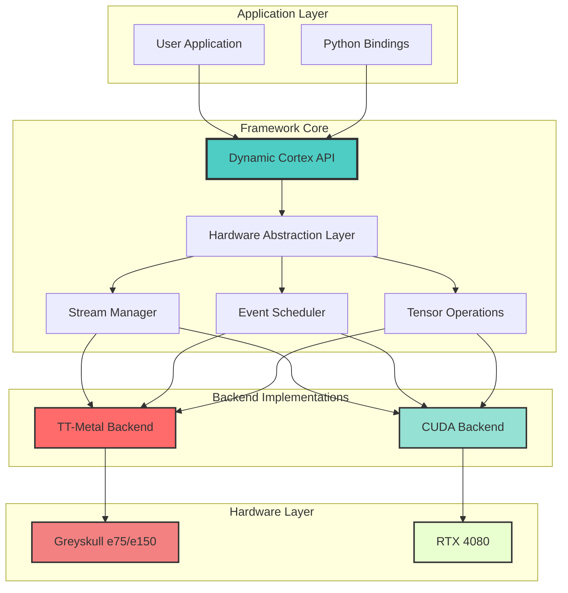

## Core Components

### 1. Cortical Area Abstraction

Represents a group of processing elements (neurons) with local state and connectivity.

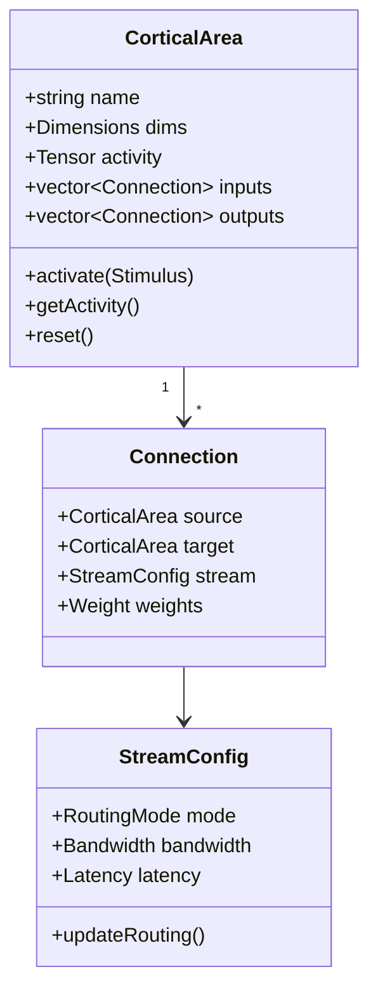

### 2. Dynamic Communication Streams

Implements reconfigurable data pathways with temporal dynamics.

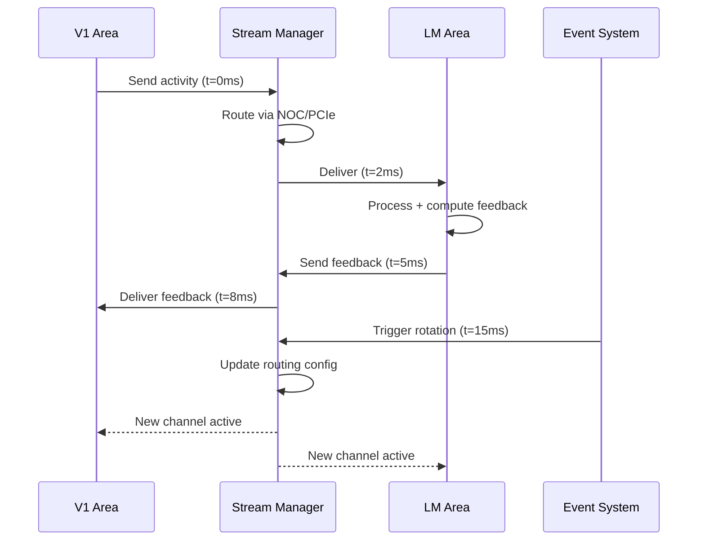

### 3. Event-Driven Execution

Millisecond-scale temporal control using hardware events.

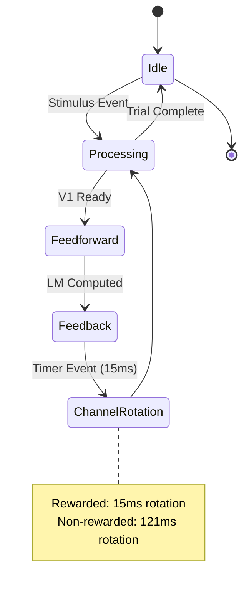

## TT-Metal Backend Architecture

### Core Mapping

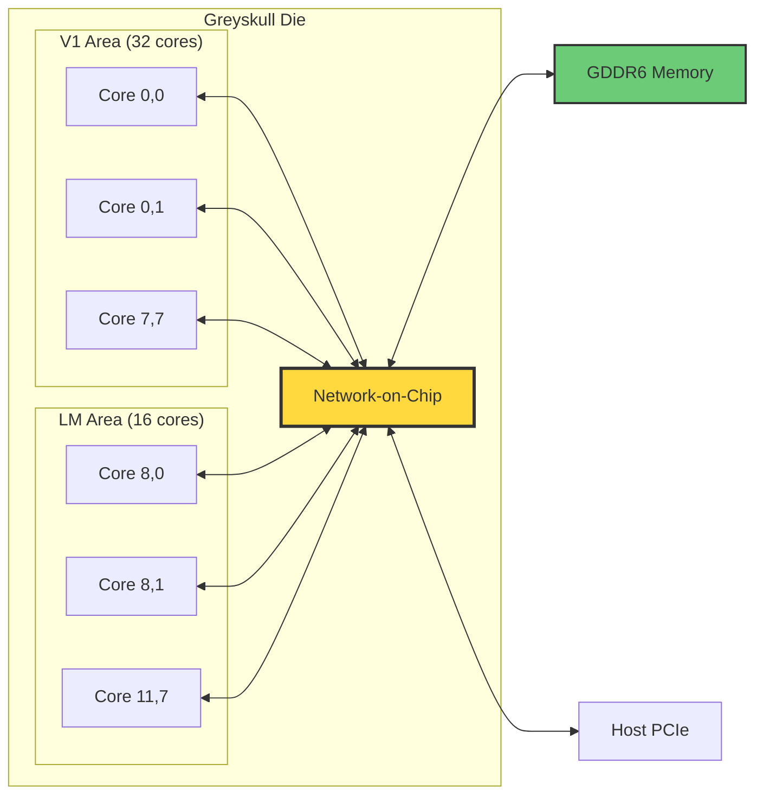

### Kernel Execution Model

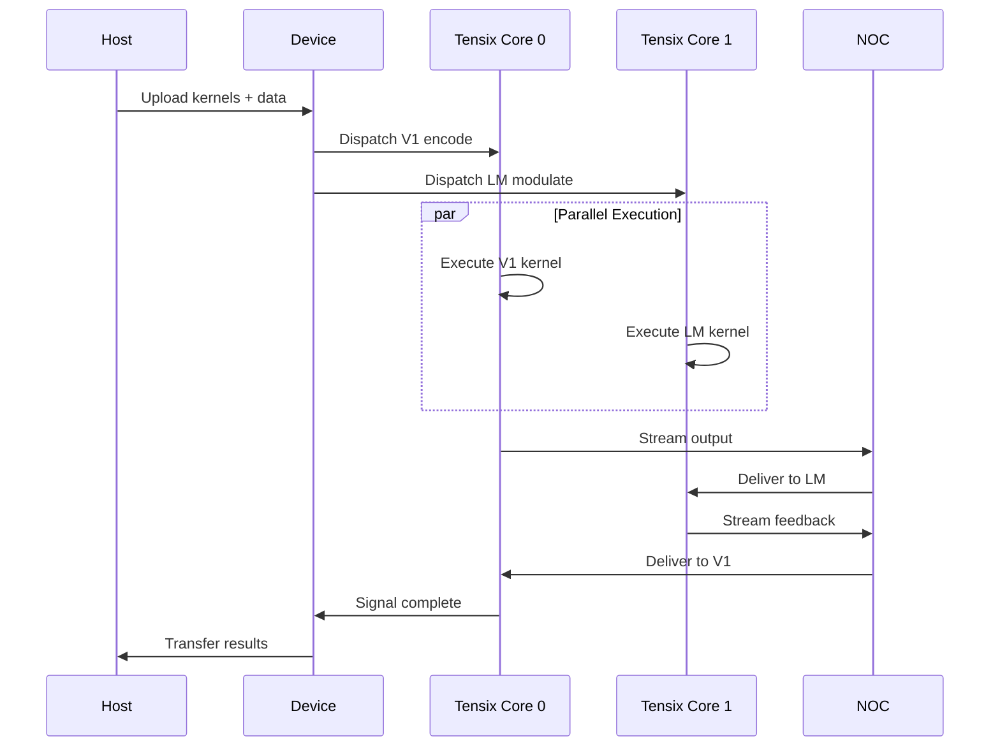

### Memory Hierarchy

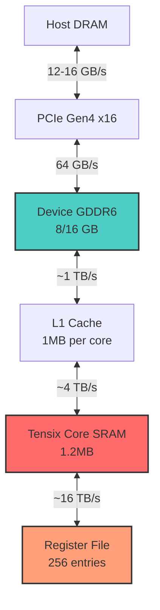

## CUDA Backend Architecture

### Block/Thread Mapping

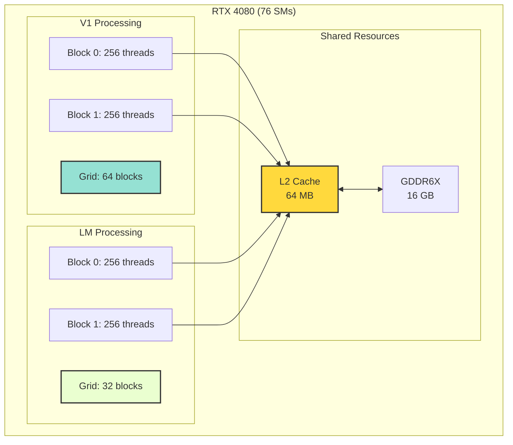

### Warp Execution Timeline

```mermaid
gantt
    title CUDA Kernel Execution (RTX 4080)
    dateFormat X
    axisFormat %L ms

    section V1 Encode
    Warp 0-7 :active, 0, 5
    Warp 8-15 :active, 0, 5

    section Feedforward
    Transfer V1→LM :crit, 5, 6

    section LM Modulate
    Warp 0-7 :active, 6, 10
    Tensor Core ops :active, 7, 9

    section Feedback
    Transfer LM→V1 :crit, 10, 11

    section V1 Update
    Warp 0-7 :active, 11, 14
```

## Data Flow

### Stimulus Processing Pipeline

```mermaid
graph LR
    A[Input Stimulus<br/>45° Grating] --> B[Preprocessing<br/>Normalization]
    B --> C[V1 Encoding<br/>Gabor Filters]
    C --> D[Feedforward Stream<br/>2ms latency]
    D --> E[LM Integration<br/>Context Modulation]
    E --> F[Feedback Stream<br/>3ms latency]
    F --> G[V1 Restructuring<br/>PC Rotation]
    G --> H[Output Activity<br/>Population Response]

    style A fill:#E3F2FD,stroke:#333,stroke-width:2px
    style C fill:#FFE0B2,stroke:#333,stroke-width:2px
    style E fill:#F8BBD0,stroke:#333,stroke-width:2px
    style G fill:#C8E6C9,stroke:#333,stroke-width:2px
    style H fill:#B2EBF2,stroke:#333,stroke-width:2px
```

### Behavioral Context Modulation

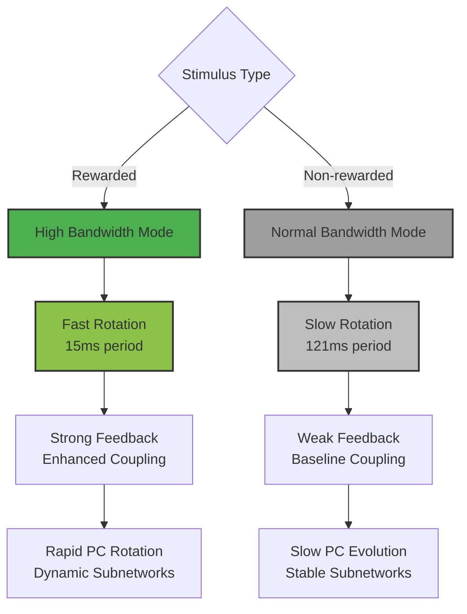

## Communication Channel Dynamics

### Channel Rotation Mechanism

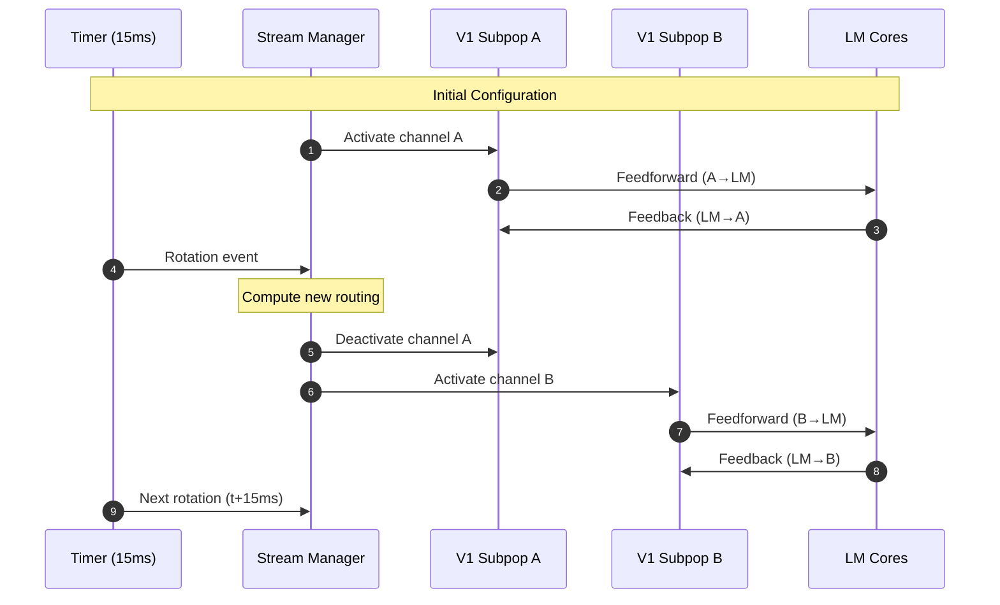

### Sparse Activation Pattern

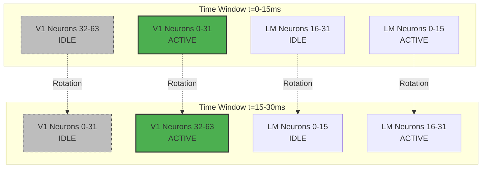

## Tensor Operations

### Population Geometry Transformation

```mermaid
graph LR
    A[V1 Activity<br/>N x T matrix] --> B[Compute Covariance<br/>C = A·Aᵀ]
    B --> C[PCA Decomposition<br/>C = U·Σ·Uᵀ]
    C --> D[Feedback Rotation<br/>R = LM_feedback]
    D --> E[Apply Transformation<br/>A' = R·A]
    E --> F[Normalize Variance<br/>var(A') = var(A)]
    F --> G[Updated V1 Activity<br/>Rotated PCs]

    style B fill:#E1F5FE,stroke:#333,stroke-width:2px
    style C fill:#F3E5F5,stroke:#333,stroke-width:2px
    style D fill:#FFF3E0,stroke:#333,stroke-width:2px
    style E fill:#E8F5E9,stroke:#333,stroke-width:2px
```

### Matrix Operations Mapping

**TT-Metal:**
```cpp
// Leverages Tensix matrix engine
TensorOp matmul = TensorOp::MATMUL
    .set_input_layout(TileLayout::ROW_MAJOR)
    .set_output_layout(TileLayout::ROW_MAJOR)
    .set_math_fidelity(MathFidelity::HiFi4);

Tensor result = matmul(rotation_matrix, v1_activity);
```

**CUDA:**
```cpp
// Uses Tensor Cores for mixed-precision
cublasLtMatmul(handle,
    CUBLAS_OP_N, CUBLAS_OP_N,
    m, n, k,
    &alpha,
    rotation_matrix, CUDA_R_16F,  // FP16 input
    v1_activity, CUDA_R_16F,
    &beta,
    result, CUDA_R_32F);  // FP32 accumulation
```

## Performance Optimization

### Greyskull Pipeline

```mermaid
gantt
    title TT-Metal Pipelined Execution (1ms trial)
    dateFormat X
    axisFormat %L µs

    section Stage 1
    V1 Compute :active, 0, 200

    section Stage 2
    FF Transfer :crit, 200, 250
    LM Compute :active, 250, 500

    section Stage 3
    FB Transfer :crit, 500, 550
    V1 Update :active, 550, 800

    section Stage 4
    Rotation :800, 850
    Next Cycle :850, 1000
```

### RTX 4080 Optimization

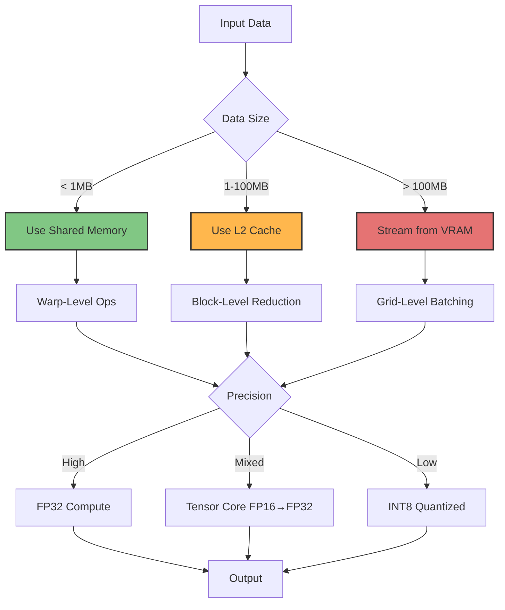

## Scalability

### Multi-Device Configuration

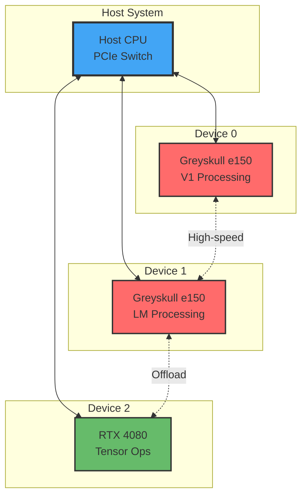

## Error Handling & Debugging

### Event Tracing

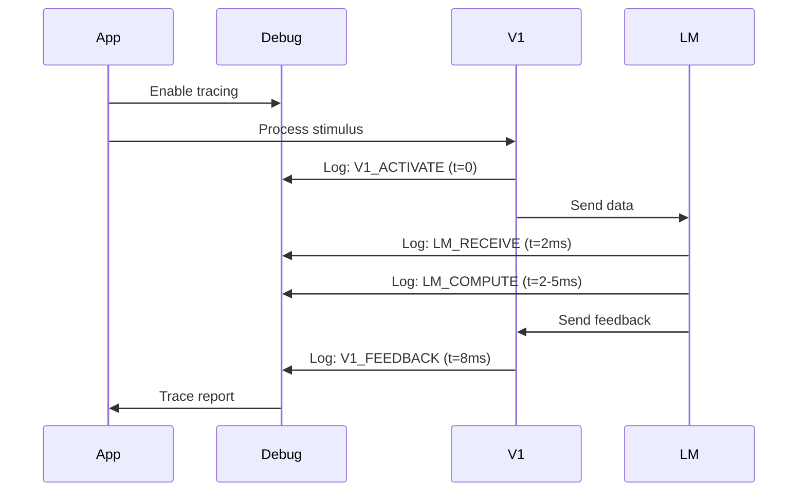

## Summary

The architecture provides:

1. **Hardware Abstraction**: Unified API across TT-Metal and CUDA backends
2. **Dynamic Reconfiguration**: Event-driven routing updates at millisecond scales
3. **Behavioral Modulation**: Context-dependent execution paths
4. **Efficient Data Movement**: Pipelined streams and sparse activation
5. **Scalable Design**: Multi-device and multi-backend support

See [API Reference](api-reference.md) for detailed programming interfaces.
