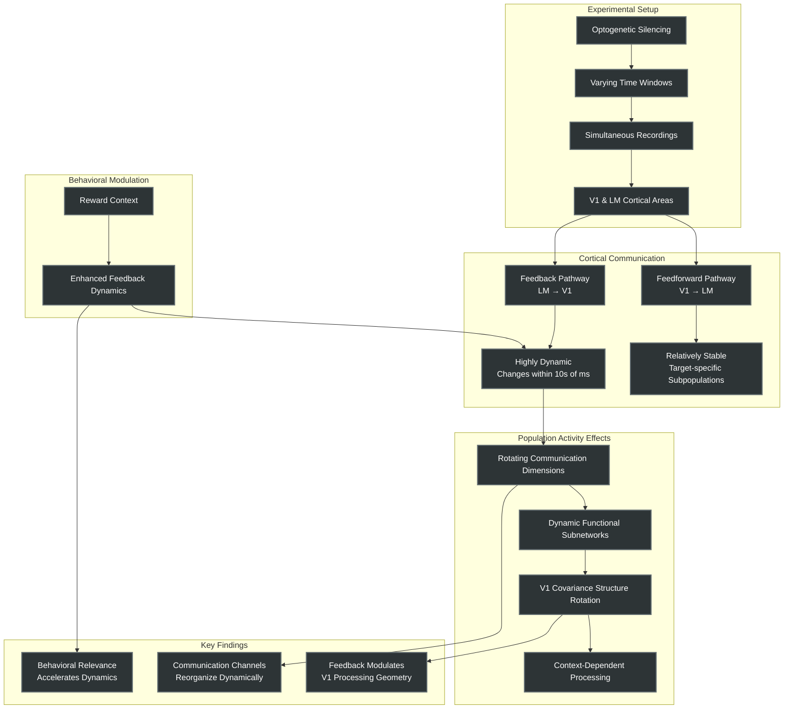

Source Paper: bioRxiv preprint doi: https://doi.org/10.1101/2021.06.28.449892; this version posted June 28, 2021. Dynamic causal communication channels
between neocortical areas Mitra Javadzadeh*, Sonja B. Hofer* Sainsbury Wellcome Centre for Neural Circuits and Behaviour, University College London, London,
United Kingdom
