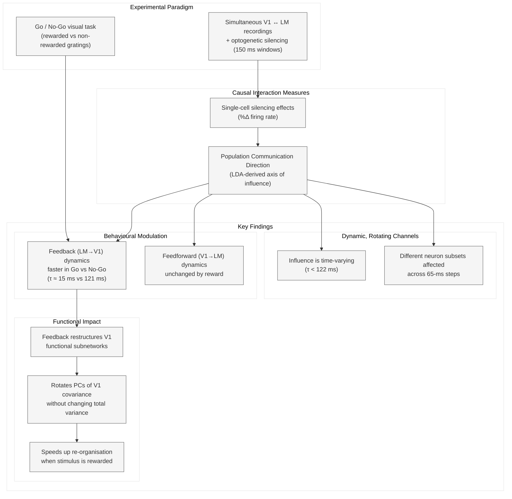

```mermaid
%%{init: {'theme':'base', 'themeVariables':{'primaryColor':'#f5f5f5','primaryTextColor':'#333','primaryBorderColor':'#666','lineColor':'#333'}}}%%
graph TD
    subgraph "Experimental Paradigm"
        Rec["Simultaneous V1 ↔ LM recordings\n+ optogenetic silencing (150 ms windows)"]
        Task["Go / No-Go visual task\n(rewarded vs non-rewarded gratings)"]
    end

    subgraph "Causal Interaction Measures"
        SilEffect["Single-cell silencing effects\n(%Δ firing rate)"]
        CommDir["Population Communication Direction\n(LDA-derived axis of influence)"]
    end

    subgraph "Key Findings"
        subgraph "Dynamic, Rotating Channels"
            Dyn1["Influence is time-varying\n(τ < 122 ms)"]
            Dyn2["Different neuron subsets affected\nacross 65-ms steps"]
        end

        subgraph "Behavioural Modulation"
            Behav1["Feedback (LM→V1) dynamics\nfaster in Go vs No-Go\n(τ ≈ 15 ms vs 121 ms)"]
            Behav2["Feedforward (V1→LM) dynamics\nunchanged by reward"]
        end

        subgraph "Functional Impact"
            Func1["Feedback restructures V1\nfunctional subnetworks"]
            Func2["Rotates PCs of V1 covariance\nwithout changing total variance"]
            Func3["Speeds up re-organisation\nwhen stimulus is rewarded"]
        end
    end

    Rec --> SilEffect
    Task --> Behav1
    SilEffect --> CommDir
    CommDir --> Dyn1
    CommDir --> Dyn2
    CommDir --> Behav1
    CommDir --> Behav2
    Behav1 --> Func1
    Func1 --> Func2
    Func2 --> Func3
```
