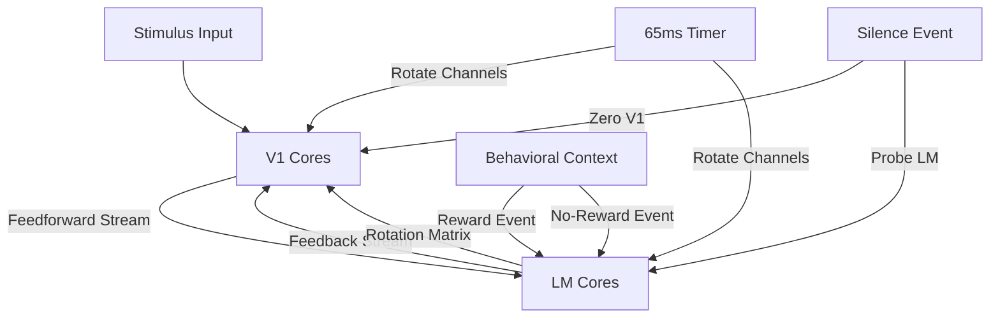

To map the paper's insights about dynamic cortical communication onto Tenstorrent's `tt-metal` framework, we need to translate the neuroscientific principles into hardware-compatible computational patterns. Here's how the core insights align with `tt-metal`'s capabilities:

---

### **1. Dynamic Communication Channels → Spatial Reconfiguration**
**Paper Insight**: Cortical areas use rapidly rotating communication channels (different neuron subpopulations engaged at different times).  
**`tt-metal` Mapping**:  
- **Spatial Partitioning**: Map V1 and LM to distinct core groups (e.g., `CoreGrid` regions).  
- **Dynamic Core-to-Core Routing**: Use `tt-metal`'s **streaming engines** to reconfigure data paths between cores on-the-fly:  
  ```cpp
  // Feedforward (V1 → LM) routing
  StreamConfig ff_config = StreamConfig()
      .set_source(v1_cores)
      .set_dest(lm_cores)
      .set_routing_mode(RoutingMode::DYNAMIC); // Reconfigurable paths

  // Feedback (LM → V1) routing
  StreamConfig fb_config = StreamConfig()
      .set_source(lm_cores)
      .set_dest(v1_cores)
      .set_routing_mode(RoutingMode::DYNAMIC);
  ```
- **Channel Rotation**: Implement event-triggered routing updates to switch communication subspaces:  
  ```cpp
  Event rotate_channels;
  rotate_channels.setAction([&]() {
      ff_config.update_routing(new_v1_subpop, new_lm_subpop); // Rotate engaged cores
  });
  ```

---

### **2. Temporal Dynamics → Event-Driven Pipelines**
**Paper Insight**: Communication channels reorganize within **tens of milliseconds**; feedback accelerates during reward contexts.  
**`tt-metal` Mapping**:  
- **Millisecond-Scale Events**: Use `tt-metal`'s **event system** for temporal control:  
  ```cpp
  Event reward_context; // Triggered by behavioral input
  Event timer_65ms;     // 65ms periodic event (matching paper's resolution)

  reward_context.setAction([&]() {
      fb_config.set_bandwidth(Bandwidth::HIGH); // Accelerate feedback
      timer_65ms.set_period(15ms);               // Faster reconfiguration (Go trials)
  });
  ```
- **Pipelined Processing**: Overlap computation and data movement:  
  ```cpp
  Pipeline pipeline;
  pipeline.add_stage(ComputeStage(v1_cores, "stimulus_encode"));
  pipeline.add_stage(StreamStage(ff_config)); // Feedforward transfer
  pipeline.add_stage(ComputeStage(lm_cores, "context_modulate"));
  pipeline.add_stage(StreamStage(fb_config)); // Feedback transfer
  ```

---

### **3. Behavioral Context Modulation → Conditional Execution**
**Paper Insight**: Feedback dynamics change based on reward association (Go vs. No-go trials).  
**`tt-metal` Mapping**:  
- **Conditional Kernel Execution**: Use **runtime predicates** to switch computational modes:  
  ```cpp
  Kernel feedback_kernel = Kernel("feedback_transform")
      .set_condition([](const Context& ctx) {
          return ctx.is_rewarded; // Execute only in Go trials
      });
  ```
- **Context-Dependent Dataflow**: Route data differently based on behavioral state:  
  ```cpp
  if (is_rewarded) {
      fb_stream.set_dest(v1_reward_subpop); // Target specific V1 neurons
  } else {
      fb_stream.set_dest(v1_default_subpop);
  }
  ```

---

### **4. Population Geometry → Tensor Operations**
**Paper Insight**: Feedback restructures covariance geometry (rotates principal components) without altering overall variability.  
**`tt-metal` Mapping**:  
- **Tensor Rotation**: Use `tt-metal`'s **tensor ops** to geometrically transform neural representations:  
  ```cpp
  // Rotate V1 population activity (PC rotation)
  Tensor v1_activity = load_tensor(v1_cores);
  Tensor rotation_matrix = precomputed_rotation_matrix(); // From LM feedback
  Tensor transformed = tensor_ops::matmul(rotation_matrix, v1_activity);
  store_tensor(transformed, v1_cores);
  ```
- **Variance Preservation**: Normalize transformations to maintain total variance:  
  ```cpp
  float total_variance = tensor_ops::variance(v1_activity);
  tensor_ops::normalize(transformed, total_variance); // Preserve overall variability
  ```

---

### **5. Causal Perturbations → Debug/Probe Interfaces**
**Paper Insight**: Optogenetic silencing reveals causal influences.  
**`tt-metal` Mapping**:  
- **Core Silencing**: Inject "zeroing" operations to simulate perturbations:  
  ```cpp
  Event silence_v1;
  silence_v1.setAction([&]() {
      for (auto& core : v1_cores) {
          core.inject_zero_kernel(); // Simulate optogenetic silencing
      }
  });
  ```
- **Activity Probes**: Monitor downstream effects via **memory-mapped debug buffers**:  
  ```cpp
  DebugBuffer lm_probe;
  lm_probe.record_activity(lm_cores, silence_v1); // Log LM activity during V1 silencing
  ```

---

### **6. Energy Efficiency → Sparse Communication**
**Paper Insight**: Only subsets of neurons engage at any time.  
**`tt-metal` Mapping**:  
- **Sparse Data Movement**: Use **compressed streams** to activate only relevant cores:  
  ```cpp
  SparseStream sparse_ff(v1_cores, lm_cores);
  sparse_ff.set_active_cores(current_v1_subpop); // Transmit only from active neurons
  ```
- **Power Gating**: Dynamically power down idle cores:  
  ```cpp
  for (auto& core : inactive_cores) {
      core.set_power_state(PowerState::OFF);
  }
  ```

---

### **Key `tt-metal` Features Leveraged**
1. **Dynamic Streams**: Reconfigurable data paths between cores.  
2. **Event System**: Temporal control for millisecond-scale dynamics.  
3. **Tensor Ops**: Geometric transformations of population activity.  
4. **Conditional Execution**: Context-dependent routing/computation.  
5. **Sparse Dataflow**: Energy-efficient activation of subpopulations.  
6. **Debug Interfaces**: Causal perturbation and monitoring.  

This mapping transforms the brain's dynamic communication principles into a hardware-efficient implementation, leveraging `tt-metal`'s strengths in reconfigurable dataflow, temporal precision, and tensor operations to emulate context-dependent neural processing.


Source: Dynamic causal communication channels between neocortical areas
 View ORCID ProfileMitra Javadzadeh,  View ORCID ProfileSonja B. Hofer
doi: https://doi.org/10.1101/2021.06.28.449892
Now published in Neuron doi: 10.1016/j.neuron.2022.05.011
