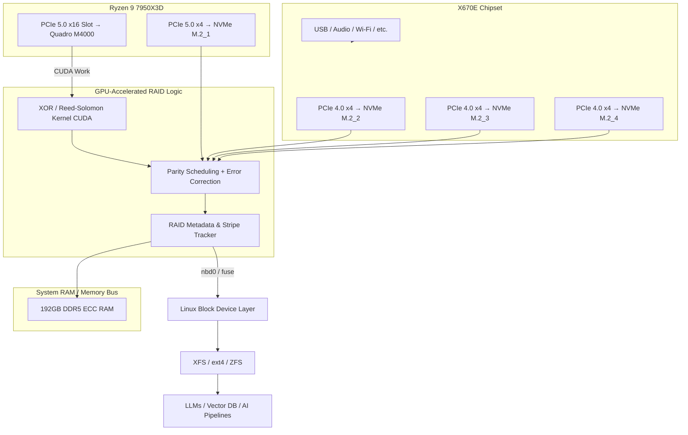

```mermaid
flowchart TB
    subgraph CPU [Ryzen 9 7950X3D]
        PCIe_GPU[PCIe 5.0 x16 Slot → Quadro M4000]
        PCIe_M2_1[PCIe 5.0 x4 → NVMe M.2_1]
    end

    subgraph Chipset [X670E Chipset]
        PCIe_M2_2[PCIe 4.0 x4 → NVMe M.2_2]
        PCIe_M2_3[PCIe 4.0 x4 → NVMe M.2_3]
        PCIe_M2_4[PCIe 4.0 x4 → NVMe M.2_4]
        Other_Devices[USB / Audio / Wi-Fi / etc.]
    end

    subgraph "System RAM / Memory Bus"
        RAM[192GB DDR5 ECC RAM]
    end

    subgraph "GPU-Accelerated RAID Logic"
        XOR_Unit[XOR / Reed-Solomon Kernel CUDA]
        Parity_Manager[Parity Scheduling + Error Correction]
        Metadata_Manager[RAID Metadata & Stripe Tracker]
    end

    PCIe_GPU -->|CUDA Work| XOR_Unit
    XOR_Unit --> Parity_Manager
    Parity_Manager --> Metadata_Manager

    PCIe_M2_1 --> Parity_Manager
    PCIe_M2_2 --> Parity_Manager
    PCIe_M2_3 --> Parity_Manager
    PCIe_M2_4 --> Parity_Manager

    Metadata_Manager --> RAM

    Metadata_Manager -->|nbd0 / fuse| OS[Linux Block Device Layer]

    OS --> FS[XFS / ext4 / ZFS]
    FS --> Applications[LLMs / Vector DB / AI Pipelines]

    Other_Devices --> Chipset
```
