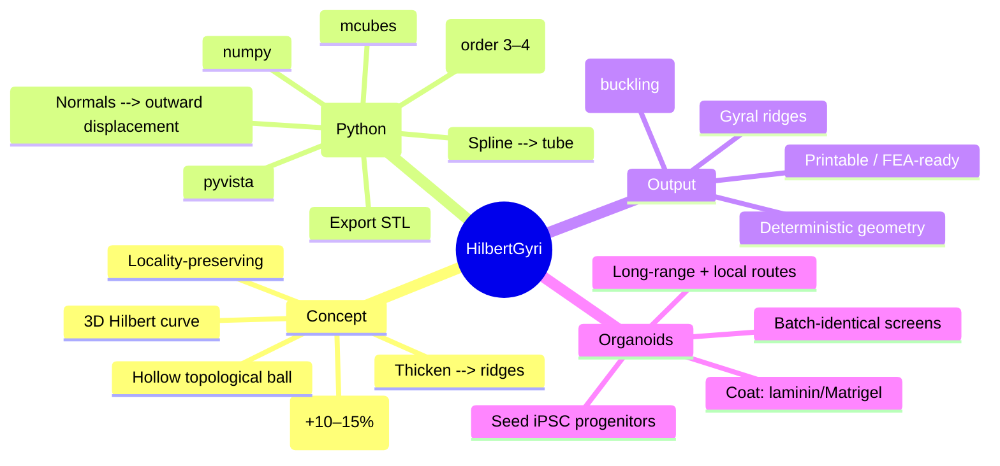
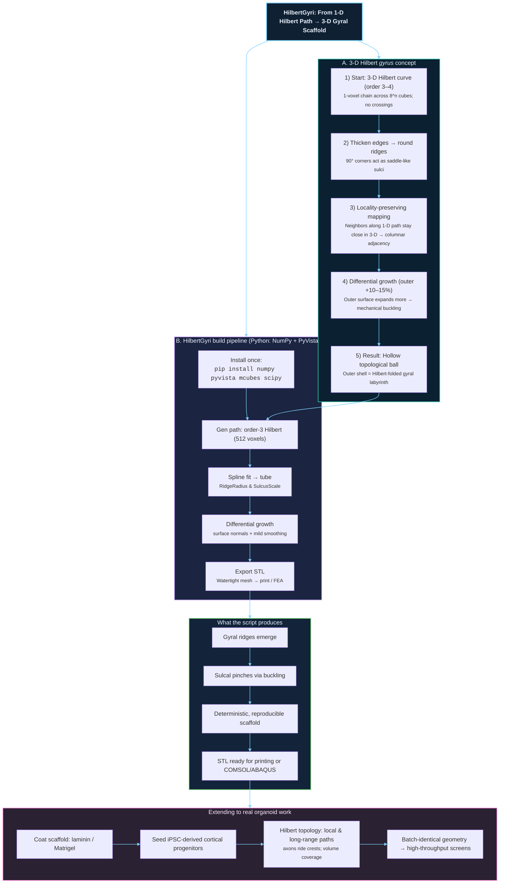
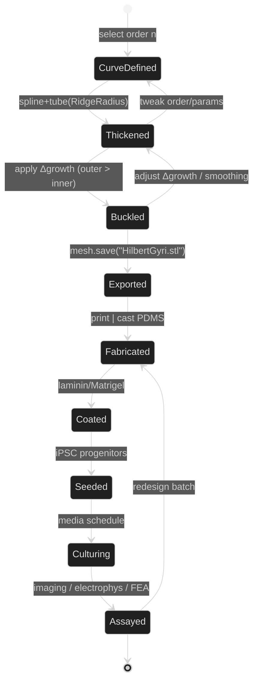

```mermaid
%%{init: {
  "theme": "dark",
  "themeVariables": {
    "background": "#0b1220",
    "primaryColor": "#0e1b2a",
    "primaryTextColor": "#e8f1ff",
    "primaryBorderColor": "#59b0ff",
    "clusterBkg": "#0b1220",
    "clusterBorder": "#2b4766",
    "lineColor": "#7fd3ff",
    "textColor": "#e8f1ff",
    "fontSize": "14px",
    "cornerRadius": 8,
    "mindmap": {
      "default": {
        "rootBackgroundColor": "#0e1b2a",
        "rootBorderColor": "#59b0ff",
        "rootTextColor": "#e8f1ff",
        "branch1BackgroundColor": "#0b2131",
        "branch1BorderColor": "#36c9b4",
        "branch1TextColor": "#e8f1ff",
        "branch2BackgroundColor": "#1b2440",
        "branch2BorderColor": "#c8a5ff",
        "branch2TextColor": "#e8f1ff",
        "branch3BackgroundColor": "#13243a",
        "branch3BorderColor": "#6ad26a",
        "branch3TextColor": "#e8f1ff",
        "branch4BackgroundColor": "#2a2132",
        "branch4BorderColor": "#ff7edb",
        "branch4TextColor": "#ffeaff"
      }
    }
  }
}%%
mindmap
  root((HilbertGyri))
    Concept
      3D Hilbert curve
      Thicken --> ridges
      Locality-preserving
      Differential growth (+10–15%)
      Hollow topological ball
    Build (Python)
      numpy
      pyvista
      mcubes
      Make path (order 3–4)
      Spline --> tube
      Normals --> outward displacement
      Export STL
    Output
      Gyral ridges
      Sulcal pinches (buckling)
      Deterministic geometry
      Printable / FEA-ready
    Organoids
      Coat: laminin/Matrigel
      Seed iPSC progenitors
      Long-range + local routes
      Batch-identical screens
```

```mermaid
%%{init: {
  "theme": "dark",
  "themeVariables": {
    "background": "#0b1220",
    "primaryColor": "#0e1b2a",
    "primaryTextColor": "#e8f1ff",
    "primaryBorderColor": "#59b0ff",
    "clusterBkg": "#0b1220",
    "clusterBorder": "#2b4766",
    "lineColor": "#7fd3ff",
    "textColor": "#e8f1ff",
    "fontSize": "14px",
    "cornerRadius": 8
  },
  "flowchart": { "curve": "basis", "nodeSpacing": 40, "rankSpacing": 55, "htmlLabels": true, "wrap": true }
}%%

flowchart TD

  %% ========= HEADER =========
  H["<b>HilbertGyri: From 1-D Hilbert Path → 3-D Gyral Scaffold</b>"]

  %% ========= SECTION A: CONCEPT =========
  subgraph A["A. 3-D Hilbert <i>gyrus</i> concept"]
    A1["1) Start: 3-D Hilbert curve (order 3–4)<br/><small>1-voxel chain across 8^n cubes; no crossings</small>"]
    A2["2) Thicken edges → round ridges<br/><small>90° corners act as saddle-like sulci</small>"]
    A3["3) Locality-preserving mapping<br/><small>Neighbors along 1-D path stay close in 3-D → columnar adjacency</small>"]
    A4["4) Differential growth (outer +10–15%)<br/><small>Outer surface expands more → mechanical buckling</small>"]
    A5["5) Result: Hollow topological ball<br/><small>Outer shell = Hilbert-folded gyral labyrinth</small>"]
    A1 --> A2 --> A3 --> A4 --> A5
  end

  %% ========= SECTION B: BUILD PIPELINE (CODE) =========
  subgraph B["B. HilbertGyri build pipeline (Python: NumPy + PyVista)"]
    B0["Install once:<br/><code>pip install numpy pyvista mcubes scipy</code>"]
    B1["Gen path: order-3 Hilbert (512 voxels)"]
    B2["Spline fit → tube<br/><small>RidgeRadius &amp; SulcusScale</small>"]
    B3["Differential growth<br/><small>surface normals + mild smoothing</small>"]
    B4["Export STL<br/><small>Watertight mesh → print / FEA</small>"]
    B0 --> B1 --> B2 --> B3 --> B4
  end

  %% ========= SCRIPT EFFECTS =========
  subgraph C["What the script produces"]
    C1["Gyral ridges emerge"]
    C2["Sulcal pinches via buckling"]
    C3["Deterministic, reproducible scaffold"]
    C4["STL ready for printing or COMSOL/ABAQUS"]
    C1 --> C2 --> C3 --> C4
  end

  %% ========= EXTENSIONS FOR ORGANOIDS =========
  subgraph D["Extending to real organoid work"]
    D1["Coat scaffold: laminin / Matrigel"]
    D2["Seed iPSC-derived cortical progenitors"]
    D3["Hilbert topology: local &amp; long-range paths<br/><small>axons ride crests; volume coverage</small>"]
    D4["Batch-identical geometry → high-throughput screens"]
    D1 --> D2 --> D3 --> D4
  end

  %% ========= FLOWS BETWEEN SECTIONS =========
  H --> A
  H --> B
  A5 --> B1
  B4 --> C
  C4 --> D

  %% ========= STYLE =========
  classDef header fill:#0f2033,stroke:#7fd3ff,color:#e8f1ff,stroke-width:2.2px;
  classDef concept fill:#0b2131,stroke:#36c9b4,color:#e8f1ff,stroke-width:1.6px;
  classDef build fill:#1b2440,stroke:#c8a5ff,color:#e8f1ff,stroke-width:1.6px;
  classDef effects fill:#13243a,stroke:#6ad26a,color:#e8f1ff,stroke-width:1.6px;
  classDef extend fill:#2a2132,stroke:#ff7edb,color:#ffeaff,stroke-width:1.6px;

  class H header
  class A concept
  class B build
  class C effects
  class D extend

  linkStyle default stroke:#7fd3ff,stroke-width:1.4px,opacity:0.95
```

```mermaid
%%{init: {"theme":"dark"}}%%
stateDiagram-v2
  [*] --> CurveDefined : select order n
  CurveDefined --> Thickened : spline+tube(RidgeRadius)
  Thickened --> Buckled : apply Δgrowth (outer > inner)
  Buckled --> Exported : mesh.save("HilbertGyri.stl")
  Exported --> Fabricated : print | cast PDMS
  Fabricated --> Coated : laminin/Matrigel
  Coated --> Seeded : iPSC progenitors
  Seeded --> Culturing : media schedule
  Culturing --> Assayed : imaging / electrophys / FEA
  Assayed --> [*]

  Thickened --> CurveDefined : tweak order/params
  Buckled --> Thickened : adjust Δgrowth / smoothing
  Assayed --> Fabricated : redesign batch
```
