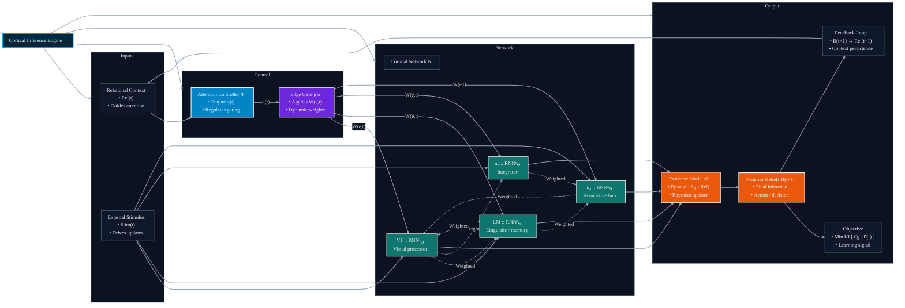

```mermaid
%%{init: {
  "theme": "dark",
  "themeVariables": {
    "fontFamily": "Inter, ui-sans-serif, system-ui, -apple-system, Segoe UI, Roboto, Ubuntu",
    "primaryColor": "#0f172a",
    "primaryTextColor": "#e5e7eb",
    "primaryBorderColor": "#334155",
    "secondaryColor": "#111827",
    "tertiaryColor": "#0b1220",
    "lineColor": "#94a3b8",
    "nodeBorder": "#475569",
    "titleColor": "#f8fafc",
    "clusterBkg": "#0b1220",
    "clusterBorder": "#334155",
    "edgeLabelBackground": "#0b1220",
    "arrowMarkerColor": "#e5e7eb"
  },
  "flowchart": { "curve": "basis", "htmlLabels": true, "nodeSpacing": 48, "rankSpacing": 56, "padding": 10 }
}}%%

flowchart LR
  %% ───────── Title / Anchor (optional) ─────────
  C["Cortical Inference Engine"]

  %% ───────── Groups ─────────
  subgraph Inputs
    direction TB
    I1["Relational Context<br/>• Rel(t)<br/>• Guides attention"]
    I2["External Stimulus<br/>• Stim(t)<br/>• Drives updates"]
  end

  subgraph Control
    direction TB
    A["Attention Controller Φ<br/>• Output: a(t)<br/>• Regulates gating"]
    G["Edge Gating σ<br/>• Applies W(e,t)<br/>• Dynamic weights"]
  end

  subgraph Network
    direction TB
    N["Cortical Network N"]
    V1["V1 :: RNN¹<sub>Θ</sub><br/>Visual processor"]
    LM["LM :: RNN²<sub>Θ</sub><br/>Linguistic / memory"]
    N3["n₃ :: RNNⁿ<sub>Θ</sub><br/>Integrator"]
    N4["n₄ :: RNNⁿ<sub>Θ</sub><br/>Associative hub"]
  end

  subgraph Output
    direction TB
    O1["Evidence Model Ω<br/>• P(cause | S<sub>N</sub> ; Rel)<br/>• Bayesian updater"]
    O2["Posterior Beliefs B(t+1)<br/>• Final inference<br/>• Action / decision"]
    O3["Objective<br/>• Min KL[ Q<sub>t</sub> || P(·) ]<br/>• Learning signal"]
    O4["Feedback Loop<br/>• B(t+1) → Rel(t+1)<br/>• Context persistence"]
  end

  %% ───────── High-level structure ─────────
  C --> Inputs
  C --> Control
  C --> Network
  C --> Output

  %% Inputs to control & network
  I1 --> A
  I2 --> V1
  I2 --> LM
  I2 --> N3
  I2 --> N4

  %% Control to network (gated)
  A -- "a(t)" --> G
  G -- "W(e,t)" --> V1
  G -- "W(e,t)" --> LM
  G -- "W(e,t)" --> N3
  G -- "W(e,t)" --> N4

  %% Lateral weighted connectivity (dashed)
  V1 -. "Weighted" .-> LM
  V1 -. "Weighted" .-> N3
  LM -. "Weighted" .-> V1
  LM -. "Weighted" .-> N4
  N3 -. "Weighted" .-> N4
  N4 -. "Weighted" .-> V1

  %% Inference path
  V1 --> O1
  LM --> O1
  N3 --> O1
  N4 --> O1

  O1 --> O2
  O2 --> O3
  O2 --> O4
  O4 --> I1

  %% ───────── Styles (dark-mode tuned) ─────────
  classDef default fill:#0f172a,stroke:#475569,color:#e5e7eb,stroke-width:1.6px;
  classDef highlight fill:#0a2636,stroke:#0ea5e9,color:#e6f6ff,stroke-width:2.2px;

  %% Phase colors from the first diagram, adapted for dark background
  classDef step1 fill:#0284c7,stroke:#e5e7eb,color:#e5e7eb;   %% Attention
  classDef step2 fill:#6d28d9,stroke:#e5e7eb,color:#f1f5f9;   %% Gating
  classDef step3 fill:#0f766e,stroke:#e5e7eb,color:#ecfeff;   %% RNN nodes
  classDef step4 fill:#ea580c,stroke:#e5e7eb,color:#fff7ed;   %% Evidence/Posterior

  %% Apply emphasis & phase mapping
  class C,A,O2 highlight;
  class A step1;
  class G step2;
  class V1,LM,N3,N4 step3;
  class O1,O2 step4;

  %% Subgraph header styling
  style Inputs fill:#0b1220,stroke:#334155,stroke-width:1.5px,color:#cbd5e1
  style Control fill:#0b1220,stroke:#334155,stroke-width:1.5px,color:#cbd5e1
  style Network fill:#0b1220,stroke:#334155,stroke-width:1.5px,color:#cbd5e1
  style Output fill:#0b1220,stroke:#334155,stroke-width:1.5px,color:#cbd5e1

  %% Link styles
  linkStyle default stroke:#94a3b8,stroke-width:1.8px

```
