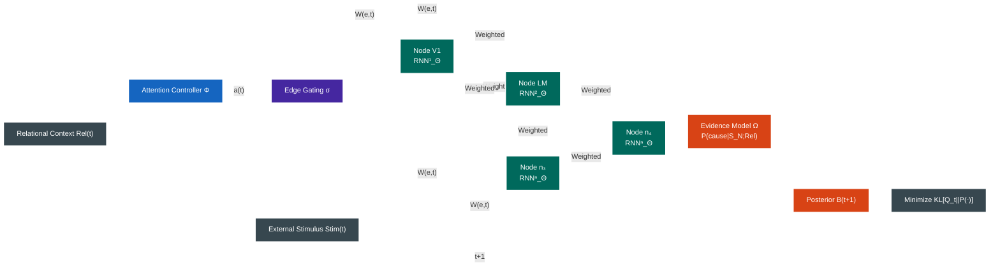

```mermaid
flowchart LR
    Rel["Relational Context Rel(t)"] --> Attn["Attention Controller Φ"]
    Attn -->|"a(t)"| Gate["Edge Gating σ"]
    Gate -->|"W(e,t)"| V1["Node V1<br>RNN¹_Θ"]
    Gate -->|"W(e,t)"| LM["Node LM<br>RNN²_Θ"]
    Gate -->|"W(e,t)"| N3["Node n₃<br>RNNⁿ_Θ"]
    Gate -->|"W(e,t)"| N4["Node n₄<br>RNNⁿ_Θ"]

    Stim["External Stimulus Stim(t)"] --> V1
    Stim --> LM
    Stim --> N3
    Stim --> N4

    V1 -. "Weighted" .-> LM
    V1 -. "Weighted" .-> N3
    LM -. "Weighted" .-> V1
    LM -. "Weighted" .-> N4
    N3 -. "Weighted" .-> N4
    N4 -. "Weighted" .-> V1

    V1 --> Omega["Evidence Model Ω<br>P(cause|S_N;Rel)"]
    LM --> Omega
    N3 --> Omega
    N4 --> Omega

    Omega --> Post["Posterior B(t+1)"]
    Post --> Obj["Minimize KL[Q_t||P(⋅)]"]
    Post -. "t+1" .-> Rel

    %% High contrast styles for dark themes
    classDef default fill:#37474f,stroke:#ffffff,stroke-width:2px,color:#ffffff;
    classDef step1 fill:#1565c0,stroke:#ffffff,stroke-width:2px,color:#ffffff;
    classDef step2 fill:#4527a0,stroke:#ffffff,stroke-width:2px,color:#ffffff;
    classDef step3 fill:#00695c,stroke:#ffffff,stroke-width:2px,color:#ffffff;
    classDef step4 fill:#d84315,stroke:#ffffff,stroke-width:2px,color:#ffffff;
    
    class Rel,Stim,Obj default
    class Attn step1
    class Gate step2
    class V1,LM,N3,N4 step3
    class Omega,Post step4
    
    %% Link styling for better visibility
    linkStyle default stroke:#ffffff,stroke-width:2px
```
