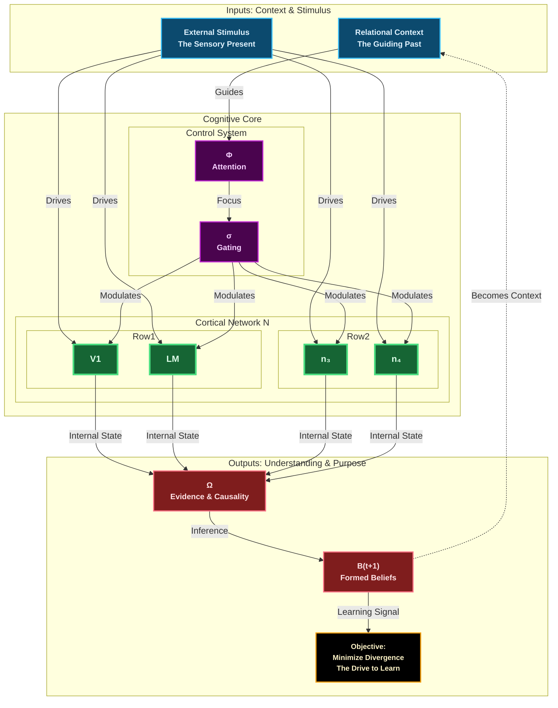
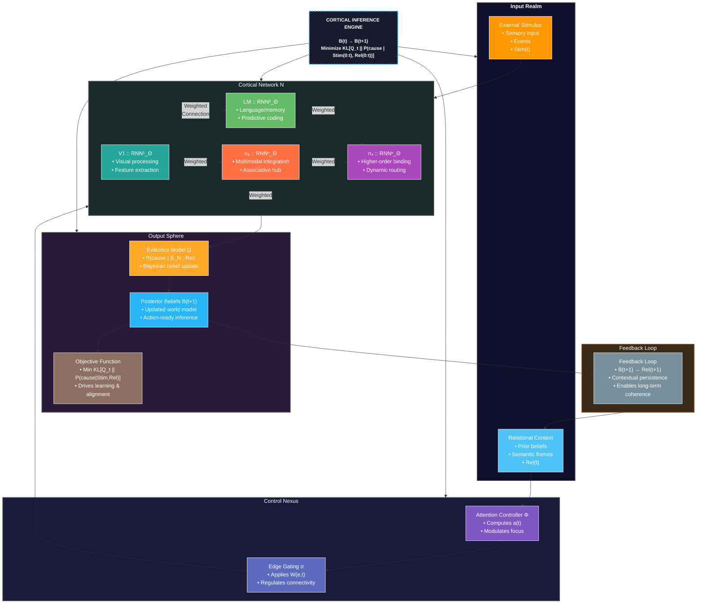

```mermaid
%%{init: {
  'theme': 'dark',
  'themeVariables': {
    'primaryColor': '#000000',
    'textColor': '#ffffff',
    'lineColor': '#555555',
    'borderColor': '#444444',
    'arrowMarkerColor': '#ffffff'
  }
}}}%%

graph TD
    %% ──────────────────────────────────────────────────────
    %% Input Layer: The Past and Present
    %% ──────────────────────────────────────────────────────
    subgraph Inputs ["Inputs: Context & Stimulus"]
        Rel["Relational Context\nThe Guiding Past"]:::inputStyle
        Stim["External Stimulus\nThe Sensory Present"]:::inputStyle
    end

    %% ──────────────────────────────────────────────────────
    %% Cognitive Core: Attention & Gating
    %% ──────────────────────────────────────────────────────
    subgraph Core ["Cognitive Core"]
        subgraph Controller ["Control System"]
            Attn["Φ\nAttention"]:::controlStyle
            Gate["σ\nGating"]:::controlStyle
        end

        subgraph Network ["Cortical Network N"]
            subgraph Row1
                V1["V1"]:::nodeStyle
                LM["LM"]:::nodeStyle
            end
            subgraph Row2
                N3["n₃"]:::nodeStyle
                N4["n₄"]:::nodeStyle
            end
        end
    end

    %% ──────────────────────────────────────────────────────
    %% Output Layer: Belief & Objective
    %% ──────────────────────────────────────────────────────
    subgraph Outputs ["Outputs: Understanding & Purpose"]
        Omega["Ω\nEvidence & Causality"]:::outputStyle
        Post["B(t+1)\nFormed Beliefs"]:::outputStyle
        Obj["Objective:\nMinimize Divergence\nThe Drive to Learn"]:::objStyle
    end

    %% ──────────────────────────────────────────────────────
    %% Connections
    %% ──────────────────────────────────────────────────────
    Rel -->|Guides| Attn
    Stim -->|Drives| V1
    Stim -->|Drives| LM
    Stim -->|Drives| N3
    Stim -->|Drives| N4

    Attn -->|Focus| Gate
    Gate -->|Modulates| V1
    Gate -->|Modulates| LM
    Gate -->|Modulates| N3
    Gate -->|Modulates| N4

    V1 -->|Internal State| Omega
    LM -->|Internal State| Omega
    N3 -->|Internal State| Omega
    N4 -->|Internal State| Omega

    Omega -->|Inference| Post
    Post -->|Learning Signal| Obj
    Post -.->|Becomes Context| Rel

    %% ──────────────────────────────────────────────────────
    %% Styling: High Contrast for Black Backgrounds
    %% ──────────────────────────────────────────────────────
    classDef inputStyle fill:#0c4a6e,stroke:#38bdf8,stroke-width:2px,color:#e0f2fe,font-size:14px,font-weight:bold;

    classDef controlStyle fill:#4a044e,stroke:#c026d3,stroke-width:2px,color:#f5d0fe,font-size:14px,font-weight:bold;

    classDef nodeStyle fill:#166534,stroke:#4ade80,stroke-width:3px,color:#dcfce7,font-size:16px,font-weight:bold;

    classDef outputStyle fill:#7f1d1d,stroke:#fb7185,stroke-width:2px,color:#ffe4e6,font-size:14px,font-weight:bold;

    classDef objStyle fill:#000000,stroke:#f59e0b,stroke-width:2px,color:#fef3c7,font-size:13px,font-weight:bold;
```

```mermaid
%%{init: {
  'theme': 'dark',
  'themeVariables': {
    'primaryColor': '#0f0f1b',
    'textColor': '#ffffff',
    'lineColor': '#444466',
    'borderColor': '#333355',
    'arrowMarkerColor': '#ffffff',
    'fontFamily': 'Arial, sans-serif'
  }
}}}%%

flowchart TD
    %% ──────────────────────────────────────────────────────
    %% Central Core: The Inference Engine
    %% ──────────────────────────────────────────────────────
    CORE["CORTICAL INFERENCE ENGINE\n\nB(t) → B(t+1)\nMinimize KL[Q_t || P(cause | Stim(0:t), Rel(0:t))]"]
    
    style CORE fill:#1a1a2e,stroke:#00bfff,stroke-width:3px,stroke-dasharray:4, color:#ffffff, font-size:14px, font-weight:bold, text-align:center

    %% ──────────────────────────────────────────────────────
    %% Input Realm: The External World
    %% ──────────────────────────────────────────────────────
    subgraph INPUTS ["Input Realm"]
        REL["Relational Context\n• Prior beliefs\n• Semantic frames\n• Rel(t)"]
        STIM["External Stimulus\n• Sensory input\n• Events\n• Stim(t)"]
    end

    %% ──────────────────────────────────────────────────────
    %% Control Nexus: Dynamic Regulation
    %% ──────────────────────────────────────────────────────
    subgraph CONTROL ["Control Nexus"]
        ATTN["Attention Controller Φ\n• Computes a(t)\n• Modulates focus"]
        GATE["Edge Gating σ\n• Applies W(e,t)\n• Regulates connectivity"]
    end

    %% ──────────────────────────────────────────────────────
    %% Cortical Network: Recurrent Cosmos
    %% ──────────────────────────────────────────────────────
    subgraph CORTEX ["Cortical Network N"]
        V1["V1 :: RNN¹_Θ\n• Visual processing\n• Feature extraction"]
        LM["LM :: RNN²_Θ\n• Language/memory\n• Predictive coding"]
        N3["n₃ :: RNNⁿ_Θ\n• Multimodal integration\n• Associative hub"]
        N4["n₄ :: RNNⁿ_Θ\n• Higher-order binding\n• Dynamic routing"]
        
        %% Internal connections — must be inside subgraph
        V1 -. "Weighted\nConnection" .-> LM
        LM -. "Weighted" .-> N4
        V1 -. "Weighted" .-> N3
        N3 -. "Weighted" .-> N4
        N4 -. "Weighted" .-> V1
    end

    %% ──────────────────────────────────────────────────────
    %% Output Sphere: Belief & Objective
    %% ──────────────────────────────────────────────────────
    subgraph OUTPUT ["Output Sphere"]
        OMEGA["Evidence Model Ω\n• P(cause | S_N ; Rel)\n• Bayesian belief update"]
        POST["Posterior Beliefs B(t+1)\n• Updated world model\n• Action-ready inference"]
        OBJ["Objective Function\n• Min KL[Q_t || P(cause|Stim,Rel)]\n• Drives learning & alignment"]
    end

    %% ──────────────────────────────────────────────────────
    %% Feedback Loop: Temporal Continuity
    %% ──────────────────────────────────────────────────────
    subgraph FEEDBACK ["Feedback Loop"]
        FB["Feedback Loop\n• B(t+1) → Rel(t+1)\n• Contextual persistence\n• Enables long-term coherence"]
    end

    %% ──────────────────────────────────────────────────────
    %% Cosmic Connections: The Flow of Intelligence
    %% ──────────────────────────────────────────────────────
    REL --> ATTN
    STIM --> CORTEX
    ATTN --> GATE
    GATE --> CORTEX
    CORTEX --> OMEGA
    OMEGA --> POST
    POST --> OBJ
    POST --> FB
    FB --> REL

    CORE --> INPUTS
    CORE --> CONTROL
    CORE --> CORTEX
    CORE --> OUTPUT

    %% ──────────────────────────────────────────────────────
    %% Styling: Professional Themes
    %% ──────────────────────────────────────────────────────
    classDef realm fill:#0f0f2d,stroke:#444,stroke-width:2px,color:#fff,font-weight:bold;
    classDef nexus fill:#1a1a3a,stroke:#555,stroke-width:2px,color:#fff;
    classDef cortex fill:#1a2a2a,stroke:#555,stroke-width:2px,color:#fff;
    classDef sphere fill:#2a1a3a,stroke:#555,stroke-width:2px,color:#fff;
    classDef feedback fill:#3a2a1a,stroke:#8b4513,stroke-width:2px,color:#fff;

    class INPUTS realm
    class CONTROL nexus
    class CORTEX cortex
    class OUTPUT sphere
    class FEEDBACK feedback

    %% Node-level styling
    style REL fill:#4fc3f7,stroke:#fff,color:#fff
    style STIM fill:#ff9800,stroke:#fff,color:#fff
    style ATTN fill:#7e57c2,stroke:#fff,color:#fff
    style GATE fill:#5c6bc0,stroke:#fff,color:#fff
    style V1 fill:#26a69a,stroke:#fff,color:#fff
    style LM fill:#66bb6a,stroke:#fff,color:#fff
    style N3 fill:#ff7043,stroke:#fff,color:#fff
    style N4 fill:#ab47bc,stroke:#fff,color:#fff
    style OMEGA fill:#ffa726,stroke:#fff,color:#fff
    style POST fill:#29b6f6,stroke:#fff,color:#fff
    style OBJ fill:#8d6e63,stroke:#fff,color:#fff
    style FB fill:#78909c,stroke:#fff,color:#fff
```

