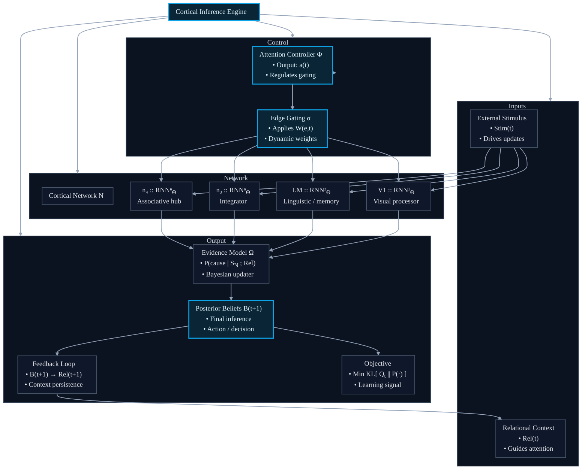

```mermaid
%%{init: {
  "theme": "dark",
  "themeVariables": {
    "fontFamily": "Inter, ui-sans-serif, system-ui, -apple-system, Segoe UI, Roboto, Ubuntu",
    "primaryColor": "#0f172a",
    "primaryTextColor": "#e5e7eb",
    "primaryBorderColor": "#334155",
    "secondaryColor": "#111827",
    "tertiaryColor": "#0b1220",
    "lineColor": "#94a3b8",
    "nodeBorder": "#475569",
    "titleColor": "#f8fafc",
    "clusterBkg": "#0b1220",
    "clusterBorder": "#334155",
    "edgeLabelBackground": "#0b1220",
    "arrowMarkerColor": "#e5e7eb"
  },
  "flowchart": { "curve": "basis", "htmlLabels": true, "nodeSpacing": 40, "rankSpacing": 40, "padding": 8 }
}}%%

flowchart TD
  %% ───────── Title / Root ─────────
  C["Cortical Inference Engine"]

  %% ───────── Groups ─────────
  subgraph Inputs
    direction TB
    I1["Relational Context<br/>• Rel(t)<br/>• Guides attention"]
    I2["External Stimulus<br/>• Stim(t)<br/>• Drives updates"]
  end

  subgraph Control
    direction TB
    A["Attention Controller Φ<br/>• Output: a(t)<br/>• Regulates gating"]
    G["Edge Gating σ<br/>• Applies W(e,t)<br/>• Dynamic weights"]
  end

  subgraph Network
    direction TB
    N["Cortical Network N"]
    N1["V1 :: RNN¹<sub>Θ</sub><br/>Visual processor"]
    N2["LM :: RNN²<sub>Θ</sub><br/>Linguistic / memory"]
    N3["n₃ :: RNNⁿ<sub>Θ</sub><br/>Integrator"]
    N4["n₄ :: RNNⁿ<sub>Θ</sub><br/>Associative hub"]
  end

  subgraph Output
    direction TB
    O1["Evidence Model Ω<br/>• P(cause | S<sub>N</sub> ; Rel)<br/>• Bayesian updater"]
    O2["Posterior Beliefs B(t+1)<br/>• Final inference<br/>• Action / decision"]
    O3["Objective<br/>• Min KL[ Q<sub>t</sub> || P(·) ]<br/>• Learning signal"]
    O4["Feedback Loop<br/>• B(t+1) → Rel(t+1)<br/>• Context persistence"]
  end

  %% ───────── Structure ─────────
  C --> Inputs
  C --> Control
  C --> Network
  C --> Output

  Control --> A --> G
  G --> N1
  G --> N2
  G --> N3
  G --> N4

  I2 --> N1
  I2 --> N2
  I2 --> N3
  I2 --> N4

  N1 --> O1
  N2 --> O1
  N3 --> O1
  N4 --> O1

  O1 --> O2
  O2 --> O3
  O2 --> O4
  O4 --> I1

  %% ───────── Styles ─────────
  classDef default fill:#0f172a,stroke:#475569,color:#e5e7eb,stroke-width:1.5px;
  classDef highlight fill:#0a2636,stroke:#0ea5e9,color:#e6f6ff,stroke-width:2.2px;
  classDef groupTitle fill:#0b1220,stroke:#334155,color:#cbd5e1,stroke-width:1.5px;

  %% Emphasize key elements
  class C,A,G,O2 highlight;

  %% Subgraph header styling
  style Inputs fill:#0b1220,stroke:#334155,stroke-width:1.5px,color:#cbd5e1
  style Control fill:#0b1220,stroke:#334155,stroke-width:1.5px,color:#cbd5e1
  style Network fill:#0b1220,stroke:#334155,stroke-width:1.5px,color:#cbd5e1
  style Output fill:#0b1220,stroke:#334155,stroke-width:1.5px,color:#cbd5e1

  %% Link styles
  linkStyle default stroke:#94a3b8,stroke-width:1.6px
```
