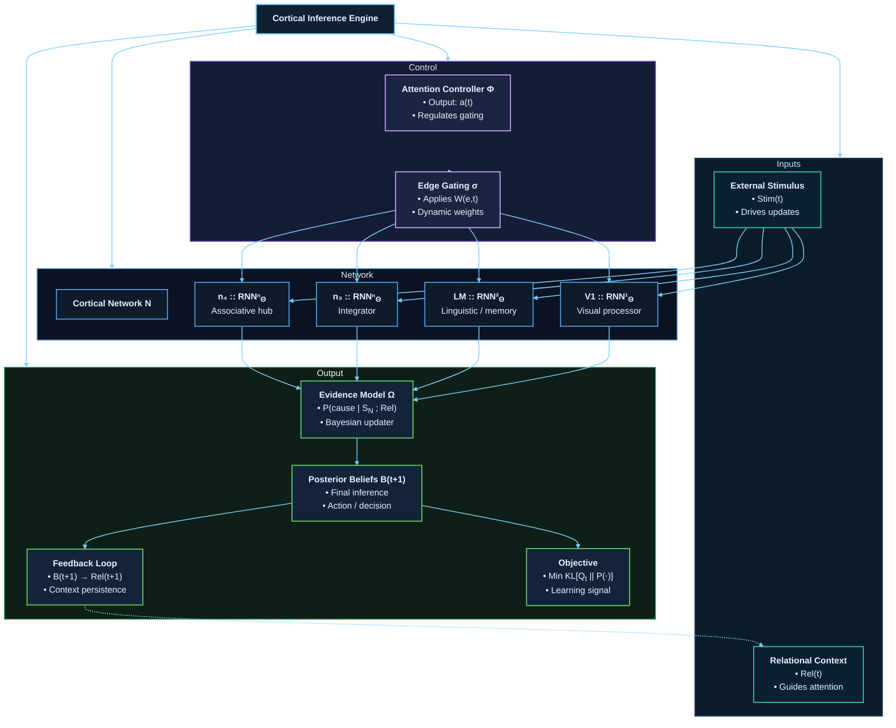

```mermaid
%%{init: {
  "theme": "dark",
  "themeVariables": {
    "background": "#0b1220",
    "primaryColor": "#0e1b2a",
    "primaryTextColor": "#e8f1ff",
    "primaryBorderColor": "#59b0ff",
    "secondaryColor": "#12263a",
    "tertiaryColor": "#0e1b2a",
    "clusterBkg": "#0b1220",
    "clusterBorder": "#2b4766",
    "lineColor": "#7fd3ff",
    "textColor": "#e8f1ff",
    "nodeTextColor": "#e8f1ff",
    "edgeLabelBackground": "#0b1220",
    "fontSize": "14px",
    "fontFamily": "Inter, Roboto, Segoe UI, Ubuntu, Cantarell, Helvetica, Arial, sans-serif",
    "cornerRadius": 8
  },
  "flowchart": {
    "htmlLabels": true,
    "curve": "basis",
    "nodeSpacing": 55,
    "rankSpacing": 70,
    "padding": 10,
    "wrap": true
  }
}%%

flowchart TD
  C["<b>Cortical Inference Engine</b>"]

  %% ==== GROUPS ====
  subgraph Inputs["Inputs"]
    I1["<b>Relational Context</b><br/>• Rel(t)<br/>• Guides attention"]
    I2["<b>External Stimulus</b><br/>• Stim(t)<br/>• Drives updates"]
  end

  subgraph Control["Control"]
    A["<b>Attention Controller Φ</b><br/>• Output: a(t)<br/>• Regulates gating"]
    G["<b>Edge Gating σ</b><br/>• Applies W(e,t)<br/>• Dynamic weights"]
  end

  subgraph Network["Network"]
    N["<b>Cortical Network N</b>"]
    N1["<b>V1 :: RNN¹<sub>Θ</sub></b><br/>Visual processor"]
    N2["<b>LM :: RNN²<sub>Θ</sub></b><br/>Linguistic / memory"]
    N3["<b>n₃ :: RNNⁿ<sub>Θ</sub></b><br/>Integrator"]
    N4["<b>n₄ :: RNNⁿ<sub>Θ</sub></b><br/>Associative hub"]
  end

  subgraph Output["Output"]
    O1["<b>Evidence Model Ω</b><br/>• P(cause | S<sub>N</sub> ; Rel)<br/>• Bayesian updater"]
    O2["<b>Posterior Beliefs B(t+1)</b><br/>• Final inference<br/>• Action / decision"]
    O3["<b>Objective</b><br/>• Min KL[Q<sub>t</sub> || P(⋅)]<br/>• Learning signal"]
    O4["<b>Feedback Loop</b><br/>• B(t+1) → Rel(t+1)<br/>• Context persistence"]
  end

  %% ==== TOP-LEVEL WIRING ====
  C --> Inputs
  C --> Control
  C --> Network
  C --> Output

  %% ==== CONTROL → NETWORK GATING ====
  Control --> G
  G --> N1
  G --> N2
  G --> N3
  G --> N4

  %% ==== STIMULUS FAN-OUT ====
  I2 --> N1
  I2 --> N2
  I2 --> N3
  I2 --> N4

  %% ==== NETWORK → EVIDENCE ====
  N1 --> O1
  N2 --> O1
  N3 --> O1
  N4 --> O1

  %% ==== EVIDENCE → POSTERIOR/OBJECTIVE/FEEDBACK ====
  O1 --> O2
  O2 --> O3
  O2 --> O4
  O4 -.-> I1

  %% ==== STYLES ====
  classDef default fill:#0e1b2a,stroke:#59b0ff,color:#e8f1ff,stroke-width:1.6px;
  classDef hub fill:#0f2033,stroke:#7fd3ff,color:#e8f1ff,stroke-width:2.2px;
  classDef inputs fill:#0b2131,stroke:#36c9b4,color:#e8f1ff,stroke-width:1.8px;
  classDef control fill:#1b2440,stroke:#c8a5ff,color:#e8f1ff,stroke-width:1.8px;
  classDef network fill:#0e1b2a,stroke:#59b0ff,color:#e8f1ff,stroke-width:1.6px;
  classDef output fill:#13243a,stroke:#6ad26a,color:#e8f1ff,stroke-width:1.8px;

  %% Apply classes
  class C hub
  class I1,I2 inputs
  class A,G control
  class N,N1,N2,N3,N4 network
  class O1,O2,O3,O4 output

  %% Subgraph panel tints
  style Inputs fill:#0a1c2a,stroke:#2b4766,stroke-width:1.6px,color:#bfe8ff
  style Control fill:#151c35,stroke:#6e56d8,stroke-width:1.6px,color:#e6ddff
  style Network fill:#0b1322,stroke:#3a7bbf,stroke-width:1.6px,color:#d9ecff
  style Output fill:#0d1f17,stroke:#3aa35c,stroke-width:1.6px,color:#dfffe8

  %% Global link styling (no numbered indices)
  linkStyle default stroke:#7fd3ff,stroke-width:1.6px,opacity:0.95
```
