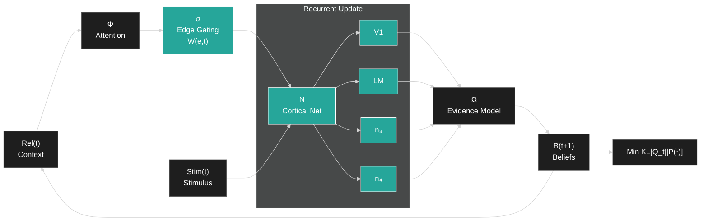

```mermaid
%%{init: {'theme': 'dark'}}%%
flowchart LR
    Rel["Rel(t)\nContext"] --> Attn["Φ\nAttention"]
    Attn --> Gate["σ\nEdge Gating\nW(e,t)"]
    Gate --> N["N\nCortical Net"]
    Stim["Stim(t)\nStimulus"] --> N

    subgraph Update["Recurrent Update"]
        N --> V1["V1"]
        N --> LM["LM"]
        N --> n3["n₃"]
        N --> n4["n₄"]
    end

    V1 --> Omega["Ω\nEvidence Model"]
    LM --> Omega
    n3 --> Omega
    n4 --> Omega

    Omega --> Post["B(t+1)\nBeliefs"]
    Post --> Obj["Min KL[Q_t||P(⋅)]"]
    Post --> Rel

    classDef box fill:#1e1e1e,stroke:#555,color:#fff;
    classDef comp fill:#26a69a,stroke:#fff,color:#fff;
    class Rel,Stim,Attn,Post,Obj,Omega box
    class Gate,N,V1,LM,n3,n4 comp
```
