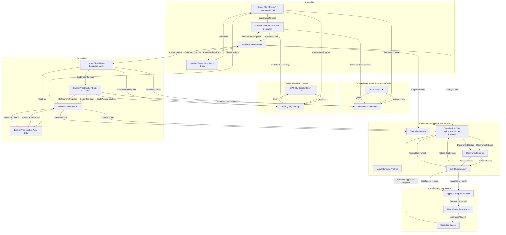

```mermaid
graph TD
    %% FAISS-Backed RAG System
    subgraph RAG_System ["Retrieval-Augmented Generation (RAG)"]
        RAG1["FAISS Vector DB"] 
        RAG2["Retriever & Embedder"]
        
        RAG2 -->|Query| RAG1
        RAG1 -->|Relevant Data| RAG2
    end

    %% API Gateway for Frontier Models
    subgraph API_Gateway ["Frontier Model API Access"]
        API1["GPT-40 / Google Gemini API"] 
        API2["Model Query Manager"]
        
        API2 -->|Query| API1
        API1 -->|Response| API2
    end

    %% Development Environment & Logging
    subgraph Dev_Env ["Development, Logging & Self-Healing"]
        LOG1["Execution Logging"]
        LOG2["Model Behavior Analysis"]
        CON1["Containerized Tool Deployment (Docker, Podman)"]
        MON1["Deployment Monitor"]
        REC1["Self-Healing Agent"]
    end

    %% Human-in-the-Loop Approval
    subgraph Human_Approval ["Human-in-the-Loop System"]
        HIL1["Approval Request Handler"]
        HIL2["Manual Override Console"]
        HIL3["Execution Queue"]
    end

    %% Ensemble 1
    subgraph Ensemble_1 ["Ensemble 1"]
        A1["Large 'Slow-thinker' Language Model"] -->|Guidance/Inference| B1["Smaller 'Fast-thinker' Code Generator"]
        A1 -->|Feedback| C1["Smaller 'Fast-thinker' Actor-Critic"]
        
        B1 -->|Generates Code| D1["Execution Environment"]
        C1 -->|Evaluates Outputs| D1
        
        D1 -->|Results & Feedback| C1
        D1 -->|Refinement Requests| B1
        
        %% Integration with RAG
        A1 -->|Retrieves Context| RAG2
        B1 -->|Retrieves Code Samples| RAG2

        %% API Model Querying
        A1 -->|Clarification Request| API2
        B1 -->|Best Practice Lookups| API2
        
        %% Logging & Deployment
        D1 -->|Logs Execution| LOG1
        D1 -->|Deploys Code| CON1
        
        %% Self-Healing Mechanism
        CON1 -->|Deployment Status| MON1
        MON1 -->|Detects Failure| REC1
        REC1 -->|Retries Deployment| CON1
        REC1 -->|Escalates to Human| HIL1
        
        %% Human-in-the-Loop Integration
        HIL1 -->|Requests Approval| HIL2
        HIL2 -->|Approves/Rejects| HIL3
        HIL3 -->|Executes Approved Requests| CON1
    end
    
    %% Ensemble 2
    subgraph Ensemble_2 ["Ensemble 2"]
        A2["Large 'Slow-thinker' Language Model"] -->|Guidance/Inference| B2["Smaller 'Fast-thinker' Code Generator"]
        A2 -->|Feedback| C2["Smaller 'Fast-thinker' Actor-Critic"]
        
        B2 -->|Generates Code| D2["Execution Environment"]
        C2 -->|Evaluates Outputs| D2
        
        D2 -->|Results & Feedback| C2
        D2 -->|Refinement Requests| B2
        
        %% Integration with RAG
        A2 -->|Retrieves Context| RAG2
        B2 -->|Retrieves Code Samples| RAG2

        %% API Model Querying
        A2 -->|Clarification Request| API2
        B2 -->|Best Practice Lookups| API2
        
        %% Logging & Deployment
        D2 -->|Logs Execution| LOG1
        D2 -->|Deploys Code| CON1
        
        %% Self-Healing Mechanism
        CON1 -->|Deployment Status| MON1
        MON1 -->|Detects Failure| REC1
        REC1 -->|Retries Deployment| CON1
        REC1 -->|Escalates to Human| HIL1
    end
    
    %% Cross-Ensemble Communication
    D1 -->|Shares Insights| A2
    D2 -->|Shares Insights| A1
```
