```mermaid
classDiagram
    %% Hardware Layer
    class AMDTRX40_X570 {
        -String platform = "AMD TRX40/X570"
        +addGPU(GPU gpu)
        +addNVMeCard(NVMeCard nvmeCard): boolean
        #connectSATAController(SATACard controller)
    }
    
    class RTX5090_GPU {
        -int memory = 24GB
        -String model = "RTX 5090"
        +initialize(): void
        +performComputeTasks(ComputeTask task) : ComputeResult
    }
    
    class ASUSHyperM2x16Card {
        -List<NVMeDrive> drives
        #attachDrives(List<Drive> driveList)
        +setupRAIDConfiguration(RAIDConfig config): boolean
    }

    class NVME1TB_990PRO_Drive {
        -int capacity = 4TB
        -String model = "Samsung 990 PRO"
        +initialize(): void
        #format()
        +performReadOps(Request readRequest) : ReadResult
    }
    
    class SATAController {
        -List<HDD> hddDrives
        #attachHDDs(List<Drive> driveList)
        +manageConnections() : boolean
    }

    class HDD1TB_Spinning_HD {
        -int capacity = 4TB
        -String model = "Spinning HD"
        +initialize(): void
        #format()
        +performReadOps(Request readRequest) : ReadResult
    }

    %% Software Infrastructure
    class OperatingSystem {
        -List<SoftwarePackage> installedPackages
        #bootUpSequence()
        +installPackage(Software software): boolean
    }

    OperatingSystem --> Deployed on AMDTRX40_X570
    AMDTRX40_X570 --> RTX5090_GPU
    AMDTRX40_X570 --> ASUSHyperM2x16Card
    ASUSHyperM2x16Card --> NVME1TB_990PRO_Drive
    AMDTRX40_X570 --> SATAController
    SATAController --> HDD1TB_Spinning_HD

    %% Vector Database & Retrieval System
    class DataSources {
        +List<String> formats
        -initializeFormats()
        +addFormat(String format)
    }

    class EmbeddingModel {
        +String language = "multi"
        -generateEmbeddings(DataSources sources)
        +embedData(DataSources data) : List<Embedding>
    }

    class FAISSVectorDB {
        -List<Vector> vectors
        +storeVectors(List<Vector> embeddings)
        +retrieveRelevant(Vectors query) : List<Data>
    }

    class Retriever {
        -FAISSVectorDB vectorDb
        +queryDatabase(String query) : List<Embedding>
    }

    class FAISSVectorDB_Soft {
        -FAISSVectorDB vectorDb
        +initializeDatabase(): void
        +storeVectors(List<Vector> vectors) : StoreResult
        +retrieveRelevant(Vectors query) : List<Data>
    }

    OperatingSystem --> FAISSVectorDB_Soft
    FAISSVectorDB_Soft --> FAISSVectorDB
    EmbeddingModel --> FAISSVectorDB
    DataSources --> EmbeddingModel
    Retriever --> FAISSVectorDB

    %% AI & API Interaction
    class GPT40API {
        -String apiKey
        +sendQuery(QueryModel model) : ResponseData
    }

    class APIStructure {
        -List<GPT40API> apis = []
        +addAPIToStructure(GPT40API api)
        +orchestrateQueries(List<QueryModel> queries): List<ResponseData>
    }

    APIStructure --> GPT40API

    %% Execution & Monitoring
    class ExecutionLogging {
        -Logger logger
        +logExecution(String executionDetails) : void
    }

    class ModelBehaviorAnalysis {
        -List<ModelMetrics> metrics = []
        +analyzeBehaviors(Model model, Data data)
        +generateReport(): ReportData
    }

    class ContainerizedToolDeployment {
        -DockerClient dockerClient
        +deployContainer(String image): DeploymentStatus
    }

    class DeploymentMonitor {
        -List<DeploymentEvent> events = []
        +monitorDeployments()
        +detectFailure(Deployment deployment) : boolean
    }

    class SelfHealingAgent {
        -List<Deployment> deploymentsToRetry = []
        +retryFailedDeploys()
        +escalateIssue(Problem problem): void
    }

    ExecutionLogging --> OperatingSystem
    ModelBehaviorAnalysis --> ExecutionLogging
    ContainerizedToolDeployment --> OperatingSystem
    DeploymentMonitor --> ContainerizedToolDeployment
    SelfHealingAgent --> DeploymentMonitor

    %% Human-in-the-Loop Approval
    class ApprovalRequestHandler {
        -Queue<String> approvalRequests = new Queue<>();
        +queueApproval(String request) : boolean;
        +processApprovals(): List<Decision>
    }

    class ManualOverrideConsole {
        -List<ManualAction> actions = []
        +executeManually(Execution execution): void
        +getPendingOverrides() : List<String>
    }

    class ExecutionQueue {
        -PriorityQueue<ExecutionTask> tasks = new PriorityQueue<>();
        +addTask(ExecutionTask task) : boolean;
        +processNext(): TaskResult
    }

    ExecutionQueue --> ApprovalRequestHandler
    ManualOverrideConsole --> ExecutionQueue

    %% Ensemble 1 (General-Purpose AI Agents)
    class LargeSlowThinkerLLM {
        -String modelType = "large"
        -Retriever retriever
        +provideGuidance(String query): String
        +requestClarification(QueryModel query) : ClarificationResponse;
        #retrievesContext()
        #retrieveCodeSamples()
    }

    class SmallFastThinkerCodeGen {
        -String languages = "multiple"
        -Retriever retriever
        +generateCode(String language, QueryModel model): Code
        +requestRefinement(Request request) : RefinementResponse;
        #retrievesContext()
        #retrieveSamples()
    }

    class SmallFastThinkerActorCritic {
        -String evaluationStrategy = "actor-critic"
        +evaluateOutput(Code code, Data data)
        +suggestImprovements(Feedback feedback): List<Recommendation>;
    }

    class MultiLanguageSandbox {
        -List<String> supportedLanguages = ["Perl", "Rust", "Go", "C/C++", "Python"]
        +executeCode(String language, Code code) : ExecutionResult;
        #logExecution()
        #deployGeneratedCode()
    }

    LargeSlowThinkerLLM --> Retriever
    SmallFastThinkerCodeGen --> Retriever
    SmallFastThinkerActorCritic --> SmallFastThinkerCodeGen
    MultiLanguageSandbox --> SmallFastThinkerCodeGen

    %% Ensemble 2 (Parallel Agents)
    class LargeSlowThinkerLLM_Ensemble2 {
        -String modelType = "large"
        -Retriever retriever
        +provideGuidance(String query): String
        +requestClarification(QueryModel query) : ClarificationResponse;
        #retrievesContext()
        #retrieveCodeSamples()
    }

    class SmallFastThinkerCodeGen_Ensemble2 {
        -String languages = "multiple"
        -Retriever retriever
        +generateCode(String language, QueryModel model): Code
        +requestRefinement(Request request) : RefinementResponse;
        #retrievesContext()
        #retrieveSamples()
    }

    class SmallFastThinkerActorCritic_Ensemble2 {
        -String evaluationStrategy = "actor-critic"
        +evaluateOutput(Code code, Data data)
        +suggestImprovements(Feedback feedback): List<Recommendation>;
    }

    class MultiLanguageSandbox_Ensemble2 {
        -List<String> supportedLanguages = ["Perl", "Rust", "Go", "C/C++", "Python"]
        +executeCode(String language, Code code) : ExecutionResult;
        #logExecution()
        #deployGeneratedCode()
    }

    LargeSlowThinkerLLM_Ensemble2 --> Retriever
    SmallFastThinkerCodeGen_Ensemble2 --> Retriever
    SmallFastThinkerActorCritic_Ensemble2 --> SmallFastThinkerCodeGen_Ensemble2
    MultiLanguageSandbox_Ensemble2 --> SmallFastThinkerCodeGen_Ensemble2

    %% Cross-Ensemble Communication
    LargeSlowThinkerLLM --> Shares Metrics with SmallFastThinkerCodeGen_Ensemble2 : List<Metric>
```

```
This refactored structure:

Moves hardware to the top as the base layer.
Orders software dependencies logically from OS → Database → Retrieval → AI models.
Groups related systems (Ensembles, Execution, API, Monitoring, etc.) for clarity.
Retains cross-ensemble links where necessary.
