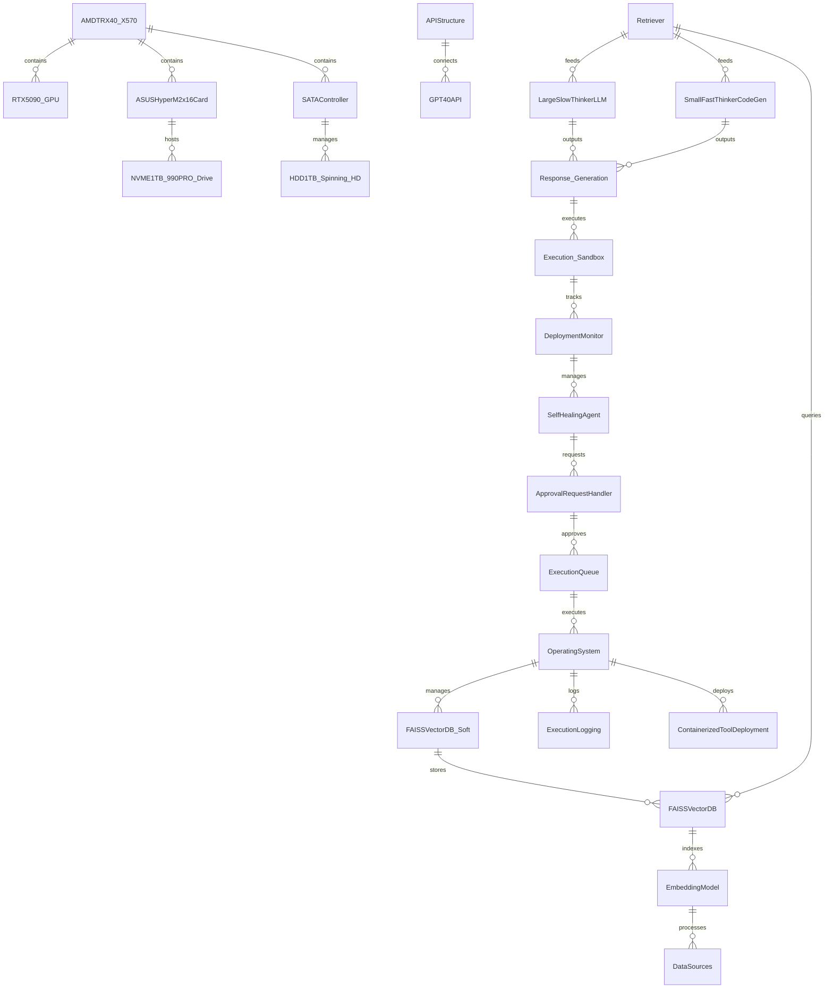

```mermaid
erDiagram
    %% Hardware Entities
    AMDTRX40_X570 ||--o{ RTX5090_GPU : contains
    AMDTRX40_X570 ||--o{ ASUSHyperM2x16Card : contains
    ASUSHyperM2x16Card ||--o{ NVME1TB_990PRO_Drive : hosts
    AMDTRX40_X570 ||--o{ SATAController : contains
    SATAController ||--o{ HDD1TB_Spinning_HD : manages

    %% Operating System
    OperatingSystem ||--o{ FAISSVectorDB_Soft : manages
    OperatingSystem ||--o{ ExecutionLogging : logs
    OperatingSystem ||--o{ ContainerizedToolDeployment : deploys

    %% FAISS & Retrieval System
    FAISSVectorDB_Soft ||--o{ FAISSVectorDB : stores
    FAISSVectorDB ||--o{ EmbeddingModel : indexes
    EmbeddingModel ||--o{ DataSources : processes
    Retriever ||--o{ FAISSVectorDB : queries

    %% AI & API
    APIStructure ||--o{ GPT40API : connects
    Retriever ||--o{ LargeSlowThinkerLLM : feeds
    Retriever ||--o{ SmallFastThinkerCodeGen : feeds
    LargeSlowThinkerLLM ||--o{ Response_Generation : outputs
    SmallFastThinkerCodeGen ||--o{ Response_Generation : outputs
    Response_Generation ||--o{ Execution_Sandbox : executes

    %% Monitoring & Human-in-the-Loop
    Execution_Sandbox ||--o{ DeploymentMonitor : tracks
    DeploymentMonitor ||--o{ SelfHealingAgent : manages
    SelfHealingAgent ||--o{ ApprovalRequestHandler : requests
    ApprovalRequestHandler ||--o{ ExecutionQueue : approves
    ExecutionQueue ||--o{ OperatingSystem : executes
```
