```mermaid
graph TD
    %% FAISS-Backed RAG System
    subgraph RAG_System ["Retrieval-Augmented Generation (RAG)"]
        RAG1["Data Sources (Multiple Formats)"]
        RAG2["Embedding Model (Multi-lingual)"]
        RAG3["FAISS Vector DB"]
        RAG4["Retriever"]

        RAG1 --> RAG2
        RAG2 -->|Embeddings| RAG3
        RAG4 -->|Query| RAG3
        RAG3 -->|Relevant Data| RAG4
    end

    %% API Gateway for Frontier Models
    subgraph API_Gateway ["Frontier Model API Access"]
        API1["GPT-40 / Google Gemini API"]
        API2["API Orchestrator"]

        API2 -->|Query| API1
        API1 -->|Response| API2
        API2 -->|Rate Limiting/Auth| API1
    end

    %% Development Environment & Logging
    subgraph Dev_Env ["Dev, Logging & Self-Healing (Ubuntu/RHEL/Rocky)"]
        LOG1["Execution Logging"]
        LOG2["Model Behavior Analysis"]
        CON1["Containerized Tool Deployment (Docker/Podman)"]
        MON1["Deployment Monitor"]
        REC1["Self-Healing Agent"]
    end

    %% Human-in-the-Loop Approval
    subgraph Human_Approval ["Human-in-the-Loop System"]
        HIL1["Approval Request Handler"]
        HIL2["Manual Override Console"]
        HIL3["Execution Queue"]

        HIL1 -->|Approval Request| HIL2
        HIL2 -->|Approval Decision| HIL3
        HIL3 -->|Execution Signal| CON1
    end

    %% Ensemble 1
    subgraph Ensemble_1 ["Ensemble 1"]
        A1["Large 'Slow-thinker' LLM"] -->|Guidance/Inference| B1["Smaller 'Fast-thinker' Code Generator"]
        A1 -->|Feedback| C1["Smaller 'Fast-thinker' Actor-Critic"]

        B1 -->|Generates Code Multiple Languages| D1["Multi-Language Sandbox (Perl, Rust, Go, C/C++, Python)"]
        C1 -->|Evaluates Outputs| D1

        D1 -->|Results & Feedback| C1
        D1 -->|Refinement Requests| B1

        A1 -->|Retrieves Context| RAG4
        B1 -->|Retrieves Code Samples| RAG4

        A1 -->|Clarification Request| API2
        B1 -->|Best Practice Lookups| API2

        D1 -->|Logs Execution| LOG1
        D1 -->|Deploys Code| CON1

        CON1 -->|Deployment Status| MON1
        MON1 -->|Detects Failure| REC1
        REC1 -->|Retries Deployment| CON1
        REC1 -->|Escalates to Human| HIL1
    end

    %% Ensemble 2 (Similar Structure)
    subgraph Ensemble_2 ["Ensemble 2"]
        A2["Large 'Slow-thinker' LLM"] -->|Guidance/Inference| B2["Smaller 'Fast-thinker' Code Generator"]
        A2 -->|Feedback| C2["Smaller 'Fast-thinker' Actor-Critic"]

        B2 -->|Generates Code Multiple Languages| D2["Multi-Language Sandbox (Perl, Rust, Go, C/C++, Python)"]
        C2 -->|Evaluates Outputs| D2

        D2 -->|Results & Feedback| C2
        D2 -->|Refinement Requests| B2

        A2 -->|Retrieves Context| RAG4
        B2 -->|Retrieves Code Samples| RAG4

        A2 -->|Clarification Request| API2
        B2 -->|Best Practice Lookups| API2

        D2 -->|Logs Execution| LOG1
        D2 -->|Deploys Code| CON1

        CON1 -->|Deployment Status| MON1
        MON1 -->|Detects Failure| REC1
        REC1 -->|Retries Deployment| CON1
        REC1 -->|Escalates to Human| HIL1
    end


    %% Cross-Ensemble Communication
    D1 -->|Shares Performance Metrics| A2
    D2 -->|Shares Performance Metrics| A1

    %% Hardware Infrastructure
    subgraph Hardware ["Hardware Infrastructure (AMD TRX40/X570)"]
        direction LR
        subgraph AMD_TRX40_X570["AMD TRX40/X570 Platform"]
            CPU[CPU] -->|PCIe 4.0 x16| GPU1[RTX 5090 GPU 1]
            CPU -->|PCIe 4.0 x16| GPU2[RTX 5090 GPU 2]
            CPU -->|PCIe 4.0 x16| NVMe_RAID[ASUS Hyper M.2 x16 Card]
            CPU -->|PCIe 4.0 x4| OS_NVMe[OS NVMe Drive]
            CPU -->|PCIe 4.0 x4| SATA_Controller[SATA Controller]
        end

        subgraph NVMe_RAID_Array["NVMe RAID 0 Array (4x 4TB Samsung 990 PRO)"]
            NVMe_RAID --> NVMe1[NVMe 1]
            NVMe_RAID --> NVMe2[NVMe 2]
            NVMe_RAID --> NVMe3[NVMe 3]
            NVMe_RAID --> NVMe4[NVMe 4]
        end

        subgraph Backup_Cold_Storage["Backup & Cold Storage (Spinning HDDs)"]
            SATA_Controller --> HDD1[HDD 1]
            SATA_Controller --> HDD2[HDD 2]
            SATA_Controller --> HDD3[HDD 3]
        end


        NVMe_RAID_Array -->|rsync| Backup_Cold_Storage
    end

    %% Software Stack
    subgraph Software_Stack["Software Stack (Ubuntu 22.04/RHEL/Rocky)"]
        OS[OS] --> FAISS[FAISS Vector Database]
        OS --> LM["Language Models (Multiple)"]  
        FAISS -->|Memory-Mapped| NVMe_RAID_Array
        LM -->|Query| FAISS
    end

    %% Linking Software and Hardware
    Software_Stack -->|Deployed on| Hardware

    style AMD_TRX40_X570 fill:#f9f,stroke:#333,stroke-width:4px
    style NVMe_RAID_Array fill:#bbf,stroke:#333,stroke-width:2px
    style Backup_Cold_Storage fill:#fbb,stroke:#333,stroke-width:2px
    style Software_Stack fill:#bfb,stroke:#333,stroke-width:2px
    style Hardware fill:#ddd,stroke:#333,stroke-width:2px
```

Key Changes & Improvements:

Multi-Language Support: Updated labels and components to explicitly mention support for multiple coding languages (Perl, Rust, Go, C/C++, Python). 

The "Execution Environment" is now a "Multi-Language Sandbox."

Operating System Flexibility: Added that the system can run on Ubuntu 22.04, Redhat, or Rocky Linux.

Hardware Diagram Integrated: The detailed hardware diagram you provided is now seamlessly integrated into the main architecture diagram using subgraphs and styling. This provides a much clearer picture of the hardware underpinning the system.

Software/Hardware Link: Added a connection line "Deployed on" between the software stack and the hardware, making the relationship explicit.

Simplified Labels: Shortened some labels for better readability (e.g., "LLM" instead of "Large Language Model").

Consistent Styling: Applied consistent styling to the hardware components to visually separate them from the software components.

NVMe RAID Description: Added a description of the NVMe RAID array's components (4x 4TB Samsung 990 PRO).

Backup Process Clarified: The backup process is now more clearly linked to the hardware and uses the rsync label.

This revised diagram offers a more complete and informative view of your system, highlighting the multi-language capabilities, OS flexibility, and the specific hardware infrastructure used. The integration of the hardware diagram is a significant improvement, providing valuable context.
