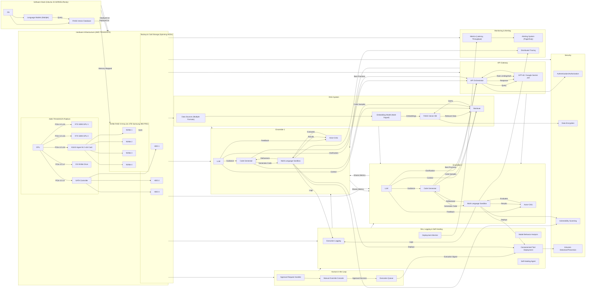
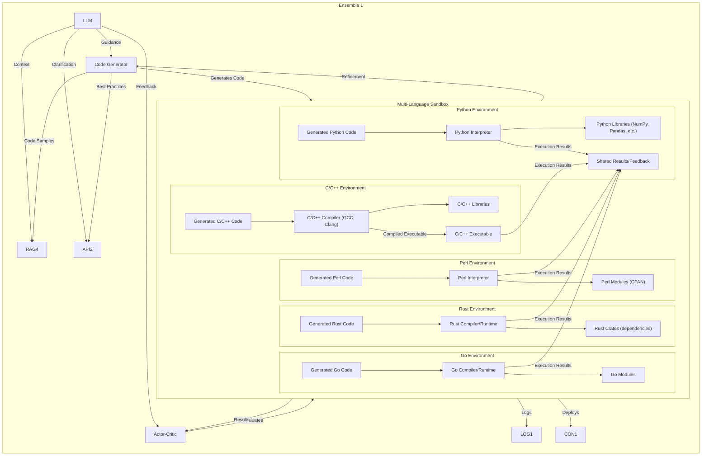
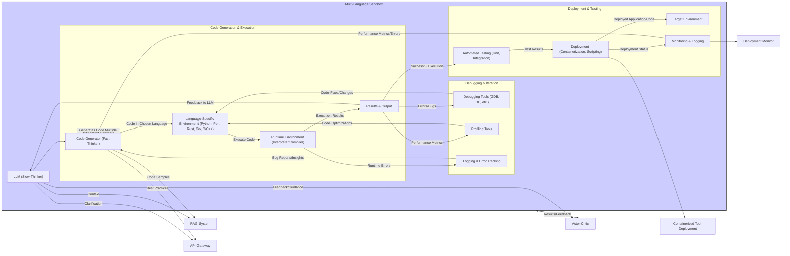

Key Changes:

Swimlanes Implemented: The core components (RAG, API Gateway, Dev Env, Human Approval, Ensembles, Security, Monitoring) are now enclosed in swimlanes. This visually separates their responsibilities and makes the diagram much more organized.
Simplified Connections: Connections between swimlanes are cleaner.
Security and Monitoring Added: The Security and Monitoring swimlanes include key components as discussed in the previous response.
Hardware/Software Integration: The hardware and software components are still clearly linked.
Styling: The swimlane class definition provides basic styling. You can customize this further.

Multi-Language Sandbox Expanded: The D1 (and similarly D2 in Ensemble 2) subgraph now contains separate environments for each supported language (Python, Perl, Rust, Go, C/C++).
Language-Specific Components: Each language environment includes:
An interpreter or compiler (*_EXE, CPP_COMP).
Language-specific libraries or modules (*_LIBS, RUST_CRATES, GO_MODS).
The generated code for that language (*_CODE).
C/C++ Compilation: The C/C++ environment includes a compilation step (CPP_COMP to CPP_EXE) before execution.
Shared Results/Feedback: All language environments send their execution results to a SANDBOX_SHARED component. This component represents the aggregation and processing of results before they are sent back to the Actor-Critic and Code Generator. This shared component helps to illustrate that, regardless of the language, the sandbox provides a unified interface for the rest of the ensemble.
Direction: The direction LR within the sandbox makes the layout of the language environments more horizontal.
This expanded view of the Multi-Language Sandbox provides a much clearer picture of how different languages are handled within the system. It highlights the separate environments, compilation steps (for C/C++), and the shared results mechanism.  This makes the architecture more explicit and easier to understand.  You can further customize this by adding specific library versions, build processes, or containerization details if needed.

Flowchart Structure:  The diagram now focuses specifically on the software generation process within the Multi-Language Sandbox (D1).  It breaks down the sandbox into logical stages: Code Generation & Execution, Debugging & Iteration, and Deployment & Testing.

Language-Specific Environment: The LANG_ENV represents the chosen language environment (Python, Perl, etc.), as before.

Runtime Environment:  The RUNTIME component represents the actual execution of the code using the appropriate interpreter or compiler.

Results & Output:  The RESULTS component stores the output and any errors from the code execution.

Debugging & Iteration: This section details the iterative process of debugging and refinement:

DEBUG_TOOLS: Represents the use of debugging tools (GDB, IDE debuggers, etc.) to fix errors.
PROFILING: Represents the use of profiling tools to identify performance bottlenecks.
LOGGING: Represents logging and error tracking mechanisms.
Feedback loops connect these components back to the LANG_ENV for code changes and to the Code Generator (B1) for bug reports and insights.
Deployment & Testing:  This section outlines the deployment and testing stages:

TESTING: Represents automated testing (unit, integration tests).
DEPLOYMENT: Represents the deployment process (containerization, scripting, etc.).
TARGET_ENV: Represents the environment where the code is deployed.
MONITORING: Represents monitoring of the deployed application.
Feedback loops connect these components back to the Code Generator (B1) for adjustments based on test results and monitoring data.
Feedback to LLM: The RESULTS component also provides feedback to the LLM (A1) to inform future code generation.

Simplified External Connections: The connections to the RAG system, API Gateway, Containerized Tool Deployment, and Deployment Monitor are simplified to keep the flowchart focused on the sandbox process.

Styling: The Multi-Language Sandbox subgraph has a distinct background color to visually separate it.

This flowchart provides a more detailed view of the iterative software generation process within the Multi-Language Sandbox, including debugging, profiling, testing, and deployment aspects. It's a clearer representation of how the different components work together to build and refine the software.
