```mermaid
graph TD
    %% FAISS-Backed RAG System
    subgraph RAG_System ["Retrieval-Augmented Generation (RAG)"]
        RAG1["Data Sources (Multiple Formats)"]
        RAG2["Embedding Model (Multi-lingual)"]
        RAG3["FAISS Vector DB"]
        RAG4["Retriever"]
        
        RAG1 --> RAG2
        RAG2 -->|Embeddings| RAG3
        RAG4 -->|Query| RAG3
        RAG3 -->|Relevant Data| RAG4
    end

    %% Neurosymbolic Reasoning
    subgraph NeuroSymbolic_AI ["Neurosymbolic Reasoning Layer"]
        NS1["LLM-Based Deductive Reasoning"]
        NS2["Symbolic Logic Engine (Prolog, Z3, RDF)"]
        NS3["Knowledge Graph Integration"]
        
        NS1 -->|Semantic Understanding| NS2
        NS2 -->|Logical Constraints| NS3
        NS3 -->|Supports Long-Term Planning| NS1
    end

    %% Active Learning Pipeline
    subgraph Active_Learning ["Active Learning & Human Querying"]
        AL1["Uncertainty Detector"]
        AL2["Human Expert Query System"]
        AL3["Incremental Model Updates"]
        
        AL1 -->|Confidence Score < Threshold| AL2
        AL2 -->|Provides Feedback| AL3
        AL3 -->|Retrains Models| Software_Stack
    end

    %% Temporal Memory System
    subgraph Temporal_Memory ["Long-Term Memory & Recall"]
        TM1["Persistent Memory Store"]
        TM2["Task-Aware Memory Retrieval"]
        TM3["Cross-Session Learning"]
        
        TM1 -->|Stores Execution History| TM2
        TM2 -->|Retrieves Context| TM3
        TM3 -->|Informs Task Execution| Software_Stack
    end

    %% Autonomous Failure Debugging
    subgraph Failure_Debugging ["Autonomous Failure Debugging"]
        FD1["Root Cause Analyzer"]
        FD2["Self-Healing Diagnostics"]
        FD3["Failure Pattern Recognition"]
        
        MON1 -->|Detects Deployment Failure| FD1
        FD1 -->|Analyzes Logs & Errors| FD2
        FD2 -->|Suggests Fixes| REC1
        FD3 -->|Matches Past Failures| FD2
    end

    %% Energy-Aware Execution
    subgraph Energy_Aware ["Energy-Aware Execution & Optimization"]
        EA1["GPU Utilization Monitor"]
        EA2["Dynamic Load Balancer"]
        EA3["Task Scheduling Optimizer"]
        
        EA1 -->|Tracks Energy Usage| EA2
        EA2 -->|Balances Resource Allocation| EA3
        EA3 -->|Optimizes Execution Order| Software_Stack
    end

    %% Zero-Shot & Few-Shot Adaptation
    subgraph Adaptation ["Zero-Shot & Few-Shot Adaptation"]
        AD1["Knowledge Transfer Agent"]
        AD2["Self-Supervised Learning"]
        AD3["Adaptive Model Tuning"]
        
        AL1 -->|Unseen Task Detected| AD1
        AD1 -->|Transfers Related Knowledge| AD2
        AD2 -->|Refines Response| AD3
        AD3 -->|Updates Execution Strategy| Software_Stack
    end

    %% Agent Autonomy Control
    subgraph Agent_Autonomy ["Fine-Grained Autonomy Control"]
        AC1["Task Permission System"]
        AC2["Execution Confidence Scoring"]
        AC3["Human-in-the-Loop Override"]
        
        AC1 -->|Determines Autonomy Level| AC2
        AC2 -->|Scales AI Decision Autonomy| AC3
        AC3 -->|Allows Human Review| HIL1
    end

    %% Knowledge Distillation
    subgraph Knowledge_Distillation ["Efficient Knowledge Compression"]
        KD1["Multi-Model Aggregation"]
        KD2["Teacher-Student Distillation"]
        KD3["Lossless Compression for Deployment"]
        
        KD1 -->|Merges Insights from LLMs| KD2
        KD2 -->|Distills Core Knowledge| KD3
        KD3 -->|Deploys Smaller Efficient Models| Software_Stack
    end

    %% Connecting to Software Stack
    Software_Stack -->|Incorporates All Enhancements| Knowledge_Distillation
    Software_Stack -->|Implements Energy-Aware Execution| Energy_Aware
    Software_Stack -->|Adapts to Unseen Tasks| Adaptation
    Software_Stack -->|Manages Memory Recall| Temporal_Memory
    Software_Stack -->|Ensures Secure & Controlled Execution| Agent_Autonomy
    Software_Stack -->|Enhances Reasoning with Neurosymbolic AI| NeuroSymbolic_AI
    Software_Stack -->|Optimizes Through Active Learning| Active_Learning
    Software_Stack -->|Debugs Deployment Failures| Failure_Debugging
```

Key Enhancements
Neurosymbolic Reasoning → Combine LLMs with symbolic logic for better long-term planning & decision-making.
Active Learning Pipeline → Allow system to query human experts when confidence is low.
Temporal Memory System → Enable long-term memory recall across different executions.
Knowledge Distillation → Improve efficiency by compressing knowledge from multiple models.
Zero-Shot & Few-Shot Adaptation → System dynamically adapts to unseen tasks using transfer learning.
Energy-Aware Execution → Smart resource allocation & scheduling to minimize energy waste.
Agent Autonomy Control → Fine-grained tuning of autonomous vs human-in-the-loop operations.
Autonomous Failure Debugging → Root-cause analysis for tool deployment failures before human escalation.

What These Refinements Achieve
Feature	Benefit
Neurosymbolic Reasoning	Enhances planning, decision-making, and consistency in task execution.
Active Learning Pipeline	Reduces errors by querying humans when confidence is low.
Temporal Memory System	Enables long-term memory recall across different sessions.
Autonomous Failure Debugging	AI self-diagnoses issues and suggests fixes before escalation.
Zero-Shot & Few-Shot Adaptation	Models adapt to new tasks on the fly without retraining.
Energy-Aware Execution	Minimizes GPU overuse and optimizes task scheduling.
Agent Autonomy Control	Allows fine-grained tuning of how much AI can automate vs. require human oversight.
Knowledge Distillation	Enables efficient model compression without sacrificing performance.
