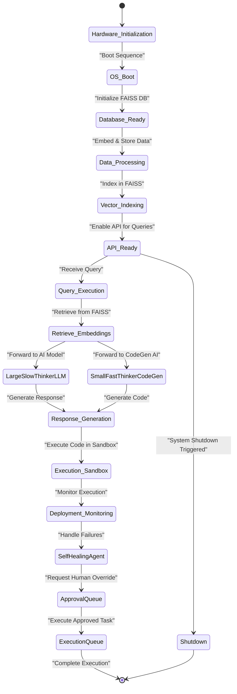

```mermaid
stateDiagram
    [*] --> Hardware_Initialization
    Hardware_Initialization --> OS_Boot : "Boot Sequence"
    OS_Boot --> Database_Ready : "Initialize FAISS DB"
    
    Database_Ready --> Data_Processing : "Embed & Store Data"
    Data_Processing --> Vector_Indexing : "Index in FAISS"
    Vector_Indexing --> API_Ready : "Enable API for Queries"
    
    API_Ready --> Query_Execution : "Receive Query"
    Query_Execution --> Retrieve_Embeddings : "Retrieve from FAISS"
    Retrieve_Embeddings --> LargeSlowThinkerLLM : "Forward to AI Model"
    Retrieve_Embeddings --> SmallFastThinkerCodeGen : "Forward to CodeGen AI"
    
    LargeSlowThinkerLLM --> Response_Generation : "Generate Response"
    SmallFastThinkerCodeGen --> Response_Generation : "Generate Code"
    
    Response_Generation --> Execution_Sandbox : "Execute Code in Sandbox"
    Execution_Sandbox --> Deployment_Monitoring : "Monitor Execution"
    Deployment_Monitoring --> SelfHealingAgent : "Handle Failures"
    
    SelfHealingAgent --> ApprovalQueue : "Request Human Override"
    ApprovalQueue --> ExecutionQueue : "Execute Approved Task"
    ExecutionQueue --> [*] : "Complete Execution"
    
    API_Ready --> Shutdown : "System Shutdown Triggered"
    Shutdown --> [*]
```
