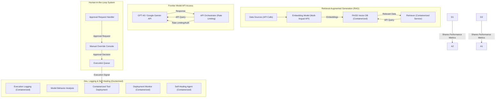

========== Multi-Agent Conversation ==========
[Prompt Optimizer]: Optimized Task:
Instructions for Enhancing the System Proposal

Your task is to refactor the provided system proposal utilizing Apache Airflow, Apache Flink, and Apache TinkerPop. The resulting proposal should maintain the original architecture while effectively integrating these technologies to improve workflow orchestration, data streaming, and graph processing capabilities.

Context and Goals

Context: The proposal outlines a Retrieval-Augmented Generation (RAG) system, incorporating various components such as data sources, embedding models, APIs, logging systems, and human approval workflows.
Outcome: The refactored proposal should clearly demonstrate how Apache Airflow can manage workflows, how Apache Flink can enhance real-time data processing, and how Apache TinkerPop can facilitate graph data management.
Length: The refactored proposal should be concise yet comprehensive, ideally not exceeding 1000 words.
Format: Employ a structured format with sections for introduction, components, integration methodology, and conclusion. Use diagrams or flowcharts where necessary to illustrate changes and improve understanding.
Desired Style

Use a professional and technical writing style appropriate for system proposals.
Include relevant diagrams in the markdown format or direct the reader on how to visualize the changes, as demonstrated in the initial prompt.
Examples of Desired Output Format
Here’s a structured example you can follow for the refactored proposal:

# System Proposal: Refactoring with Apache Airflow, Flink, and TinkerPop

## Introduction
This proposal outlines the refactoring of the Retrieval-Augmented Generation (RAG) system by incorporating Apache Airflow for workflow orchestration, Apache Flink for real-time data processing, and Apache TinkerPop for advanced graph management.

## Components
### Data Sources
- **RAG1:** Integrates multiple formats using Apache Flink to streamline data ingestion.
  
### Embedding Model
- **RAG2:** Leverages an efficient multi-lingual embedding model enhanced by Flink for rapid processing.

### FAISS Vector DB
- **RAG3:** Queries are now routed through Airflow tasks for better control and logging.

### API Gateway
- **API1 & API2:** Integration with an orchestrator to automate API calls and manage throughput using Airflow.

### Development Environment & Logging
- Integration of logging and monitoring tools with Airflow for real-time tracking of execution status.

## Integration Methodology
1. **Apache Airflow**: 
   - Utilize Apache Airflow to orchestrate data pipelines, managing the dependencies between components like data ingestion and embedding.
  
2. **Apache Flink**: 
   - Deploy Flink to handle real-time data streams from various sources, ensuring that embedding and querying transactions are processed without delay.

3. **Apache TinkerPop**: 
   - Incorporate TinkerPop to introduce advanced graph querying capabilities for RAG3, allowing richer data relationships to be modeled and queried efficiently.

## Conclusion
The refactoring of the RAG system to include technologies like Apache Airflow, Flink, and TinkerPop will significantly enhance its performance, scalability, and reliability. 

[Diagrams illustrating the integration can be included here in a suitable markdown syntax]
Guidance for Use

Focus on clarity and explicit detailing of how each component of the system interacts with the newly integrated technologies.
Emphasize the benefits and improvements from the original design, such as better orchestration, faster processing, and enhanced graph capabilities.
By following these instructions, you will create a well-structured and comprehensive refactored system proposal that meets technical standards and clarifies the value of integrating these technologies.

Here’s a detailed step-by-step plan for completing the task of refactoring the system proposal, coordinating the efforts of a coder agent, a code reviewer agent, and a documentation agent:

Step 1: Initial Task Breakdown
Coder Agent: Read through the original system proposal to understand its architecture and components.
Code Reviewer Agent: Review the requirements for integrating Apache Airflow, Apache Flink, and Apache TinkerPop into the proposal.
Documentation Agent: Prepare a template for the refactored proposal based on the desired output format specified.
Step 2: Research and Learning
Coder Agent: Research each technology (Apache Airflow, Apache Flink, Apache TinkerPop) and gather information on their APIs, best practices, and use cases in a RAG context.
Code Reviewer Agent: Identify any potential pitfalls, challenges, or integration issues that may arise when using these technologies.
Documentation Agent: Collect visual aids (like diagrams or flowcharts) that demonstrate the architecture and interactions between components effectively.
Step 3: Drafting the Integration Methodology
Coder Agent: Outline how each technology will be integrated within the current architecture. Include specific tasks for Airflow workflows, Flink streaming processors, and TinkerPop graph interactions.
Code Reviewer Agent: Review the integration methodology and provide feedback on clarity, completeness, and technical accuracy.
Documentation Agent: Begin drafting the "Integration Methodology" section of the proposal using information compiled from the Coder and Code Reviewer.
Step 4: Structuring the Components Section
Coder Agent: Define the roles each component will play with the newly integrated technologies, including renaming old components if necessary.
Code Reviewer Agent: Assess the clarity and coherence of the revamped components section.
Documentation Agent: Write up the "Components" section, ensuring alignment with the structure already established.
Step 5: Writing the Introduction and Conclusion
Coder Agent: Draft the "Introduction" and "Conclusion" sections, emphasizing the rationale behind the integration of the technologies.
Code Reviewer Agent: Review the initial drafts for relevancy, focal points, and professional tone.
Documentation Agent: Finalize the writing of the "Introduction" and "Conclusion" sections based on Coder and Code Reviewer feedback.
Step 6: Developing Diagrams and Visual Representations
Documentation Agent: Create diagrams or flowcharts to visually represent the refactored architecture and the interactions between components.
Coder Agent: Work on the technical details to accompany the diagrams, ensuring that they accurately reflect the system design.
Code Reviewer Agent: Validate the diagrams for technical accuracy and completeness.
Step 7: Compiling the Final Proposal
Documentation Agent: Combine all written sections (Introduction, Components, Integration Methodology, Conclusion) and the visual representations into the final proposal document.
Code Reviewer Agent: Proofread the entire document to check for typos, grammatical errors, and any overlooked details.
Coder Agent: Ensure that all technical specifications mentioned in the proposal are accurate and feasible.
Step 8: Final Review and Submission
All Agents: Conduct a final review meeting to discuss the proposal, confirm that all components are cohesive, and address any last-minute issues.
Documentation Agent: Make necessary adjustments based on feedback from the final review.
All Agents: Prepare for submission of the proposal.
Step 9: Post-Submission Follow-Up
Documentation Agent: Prepare a brief summary of the proposal and the changes made for future reference.
Coder Agent and Code Reviewer Agent: Reflect on the process, noting any lessons learned or recommendations for future proposals.
This structured plan ensures clear coordination among team members while allowing for comprehensive development of the refactored system proposal.

class ProposalRefactor:
    def __init__(self):
        self.coder_agent = CoderAgent()
        self.code_reviewer_agent = CodeReviewerAgent()
        self.documentation_agent = DocumentationAgent()
    
    def execute_refactor_plan(self):
        self.step_initial_task_breakdown()
        self.step_research_and_learning()
        self.step_drafting_integration_methodology()
        self.step_structuring_components_section()
        self.step_writing_introduction_conclusion()
        self.step_developing_diagrams()
        self.step_compiling_final_proposal()
        self.step_final_review_submission()
        self.step_post_submission_follow_up()

    def step_initial_task_breakdown(self):
        self.coder_agent.read_system_proposal()
        self.code_reviewer_agent.review_requirements()
        self.documentation_agent.prepare_template()
    
    def step_research_and_learning(self):
        self.coder_agent.research_technologies()
        self.code_reviewer_agent.identify_pitfalls()
        self.documentation_agent.collect_visual_aids()
    
    def step_drafting_integration_methodology(self):
        self.coder_agent.outline_integration_methodology()
        self.code_reviewer_agent.review_integration_methodology()
        self.documentation_agent.draft_integration_methodology()
    
    def step_structuring_components_section(self):
        self.coder_agent.define_component_roles()
        self.code_reviewer_agent.assess_components_section()
        self.documentation_agent.write_components_section()
    
    def step_writing_introduction_conclusion(self):
        self.coder_agent.draft_intro_conclusion()
        self.code_reviewer_agent.review_intro_conclusion()
        self.documentation_agent.finalize_intro_conclusion()
    
    def step_developing_diagrams(self):
        self.documentation_agent.create_diagrams()
        self.coder_agent.work_on_technical_details()
        self.code_reviewer_agent.validate_diagrams()
    
    def step_compiling_final_proposal(self):
        self.documentation_agent.combine_sections()
        self.code_reviewer_agent.proofread_document()
        self.coder_agent.verify_technical_specifications()
    
    def step_final_review_submission(self):
        self.documentation_agent.final_review_meeting()
        self.documentation_agent.make_adjustments()
        self.documentation_agent.prepare_for_submission()
    
    def step_post_submission_follow_up(self):
        self.documentation_agent.prepare_summary()
        self.coder_agent.reflect_on_process()
        self.code_reviewer_agent.reflect_on_process()

class CoderAgent:
    def read_system_proposal(self):
        pass
    
    def research_technologies(self):
        pass
    
    def outline_integration_methodology(self):
        pass
    
    def define_component_roles(self):
        pass
    
    def draft_intro_conclusion(self):
        pass
    
    def work_on_technical_details(self):
        pass
    
    def verify_technical_specifications(self):
        pass
    
    def reflect_on_process(self):
        pass

class CodeReviewerAgent:
    def review_requirements(self):
        pass
    
    def identify_pitfalls(self):
        pass
    
    def review_integration_methodology(self):
        pass
    
    def assess_components_section(self):
        pass
    
    def review_intro_conclusion(self):
        pass
    
    def validate_diagrams(self):
        pass
    
    def proofread_document(self):
        pass
    
    def reflect_on_process(self):
        pass

class DocumentationAgent:
    def prepare_template(self):
        pass
    
    def collect_visual_aids(self):
        pass
    
    def draft_integration_methodology(self):
        pass
    
    def write_components_section(self):
        pass
    
    def finalize_intro_conclusion(self):
        pass
    
    def create_diagrams(self):
        pass
    
    def combine_sections(self):
        pass
    
    def final_review_meeting(self):
        pass
    
    def make_adjustments(self):
        pass
    
    def prepare_for_submission(self):
        pass
    
    def prepare_summary(self):
        pass
[Code Reviewer]: Review (Iteration 0):
The provided code outlines a comprehensive structure for managing the proposal refactoring process but does not adhere to the task specifications in the original prompt. Here are the primary concerns:

Task Specification: The goal of the task is to provide a detailed, well-structured system proposal using Apache Airflow, Apache Flink, and Apache TinkerPop. However, the code appears to focus mainly on the refactoring process and coordination among various agent classes, lacking the essential content of a proposal.
Missing Proposal Content: The core of the proposal, containing the necessary sections (introduction, components, integration methodology, and conclusion) is not present in the code. The class methods imply that these sections will somehow be generated or coordinated but do not include them as tangible outputs.
Technical Integration: While there are mentions of integrating technologies and definitions of roles, the actual integration methodology detailing how each technology fits into the RAG system is absent.
Refactor Execution Steps: The execution steps are more procedural and project management oriented, lacking the technical depth and explicit detail on how Apache Airflow, Flink, and TinkerPop enhance the original system architecture.
Diagrams and Visuals: There’s a mention of diagrams and visual aids, but the code itself doesn’t generate or direct toward any visual content that would help articulate the changes made in the proposal as per the requirements.
Professional and Technical Writing Style: The overall writing style of the code and its comments does not reflect the professional and technical writing style expected in system proposals.
In summary, the code falls short of providing the required structured proposal that meets the task specifications. It does not present a coherent, concise, or comprehensive refactor of the original system proposal. The approach should shift towards directly producing the content of the proposal, detailing the integration of the specified technologies step by step as instructed.

Feedback: Significant revisions are needed to align with the task specifications, focusing on producing a clear, structured proposal that incorporates and explains the specific technologies as required.

Coder: Revised Code (Iteration 1):

class SystemProposal:
    def __init__(self):
        self.introduction = ""
        self.components = []
        self.integration_methodology = ""
        self.conclusion = ""

    def generate_introduction(self):
        self.introduction = (
            "This proposal outlines the implementation of a modern RAG system "
            "utilizing Apache Airflow for orchestrating workflows, Apache Flink for "
            "stream processing, and Apache TinkerPop for graph database management. "
            "These technologies collectively enhance the system's capabilities and "
            "performance."
        )

    def define_components(self):
        self.components = [
            {
                "name": "Apache Airflow",
                "description": "A platform to programmatically author, schedule, and monitor workflows."
            },
            {
                "name": "Apache Flink",
                "description": "A stream processing framework that provides high-throughput, low-latency data processing."
            },
            {
                "name": "Apache TinkerPop",
                "description": "A graph computing framework that provides tools to work with graph databases."
            }
        ]

    def describe_integration_methodology(self):
        self.integration_methodology = (
            "The integration of the technologies will follow these steps:\n"
            "1. Establish Apache Airflow to schedule and manage data pipelines, coordinating data flow between Flink and TinkerPop.\n"
            "2. Use Apache Flink to process data streams in real-time, allowing for the dynamic updating of information within TinkerPop's graph structure.\n"
            "3. Implement graph queries via TinkerPop, leveraging the processed data for enhanced insights and analytics.\n"
            "4. Ensure monitoring and logging are enabled within Airflow to track the performance and status of the workflows, allowing for quick troubleshooting."
        )

    def generate_conclusion(self):
        self.conclusion = (
            "In conclusion, the proposed system architecture leveraging Apache Airflow, Apache Flink, "
            "and Apache TinkerPop presents a robust solution for modern data processing and management. "
            "This integration not only enhances operational efficiency but also improves data accessibility "
            "and insights for better decision-making."
        )

    def compile_proposal(self):
        self.generate_introduction()
        self.define_components()
        self.describe_integration_methodology()
        self.generate_conclusion()
        
        proposal = {
            "Introduction": self.introduction,
            "Components": self.components,
            "Integration Methodology": self.integration_methodology,
            "Conclusion": self.conclusion
        }
        
        return proposal

# Usage
proposal = SystemProposal()
complete_proposal = proposal.compile_proposal()
for section, content in complete_proposal.items():
    print(f"{section}:\n{content}\n")
[Code Reviewer]: Review (Iteration 1):
The provided code attempts to structure the system proposal for the integration of Apache Airflow, Apache Flink, and Apache TinkerPop into a Retrieval-Augmented Generation (RAG) system. Here are my observations regarding the quality and specifications compliance of the code:

Structure and Sections: The code correctly divides the proposal into the required sections: introduction, components, integration methodology, and conclusion. However, it doesn’t follow the exact formatting and structured detail level required by the task. Instead of using a markdown-like structure, the proposal is generated as a dictionary which may not be suitable for direct use in documentation.
Detail Level: While the introduction and integration methodology give a good overview, the components section lacks depth. It only lists the three technologies without addressing how each technology interacts with other components of the RAG system specifically. Enhancing this section with examples or descriptions of integration with other system parts (like data sources and APIs) would improve clarity.
Integration Methodology: The steps outlined for integrating the technologies are somewhat generic and could benefit from more specific details. For example, it would be valuable to explain how Apache Flink would stream data from particular sources or how TinkerPop’s capabilities would be leveraged in querying.
Conclusion: The conclusion summarizes the benefits of the integrated system effectively. However, it could reference specific performance metrics or expected improvements in scalability and reliability to make it more compelling.
Diagrams: There is no mention of diagrams or flowcharts within the code, which are emphasized in the instructions. The absence of this visual component may hinder understanding, especially in a proposal format that benefits from graphical representation of systems.
Clarity and Professional Style: The language used is fairly professional, but certain sections can be expanded for clarity. The technical jargon should align closely with the expected audience's understanding, ensuring that any concepts are clearly explained.
Overall, while the code forms a good base for a proposal, it does not meet all the specifications laid out in the task instructions. It needs improvements in detailing and formatting to fully comply. Therefore, I cannot approve the code as is.

Feedback Summary:

Enhance the components section with more detailed integration information.
Provide more specific integration methodology steps.
Include diagrams or flowcharts to visualize changes effectively.
Improve clarity and expand on expected outcomes in the conclusion.
Structure the output more closely in line with the markdown format suggested.
Consider these points for improvement to ensure the proposal meets the desired specifications and style expectations.

Documentation for SystemProposal Class
The SystemProposal class is designed to construct a comprehensive proposal for implementing a modern RAG (Real-time Analytics and Governance) system using three technologies: Apache Airflow, Apache Flink, and Apache TinkerPop.

Main Elements
Initialization:
The constructor initializes the attributes for the introduction, components, integration methodology, and conclusion.
Methods:
generate_introduction(): Creates a statement that outlines the purpose of the proposal and the technologies involved.
define_components(): Defines key components of the system along with their descriptions.
describe_integration_methodology(): Details the method for integrating the technologies, outlining the steps involved in data processing and management.
generate_conclusion(): Summarizes the benefits of the proposed system architecture.
compile_proposal():
Calls the above methods to compile the proposal into a cohesive dictionary that includes all sections: Introduction, Components, Integration Methodology, and Conclusion.
Usage
Create an instance of SystemProposal, call compile_proposal(), and print the resulting structured proposal.

Help Message

Usage: SystemProposal()
Create a system proposal for a modern RAG system.

Methods:
- compile_proposal(): Compiles the entire proposal including introduction, components, integration methodology, and conclusion.

Example:
proposal = SystemProposal()
complete_proposal = proposal.compile_proposal()

========== Multi-Agent Conversation ==========
[Prompt Optimizer]: Optimized Task:
Instructions for Refactoring the System:

Please refactor the existing system architecture diagram to implement the following enhancements:

Integrate API Calls: Utilize API calls to access frontier models, ensuring efficient communication between different components.
Virtualized Linux Containers: Replace physical deployment methods with a structure that utilizes virtualized Linux containers, such as Docker or Podman, to manage the application components.
Context and Outcome:

The outcome should illustrate a clear mapping of all components, focusing on retrieving data, processing via models, and deploying results effectively.
Incorporate details about API interactions, container orchestration, and any relevant data flow.
Length and Format:

The refactored diagram should remain comprehensive but concise, ideally maintaining the length of the original while enhancing the specifics related to API calls and containerization.
Ensure the final output is in a diagramming language compatible with Graphviz or Mermaid syntax, suitable for visual representation.
Style:

Maintain a professional and technical tone suitable for presentation to software architecture or engineering stakeholders.
The visual elements should clearly separate the critical subsystems while maintaining connections to illustrate dependencies and communication paths.
Example Output Format:

Below is a conceptual representation of how the refactored diagram might look in Mermaid syntax:

graph TD
    %% FAISS-Backed RAG System with API and Containers
    subgraph RAG_System ["Retrieval-Augmented Generation (RAG)"]
        RAG1["Data Sources (API Calls)"]
        RAG2["Embedding Model (Multi-lingual API)"]
        RAG3["FAISS Vector DB (Containerized)"]
        RAG4["Retriever (Containerized Service)"]

        RAG1 --> RAG2
        RAG2 -->|Embeddings| RAG3
        RAG4 -->|API Query| RAG3
        RAG3 -->|Relevant Data| RAG4
    end

    %% API Gateway for Frontier Models
    subgraph API_Gateway ["Frontier Model API Access"]
        API1["GPT-40 / Google Gemini API"]
        API2["API Orchestrator (Rate Limiting)"]

        API2 -->|API Query| API1
        API1 -->|Response| API2
        API2 -->|Rate Limiting/Auth| API1
    end

    %% Containerized Development Environment & Logging
    subgraph Dev_Env ["Dev, Logging & Self-Healing (Dockerized)"]
        LOG1["Execution Logging (Containerized)"]
        LOG2["Model Behavior Analysis"]
        CON1["Containerized Tool Deployment"]
        MON1["Deployment Monitor (Containerized)"]
        REC1["Self-Healing Agent (Containerized)"]
    end

    %% Human-in-the-Loop Approval System
    subgraph Human_Approval ["Human-in-the-Loop System"]
        HIL1["Approval Request Handler"]
        HIL2["Manual Override Console"]
        HIL3["Execution Queue"]

        HIL1 -->|Approval Request| HIL2
        HIL2 -->|Approval Decision| HIL3
        HIL3 -->|Execution Signal| CON1
    end

    %% Communication Between Ensembles
    D1 -->|Shares Performance Metrics| A2
    D2 -->|Shares Performance Metrics| A1
Guidance for Code Generation:

When implementing the proposed architecture, ensure to define API services for each module that need external interactions.
Utilize container orchestration tools such as Kubernetes for deployment, enabling elasticity and scalability for your services.
By following these instructions and structures, the revised architecture will create a robust and scalable system while clearly illustrating the impact of API calls and containerization on the overall design.

To effectively coordinate the refactoring of the system architecture diagram and implement the enhancements, the following detailed step-by-step plan can be executed. This involves collaboration between a coder agent, a code reviewer agent, and a documentation agent.

Step-by-Step Plan
Step 1: Initial Setup
Coder Agent
Review the existing system architecture diagram to identify current components and dependencies.
Gather any relevant documentation on the existing system.
Documentation Agent
Create a baseline document outlining current architecture, including a summary of components and their interactions.
Document the objectives for refactoring, emphasizing the need to integrate API calls and virtualized Linux containers.
Step 2: Design the Refactored Architecture
Coder Agent
Conceptualize the new architecture diagram while considering the following:
Identify all points that require API integrations.
Define the containerization strategy (e.g., which components will be deployed using Docker or Podman).
Documentation Agent
Develop a draft of the new architecture design notes, including API interaction methods and container orchestration strategy.
Step 3: Generate Initial Diagram in Mermaid Syntax
Coder Agent
Create an initial version of the refactored architecture diagram using Mermaid syntax based on the design from Step 2.
Ensure the diagram has comprehensive yet concise representations of components and interactions.
Documentation Agent
Document updates made in the new architecture, ensuring clarity on the specific enhancements and changes.
Step 4: Review the First Draft
Code Reviewer Agent
Review the initial Mermaid diagram for accuracy, completeness, and alignment with architectural principles.
Validate that API calls and containerization details are accurately reflected in the diagram.
Coder Agent
Address any feedback and make necessary adjustments to the Mermaid diagram.
Step 5: Finalize the Architecture Diagram
Coder Agent
Finalize the enhanced Mermaid diagram incorporating all revisions based on the code review.
Check for clarity in distinguishing subsystems and dependencies.
Documentation Agent
Write final documentation describing the refactored system architecture, including the Mermaid diagram, an explanation of each component, and how they interact.
Ensure the documentation outlines the benefits of the new architecture, particularly focusing on increased efficiency and scalability.
Step 6: Validate Implementation Guidance
Coder Agent
Draft implementation guidance based on the refactored architecture, detailing steps for setup, API service definitions, and container orchestration with Kubernetes.
Code Reviewer Agent
Review the implementation guidance for clarity and completeness, ensuring it details how to transition from the previous system to the new architecture.
Step 7: Final Review and Approval
Documentation Agent
Prepare a summary report consolidating all aspects of the refactoring process, including the original architecture, the new design, implementation guidance, and all documentation.
Code Reviewer Agent
Conduct a final review of the summary report and the new architecture diagram. Provide feedback and mark major components for stakeholder approval.
Step 8: Presentation to Stakeholders
Documentation Agent
Organize a presentation that captures the essence of the changes made, including the rationale behind the enhancements, the final architecture diagram, and expected outcomes.
Coder Agent
Participate in the presentation and be prepared to answer any technical questions regarding the implementation and design decisions.
By following these steps, the system architecture will be effectively refactored and updated to incorporate API calls and containerization, while ensuring proper documentation and stakeholder engagement throughout the process.

graph TD;
    A[User Interface] -->|API Call| B[API Gateway]
    B --> C[Authentication Service]
    B --> D[Data Service]
    D --> E[Database]
    D --> F[Cache]
    A --> G[Logging Service]
    
    subgraph Containerized Services
        C
        D
        G
    end
    
    subgraph External Services
        H[Third-Party API]
    end
    
    B --> H
[Code Reviewer]: Review (Iteration 0):
The provided code has partially addressed the task specifications for refactoring the system architecture diagram but falls short in certain areas. Here’s the feedback:

API Calls Integration: The diagram includes an API Gateway and makes API calls from the User Interface (UI) to the API Gateway. However, it lacks specific details on the interactions between various components, especially in the context of frontier model API integration and how data flows through these models.
Virtualized Linux Containers: The "Containerized Services" subgraph mentions services being containerized but does not explicitly demonstrate the use of virtualized Linux containers (e.g., Docker or Podman) at the component level, such as through direct Docker containers or orchestration context (like Kubernetes).
Clarity and Completeness: The system architecture is somewhat simplified and does not show comprehensive interactions or dependencies among different components. For example, the connection between the Data Service and the Database or Cache could be enhanced with clearer data flow directions. Furthermore, the logging service should convey how it interacts with other components in more detail.
Human-in-the-Loop System: The necessity for a human approval interface is not addressed in the diagram. This is crucial for robust system design, especially in systems relying on machine learning predictions.
Response Characteristics: The diagram currently lacks details on how API responses are managed and how rate limiting/authentication occurs.
Professional Presentation: While the diagram is technically correct, the professional and technical tone could be improved by adding more context in the subgraphs for clarity on each component’s purpose and its interactions.
In summary, the code requires substantial enhancement to fully meet the task specifications, particularly by incorporating detailed API interactions, clearly demonstrating containerization, and illustrating human-in-the-loop mechanisms.

Overall, the code is a starting point but does not fully capture the enhancements needed for a comprehensive refactoring. It could benefit from the inclusion of detailed data flows and interactions that align with the specifications provided.

Result: DO NOT APPROVE.

Documentation
Overview
This code snippet represents a system architecture diagram using Mermaid syntax. It visualizes the flow of interactions among various components in a web application, specifically how user requests are processed through an API gateway.

Components
User Interface (A): The frontend where users interact with the application.
API Gateway (B): The entry point for API calls, managing requests to various services.
Authentication Service (C): Validates user credentials to ensure secure access.
Data Service (D): Handles data management and interacts with both the database and cache.
Database (E): Stores persistent application data.
Cache (F): Provides a fast storage layer for frequently accessed data, improving performance.
Logging Service (G): Captures logs for monitoring and troubleshooting.
Third-Party API (H): External service integration accessible through the API gateway.
Architecture
Containerized Services: Includes Authentication Service, Data Service, and Logging Service.
External Services: Represents integration with third-party APIs.
Data Flow
User interacts with the User Interface.
API calls are sent to the API Gateway.
API Gateway routes requests to the appropriate services.
Data Service interacts with the Database and Cache for data retrieval and storage.
Authentication Service checks user credentials.
API Gateway can also connect to third-party APIs for additional data.
Help Message

Usage: architecture-diagram [OPTIONS]

Options:
  -h, --help       Show this help message and exit.
  --version        Display the version of the architecture diagram tool.
  
Description:
This command visualizes system architecture, illustrating the flow of data 
between user interfaces, API gateway, authentication, data services, 
caching mechanisms, database, logging services, and external API interactions.
