```mermaid
graph LR
    subgraph "Human-in-the-Loop Operator"
        H1["Operator Request: TensorFlow instance with DB backend, containerized"] --> H2["Request Submitted (e.g., Jira Ticket)"]
        H2 --> H3["Approval Workflow (e.g., Manager Approval)"]
        H3 --> H4["Request Approved"]
    end

    subgraph "System (Automated)"
        H4 --> A1["LLM (Slow-Thinker) - Task Decomposition"]
        A1 --> B1["Code Generator (Fast-Thinker) - TensorFlow Instance Code"]
        A1 --> B2["Code Generator (Fast-Thinker) - Database Backend Code"]
        A1 --> B3["Code Generator (Fast-Thinker) - Containerization Script"]

        B1 --> D1["Multi-Language Sandbox (Python) - TensorFlow Instance Creation"]
        B2 --> D2["Multi-Language Sandbox (SQL) - Database Setup/Initialization"]
        B3 --> D3["Multi-Language Sandbox (Bash/Dockerfile) - Containerization"]

        D1 -->|TensorFlow Instance| E1["Git Repository (Local)"]
        D2 -->|Database Schema/Scripts| E1
        D3 -->|Dockerfile/Scripts| E1

        E1 -->|Commit/Push| F1["Git Server (Remote)"]

        F1 --> G1["CI/CD Pipeline (e.g., GitLab CI)"]
        G1 --> H10["Automated Testing (Unit, Integration)"]
        H10 -->|Tests Passed| I1["Deployment to Remote Server"]
        I1 --> J1["Deployed TensorFlow Instance with DB backend"]
        I1 --> K1["Monitoring & Logging"]
        K1 -->|Performance/Errors| L1["Alerts (e.g., Slack, PagerDuty)"]

        subgraph "Remote Server"
            J1["Deployed TensorFlow Instance with DB backend"]
        end

    end

    subgraph "Feedback & Iteration"
        L1 --> H1["Operator Feedback (e.g., Bug reports, Performance Issues)"]
        H1 --> A1["LLM - Refinement/Bug Fixing"]
        A1 --> B1["Code Generator - Code Updates"]
        A1 --> B2["Code Generator - DB Updates"]
        A1 --> B3["Code Generator - Container Updates"]
        B1 --> D1
        B2 --> D2
        B3 --> D3
        D1 --> E1
        D2 --> E1
        D3 --> E1
    end

    %% Styles
    style H1 fill:#ccf,stroke:#333,stroke-width:2px
    style J1 fill:#afa,stroke:#333,stroke-width:2px
    style D1 fill:#bbf,stroke:#333,stroke-width:2px
    style D2 fill:#bbf,stroke:#333,stroke-width:2px
    style D3 fill:#bbf,stroke:#333,stroke-width:2px
    style E1 fill:#dde,stroke:#333,stroke-width:2px
    style F1 fill:#dff,stroke:#333,stroke-width:2px
    style G1 fill:#fdd,stroke:#333,stroke-width:2px
    style I1 fill:#fcf,stroke:#333,stroke-width:2px
```

Human-in-the-Loop Flow: The flowchart starts with the operator's request and shows the approval process.

Task Decomposition: The LLM decomposes the high-level request into sub-tasks (TensorFlow instance, database backend, containerization).

Code Generation: Separate code generators handle each sub-task.

Multi-Language Sandboxes:  The appropriate sandbox environment is used for each component (Python for TensorFlow, SQL for the database, Bash/Dockerfile for containerization).

Git Integration:  The generated code and scripts are committed to a local Git repository and then pushed to a remote Git server.

CI/CD Pipeline: The CI/CD pipeline (e.g., GitLab CI) automates testing and deployment.

Automated Testing:  Automated tests are run before deployment.

Deployment to Remote Server: The application is deployed to a remote server.

Monitoring and Logging: The deployed application is monitored, and logs are generated.

Alerting: Alerts are triggered for performance issues or errors.

Feedback & Iteration: The operator can provide feedback, which triggers a new iteration of code generation, testing, and deployment.

Clearer Subgraphs: The use of subgraphs makes the diagram more organized and easier to follow.

Styling:  Styling is used to highlight key components and stages.

This enhanced flowchart provides a much more detailed view of the human-in-the-loop workflow, including task decomposition, code generation, sandboxing, Git integration, CI/CD, deployment, monitoring, alerting, and the crucial feedback loop. It's a more complete representation of a realistic software development process.
