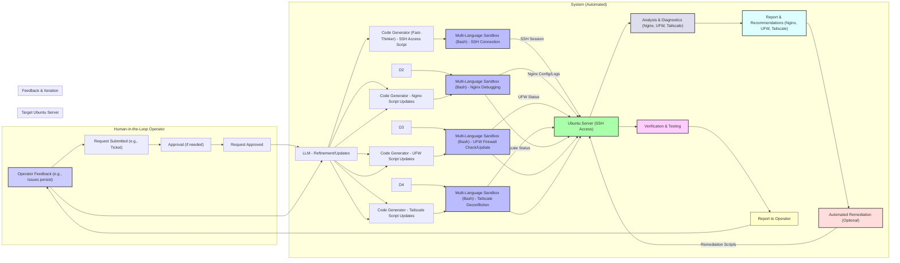

Specific Request: The operator's request is now very specific: debugging Nginx, UFW, and Tailscale on a target Ubuntu server via SSH.

Task Breakdown: The LLM breaks down the request into manageable tasks: SSH access, Nginx debugging, UFW firewall checks, and Tailscale deconfliction.

Code Generation: Separate code generators create scripts for each task.  Bash is a natural choice for system administration tasks like these.

Multi-Language Sandboxes (Bash): The sandboxes are Bash environments, suitable for executing system commands.

SSH Connection: The SSH access script establishes a connection to the target server.

Target Server Interaction: The debugging scripts interact with the target server via the established SSH connection.  They retrieve Nginx configuration/logs, UFW status, and Tailscale status.

Analysis & Diagnostics: The system analyzes the collected data to diagnose the issues.

Report & Recommendations: A report is generated with findings and recommendations for fixing the problems.

Automated Remediation (Optional): The system could automatically attempt to fix some issues based on the recommendations.  This is marked as optional because some changes might require manual intervention.

Verification & Testing: After any changes (manual or automated), the system verifies that the issues are resolved.

Report to Operator: The final report is sent to the operator.

Feedback & Iteration: The operator can provide feedback if issues persist, triggering another iteration of analysis and debugging.

Clearer Subgraphs and Styling: The diagram uses subgraphs and styling to make the flow easier to understand.

This example demonstrates how the system can be used for very specific system administration and debugging tasks, leveraging SSH access and Bash scripting within the sandboxes. The optional automated remediation step highlights the potential for the system to not just diagnose but also fix problems.
