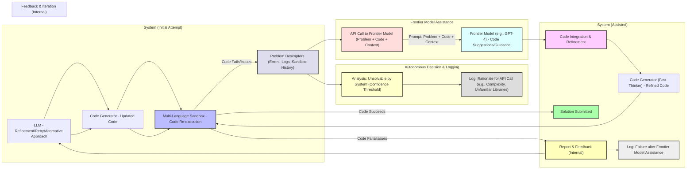

Autonomous Decision: The system now autonomously decides to call the frontier model.  The F1 component represents the logic that determines the coding challenge is beyond the system's current capabilities.  This could be based on a confidence threshold, complexity analysis, or the identification of unfamiliar libraries/APIs.

Rationale Logging: The system logs the rationale for making the API call.  This is crucial for auditing, debugging, and improving the system's autonomous decision-making in the future.  The G1 component represents this logging.

Bypassing Human Operator: The human operator is not involved in the decision to call the frontier model.  The process is fully automated.

Internal Feedback Loop: If the code fails even after frontier model assistance, the system has an internal feedback loop (M1 to A1).  It can attempt further refinement, try a different approach, or even escalate to a human operator if necessary (although that's not shown in this specific diagram to keep it focused on the autonomous flow).

Logging of Post-Assistance Failure: The system logs if the code still fails after receiving assistance from the frontier model. This information is valuable for analysis and improvement.

Styles:  Styles are used to highlight the autonomous decision and logging components.

This example highlights the autonomous nature of the system's interaction with the frontier model.  The system makes the decision, logs its reasoning, and attempts to resolve the issue without human intervention. The internal feedback loop allows the system to continue trying even if the initial frontier model assistance is insufficient.  This makes the system more robust and efficient.
