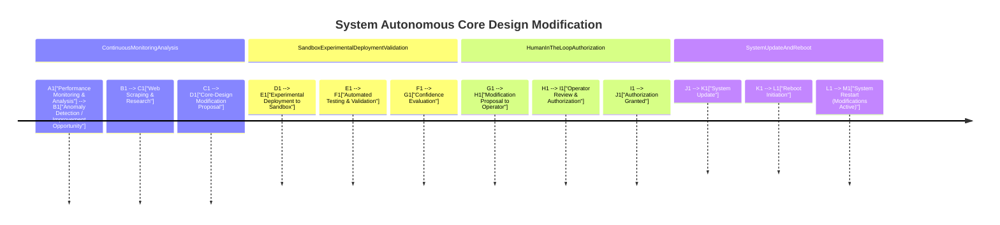

Continuous Monitoring & Analysis: The system constantly monitors its performance and analyzes logs to identify potential areas for improvement.

Anomaly Detection & Improvement Opportunity: The system detects anomalies or identifies opportunities to enhance efficiency or robustness.

Web Scraping & Research:  The system uses web scraping to research new libraries, techniques, or architectural patterns that could address the identified issues or opportunities.  This is a key aspect of autonomous improvement.

Core-Design Modification Proposal: The system generates a proposal outlining the suggested modifications to its core design.

Sandbox Experimental Deployment & Validation: The proposed changes are deployed to a separate sandbox environment (e.g., on remote servers) for testing and validation.

Automated Testing & Validation: Automated tests evaluate the performance and robustness of the modified system in the sandbox.

Confidence Evaluation: The system evaluates the results of the tests and determines a confidence level in the proposed changes.  A high confidence threshold is required before proceeding.

Human-in-the-Loop Authorization:  The system submits the modification proposal to a human operator for review and authorization.  This crucial step ensures human oversight.

System Update & Reboot: Once authorized, the system updates its codebase and dependencies with the new modifications.  A reboot is initiated to activate the changes.

Clearer Subgraphs and Styling: The diagram uses subgraphs and styling to clearly delineate the different stages of the process.

This example illustrates how the system can autonomously explore and propose improvements to its core design. The key aspects are the continuous monitoring, web scraping for research, experimental validation in a sandbox, and the essential human-in-the-loop authorization before changes are applied to the production system. This process allows the system to evolve and optimize itself while maintaining human control.
