```mermaid
timeline
    title System Autonomous Core Design Modification v2.0

    section Continuous Monitoring & Analysis
        A1["Performance Monitoring & Analysis"] --> B1["Anomaly Detection / Improvement Opportunity"]
        B1 --> C1["Web Scraping & Research"]
        C1 --> D1["Core-Design Modification Proposal"]

    section Confidence Evaluation with Bayesian Optimization
        D1 --> G1["Experimental Deployment to Sandbox"]
        G1 --> H1["Automated Testing & Validation"]
        H1 --> I1["Dynamic Confidence Evaluation (Bayesian Optimization)"]
        I1 -->|Confidence > Adaptive Threshold| J1["Auto-Approved for Review"]
        I1 -->|Confidence Borderline| J2["Additional Testing Required"]
        I1 -->|Confidence Too Low| J3["Modification Discarded"]
        J2 --> G1  %% Additional Testing Loop

    section Human-in-the-Loop Authorization with Automated Feedback
        J1 --> K1["Modification Proposal to Operator"]
        K1 --> L1["Operator Review & Authorization"]
        L1 --> M1["Authorization Granted"]
        L1 -->|Feedback Captured| M2["Feedback Stored for AI Learning"]
        M2 --> C1["Feedback Refines Future Proposals"]

    section System Update with Rollback Mechanism
        M1 --> N1["System Update & Deployment"]
        N1 --> O1["Live Deployment Monitoring"]
        O1 --> P1["Post-Deployment Performance Check"]
        P1 -->|Success| Q1["Stable Deployment"]
        P1 -->|Failure Detected| R1["Rollback Triggered"]
        R1 --> S1["Snapshot Recovery & Version Control"]
        S1 --> T1["Revert to Last Stable Version"]
        T1 --> P1  %% Retry cycle

    section System Reboot & Learning Cycle
        Q1 --> U1["Reboot Initiation (If Required)"]
        U1 --> V1["System Restart (Modifications Active)"]
        V1 --> W1["Post-Reboot Diagnostics"]
        W1 --> X1["AI Learns from Outcome & Updates Self"]
        X1 --> A1  %% Restart Continuous Monitoring Cycle
```

✅ Dynamic Confidence Evaluation with Bayesian Optimization
✅ Expanded Rollback Mechanism with Version Control & Snapshot Recovery
✅ Automated Human Feedback Integration for AI Learning Loops

📌 New Additions & Enhancements
1️⃣ Confidence Evaluation → Bayesian-based dynamic confidence thresholding replaces static % cutoffs.
2️⃣ Rollback Mechanism → Introduces Git-like version control & snapshot recovery to revert changes safely.
3️⃣ AI Learning Loops → Human feedback automatically updates the AI's proposal system to refine future modifications.

Key Enhancements & Rationalization
🔹 1. Confidence Evaluation with Bayesian Optimization
🚀 What’s New?

Bayesian Optimization replaces static confidence thresholds for deciding modification readiness.
More accurate risk/reward estimation before deciding to approve, discard, or further test a modification.
The system dynamically adjusts its confidence cutoffs based on:
Past approval rates.
Performance in sandbox testing.
Operator feedback loops.
✅ Benefits:
✔ Eliminates rigid cutoffs, allowing adaptive, data-driven decision-making.
✔ Reduces false approvals & false rejections of system modifications.
✔ Ensures modifications are only promoted when robustly validated.

🔹 2. Expanded Rollback Mechanism with Version Control & Snapshot Recovery
🚀 What’s New?

Every system update is version-controlled, similar to Git-based rollbacks.
Before applying a modification, the previous stable state is snapshotted.
If the update fails post-deployment, the system automatically reverts to the last stable version.
Rollback events are logged in the blockchain-based execution log.
✅ Benefits:
✔ Prevents catastrophic failures by allowing safe reversion.
✔ Ensures rapid recovery in case of unexpected instability.
✔ Provides a fully traceable modification history for compliance & debugging.

🔹 3. AI Learning Loops from Human Feedback
🚀 What’s New?

Operators’ decisions & justifications are logged and fed back into the AI's learning process.
AI learns which types of modifications tend to be approved vs. rejected.
The system uses this data to:
Improve future modification proposals.
Adjust its confidence evaluation models.
Reduce unnecessary human interventions over time.
✅ Benefits:
✔ System self-optimizes based on real-world feedback.
✔ Reduces operator fatigue (fewer low-quality proposals).
✔ Aligns AI-generated modifications with human decision-making patterns.

📌 Expected System Behavior After These Changes
Scenario	Old Behavior	New Behavior
High-confidence modification	Approved if above 90% threshold.	Approved dynamically if Bayesian analysis confirms expected gain.
Borderline confidence modification	Rejected or sent for human review.	Sent for additional testing, adjusting the confidence level.
Failed system update	Operator must manually diagnose & revert.	Auto-detects failure → triggers rollback → restores last working state.
Operator feedback	Used passively (for decision-making only).	Actively informs future AI-generated modification proposals.
