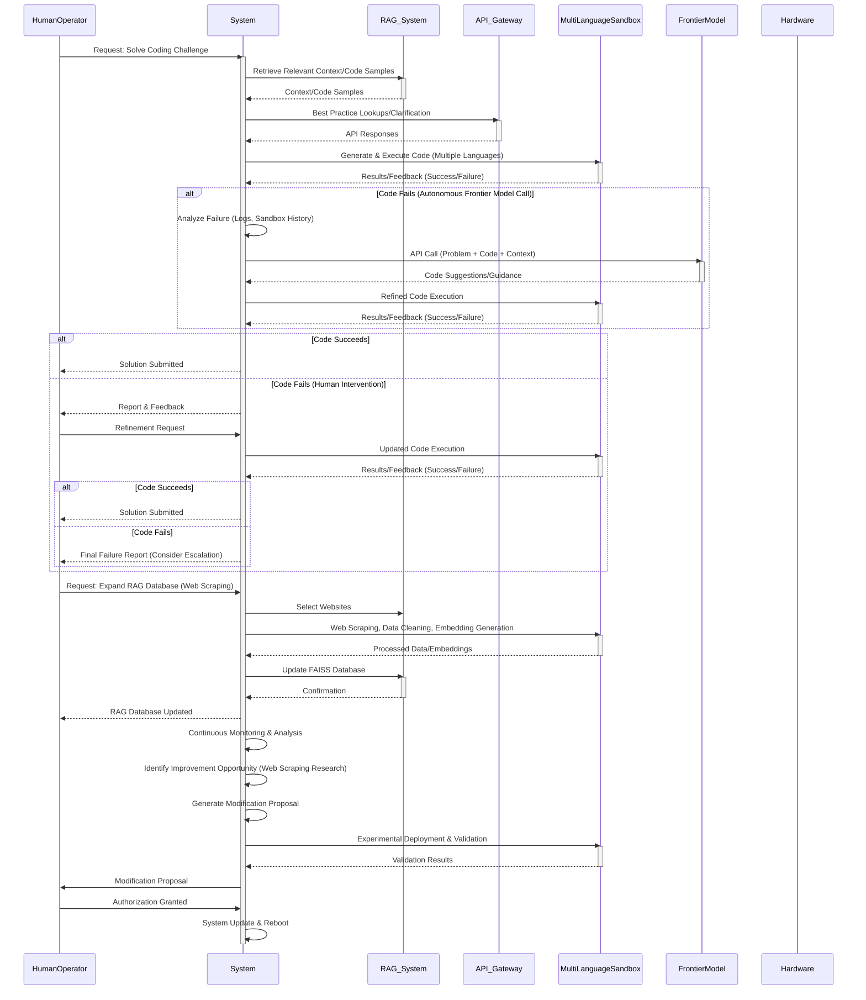

Sequence Diagram Format: The diagram is now a Mermaid sequenceDiagram, which is ideal for showing the interactions between components over time.

Clearer Flow: The sequence of events is more clearly represented by the vertical flow of the diagram.

Combined Capabilities: The diagram now integrates the core coding challenge functionality, the autonomous frontier model call, the human intervention path, the RAG expansion via web scraping, and the core-design modification process.  This provides a more holistic view of the system's capabilities.

Alt and Else:  The alt and else keywords are used to represent conditional flows (e.g., code success/failure, autonomous vs. human intervention).

Activations: The activate and deactivate keywords show when a component is actively processing a request.

Participants: All key components are represented as participants: Human Operator, System, RAG System, API Gateway, Multi-Language Sandbox, Frontier Model, and Hardware (although the Hardware interaction is implicit in the sandbox and system operations).

Concise Messages: The messages between components are kept concise but descriptive.

This sequence diagram provides a comprehensive overview of how the different parts of your system work together to achieve its various functionalities. It's a valuable tool for understanding the system's behavior and identifying potential areas for improvement.  It's also easier to follow than a very complex flowchart for this type of interaction.
