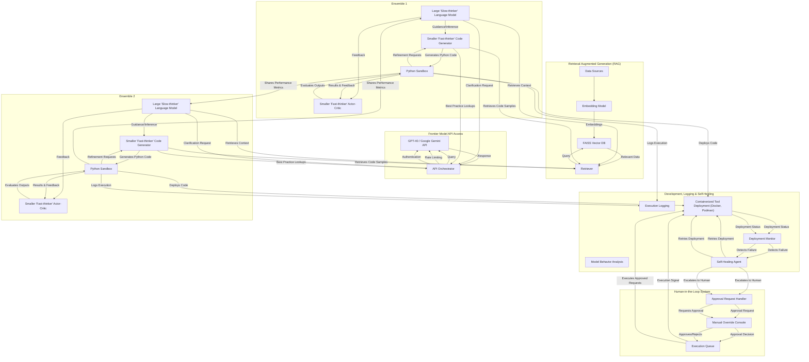

Key changes:

RAG Subgraph: Added "Data Sources" and "Embedding Model." Renamed RAG2 to "Retriever" and added an arrow for embedding creation.
API Gateway Subgraph: Renamed "Model Query Manager" to "API Orchestrator" and added labels for "Rate Limiting" and "Authentication."
Human-in-the-Loop Subgraph: Added labels to the arrows to describe the HIL workflow.
Ensemble Communication: Changed "Shares Insights" to "Shares Performance Metrics."
Code Generation: Added "Python Code" to the code generation arrows.
Execution Environment: Changed "Execution Environment" to "Python Sandbox" for more context.

This refactored version provides more specific information and a clearer understanding of the system's components and interactions.  It's still a complex diagram, so consider breaking it down into smaller diagrams if needed for specific deep dives.
