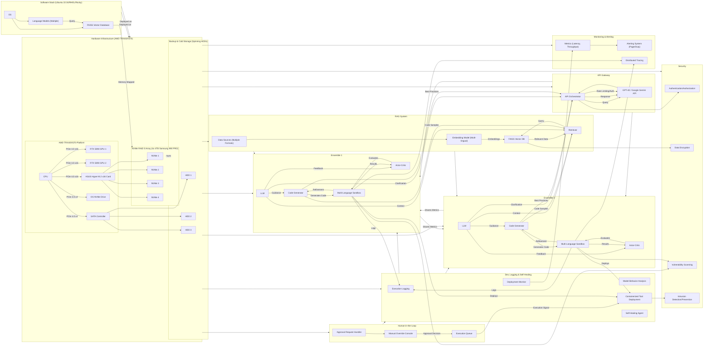

```mermaid
graph LR
    subgraph Hardware ["Hardware Infrastructure (AMD TRX40/X570)"]
        direction LR
        subgraph AMD_TRX40_X570["AMD TRX40/X570 Platform"]
            CPU[CPU] -->|PCIe 4.0 x16| GPU1[RTX 5090 GPU 1]
            CPU -->|PCIe 4.0 x16| GPU2[RTX 5090 GPU 2]
            CPU -->|PCIe 4.0 x16| NVMe_RAID[ASUS Hyper M.2 x16 Card]
            CPU -->|PCIe 4.0 x4| OS_NVMe[OS NVMe Drive]
            CPU -->|PCIe 4.0 x4| SATA_Controller[SATA Controller]
        end

        subgraph NVMe_RAID_Array["NVMe RAID 0 Array (4x 4TB Samsung 990 PRO)"]
            NVMe_RAID --> NVMe1[NVMe 1]
            NVMe_RAID --> NVMe2[NVMe 2]
            NVMe_RAID --> NVMe3[NVMe 3]
            NVMe_RAID --> NVMe4[NVMe 4]
        end

        subgraph Backup_Cold_Storage["Backup & Cold Storage (Spinning HDDs)"]
            SATA_Controller --> HDD1[HDD 1]
            SATA_Controller --> HDD2[HDD 2]
            SATA_Controller --> HDD3[HDD 3]
        end

        NVMe_RAID_Array -->|rsync| Backup_Cold_Storage
    end

    subgraph Software_Stack["Software Stack (Ubuntu 22.04/RHEL/Rocky)"]
        OS[OS] --> FAISS[FAISS Vector Database]
        OS --> LM["Language Models (Multiple)"]
        FAISS -->|Memory-Mapped| NVMe_RAID_Array
        LM -->|Query| FAISS
    end

    Software_Stack -->|Deployed on| Hardware


    %% Swimlanes
    classDef swimlane fill:#f9f,stroke:#333,stroke-width:2px
    class RAG_System,API_Gateway,Dev_Env,Human_Approval,Ensemble_1,Ensemble_2,Security,Monitoring swimlane

    subgraph RAG_System ["RAG System"]
        RAG1["Data Sources (Multiple Formats)"] --> RAG2["Embedding Model (Multi-lingual)"]
        RAG2 -->|Embeddings| RAG3["FAISS Vector DB"]
        RAG4["Retriever"] -->|Query| RAG3
        RAG3 -->|Relevant Data| RAG4
    end

    subgraph API_Gateway ["API Gateway"]
        API1["GPT-40 / Google Gemini API"] --> API2["API Orchestrator"]
        API2 -->|Query| API1
        API2 -->|Response| API1
        API2 -->|Rate Limiting/Auth| API1
    end

    subgraph Dev_Env ["Dev, Logging & Self-Healing"]
        LOG1["Execution Logging"]
        LOG2["Model Behavior Analysis"]
        CON1["Containerized Tool Deployment"]
        MON1["Deployment Monitor"]
        REC1["Self-Healing Agent"]
    end

    subgraph Human_Approval ["Human-in-the-Loop"]
        HIL1["Approval Request Handler"] --> HIL2["Manual Override Console"]
        HIL2 -->|Approval Decision| HIL3["Execution Queue"]
        HIL3 -->|Execution Signal| CON1
    end

    subgraph Ensemble_1 ["Ensemble 1"]
        A1["LLM"] -->|Guidance| B1["Code Generator"]
        A1 -->|Feedback| C1["Actor-Critic"]
        B1 -->|Generates Code| D1["Multi-Language Sandbox"]
        C1 -->|Evaluates| D1
        D1 -->|Results| C1
        D1 -->|Refinement| B1
        A1 -->|Context| RAG4
        B1 -->|Code Samples| RAG4
        A1 -->|Clarification| API2
        B1 -->|Best Practices| API2
        D1 -->|Logs| LOG1
        D1 -->|Deploys| CON1
    end

    subgraph Ensemble_2 ["Ensemble 2"]
        A2["LLM"] -->|Guidance| B2["Code Generator"]
        A2 -->|Feedback| C2["Actor-Critic"]
        B2 -->|Generates Code| D2["Multi-Language Sandbox"]
        C2 -->|Evaluates| D2
        D2 -->|Results| C2
        D2 -->|Refinement| B2
        A2 -->|Context| RAG4
        B2 -->|Code Samples| RAG4
        A2 -->|Clarification| API2
        B2 -->|Best Practices| API2
        D2 -->|Logs| LOG1
        D2 -->|Deploys| CON1
    end

    subgraph Security ["Security"]
        AUTH["Authentication/Authorization"]
        ENC["Data Encryption"]
        VULN["Vulnerability Scanning"]
        IDPS["Intrusion Detection/Prevention"]
        API2 --> AUTH
        RAG3 --> ENC
        D1 --> VULN
        D2 --> VULN
        CON1 --> IDPS

    end

    subgraph Monitoring ["Monitoring & Alerting"]
        METRICS["Metrics (Latency, Throughput)"]
        ALERTING["Alerting System (PagerDuty)"]
        TRACING["Distributed Tracing"]
        MON1 --> METRICS
        METRICS --> ALERTING
        D1 --> TRACING
        D2 --> TRACING
    end

    %% Connections between Swimlanes
    RAG_System --> Ensemble_1
    RAG_System --> Ensemble_2
    API_Gateway --> Ensemble_1
    API_Gateway --> Ensemble_2
    Dev_Env --> Ensemble_1
    Dev_Env --> Ensemble_2
    Human_Approval --> Dev_Env
    Ensemble_1 -->|Shares Metrics| Ensemble_2
    Ensemble_2 -->|Shares Metrics| Ensemble_1

    Software_Stack -->|Deployed on| Hardware
    Hardware --> RAG_System
    Hardware --> API_Gateway
    Hardware --> Dev_Env
    Hardware --> Human_Approval
    Hardware --> Ensemble_1
    Hardware --> Ensemble_2
    Hardware --> Security
    Hardware --> Monitoring
```
