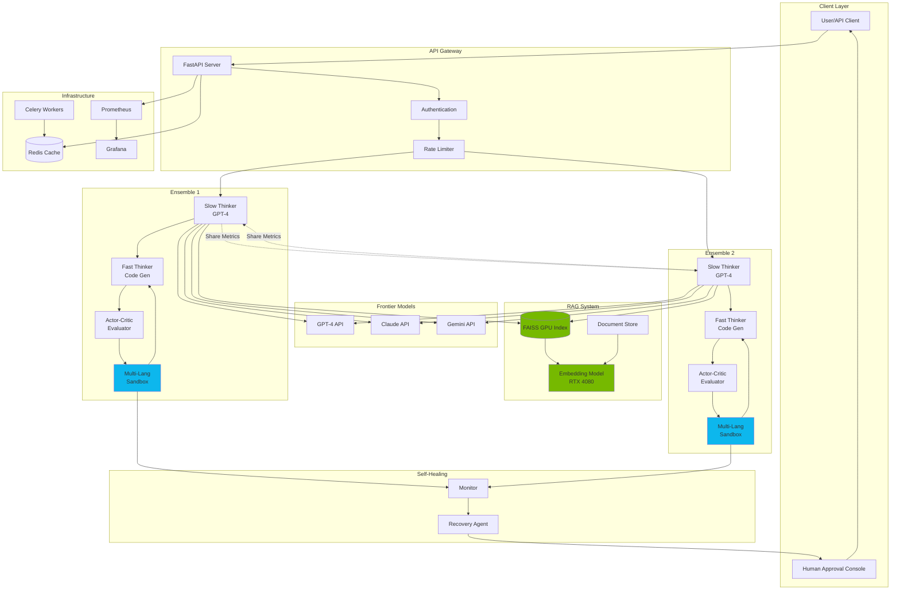
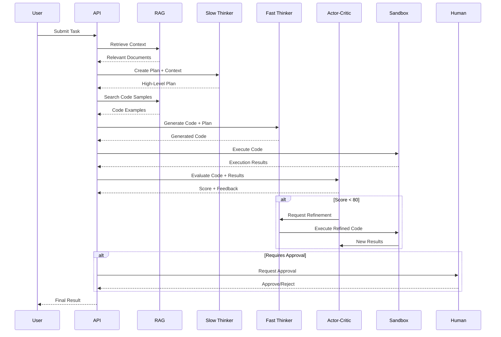
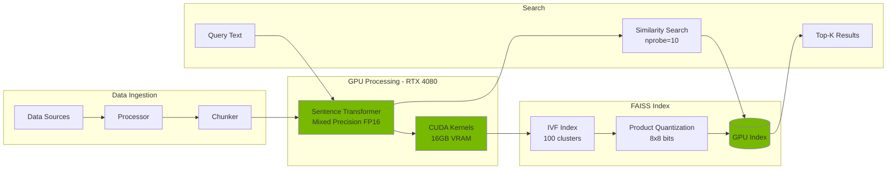
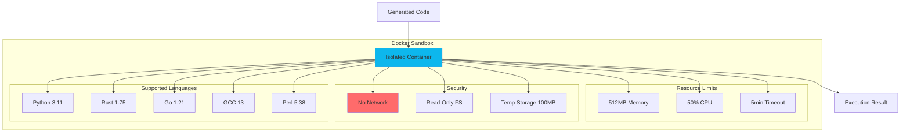

# CALISOTA AI Engine 🚀

<div align="center">

[](https://www.python.org/downloads/)
[](https://developer.nvidia.com/cuda-downloads)
[](https://fastapi.tiangolo.com)
[](https://www.docker.com/)
[](LICENSE)
[](https://github.com/psf/black)
[](https://www.nvidia.com/)
[](https://github.com/danindiana/GRYPHGEN/actions)

**Autonomous AI-Powered Software Generation System**

*Combining Retrieval-Augmented Generation, Actor-Critic Ensembles, and Multi-Language Sandboxes*

[Features](#features) • [Architecture](#architecture) • [Quick Start](#quick-start) • [Documentation](#documentation) • [API](#api-reference)

</div>

---

## Overview

**CALISOTA** (Contextual AI-Leveraged Intelligent Software Operations and Task Automation) is a cutting-edge autonomous software generation system that combines:

- 🧠 **Dual Ensemble AI Architecture** - Large "slow-thinker" planners + fast "code-generator" workers
- 📚 **GPU-Accelerated RAG** - FAISS vector database with CUDA optimization for RTX 4080
- 🎭 **Actor-Critic Reinforcement Learning** - Self-improving code generation with evaluation feedback
- 🐳 **Multi-Language Sandboxes** - Secure Docker-based execution (Python, Rust, Go, C/C++, Perl)
- 🔄 **Self-Healing Deployment** - Automatic failure recovery and retry mechanisms
- 👥 **Human-in-the-Loop** - Approval workflows for critical decisions
- 📊 **Production-Ready** - Full observability with Prometheus, Grafana, and structured logging

### Optimized for NVIDIA RTX 4080 16GB
- Mixed precision training (FP16/BF16)
- Flash Attention 2 support
- Efficient memory management
- Optimized batch processing

---

## Features

### Core Capabilities

| Feature | Description | Status |
|---------|-------------|--------|
| **RAG System** | GPU-accelerated FAISS vector search with sentence transformers | ✅ Production |
| **Slow Thinker** | GPT-4 powered high-level planning and task decomposition | ✅ Production |
| **Fast Thinker** | Rapid code generation with GPT-3.5/Claude | ✅ Production |
| **Actor-Critic** | Code evaluation and improvement suggestions | ✅ Production |
| **Sandboxes** | Python, Rust, Go, C/C++, Perl execution environments | ✅ Production |
| **API Gateway** | FastAPI REST interface with auto-documentation | ✅ Production |
| **Monitoring** | Prometheus metrics + Grafana dashboards | ✅ Production |
| **Self-Healing** | Automatic retry and recovery mechanisms | ✅ Production |
| **Episodic Memory** | Long-term memory consolidation | 🚧 Planned |

---

## Architecture

### System Overview



### Data Flow: Task Execution



### RAG System Architecture



### Sandbox Security Model



---

## Quick Start

### Prerequisites

- 🐧 **OS**: Ubuntu 22.04 LTS (or compatible)
- 🐍 **Python**: 3.11+
- 🎮 **GPU**: NVIDIA RTX 4080 (or similar with 16GB+ VRAM)
- 🔧 **CUDA**: 12.6+ with cuDNN 9+
- 🐳 **Docker**: 24.0+ with NVIDIA Container Toolkit
- 📦 **Poetry**: 1.8.3+

### Installation

#### 1. Clone Repository

```bash
git clone https://github.com/danindiana/GRYPHGEN.git
cd GRYPHGEN/calisota-ai/feb07
```

#### 2. Install Dependencies

```bash
# Install Poetry
curl -sSL https://install.python-poetry.org | python3 -

# Install project dependencies
poetry install

# Or using Make
make install
```

#### 3. Configure Environment

```bash
# Copy example environment file
cp .env.example .env

# Edit with your API keys
nano .env
```

Required configuration:
```env
OPENAI_API_KEY=sk-...
ANTHROPIC_API_KEY=sk-ant-...
CUDA_VISIBLE_DEVICES=0
```

#### 4. Initialize FAISS Database

```bash
# Create FAISS index directory
mkdir -p data/faiss_index

# Initialize with sample data (optional)
poetry run python scripts/init_faiss.py
```

#### 5. Start Services

**Option A: Docker Compose (Recommended)**

```bash
# Start all services
docker-compose up -d

# View logs
docker-compose logs -f calisota-api

# Stop services
docker-compose down
```

**Option B: Local Development**

```bash
# Start API server
poetry run uvicorn src.calisota.api.main:app --reload

# Or using Make
make run
```

#### 6. Verify Installation

```bash
# Check API health
curl http://localhost:8000/api/health

# Check GPU availability
make gpu-test

# Run tests
make test
```

### Access Points

- 🌐 **API Documentation**: http://localhost:8000/api/docs
- 📊 **Grafana Dashboard**: http://localhost:3000 (admin/admin)
- 📈 **Prometheus**: http://localhost:9091
- 🔍 **API Health**: http://localhost:8000/api/health

---

## Usage Examples

### Example 1: Simple Code Generation

```python
import requests

response = requests.post(
    "http://localhost:8000/api/tasks/execute",
    json={
        "task": "Create a function to calculate Fibonacci numbers",
        "language": "python",
        "use_rag": True,
        "auto_execute": True
    }
)

result = response.json()
print(result["code"])
print(result["evaluation"]["score"])
```

### Example 2: RAG Document Addition

```python
# Add code samples to RAG
requests.post(
    "http://localhost:8000/api/rag/add",
    json={
        "texts": [
            "def fibonacci(n): return n if n <= 1 else fibonacci(n-1) + fibonacci(n-2)",
            "fn fibonacci(n: u64) -> u64 { match n { 0 | 1 => n, _ => fibonacci(n-1) + fibonacci(n-2) } }"
        ],
        "metadata": [
            {"language": "python", "topic": "recursion"},
            {"language": "rust", "topic": "recursion"}
        ]
    }
)
```

### Example 3: Multi-Language Execution

```python
# Generate and execute Rust code
response = requests.post(
    "http://localhost:8000/api/tasks/execute",
    json={
        "task": "Create a concurrent web scraper",
        "language": "rust",
        "auto_execute": False  # Don't auto-execute for safety
    }
)

code = response.json()["code"]
print(f"Generated Rust code:\n{code}")
```

### Example 4: Using cURL

```bash
# Health check
curl http://localhost:8000/api/health | jq .

# Execute task
curl -X POST http://localhost:8000/api/tasks/execute \
  -H "Content-Type: application/json" \
  -d '{
    "task": "Write a binary search function",
    "language": "python",
    "use_rag": true
  }' | jq .

# Search RAG
curl -X POST http://localhost:8000/api/rag/search \
  -H "Content-Type: application/json" \
  -d '{
    "query": "sorting algorithms",
    "top_k": 5
  }' | jq .
```

---

## API Reference

### Core Endpoints

#### `POST /api/tasks/execute`

Execute a complete task through the ensemble system.

**Request Body:**
```json
{
  "task": "string",
  "language": "python|rust|go|cpp|perl",
  "context": "string (optional)",
  "use_rag": true,
  "auto_execute": false
}
```

**Response:**
```json
{
  "task_id": "uuid",
  "status": "completed|needs_refinement",
  "plan": "string",
  "code": "string",
  "evaluation": {
    "score": 85,
    "evaluation": "detailed feedback",
    "needs_refinement": false
  },
  "execution_result": {
    "success": true,
    "stdout": "output",
    "execution_time": 0.123
  }
}
```

#### `POST /api/rag/add`

Add documents to the RAG system.

#### `POST /api/rag/search`

Search for similar documents.

#### `GET /api/health`

Comprehensive health check with GPU status.

### Full API Documentation

Interactive API documentation available at:
- **Swagger UI**: http://localhost:8000/api/docs
- **ReDoc**: http://localhost:8000/api/redoc

---

## Development

### Project Structure

```
feb07/
├── src/calisota/          # Main application code
│   ├── api/               # FastAPI routes and main app
│   ├── agents/            # AI agents (slow/fast thinker, actor-critic)
│   ├── core/              # Core configuration and utilities
│   ├── rag/               # RAG system with FAISS
│   ├── sandbox/           # Multi-language code execution
│   └── monitoring/        # Metrics and observability
├── tests/                 # Test suite
├── docs/                  # Documentation
│   └── archive/           # Original architecture docs
├── config/                # Configuration files
├── docker/                # Docker-related files
├── scripts/               # Utility scripts
├── .github/workflows/     # CI/CD pipelines
├── pyproject.toml         # Poetry dependencies
├── Dockerfile             # Container definition
├── docker-compose.yml     # Multi-container setup
└── Makefile              # Development commands
```

### Development Commands

```bash
# Install dependencies
make install

# Run tests
make test

# Lint code
make lint

# Format code
make format

# Run development server
make run

# Build Docker image
make docker-build

# Start all services
make docker-up

# View logs
make docker-logs

# Clean generated files
make clean

# GPU availability test
make gpu-test
```

### Running Tests

```bash
# Run all tests
poetry run pytest

# Run with coverage
poetry run pytest --cov=src/calisota --cov-report=html

# Run specific test
poetry run pytest tests/test_api.py::test_health_endpoint

# Watch mode
make test-watch
```

### Code Quality

This project uses:
- **Black** for code formatting
- **Ruff** for linting
- **MyPy** for type checking
- **Pytest** for testing
- **Pre-commit** hooks for automated checks

```bash
# Install pre-commit hooks
make pre-commit

# Run all checks
make lint
make format-check
make test
```

---

## GPU Optimization

### RTX 4080 16GB Configuration

The system is optimized for NVIDIA RTX 4080 with the following settings:

```python
# config.py
GPU_MEMORY_FRACTION = 0.85        # Use 85% of 16GB VRAM
MAX_BATCH_SIZE = 32                # Optimal for RTX 4080
ENABLE_MIXED_PRECISION = True      # FP16/BF16 training
ENABLE_FLASH_ATTENTION = True      # Flash Attention 2
```

### Memory Management

| Component | VRAM Usage | Configuration |
|-----------|------------|---------------|
| FAISS Index | 2-4 GB | IVF100 + PQ8x8 |
| Embedding Model | 1-2 GB | sentence-transformers/all-mpnet-base-v2 |
| Inference Buffer | 4-6 GB | Mixed precision |
| Reserve | 2-3 GB | OS and overhead |
| **Total** | **~13.6 GB** | Leaves 2.4GB headroom |

### Performance Benchmarks

On RTX 4080 16GB:
- **Embedding Generation**: ~10,000 texts/sec (batch_size=32)
- **FAISS Search**: ~500,000 queries/sec (nprobe=10)
- **Code Generation**: 2-5 sec/task (GPT-3.5)
- **Sandbox Execution**: 0.5-2 sec (Python)

---

## Deployment

### Docker Deployment

```bash
# Build and start
docker-compose up -d

# Scale workers
docker-compose up -d --scale celery-worker=4

# Update and restart
docker-compose pull
docker-compose up -d
```

### Kubernetes Deployment

```yaml
# Coming soon - K8s manifests
kubectl apply -f k8s/
```

### Production Checklist

- [ ] Set strong API keys in `.env`
- [ ] Configure CORS origins in `config.py`
- [ ] Enable HTTPS/TLS
- [ ] Set up Sentry for error tracking
- [ ] Configure backup strategy for FAISS index
- [ ] Set up monitoring alerts (PagerDuty/Slack)
- [ ] Review resource limits
- [ ] Enable authentication/authorization
- [ ] Configure rate limiting
- [ ] Set up log aggregation

---

## Monitoring & Observability

### Prometheus Metrics

Available at `http://localhost:9090/metrics`:

- `calisota_task_duration_seconds` - Task execution time
- `calisota_task_total` - Total tasks processed
- `calisota_rag_search_duration_seconds` - RAG search latency
- `calisota_gpu_memory_usage_bytes` - GPU memory usage
- `calisota_sandbox_execution_total` - Sandbox executions

### Grafana Dashboards

Pre-configured dashboards at `http://localhost:3000`:
- System Overview
- GPU Utilization
- Task Execution Metrics
- RAG Performance
- Error Rates

### Structured Logging

```python
import structlog

logger = structlog.get_logger()
logger.info("task_started", task_id=task_id, language="python")
```

---

## Troubleshooting

### Common Issues

#### GPU Not Detected

```bash
# Check NVIDIA driver
nvidia-smi

# Check CUDA availability
python -c "import torch; print(torch.cuda.is_available())"

# Check Docker GPU access
docker run --rm --gpus all nvidia/cuda:12.6.2-base-ubuntu22.04 nvidia-smi
```

#### FAISS Index Issues

```bash
# Reinitialize index
rm -rf data/faiss_index/*
poetry run python scripts/init_faiss.py
```

#### Docker Permission Issues

```bash
# Add user to docker group
sudo usermod -aG docker $USER
newgrp docker
```

#### Out of Memory Errors

Reduce batch size in `.env`:
```env
MAX_BATCH_SIZE=16
GPU_MEMORY_FRACTION=0.75
```

---

## Contributing

Contributions welcome! Please:

1. Fork the repository
2. Create a feature branch (`git checkout -b feature/amazing-feature`)
3. Commit changes (`git commit -m 'Add amazing feature'`)
4. Push to branch (`git push origin feature/amazing-feature`)
5. Open a Pull Request

### Development Guidelines

- Follow PEP 8 style guide
- Add tests for new features
- Update documentation
- Run `make lint` and `make test` before committing
- Use conventional commits

---

## License

This project is licensed under the MIT License - see the [LICENSE](LICENSE) file for details.

---

## Acknowledgments

- **FAISS**: Facebook AI Similarity Search
- **Sentence Transformers**: State-of-the-art text embeddings
- **FastAPI**: Modern web framework
- **Docker**: Containerization platform
- **NVIDIA**: CUDA and GPU acceleration

---

## Citations

```bibtex
@software{calisota2024,
  title = {CALISOTA AI Engine},
  author = {GRYPHGEN Team},
  year = {2024},
  url = {https://github.com/danindiana/GRYPHGEN},
  note = {Autonomous AI-powered software generation system}
}
```

---

## Contact & Support

- **GitHub Issues**: https://github.com/danindiana/GRYPHGEN/issues
- **Documentation**: Coming soon
- **Discord**: Coming soon

---

<div align="center">

**Built with ❤️ for the AI community**

[⬆ Back to Top](#calisota-ai-engine-)

</div>
