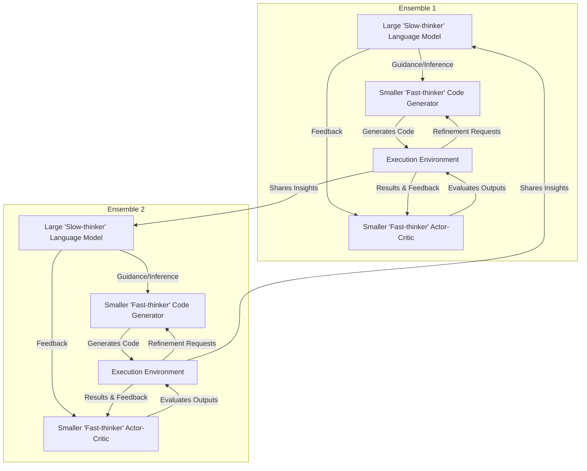

```mermaid
graph TD
    %% Ensemble 1
    subgraph Ensemble_1 ["Ensemble 1"]
        A1["Large 'Slow-thinker' Language Model"] -->|Guidance/Inference| B1["Smaller 'Fast-thinker' Code Generator"]
        A1 -->|Feedback| C1["Smaller 'Fast-thinker' Actor-Critic"]
        
        B1 -->|Generates Code| D1["Execution Environment"]
        C1 -->|Evaluates Outputs| D1
        
        D1 -->|Results & Feedback| C1
        D1 -->|Refinement Requests| B1
    end
    
    %% Ensemble 2
    subgraph Ensemble_2 ["Ensemble 2"]
        A2["Large 'Slow-thinker' Language Model"] -->|Guidance/Inference| B2["Smaller 'Fast-thinker' Code Generator"]
        A2 -->|Feedback| C2["Smaller 'Fast-thinker' Actor-Critic"]
        
        B2 -->|Generates Code| D2["Execution Environment"]
        C2 -->|Evaluates Outputs| D2
        
        D2 -->|Results & Feedback| C2
        D2 -->|Refinement Requests| B2
    end
    
    %% Explicitly connecting a node inside Ensemble 1 to one in Ensemble 2
    D1 -->|Shares Insights| A2
    D2 -->|Shares Insights| A1
```
