```mermaid
graph TD
    %% FAISS-Backed RAG System
    subgraph RAG_System ["Retrieval-Augmented Generation (RAG)"]
        RAG1["Data Sources (Multiple Formats)"]
        RAG2["Embedding Model (Multi-lingual)"]
        RAG3["FAISS Vector DB"]
        RAG4["Retriever"]
        
        RAG1 --> RAG2
        RAG2 -->|Embeddings| RAG3
        RAG4 -->|Query| RAG3
        RAG3 -->|Relevant Data| RAG4
    end

    %% Agentic Task Prioritization & Meta-Reasoning
    subgraph Task_Orchestration ["Agentic Task Prioritization & Meta-Reasoning"]
        TM1["Task Manager Agent"]
        TM2["Task Prioritization"]
        TM3["Sub-task Scheduler"]
        
        TM1 -->|Classifies & Routes Tasks| TM2
        TM2 -->|Delegates Execution| TM3
        TM3 -->|Sub-task Assignment| Ensemble_1 & Ensemble_2
    end

    %% API Gateway for Frontier Models
    subgraph API_Gateway ["Frontier Model API Access"]
        API1["GPT-40 / Google Gemini API"]
        API2["API Orchestrator"]
        
        API2 -->|Query| API1
        API1 -->|Response| API2
        API2 -->|Rate Limiting/Auth| API1
    end

    %% Development Environment & Logging
    subgraph Dev_Env ["Dev, Logging & Self-Healing (Ubuntu/RHEL/Rocky)"]
        LOG1["Execution Logging"]
        LOG2["Model Behavior Analysis"]
        CON1["Containerized Tool Deployment (Docker/Podman)"]
        MON1["Deployment Monitor"]
        REC1["Self-Healing Agent"]
    end

    %% Human-in-the-Loop Approval
    subgraph Human_Approval ["Human-in-the-Loop System"]
        HIL1["Approval Request Handler"]
        HIL2["Manual Override Console"]
        HIL3["Execution Queue"]

        HIL1 -->|Approval Request| HIL2
        HIL2 -->|Approval Decision| HIL3
        HIL3 -->|Execution Signal| CON1
    end

    %% Autonomous Model Fine-Tuning & Adaptation
    subgraph AutoML_Tuning ["Autonomous Model Fine-Tuning"]
        AML1["AutoML Controller"]
        AML2["Model Feedback Ingestion"]
        AML3["Hyperparameter Optimizer"]
        AML4["Fine-tune & Deploy"]
        
        LOG1 -->|Extract Failure/Success Patterns| AML2
        AML2 -->|Optimize Weights| AML3
        AML3 -->|Fine-tunes Models| AML4
        AML4 -->|Deploys Updated Models| Software_Stack
    end

    %% Secure Multi-Agent Collaboration (Swarm AI)
    subgraph Swarm_AI ["Secure Multi-Agent Collaboration"]
        SA1["Multi-Agent Coordinator"]
        SA2["Shared Memory Bus (FAISS)"]
        SA3["Agent Voting Mechanism"]
        
        SA1 -->|Syncs Context| SA2
        SA2 -->|Distributes Memory| Ensemble_1 & Ensemble_2
        SA3 -->|Prevents Rogue Executions| Human_Approval
    end

    %% Blockchain-Based Execution Logging
    subgraph Blockchain_Audit ["Blockchain-Based Execution Logs"]
        BC1["Immutable Execution Log"]
        BC2["Cryptographic Hashing"]
        BC3["Decentralized Storage"]
        
        LOG1 -->|Hashes Execution Data| BC2
        BC2 -->|Stores Securely| BC3
    end

    %% Graph-Based Knowledge Representation (Semantic Search)
    subgraph Knowledge_Graph ["Graph-Based Knowledge Representation"]
        KG1["Ontology Engine"]
        KG2["Semantic Query Processor"]
        KG3["GraphDB (Neo4j, ArangoDB)"]

        FAISS -->|Structured Knowledge Extraction| KG1
        KG1 -->|Graph Embeddings| KG3
        KG3 -->|Enables Conceptual Search| KG2
    end

    %% Ensemble 1
    subgraph Ensemble_1 ["Ensemble 1"]
        A1["Large 'Slow-thinker' LLM"] -->|Guidance/Inference| B1["Smaller 'Fast-thinker' Code Generator"]
        A1 -->|Feedback| C1["Smaller 'Fast-thinker' Actor-Critic"]

        B1 -->|Generates Code Multiple Languages| D1["Multi-Language Sandbox (Perl, Rust, Go, C/C++, Python)"]
        C1 -->|Evaluates Outputs| D1

        D1 -->|Results & Feedback| C1
        D1 -->|Refinement Requests| B1

        A1 -->|Retrieves Context| RAG4
        B1 -->|Retrieves Code Samples| RAG4

        A1 -->|Clarification Request| API2
        B1 -->|Best Practice Lookups| API2

        D1 -->|Logs Execution| LOG1
        D1 -->|Deploys Code| CON1

        CON1 -->|Deployment Status| MON1
        MON1 -->|Detects Failure| REC1
        REC1 -->|Retries Deployment| CON1
        REC1 -->|Escalates to Human| HIL1
    end

    %% Ensemble 2 (Similar Structure)
    subgraph Ensemble_2 ["Ensemble 2"]
        A2["Large 'Slow-thinker' LLM"] -->|Guidance/Inference| B2["Smaller 'Fast-thinker' Code Generator"]
        A2 -->|Feedback| C2["Smaller 'Fast-thinker' Actor-Critic"]

        B2 -->|Generates Code Multiple Languages| D2["Multi-Language Sandbox (Perl, Rust, Go, C/C++, Python)"]
        C2 -->|Evaluates Outputs| D2

        D2 -->|Results & Feedback| C2
        D2 -->|Refinement Requests| B2

        A2 -->|Retrieves Context| RAG4
        B2 -->|Retrieves Code Samples| RAG4

        A2 -->|Clarification Request| API2
        B2 -->|Best Practice Lookups| API2

        D2 -->|Logs Execution| LOG1
        D2 -->|Deploys Code| CON1

        CON1 -->|Deployment Status| MON1
        MON1 -->|Detects Failure| REC1
        REC1 -->|Retries Deployment| CON1
        REC1 -->|Escalates to Human| HIL1
    end

    %% Cross-Ensemble Communication
    D1 -->|Shares Performance Metrics| A2
    D2 -->|Shares Performance Metrics| A1

    %% Software Stack
    subgraph Software_Stack["Software Stack (Ubuntu 22.04/RHEL/Rocky)"]
        OS[OS] --> FAISS[FAISS Vector Database]
        OS --> LM["Language Models (Multiple)"]
        FAISS -->|Memory-Mapped| NVMe_RAID_Array
        LM -->|Query| FAISS
    end

    %% Linking Software and Infrastructure
    Software_Stack -->|Deployed on| Hardware
    AutoML_Tuning -->|Optimizes Models| Software_Stack
    Blockchain_Audit -->|Secures Logs| Software_Stack
    Task_Orchestration -->|Task Distribution| Software_Stack
    Swarm_AI -->|Multi-Agent Sync| Software_Stack
    Knowledge_Graph -->|Enhances Search| Software_Stack
```

Task Prioritization & Orchestration → Agents work efficiently, reducing redundant processes.
✅ Self-Optimizing AI → Continuous model improvement using AutoML.
✅ Multi-Agent Swarm AI → Secure, multi-agent task delegation.
✅ Immutable Security → Blockchain ensures transparency & auditability.
✅ Graph-Based Knowledge Representation → Semantic search beyond vector similarity.
