```mermaid
graph TD
    %% FAISS-Backed RAG System
    subgraph RAG_System ["Retrieval-Augmented Generation (RAG)"]
        RAG1["Data Sources (Multiple Formats)"]
        RAG2["Embedding Model (Multi-lingual)"]
        RAG3["FAISS Vector DB"]
        RAG4["Retriever"]
        
        RAG1 --> RAG2
        RAG2 -->|Embeddings| RAG3
        RAG4 -->|Query| RAG3
        RAG3 -->|Relevant Data| RAG4
    end

    %% Neurosymbolic Reasoning
    subgraph NeuroSymbolic_AI ["Neurosymbolic Reasoning Layer"]
        NS1["LLM-Based Deductive Reasoning"]
        NS2["Symbolic Logic Engine (Prolog, Z3, RDF)"]
        NS3["Knowledge Graph Integration"]
        
        NS1 -->|Semantic Understanding| NS2
        NS2 -->|Logical Constraints| NS3
        NS3 -->|Supports Long-Term Planning| NS1
    end

    %% Active Learning Pipeline
    subgraph Active_Learning ["Active Learning & Human Querying"]
        AL1["Uncertainty Detector"]
        AL2["Human Expert Query System"]
        AL3["Incremental Model Updates"]
        
        AL1 -->|Confidence Score < Threshold| AL2
        AL2 -->|Provides Feedback| AL3
        AL3 -->|Retrains Models| Software_Stack
    end

    %% Temporal Memory System
    subgraph Temporal_Memory ["Long-Term Memory & Recall"]
        TM1["Persistent Memory Store"]
        TM2["Task-Aware Memory Retrieval"]
        TM3["Cross-Session Learning"]
        
        TM1 -->|Stores Execution History| TM2
        TM2 -->|Retrieves Context| TM3
        TM3 -->|Informs Task Execution| Software_Stack
    end

    %% Autonomous Failure Debugging
    subgraph Failure_Debugging ["Autonomous Failure Debugging"]
        FD1["Root Cause Analyzer"]
        FD2["Self-Healing Diagnostics"]
        FD3["Failure Pattern Recognition"]
        
        MON1 -->|Detects Deployment Failure| FD1
        FD1 -->|Analyzes Logs & Errors| FD2
        FD2 -->|Suggests Fixes| REC1
        FD3 -->|Matches Past Failures| FD2
    end

    %% Energy-Aware Execution
    subgraph Energy_Aware ["Energy-Aware Execution & Optimization"]
        EA1["GPU Utilization Monitor"]
        EA2["Dynamic Load Balancer"]
        EA3["Task Scheduling Optimizer"]
        
        EA1 -->|Tracks Energy Usage| EA2
        EA2 -->|Balances Resource Allocation| EA3
        EA3 -->|Optimizes Execution Order| Software_Stack
    end

    %% Zero-Shot & Few-Shot Adaptation
    subgraph Adaptation ["Zero-Shot & Few-Shot Adaptation"]
        AD1["Knowledge Transfer Agent"]
        AD2["Self-Supervised Learning"]
        AD3["Adaptive Model Tuning"]
        
        AL1 -->|Unseen Task Detected| AD1
        AD1 -->|Transfers Related Knowledge| AD2
        AD2 -->|Refines Response| AD3
        AD3 -->|Updates Execution Strategy| Software_Stack
    end

    %% Agent Autonomy Control
    subgraph Agent_Autonomy ["Fine-Grained Autonomy Control"]
        AC1["Task Permission System"]
        AC2["Execution Confidence Scoring"]
        AC3["Human-in-the-Loop Override"]
        
        AC1 -->|Determines Autonomy Level| AC2
        AC2 -->|Scales AI Decision Autonomy| AC3
        AC3 -->|Allows Human Review| HIL1
    end

    %% Knowledge Distillation
    subgraph Knowledge_Distillation ["Efficient Knowledge Compression"]
        KD1["Multi-Model Aggregation"]
        KD2["Teacher-Student Distillation"]
        KD3["Lossless Compression for Deployment"]
        
        KD1 -->|Merges Insights from LLMs| KD2
        KD2 -->|Distills Core Knowledge| KD3
        KD3 -->|Deploys Smaller Efficient Models| Software_Stack
    end

    %% Connecting to Software Stack
    Software_Stack -->|Incorporates All Enhancements| Knowledge_Distillation
    Software_Stack -->|Implements Energy-Aware Execution| Energy_Aware
    Software_Stack -->|Adapts to Unseen Tasks| Adaptation
    Software_Stack -->|Manages Memory Recall| Temporal_Memory
    Software_Stack -->|Ensures Secure & Controlled Execution| Agent_Autonomy
    Software_Stack -->|Enhances Reasoning with Neurosymbolic AI| NeuroSymbolic_AI
    Software_Stack -->|Optimizes Through Active Learning| Active_Learning
    Software_Stack -->|Debugs Deployment Failures| Failure_Debugging
```

Key Enhancements
Neurosymbolic Reasoning → Combine LLMs with symbolic logic for better long-term planning & decision-making.
Active Learning Pipeline → Allow system to query human experts when confidence is low.
Temporal Memory System → Enable long-term memory recall across different executions.
Knowledge Distillation → Improve efficiency by compressing knowledge from multiple models.
Zero-Shot & Few-Shot Adaptation → System dynamically adapts to unseen tasks using transfer learning.
Energy-Aware Execution → Smart resource allocation & scheduling to minimize energy waste.
Agent Autonomy Control → Fine-grained tuning of autonomous vs human-in-the-loop operations.
Autonomous Failure Debugging → Root-cause analysis for tool deployment failures before human escalation.

What These Refinements Achieve
Feature	Benefit
Neurosymbolic Reasoning	Enhances planning, decision-making, and consistency in task execution.
Active Learning Pipeline	Reduces errors by querying humans when confidence is low.
Temporal Memory System	Enables long-term memory recall across different sessions.
Autonomous Failure Debugging	AI self-diagnoses issues and suggests fixes before escalation.
Zero-Shot & Few-Shot Adaptation	Models adapt to new tasks on the fly without retraining.
Energy-Aware Execution	Minimizes GPU overuse and optimizes task scheduling.
Agent Autonomy Control	Allows fine-grained tuning of how much AI can automate vs. require human oversight.
Knowledge Distillation	Enables efficient model compression without sacrificing performance.

```
```
# **🔹 Simulation & Testing Plan for AI System Validation**

## **📌 Overview**
This testing plan ensures that the **newly integrated capabilities** of your AI system function correctly, efficiently, and securely. The plan consists of **unit tests, integration tests, stress tests, and real-world simulations** for different components.

---

## **🛠️ Testing Components**
### **1️⃣ Neurosymbolic Reasoning Validation**
🔍 **Goal:** Ensure the system correctly **combines LLM reasoning with symbolic logic (Prolog, Z3, RDF)** for structured decision-making.

✅ **Test Cases:**
- **Logical Deduction Test** → Provide inputs with logical dependencies and validate **correct inferences**.
- **Contradiction Handling** → Introduce conflicting knowledge (e.g., "X is true" and "X is false") and ensure the system flags contradictions.
- **Long-Term Planning** → Simulate **multi-step reasoning problems** and validate correctness over multiple turns.

🛠 **Tools:**  
✅ **Synthetic Data for Knowledge Graphs** (e.g., Cypher queries in Neo4j).  
✅ **Symbolic Solvers** (e.g., Z3 for constraint satisfaction problems).  

---

### **2️⃣ Active Learning Pipeline Validation**
🔍 **Goal:** Test whether **uncertainty detection, human feedback, and retraining mechanisms** work effectively.

✅ **Test Cases:**
- **Confidence Score Validation** → Ensure queries below a threshold **trigger human involvement**.
- **Feedback Accuracy** → Simulate human expert input and verify that **feedback improves model predictions**.
- **Incremental Learning** → Monitor model performance before and after integrating **expert-labeled data**.

🛠 **Tools:**  
✅ **Monte Carlo Dropout** (for confidence estimation).  
✅ **Synthetic Dataset with Ground Truth Labels** for uncertainty evaluation.  

---

### **3️⃣ Temporal Memory System Validation**
🔍 **Goal:** Ensure that **long-term memory recall** correctly influences task execution across multiple sessions.

✅ **Test Cases:**
- **Memory Recall Check** → Store historical interaction data and verify retrieval accuracy in subsequent sessions.
- **Context-Aware Adaptation** → Execute a sequence of related tasks and confirm that **past execution history affects decision-making**.
- **Memory Persistence** → Simulate **reboots/restarts** and ensure no data loss.

🛠 **Tools:**  
✅ **FAISS Indexed Query Benchmarks**.  
✅ **Logging System for Execution Tracking**.  

---

### **4️⃣ Autonomous Failure Debugging Validation**
🔍 **Goal:** Ensure that the **AI can self-diagnose, retry, and escalate tool deployment failures**.

✅ **Test Cases:**
- **Failure Injection Test** → Simulate deployment failures (e.g., missing dependencies, broken code) and validate **self-healing attempts**.
- **Root Cause Analysis Test** → Provide logs with different failure patterns and test if the system correctly **identifies root causes**.
- **Escalation Check** → Ensure failures exceeding retry thresholds **trigger human intervention**.

🛠 **Tools:**  
✅ **Chaos Engineering Frameworks** (e.g., **Netflix Chaos Monkey**).  
✅ **Synthetic Fault Injection** in Docker/Podman deployments.  

---

### **5️⃣ Zero-Shot & Few-Shot Adaptation Validation**
🔍 **Goal:** Ensure that the system correctly **handles unseen tasks** using **transfer learning**.

✅ **Test Cases:**
- **Few-Shot Benchmarking** → Provide **small training examples** (e.g., 1-5 examples) and measure task accuracy.
- **Zero-Shot Generalization** → Evaluate performance on tasks with **no prior training data**.
- **Adaptive Learning Check** → Modify an existing task slightly (e.g., tweak an API format) and check **whether the model adapts without explicit retraining**.

🛠 **Tools:**  
✅ **OpenAI GPT-4 Eval Set** (for benchmarking adaptation).  
✅ **Manifold Learning Metrics** (e.g., KL divergence, Wasserstein distance).  

---

### **6️⃣ Energy-Aware Execution Validation**
🔍 **Goal:** Ensure **energy-efficient AI execution**.

✅ **Test Cases:**
- **GPU Utilization Benchmarking** → Measure **power consumption vs. task completion time**.
- **Dynamic Load Balancing** → Simulate **high workloads** and check if task scheduling optimally distributes resources.
- **Task Prioritization Efficiency** → Validate that **critical tasks get priority** while lower-priority tasks get deferred.

🛠 **Tools:**  
✅ **NVIDIA-SMI Profiling**.  
✅ **SLURM Job Scheduler for HPC Load Testing**.  

---

### **7️⃣ Agent Autonomy Control Validation**
🔍 **Goal:** Test whether **the AI system respects human oversight and executes at appropriate autonomy levels**.

✅ **Test Cases:**
- **Autonomy Level Scaling** → Configure different **autonomy thresholds** and verify behavior.
- **Human-in-the-Loop Interruption** → Manually intervene during task execution and check if AI **halts execution correctly**.
- **Confidence-Based Execution** → Ensure tasks **with high confidence run automatically**, while lower-confidence tasks require **human review**.

🛠 **Tools:**  
✅ **Custom AI Governance Dashboard** for tracking task permissions.  
✅ **Real-Time Logging & Alerts** to measure human-AI interaction effectiveness.  

---

### **8️⃣ Knowledge Distillation Validation**
🔍 **Goal:** Ensure the **AI system efficiently compresses knowledge** from multiple models into **smaller, faster versions**.

✅ **Test Cases:**
- **Distillation Accuracy Benchmark** → Compare performance between **full-sized models vs. distilled models**.
- **Latency Reduction Measurement** → Measure time-to-inference improvements before & after distillation.
- **Compression Efficiency** → Ensure the model **retains core knowledge** despite size reduction.

🛠 **Tools:**  
✅ **Hugging Face Knowledge Distillation Pipelines**.  
✅ **TensorRT Model Compression**.  

---

### **9️⃣ Blockchain-Based Execution Logging Validation**
🔍 **Goal:** Validate that **executions are securely logged and tamper-proof**.

✅ **Test Cases:**
- **Tamper-Resistance Check** → Try modifying past logs and validate **immutability**.
- **Audit Trail Validation** → Ensure that **all model queries & code executions** are traceable.
- **Decentralized Storage Performance** → Measure logging overhead when using blockchain-based solutions.

🛠 **Tools:**  
✅ **Ethereum Smart Contracts for Logging**.  
✅ **Hyperledger Fabric (Private Blockchain)**.  

---

## **🧪 Simulation Environment Setup**
🔹 **Compute Environment:**  
✅ **AMD TRX40 / X570 Workstation**  
✅ **RTX 5090 GPUs** for AI workloads  
✅ **NVMe RAID 0 Array (4x 4TB Samsung 990 PRO)**  

🔹 **AI Model Stack:**  
✅ **FAISS for Vector Search**  
✅ **GraphDB (Neo4j/ArangoDB)**  
✅ **AutoML for Model Self-Improvement**  

🔹 **Deployment Environment:**  
✅ **Docker/Podman for Tool Execution**  
✅ **Rocky Linux / Ubuntu 22.04 for OS**  

---

## **📊 Reporting & Evaluation Metrics**
| **Test Component** | **Metrics to Evaluate** |
|-------------------|---------------------|
| Neurosymbolic Reasoning | **Reasoning accuracy, contradiction detection** |
| Active Learning | **Human intervention rate, model accuracy post-feedback** |
| Temporal Memory | **Context retention, recall accuracy** |
| Failure Debugging | **Self-healing success rate, failure classification accuracy** |
| Adaptation | **Task generalization, zero-shot/few-shot performance** |
| Energy Efficiency | **Watts per task, resource allocation efficiency** |
| Agent Autonomy | **Human override frequency, execution confidence** |
| Knowledge Distillation | **Inference latency, model accuracy vs. size** |
| Blockchain Logging | **Tamper-proof integrity, auditability** |

---

### **🚀 Next Steps**
1. **Automate Testing:**  
   - Implement CI/CD pipelines to **continuously test model updates**.  
2. **Run Load Tests:**  
   - Simulate **multi-agent execution** with thousands of tasks.  
3. **Pilot Deployment:**  
   - Deploy on **real-world workloads** and measure performance.  
