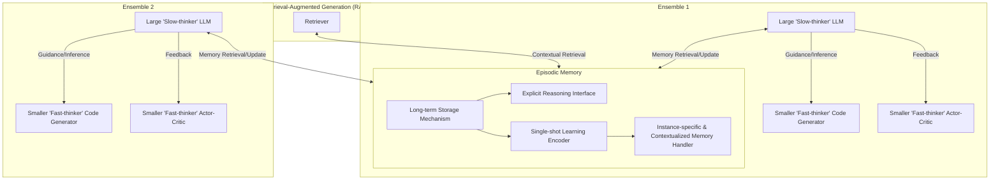

To refactor the provided system in accordance with the paper's core insights on implementing episodic memory for Large Language Models (LLMs), we'll focus on integrating an episodic memory framework. This will enhance the LLMs' ability to retain and utilize contextual information over extended periods, 
improving their performance in tasks that require long-term understanding and adaptation.

**Key Refactoring Steps:**

1. **Integrate Episodic Memory Module:**
	* Add a new subgraph, `Episodic_Memory`, which will store and manage contextual information for the LLMs.
	* This module should support:
		+ **Long-term Storage:** Efficiently retain information across any number of tokens.
		+ **Explicit Reasoning:** Allow for reflection and reasoning about stored memory content.
		+ **Single-shot Learning:** Rapidly encode unique experiences from single exposures.
		+ **Instance-specific Memories:** Capture details unique to a particular occurrence.
		+ **Contextualized Memories:** Bind context to memory content (e.g., when, where, why).

2. **Connect Episodic Memory to LLMs:**
	* Link `Episodic_Memory` to both `A1["Large 'Slow-thinker' LLM"]` and `A2["Large 'Slow-thinker' LLM"]` in `Ensemble_1` and `Ensemble_2`, respectively.
	* Establish bidirectional connections to enable:
		+ **Memory Retrieval:** LLMs can query the episodic memory for relevant contextual information.
		+ **Memory Update:** LLMs can update the episodic memory with new experiences or learned information.

3. **Enhance RAG System with Episodic Memory:**
	* Connect `Episodic_Memory` to `RAG4["Retriever"]`, allowing the retriever to leverage contextual information from the episodic memory.
	* This integration should improve the retrieval of relevant data by considering the broader context stored in the episodic memory.

4. **Modify API Gateway for Frontier Models (Optional):**
	* If deemed beneficial, integrate `Episodic_Memory` with `API2["API Orchestrator"]` to provide contextual information for external queries or to enhance the models' responses with historical context.

**Refactored System Graph:**

```graph TD
    %% ... (Other subgraphs remain unchanged)

    %% Episodic Memory Module
    subgraph Episodic_Memory ["Episodic Memory"]
        EM1["Long-term Storage Mechanism"]
        EM2["Explicit Reasoning Interface"]
        EM3["Single-shot Learning Encoder"]
        EM4["Instance-specific & Contextualized Memory Handler"]

        EM1 --> EM2
        EM1 --> EM3
        EM3 --> EM4
    end

    %% Ensemble 1 (Updated)
    subgraph Ensemble_1 ["Ensemble 1"]
        A1["Large 'Slow-thinker' LLM"] -->|Guidance/Inference| B1["Smaller 'Fast-thinker' Code Generator"]
        A1 -->|Feedback| C1["Smaller 'Fast-thinker' Actor-Critic"]
        A1 <-->|Memory Retrieval/Update| Episodic_Memory

        %% ... (Other connections within Ensemble_1 remain unchanged)
    end

    %% Ensemble 2 (Updated)
    subgraph Ensemble_2 ["Ensemble 2"]
        A2["Large 'Slow-thinker' LLM"] -->|Guidance/Inference| B2["Smaller 'Fast-thinker' Code Generator"]
        A2 -->|Feedback| C2["Smaller 'Fast-thinker' Actor-Critic"]
        A2 <-->|Memory Retrieval/Update| Episodic_Memory

        %% ... (Other connections within Ensemble_2 remain unchanged)
    end

    %% RAG System (Updated)
    subgraph RAG_System ["Retrieval-Augmented Generation (RAG)"]
        RAG4["Retriever"] <-->|Contextual Retrieval| Episodic_Memory
        %% ... (Other connections within RAG_System remain unchanged)
    end

    %% ... (Other subgraphs and connections remain unchanged unless specified otherwise)
```

**Implementation Considerations:**

* **Efficient Storage:** Utilize a combination of database technologies (e.g., relational for structured data, NoSQL for unstructured) to efficiently store and retrieve contextual information.
* **Scalability:** Design the episodic memory module with scalability in mind, using distributed architectures if necessary, to accommodate growing amounts of contextual data.
* **Security and Privacy:** Implement robust security measures to protect sensitive information stored within the episodic memory, ensuring compliance with relevant privacy regulations.
* **Continuous Integration/Continuous Deployment (CI/CD):** Integrate the refactored system into a CI/CD pipeline to ensure seamless updates and deployments.
