```mermaid
graph LR
    subgraph "Human-in-the-Loop Operator"
        H1["Request: Expand RAG DB via web scraping biomedical websites"] --> H2["Request Submitted"]
        H2 --> H3["Approval (if needed)"]
        H3 --> H4["Request Approved"]
    end

    subgraph "System (Automated)"
        H4 --> A1["LLM (Slow-Thinker) - Task Decomposition & Website Selection"]
        A1 --> B1["Code Generator (Fast-Thinker) - Web Scraping Script"]
        A1 --> B2["Code Generator (Fast-Thinker) - Data Cleaning/Preprocessing Script"]
        A1 --> B3["Code Generator (Fast-Thinker) - Embedding Generation Script"]
        A1 --> B4["Code Generator (Fast-Thinker) - FAISS Update Script"]

        B1 --> D1["Multi-Language Sandbox (Python) - Web Scraping"]
        B2 --> D2["Multi-Language Sandbox (Python) - Data Cleaning"]
        B3 --> D3["Multi-Language Sandbox (Python) - Embedding Generation"]
        B4 --> D4["Multi-Language Sandbox (Python) - FAISS Update"]

        D1 -->|Raw Data| E1["Data Storage (Temporary)"]
        D2 -->|Cleaned Data| E1
        D3 -->|Embeddings| E1

        E1 --> F1["FAISS Vector Database"]

        F1 --> G1["Confirmation/Report"]
        G1 --> H10["Downstream Task Request"]
        H10 --> A2["LLM (Slow-Thinker) - Downstream Task Processing"]
        A2 -->...["Downstream Task Execution"]

    end

    subgraph "Biomedical Websites"
        W1["Website 1"]
        W2["Website 2"]
        W3["Website N"]
        W1 --> D1
        W2 --> D1
        W3 --> D1
    end

    subgraph "Feedback & Iteration (Optional)"
        G1 --> H1["Operator Feedback (e.g., Data Quality Issues)"]
        H1 --> A1["LLM - Refinement/Website Selection/Script Updates"]
        A1 --> B1["Code Generator - Web Scraping Script Updates"]
        A1 --> B2["Code Generator - Data Cleaning Script Updates"]
        A1 --> B3["Code Generator - Embedding Script Updates"]
        B1 --> D1
        B2 --> D2
        B3 --> D3
    end

    %% Styles
    style H1 fill:#ccf,stroke:#333,stroke-width:2px
    style F1 fill:#afa,stroke:#333,stroke-width:2px
    style D1 fill:#bbf,stroke:#333,stroke-width:2px
    style D2 fill:#bbf,stroke:#333,stroke-width:2px
    style D3 fill:#bbf,stroke:#333,stroke-width:2px
    style D4 fill:#bbf,stroke:#333,stroke-width:2px
    style E1 fill:#dde,stroke:#333,stroke-width:2px
    style W1 fill:#fdd,stroke:#333,stroke-width:2px
    style W2 fill:#fdd,stroke:#333,stroke-width:2px
    style W3 fill:#fdd,stroke:#333,stroke-width:2px
    style G1 fill:#dff,stroke:#333,stroke-width:2px
    style H10 fill:#fcf,stroke:#333,stroke-width:2px
```

Specific Request: The operator requests expanding the RAG database by scraping biomedical websites.

Task Decomposition & Website Selection: The LLM decomposes the task and selects the relevant biomedical websites to scrape.  This website selection could be based on a pre-defined list, user input, or even dynamic discovery.

Code Generation: Code generators create scripts for web scraping, data cleaning/preprocessing, embedding generation, and updating the FAISS database. Python is a suitable language for these tasks.

Multi-Language Sandboxes (Python): Python sandboxes execute the scripts.

Data Storage (Temporary):  A temporary data storage (e.g., a file system or cloud storage) holds the raw data, cleaned data, and generated embeddings.

FAISS Database Update: The embeddings are used to update the FAISS vector database.

Confirmation/Report: The system confirms the successful update and generates a report.

Downstream Task Request: The operator can then submit a downstream task that will benefit from the expanded RAG database.

Downstream Task Processing: The LLM processes the downstream task, leveraging the updated FAISS database.

Biomedical Websites: The diagram shows the connection to the series of biomedical websites.

Feedback & Iteration (Optional): The operator can provide feedback on data quality, which can trigger a new iteration of scraping, cleaning, and embedding generation.  This allows for refinement of the process.

Clearer Subgraphs and Styling:  The diagram uses subgraphs and styling for better organization and readability.

This example illustrates how the system can be used to augment the RAG database with new information from external sources, making it more powerful and relevant for downstream tasks. The optional feedback loop ensures that the data quality is maintained.
