```mermaid
graph LR
    subgraph "Human-in-the-Loop Operator"
        H1["Request: Coding Challenge Failure - Seek Frontier Model Assistance"] --> H2["Request Submitted (with Challenge Details)"]
        H2 --> H3["Approval (if needed)"]
        H3 --> H4["Request Approved"]
    end

    subgraph "System (Initial Attempt)"
        H4 --> A1["LLM (Slow-Thinker) - Initial Coding Attempt"]
        A1 --> B1["Code Generator (Fast-Thinker) - Initial Code"]
        B1 --> D1["Multi-Language Sandbox - Code Execution"]
        D1 -->|Code Fails/Issues| E1["Problem Descriptors (Error Messages, Logs, Sandbox History)"]
    end

    subgraph "Frontier Model Assistance"
        E1 --> F1["API Call to Frontier Model (e.g., GPT-4)"]
        F1 -->|Prompt: Problem + Code + Context| G1["Frontier Model (e.g., GPT-4) - Code Suggestions/Guidance"]
    end

    subgraph "System (Assisted)"
        G1 --> H10["Code Integration & Refinement"]
        H10 --> I1["Code Generator (Fast-Thinker) - Refined Code"]
        I1 --> D1["Multi-Language Sandbox - Code Re-execution"]
        D1 -->|Code Succeeds| J1["Solution Submitted"]
        D1 -->|Code Fails/Issues| K1["Report & Feedback (to Operator)"]
    end

    subgraph "Feedback & Iteration (if needed)"
        K1 --> H1["Operator Feedback"]
        H1 --> A1["LLM - Refinement/Retry"]
        A1 --> B1["Code Generator - Updated Code"]
        B1 --> D1
    end

    %% Styles
    style H1 fill:#ccf,stroke:#333,stroke-width:2px
    style D1 fill:#bbf,stroke:#333,stroke-width:2px
    style E1 fill:#dde,stroke:#333,stroke-width:2px
    style F1 fill:#fdd,stroke:#333,stroke-width:2px
    style G1 fill:#dff,stroke:#333,stroke-width:2px
    style H10 fill:#fcf,stroke:#333,stroke-width:2px
    style J1 fill:#afa,stroke:#333,stroke-width:2px
    style K1 fill:#ffc,stroke:#333,stroke-width:2px
```

Coding Challenge Failure: The operator notices the system is unable to solve a coding challenge.

Problem Descriptors: The system gathers relevant information about the failure, including error messages, logs, and importantly, the sandbox shell history.  This context is crucial for the frontier model.

API Call to Frontier Model: The system makes an API call to a frontier model (like GPT-4), including the problem descriptors and the code as part of the prompt. This prompt provides the frontier model with the context it needs to provide useful assistance.

Frontier Model Assistance: The frontier model analyzes the information and provides code suggestions, guidance, or even code completion.

Code Integration & Refinement: The system integrates the frontier model's suggestions into the code and refines it.

Code Re-execution: The refined code is executed in the sandbox.

Solution Submitted/Feedback: If the code succeeds, the solution is submitted. If it fails, a report is sent to the operator, and the process can iterate.

Feedback & Iteration: The operator can provide feedback, which triggers another attempt with the LLM and code generator, potentially incorporating further guidance from the frontier model.

Clearer Subgraphs and Styling:  The diagram uses subgraphs and styling for better organization and readability.

This example demonstrates how the system can leverage frontier models for complex tasks like coding challenges. The crucial aspect is the inclusion of detailed problem descriptors, including sandbox history, in the prompt to the frontier model. This allows the frontier model to provide more targeted and effective assistance. The iterative feedback loop enables the system to refine its approach based on both the execution results and operator feedback.
