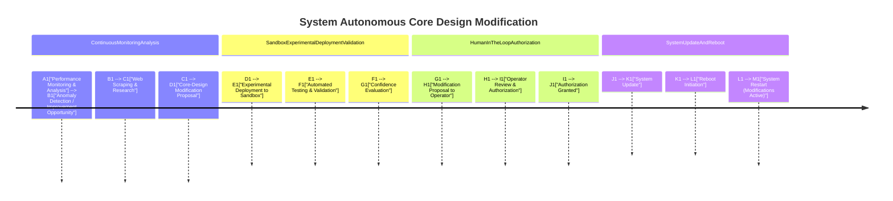

Continuous Monitoring & Analysis: The system constantly monitors its performance and analyzes logs to identify potential areas for improvement.

Anomaly Detection & Improvement Opportunity: The system detects anomalies or identifies opportunities to enhance efficiency or robustness.

Web Scraping & Research:  The system uses web scraping to research new libraries, techniques, or architectural patterns that could address the identified issues or opportunities.  This is a key aspect of autonomous improvement.

Core-Design Modification Proposal: The system generates a proposal outlining the suggested modifications to its core design.

Sandbox Experimental Deployment & Validation: The proposed changes are deployed to a separate sandbox environment (e.g., on remote servers) for testing and validation.

Automated Testing & Validation: Automated tests evaluate the performance and robustness of the modified system in the sandbox.

Confidence Evaluation: The system evaluates the results of the tests and determines a confidence level in the proposed changes.  A high confidence threshold is required before proceeding.

Human-in-the-Loop Authorization:  The system submits the modification proposal to a human operator for review and authorization.  This crucial step ensures human oversight.

System Update & Reboot: Once authorized, the system updates its codebase and dependencies with the new modifications.  A reboot is initiated to activate the changes.

Clearer Subgraphs and Styling: The diagram uses subgraphs and styling to clearly delineate the different stages of the process.

This example illustrates how the system can autonomously explore and propose improvements to its core design. The key aspects are the continuous monitoring, web scraping for research, experimental validation in a sandbox, and the essential human-in-the-loop authorization before changes are applied to the production system. This process allows the system to evolve and optimize itself while maintaining human control.
---
# **System Autonomous Core Design Modification: Explanation, Expansion & Rationalization**

This timeline outlines a **self-improving AI system** that continuously monitors, analyzes, and autonomously proposes design modifications while integrating **sandboxed experimental validation, human oversight, and safe system updates**. The core objective is to enable a **self-modifying AI infrastructure** while maintaining **operational reliability, human control, and security**.

---

## **🔹 Phase 1: Continuous Monitoring & Analysis**
📍 *Objective:* The system continuously evaluates its **performance, efficiency, and potential weaknesses**, using **anomaly detection and external research** to **propose self-improvements**.

### **🛠 Process Breakdown:**
1️⃣ **Performance Monitoring & Analysis (`A1`)**  
   - The system **continuously logs performance metrics**, including:
     - **Model accuracy, execution speed, hardware efficiency, failure rates**.
     - **Agent collaboration effectiveness** in multi-agent environments.
     - **System-wide resource utilization** (e.g., GPU/CPU load, memory overhead).  
   - Uses **real-time analytics** to identify:
     - **Latency spikes, task failures, inefficiencies** in execution.
     - **Bottlenecks in data retrieval, processing, or tool deployment**.

2️⃣ **Anomaly Detection & Improvement Opportunity (`B1`)**  
   - A **dedicated anomaly detection module** compares system behavior against **historical baselines**.
   - If deviations **exceed pre-defined thresholds**, the system **flags them for further analysis**.
   - Machine learning-based **failure pattern recognition** (via logs & blockchain audit trails).
   - Generates **improvement opportunities** (e.g., "Should switch to an optimized model architecture").

3️⃣ **Web Scraping & Research (`C1`)**  
   - AI **autonomously scrapes technical documentation, research papers, and code repositories** to gather:
     - **Best practices for AI orchestration**.
     - **Emerging techniques** (e.g., model distillation, hyperparameter tuning).
     - **Relevant patches or optimizations** from open-source repositories (e.g., Hugging Face, ArXiv, GitHub).
   - Uses **graph-based reasoning** to **connect new insights** with the system’s existing architecture.

4️⃣ **Core-Design Modification Proposal (`D1`)**  
   - AI **generates a structured modification proposal**, including:
     - **Why** the modification is needed (backed by anomaly detection & research).
     - **How** it integrates into the current system.
     - **Risk assessments & potential impact** on stability, performance, and security.
   - **Example Modifications Proposed:**
     - **Switching to more efficient neural architecture** for certain tasks.
     - **Optimizing FAISS-based vector search to improve RAG response time**.
     - **Refactoring multi-agent communication layer for improved autonomy**.

---

## **🔹 Phase 2: Sandbox Experimental Deployment & Validation**
📍 *Objective:* The proposed modifications are **tested in an isolated sandbox environment** before being considered for full deployment.

### **🛠 Process Breakdown:**
5️⃣ **Experimental Deployment to Sandbox (`E1`)**  
   - Proposed changes are **deployed in a controlled, isolated environment** that mirrors production:
     - **Containerized environment (Docker/Podman)**.
     - **Simulated workload to mimic real-world conditions**.
   - If the modification involves **new AI model weights**, the model is:
     - **Benchmarked against previous versions**.
     - **Tested on edge-case scenarios**.

6️⃣ **Automated Testing & Validation (`F1`)**  
   - AI autonomously runs **automated tests**, including:
     - **Unit tests, integration tests, and regression testing** to verify compatibility.
     - **Load testing** to check if the modification scales effectively.
     - **Adversarial testing** to detect vulnerabilities or unintended side effects.
   - Test cases are **logged into the blockchain audit system**.

7️⃣ **Confidence Evaluation (`G1`)**  
   - The system **calculates a confidence score** based on test results:
     - **Pass Rate:** % of test cases successfully executed.
     - **Performance Gain:** How much efficiency or accuracy improves.
     - **Stability Impact:** If the change introduces instability.
   - If **confidence is high (>90%)**, **modification proceeds** to human review.
   - If **confidence is low (<70%)**, **modification is discarded or refined**.

---

## **🔹 Phase 3: Human-in-the-Loop Authorization**
📍 *Objective:* Human operators review and authorize changes before **deploying them to production**.

### **🛠 Process Breakdown:**
8️⃣ **Modification Proposal to Operator (`H1`)**  
   - AI generates a **human-readable modification summary**, including:
     - **Proposed change & justification**.
     - **Performance gains vs. risks**.
     - **Test results & confidence score**.
   - Operator receives a **detailed report via a governance dashboard**.

9️⃣ **Operator Review & Authorization (`I1`)**  
   - Operator can:
     - **Approve the modification** (if it meets quality standards).
     - **Request additional testing** (if confidence is borderline).
     - **Reject the modification** (if risks outweigh benefits).
   - AI records operator feedback and **learns from past decisions**.

🔹 **Failsafe Mechanism:**  
   - If an urgent modification **must be deployed immediately**, the operator can **override normal processes**.
   - **High-risk modifications require multi-operator consensus**.

🔹 **Example Human Decisions:**  
   - 🟢 **Approved:** "This optimization improves multi-agent collaboration by 15%, proceed."  
   - 🟡 **Pending Review:** "Conduct further security testing before deployment."  
   - 🔴 **Rejected:** "This model is too unstable, discard changes."

---

## **🔹 Phase 4: System Update & Reboot**
📍 *Objective:* Safely apply authorized modifications **without disrupting operations**.

### **🛠 Process Breakdown:**
🔟 **System Update (`K1`)**  
   - The system **applies modifications** to the production environment.
   - **Rollback mechanism** is in place in case of failures.
   - Logs **updated system state in blockchain** for future audits.

1️⃣1️⃣ **Reboot Initiation (`L1`)**  
   - AI schedules **a reboot during low-traffic hours** to prevent disruptions.
   - If modification **does not require a reboot**, changes are **hot-swapped dynamically**.

1️⃣2️⃣ **System Restart (`M1`)**  
   - System reboots with **modifications fully active**.
   - **Self-diagnostics** run on startup to verify successful deployment.
   - AI **monitors post-deployment performance** to detect regressions.

---

## **🔹 Summary of Rationalization**
### ✅ **Why This System Works**
1. **Autonomous Yet Controlled**  
   - AI **proposes modifications** but **requires human approval for high-risk changes**.
2. **Safe Experimental Testing**  
   - All changes **validated in a sandbox before live deployment**.
3. **Self-Improving AI**  
   - Continuous monitoring ensures the system **stays optimal over time**.
4. **Failsafe & Rollback Mechanisms**  
   - **Reboots scheduled strategically, and rollback is available** if issues arise.
5. **Blockchain-Based Logging**  
   - All modifications are **tracked for auditability & accountability**.

---
