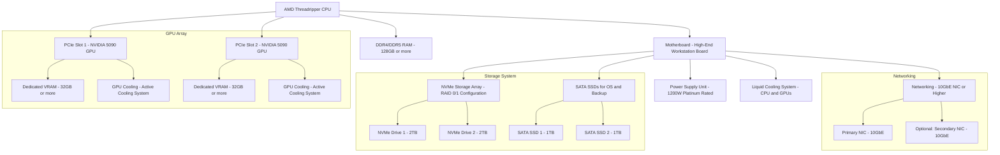
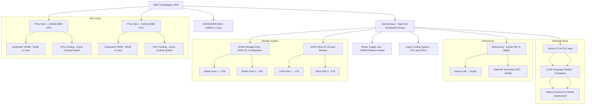

```mermaid
graph TD
    A[AMD Threadripper CPU] --> B1[PCIe Slot 1 - NVIDIA 5090 GPU]
    A --> B2[PCIe Slot 2 - NVIDIA 5090 GPU]
    A --> C[DDR4/DDR5 RAM - 128GB or more]
    A --> D[Motherboard - High-End Workstation Board]
    D --> E1[NVMe Storage Array - RAID 0/1 Configuration]
    D --> E2[SATA SSDs for OS and Backup]
    D --> F[Power Supply Unit - 1200W Platinum Rated]
    D --> G[Liquid Cooling System - CPU and GPUs]
    D --> H[Networking - 10GbE NIC or Higher]
    
    subgraph GPU Array
        B1 --> B1a[Dedicated VRAM - 32GB or more]
        B2 --> B2a[Dedicated VRAM - 32GB or more]
        B1 --> B3[GPU Cooling - Active Cooling System]
        B2 --> B4[GPU Cooling - Active Cooling System]
    end

    subgraph Storage System
        E1 --> E1a[NVMe Drive 1 - 2TB]
        E1 --> E1b[NVMe Drive 2 - 2TB]
        E2 --> E2a[SATA SSD 1 - 1TB]
        E2 --> E2b[SATA SSD 2 - 1TB]
    end

    subgraph Networking
        H --> H1[Primary NIC - 10GbE]
        H --> H2[Optional: Secondary NIC - 10GbE]
    end
```

```mermaid
graph TD
    A[AMD Threadripper CPU] --> B1[PCIe Slot 1 - NVIDIA 5090 GPU]
    A --> B2[PCIe Slot 2 - NVIDIA 5090 GPU]
    A --> C[DDR4/DDR5 RAM - 128GB or more]
    A --> D[Motherboard - High-End Workstation Board]
    D --> E1[NVMe Storage Array - RAID 0/1 Configuration]
    D --> E2[SATA SSDs for OS and Backup]
    D --> F[Power Supply Unit - 1200W Platinum Rated]
    D --> G[Liquid Cooling System - CPU and GPUs]
    D --> H[Networking - 10GbE NIC or Higher]
    D --> OS[Ubuntu 22.04 OS Layer]
    OS --> L1[Local Language Models - Containers]
    L1 --> L2[Ollama Runtime for Model Deployment]
    
    subgraph GPU Array
        B1 --> B1a[Dedicated VRAM - 32GB or more]
        B2 --> B2a[Dedicated VRAM - 32GB or more]
        B1 --> B3[GPU Cooling - Active Cooling System]
        B2 --> B4[GPU Cooling - Active Cooling System]
    end

    subgraph Storage System
        E1 --> E1a[NVMe Drive 1 - 2TB]
        E1 --> E1b[NVMe Drive 2 - 2TB]
        E2 --> E2a[SATA SSD 1 - 1TB]
        E2 --> E2b[SATA SSD 2 - 1TB]
    end

    subgraph Networking
        H --> H1[Primary NIC - 10GbE]
        H --> H2[Optional: Secondary NIC - 10GbE]
    end

    subgraph Software Stack
        OS --> L1[Local Language Models - Containers]
        L1 --> L2[Ollama Runtime for Model Deployment]
    end
```
