# GRYPHGEN Git Workflow Documentation

This document provides comprehensive mermaid diagrams explaining the git workflow, branching strategy, and collaboration model for the GRYPHGEN project.

## Table of Contents
1. [Branch Strategy](#branch-strategy)
2. [Claude Code Development Workflow](#claude-code-development-workflow)
3. [Feature Development Lifecycle](#feature-development-lifecycle)
4. [Commit and Push Workflow](#commit-and-push-workflow)
5. [Pull Request Process](#pull-request-process)

---

## Branch Strategy

The GRYPHGEN project uses a feature branch workflow where all development happens on dedicated branches prefixed with `claude/`.

### Branch Naming Convention

**Format:** `claude/{descriptive-name}-{sessionID}`

**Examples:**
- `claude/add-git-mermaid-diagrams-01A7FntuzYu1pDpWAiqwbqSv`
- `claude/feature-rag-system-AbC123XyZ456`
- `claude/fix-zeromq-connection-DeF789UvW012`

---

## Claude Code Development Workflow

This diagram shows the complete workflow when using Claude Code to develop features.

---

## Feature Development Lifecycle

Complete lifecycle from feature request to merge.

---

## Commit and Push Workflow

Detailed workflow for committing and pushing changes with retry logic.

---

## Pull Request Process

Workflow for creating and managing pull requests.

```mermaid
sequenceDiagram
    participant Dev as Developer/Claude
    participant Branch as Feature Branch
    participant Remote as GitHub Remote
    participant CI as CI/CD Pipeline
    participant Rev as Code Reviewer
    participant Main as Main Branch

    Dev->>Branch: Complete feature development
    Dev->>Remote: Push feature branch
    Remote->>CI: Trigger automated tests

    CI->>CI: Run test suite
    CI->>CI: Run linters
    CI->>CI: Security scan
    CI->>CI: Build verification

    alt Tests Pass
        CI->>Remote: ✅ All checks passed
        Dev->>Remote: Create Pull Request
        Remote->>Rev: Notify reviewer

        Rev->>Remote: Review code

        alt Approved
            Rev->>Remote: Approve PR
            Rev->>Main: Merge to main
            Main->>Remote: Update main branch
            Remote->>Branch: Delete feature branch
        else Changes Requested
            Rev->>Dev: Request changes
            Dev->>Branch: Make updates
            Dev->>Remote: Push updates
            Remote->>CI: Re-run tests
        end
    else Tests Fail
        CI->>Remote: ❌ Tests failed
        CI->>Dev: Notify of failures
        Dev->>Branch: Fix issues
        Dev->>Remote: Push fixes
        Remote->>CI: Re-trigger tests
    end
```

---

## Repository Structure Workflow

How different components interact in the repository structure.

```mermaid
graph TB
    ROOT[GRYPHGEN Repository Root]

    ROOT --> DOCS[📁 docs/]
    ROOT --> MCP[📁 MCP_SERVER/]
    ROOT --> MERMAID[📁 mermaid/]
    ROOT --> COMPONENTS[📁 Component Dirs/]
    ROOT --> DATED[📁 Dated Releases/]
    ROOT --> README[📄 README.md]
    ROOT --> LICENSE[📄 LICENSE]

    DOCS --> WORKFLOW[📄 GIT_WORKFLOW.md]
    DOCS --> STRUCTURE[📄 STRUCTURE.md]

    MCP --> MCP_DOCS[📄 Documentation]
    MCP --> MCP_CODE[💻 Server Code]

    MERMAID --> DIAGRAMS[📄 Diagram Files]
    MERMAID --> MERMAID_README[📄 readme.md]

    COMPONENTS --> SYMORQ[📁 SYMORQ/]
    COMPONENTS --> SYMORG[📁 SYMORG/]
    COMPONENTS --> SYMAUG[📁 SYMAUG/]
    COMPONENTS --> UTILS[📁 Utilities/]

    DATED --> JAN[📁 jan13, jan14/]
    DATED --> MARCH[📁 march13-25/]
    DATED --> AUG[📁 Aug_20_2025/]

    README --> MAIN_DOCS[Main Documentation]
    README --> ARCH_DIAGRAMS[Architecture Diagrams]

    style ROOT fill:#e1f5ff
    style DOCS fill:#e8f5e9
    style MCP fill:#fff3e0
    style MERMAID fill:#f3e5f5
    style COMPONENTS fill:#e0f2f1
    style README fill:#fce4ec
```

---

## Collaboration Model

Multi-developer collaboration workflow with conflict resolution.

---

## Best Practices

### Branch Management
1. **Always** work on feature branches prefixed with `claude/`
2. **Never** commit directly to main branch
3. **Include** session ID in branch name for traceability
4. **Delete** branches after successful merge

### Commit Messages
1. **Use** descriptive, imperative mood messages
2. **Reference** issue numbers when applicable
3. **Group** related changes in single commits
4. **Avoid** generic messages like "fix" or "update"

### Push Strategy
1. **Push** regularly to backup work
2. **Use** `-u` flag for first push to set upstream
3. **Implement** retry logic with exponential backoff
4. **Verify** branch name format before pushing

### Code Review
1. **Request** review before merging
2. **Test** thoroughly before creating PR
3. **Document** complex changes
4. **Respond** promptly to review feedback

---

## Troubleshooting

### Common Issues and Solutions

---

## Integration with GRYPHGEN System

How git workflow integrates with the overall GRYPHGEN architecture.

---

## Conclusion

This git workflow documentation provides a comprehensive guide to:
- Branch management and naming conventions
- Development workflow with Claude Code
- Commit and push strategies with retry logic
- Pull request process and code review
- Collaboration and conflict resolution
- Integration with GRYPHGEN architecture

Following these workflows ensures consistent, maintainable, and collaborative development practices for the GRYPHGEN project.
