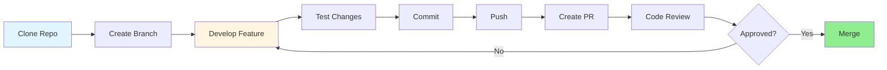
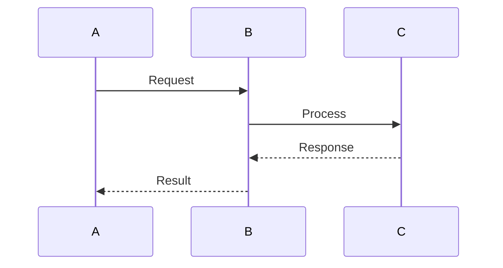
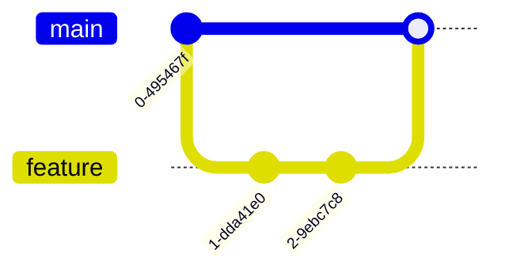
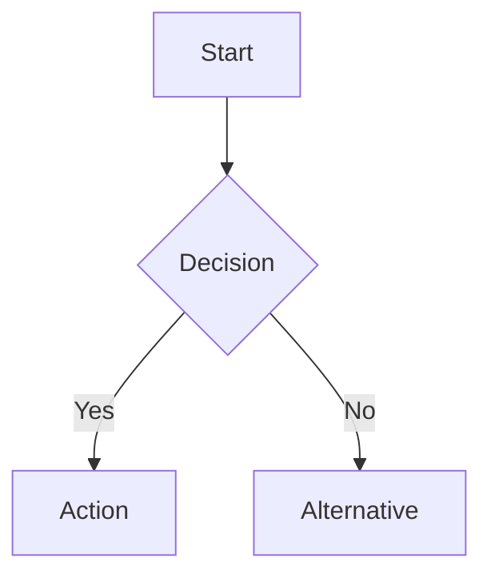

# GRYPHGEN Documentation Index

Welcome to the GRYPHGEN documentation! This directory contains comprehensive guides, workflows, and architectural documentation for the GRYPHGEN framework.

## Table of Contents

- [Quick Start](#quick-start)
- [Core Documentation](#core-documentation)
- [Architecture & Design](#architecture--design)
- [Development Guides](#development-guides)
- [Contributing](#contributing)

---

## Quick Start

New to GRYPHGEN? Start here:

1. **[Main README](../README.md)** - Project overview and introduction
2. **[System Overview](../System_overview.md)** - High-level architecture overview
3. **[Git Workflow](GIT_WORKFLOW.md)** - How to contribute using git

---

## Core Documentation

### Git & Development Workflow

**[GIT_WORKFLOW.md](GIT_WORKFLOW.md)**

Complete guide to the GRYPHGEN git workflow, including:
- Branch strategy and naming conventions
- Claude Code development workflow
- Commit and push workflow with retry logic
- Pull request process
- Collaboration model
- Troubleshooting common issues

**Key Sections:**
- [Branch Strategy](GIT_WORKFLOW.md#branch-strategy) - Understanding the branching model
- [Claude Code Workflow](GIT_WORKFLOW.md#claude-code-development-workflow) - Automated development process
- [Feature Lifecycle](GIT_WORKFLOW.md#feature-development-lifecycle) - From request to merge
- [Best Practices](GIT_WORKFLOW.md#best-practices) - Development guidelines

### Repository Structure

**[STRUCTURE_IMPROVEMENTS.md](STRUCTURE_IMPROVEMENTS.md)**

Proposals and guidelines for repository organization:
- Current structure analysis
- Proposed improvements
- Migration plan
- Benefits and rationale

**Key Sections:**
- [Proposed Structure](STRUCTURE_IMPROVEMENTS.md#proposed-structure-improvements) - Reorganization plan
- [Component Organization](STRUCTURE_IMPROVEMENTS.md#component-organization) - Module structure
- [Implementation Priority](STRUCTURE_IMPROVEMENTS.md#implementation-priority) - Phased approach
- [Migration Plan](STRUCTURE_IMPROVEMENTS.md#migration-plan) - Step-by-step guide

---

## Architecture & Design

### System Components

#### SYMORQ - Systems Orchestration for Resource Quality
**Location:** `components/symorq/` (proposed) / Root directory (current)

LLM-based orchestration service using ZeroMQ for resource management and coordination.

**Key Features:**
- Resource allocation and management
- ZeroMQ message passing
- Grid coordination
- Efficient resource utilization

#### SYMORG - Systems Orchestration Retrieval Generator
**Location:** `components/symorg/` (proposed) / Root directory (current)

LLM-based automated RAG (Retrieval Augmented Generation) constructor.

**Key Features:**
- Automated retrieval augmentation
- External data integration
- Enhanced AI model accuracy
- Context-aware generation

#### SYMAUG - Smart Yielding Microservices
**Location:** `components/symaug/` (proposed) / Root directory (current)

Dockerized/VM implementation of CCDE-SIOS ensemble.

**Key Features:**
- Lightweight deployment
- Cross-platform compatibility
- Portable architecture
- Scalable microservices

### Diagrams and Visualizations

**Location:** `../mermaid/` (current) / `diagrams/` (proposed)

Visual representations of system architecture:
- Sequence diagrams for workflow stages
- Component interaction diagrams
- System roadmap overview
- Git workflow diagrams

---

## Development Guides

### Getting Started

1. **Clone the repository:**
   ```bash
   git clone <repository-url>
   cd GRYPHGEN
   ```

2. **Create a feature branch:**
   ```bash
   git checkout -b claude/your-feature-name-sessionID
   ```

3. **Make changes and commit:**
   ```bash
   git add .
   git commit -m "Descriptive commit message"
   ```

4. **Push to remote:**
   ```bash
   git push -u origin claude/your-feature-name-sessionID
   ```

### Branch Naming Convention

All branches must follow this format:
```
claude/{descriptive-name}-{sessionID}
```

**Examples:**
- `claude/add-git-mermaid-diagrams-01A7FntuzYu1pDpWAiqwbqSv`
- `claude/implement-rag-system-AbC123XyZ456`
- `claude/fix-zeromq-connection-DeF789UvW012`

### Development Workflow



---

## Contributing

We welcome contributions! Please follow these guidelines:

### Before You Start

1. **Read the documentation:**
   - [Git Workflow](GIT_WORKFLOW.md)
   - [Main README](../README.md)
   - [Structure Improvements](STRUCTURE_IMPROVEMENTS.md)

2. **Understand the architecture:**
   - Review system diagrams
   - Understand component interactions
   - Read existing code

3. **Check existing issues:**
   - Browse open issues
   - Look for good first issues
   - Avoid duplicate work

### Contribution Process

1. **Fork and clone** the repository
2. **Create a feature branch** with proper naming
3. **Implement your changes** following project conventions
4. **Write tests** for new functionality
5. **Update documentation** as needed
6. **Submit a pull request** with clear description

### Code Standards

- **Commit messages:** Descriptive, imperative mood
- **Code style:** Follow project conventions
- **Testing:** Include tests for new features
- **Documentation:** Update docs for API changes

### Pull Request Guidelines

- **Title:** Clear, concise description
- **Description:** Explain what, why, and how
- **Testing:** Describe test coverage
- **Screenshots:** Include for UI changes
- **Breaking changes:** Highlight clearly

---

## Component-Specific Documentation

### MCP Server
**Location:** `../MCP_SERVER/`

Model Context Protocol server implementation:
- [MCP Server README](../MCP_SERVER/readme.md)
- [System Overview](../MCP_SERVER/system_overview.md)
- [API Documentation](../MCP_SERVER/expanded_design.md)

### Integration Components

- **[Perl Pipes](../perl_pipes/readme.md)** - Inter-process communication
- **[gstruct](../gstruct/readme.md)** - Data structure handling
- **[Swarm OpenAI](../swarm_openai/readme.md)** - OpenAI integration
- **[LLM Sandbox CLI](../LLM-Sandbox%20CLI/)** - Sandboxed LLM execution

---

## Diagram Guide

### Understanding Mermaid Diagrams

GRYPHGEN uses Mermaid for visualization:

**Sequence Diagrams** - Show process flows and interactions


**Git Graphs** - Illustrate branching strategies


**Flowcharts** - Demonstrate decision flows


### Rendering Diagrams

Mermaid diagrams render automatically on GitHub. For local viewing:
- Use a Mermaid-compatible markdown viewer
- Install Mermaid CLI tools
- Use online Mermaid Live Editor

---

## Additional Resources

### External Links

- **llama.cpp:** https://github.com/ggerganov/llama.cpp
- **OpenAI API:** https://github.com/openai/openai-openapi
- **ZeroMQ:** https://zeromq.org/
- **Docker:** https://www.docker.com/

### Related Projects

- **Jan.ai** - Local AI runtime
- **LM Studio** - Local model server
- **Calisota AI** - AI integration framework

---

## Documentation Roadmap

### Phase 1: Complete ✅
- [x] Git workflow documentation
- [x] Structure improvement proposals
- [x] Documentation index
- [x] Main README updates

### Phase 2: In Progress 🔄
- [ ] API reference documentation
- [ ] Deployment guides
- [ ] Testing documentation
- [ ] Component-specific guides

### Phase 3: Planned 📋
- [ ] Video tutorials
- [ ] Interactive examples
- [ ] Architecture deep dives
- [ ] Performance tuning guides

### Phase 4: Future 🔮
- [ ] Wiki pages
- [ ] Community contributions
- [ ] Best practices library
- [ ] Case studies

---

## Getting Help

- **Issues:** Report bugs via GitHub Issues
- **Discussions:** Ask questions in GitHub Discussions
- **Pull Requests:** Contribute improvements
- **Documentation:** This index and linked pages

---

## Document Maintenance

### Last Updated
- **Date:** 2025-11-14
- **Version:** 1.0.0
- **Maintainer:** GRYPHGEN Development Team

### Update Process

To update documentation:
1. Create a branch: `claude/update-docs-sessionID`
2. Make changes with clear commits
3. Update "Last Updated" section
4. Submit pull request
5. Request review

### Documentation Standards

- **Clarity:** Write for all skill levels
- **Completeness:** Cover all aspects thoroughly
- **Accuracy:** Keep information current
- **Examples:** Include practical examples
- **Diagrams:** Use visuals where helpful

---

**GRYPHGEN Documentation** - Comprehensive guides for automated software production at scale.
