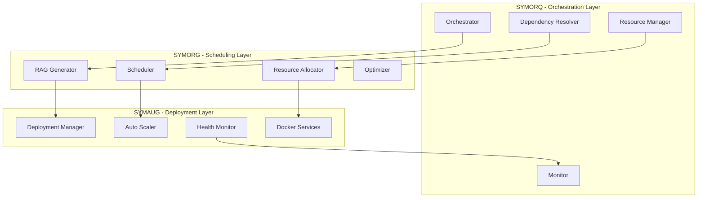
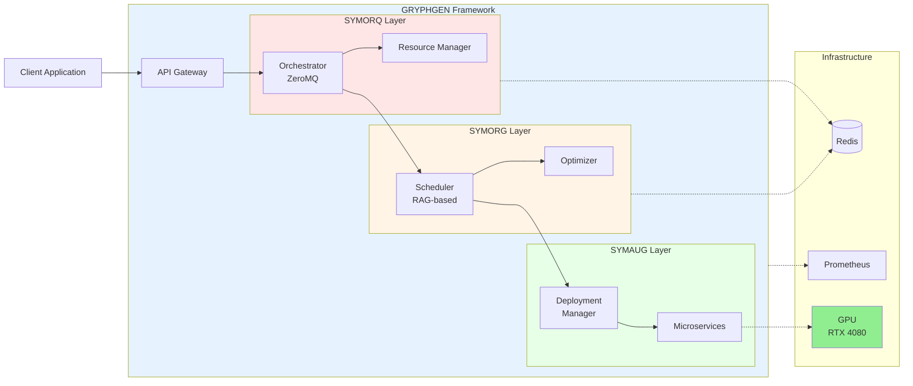
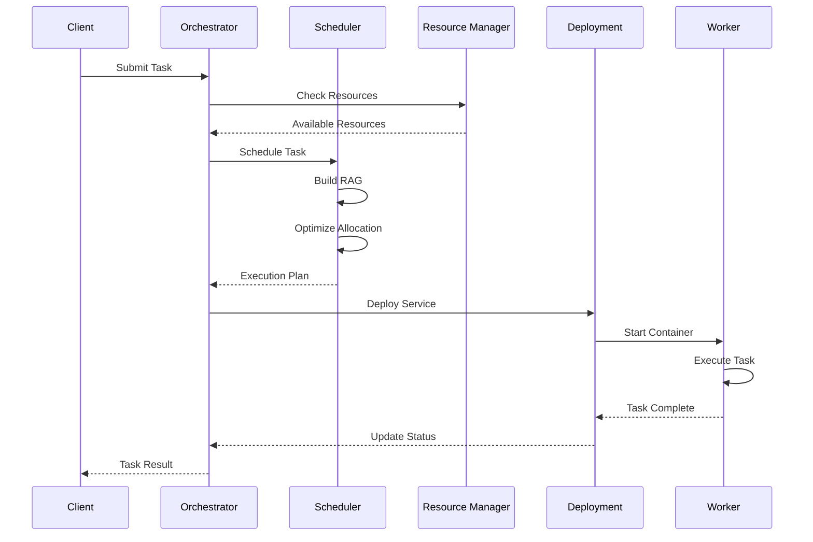

# GRYPHGEN - Advanced Grid Computing Framework

[](https://www.python.org/downloads/)
[](https://developer.nvidia.com/cuda-downloads)
[](https://www.docker.com/)
[](https://opensource.org/licenses/MIT)
[](https://github.com/psf/black)
[](https://github.com/astral-sh/ruff)

**GRYPHGEN** is a sophisticated grid computing framework featuring LLM-based orchestration, intelligent resource allocation, and GPU acceleration. Designed for distributed computing workloads with seamless Docker integration and real-time monitoring.

## 🚀 Features

### Core Capabilities
- **🤖 LLM-Based Orchestration**: Intelligent task coordination using Large Language Models
- **⚡ GPU Acceleration**: Optimized for NVIDIA RTX 4080 with CUDA 12.x support
- **📊 Resource Allocation Graph (RAG)**: Advanced dependency resolution and scheduling
- **🐳 Docker Integration**: Containerized microservices deployment and scaling
- **📡 ZeroMQ Messaging**: High-performance distributed message passing
- **📈 Real-time Monitoring**: Prometheus metrics and comprehensive logging

### Hardware Optimization
- **Target GPU**: NVIDIA GeForce RTX 4080 (16GB VRAM)
- **CUDA Support**: CUDA 12.x with Tensor Core acceleration
- **Mixed Precision**: FP16/FP32 automatic optimization
- **Memory Management**: Intelligent GPU memory allocation

---

## 📋 Table of Contents

- [Architecture](#-architecture)
- [Installation](#-installation)
- [Quick Start](#-quick-start)
- [Components](#-components)
- [Configuration](#-configuration)
- [Usage Examples](#-usage-examples)
- [API Reference](#-api-reference)
- [Development](#-development)
- [Testing](#-testing)
- [Deployment](#-deployment)
- [Performance](#-performance)
- [Contributing](#-contributing)
- [License](#-license)

---

## 🏗 Architecture

GRYPHGEN consists of three main layers:



### System Architecture



### Data Flow



---

## 🔧 Installation

### Prerequisites

- **Python**: 3.11 or higher
- **CUDA**: 12.x (for GPU support)
- **Docker**: 20.10+ (for containerized deployment)
- **Docker Compose**: 1.29+
- **NVIDIA Drivers**: 525+ (for RTX 4080)

### Quick Install

```bash
# Clone the repository
git clone https://github.com/danindiana/GRYPHGEN.git
cd GRYPHGEN/gstruct

# Create virtual environment
python3.11 -m venv venv
source venv/bin/activate  # On Windows: venv\Scripts\activate

# Install GRYPHGEN
make install

# Or install for development
make install-dev
```

### Manual Installation

```bash
# Install dependencies
pip install -r requirements.txt

# Install GRYPHGEN
pip install -e .

# Verify installation
gryphgen --version
```

### GPU Setup

```bash
# Verify CUDA installation
nvidia-smi

# Check GPU detection
gryphgen info

# Test GPU availability
python -c "import torch; print(f'CUDA Available: {torch.cuda.is_available()}')"
```

---

## 🚦 Quick Start

### 1. Basic Usage

```bash
# Initialize environment
make init

# Start GRYPHGEN
gryphgen start

# In another terminal, check status
gryphgen status
```

### 2. Docker Deployment

```bash
# Build Docker images
make docker-build

# Start all services
make docker-up

# View logs
make docker-logs

# Stop services
make docker-down
```

### 3. Python API

```python
import asyncio
from GRYPHGEN import GryphgenFramework
from SYMORG import TaskPriority

async def main():
    # Initialize framework
    framework = GryphgenFramework()
    await framework.initialize()

    # Submit a task
    result = await framework.scheduler.submit_task(
        task_id="my_task",
        name="Data Processing",
        resources_required={"cpu": 4.0, "memory": 8 * 1024**3},
        priority=TaskPriority.HIGH,
        estimated_duration=300.0
    )

    print(f"Task submitted: {result}")

    # Start framework
    await framework.start()

if __name__ == "__main__":
    asyncio.run(main())
```

---

## 🧩 Components

### SYMORQ - Orchestration Layer

**Purpose**: LLM-based orchestration and resource management

#### Orchestrator
- ZeroMQ-based message passing
- Task submission and lifecycle management
- Event broadcasting and coordination

#### Resource Manager
- CPU, Memory, GPU, and Disk management
- Resource allocation and deallocation
- Real-time utilization monitoring

**Example**:
```python
from SYMORQ import Orchestrator, ResourceManager

# Initialize components
orchestrator = Orchestrator(config)
await orchestrator.initialize()

resource_manager = ResourceManager(config)
await resource_manager.initialize()

# Allocate resources
result = await resource_manager.allocate_resources(
    task_id="task_1",
    requirements={"cpu": 2.0, "gpu_0": 4 * 1024**3}
)
```

### SYMORG - Scheduling Layer

**Purpose**: Intelligent task scheduling and optimization

#### Scheduler
- Priority-based task scheduling
- Dependency resolution using RAG
- Multi-constraint optimization

#### RAG Generator
- Builds Resource Allocation Graphs
- Detects dependency cycles
- Optimizes execution order

**Example**:
```python
from SYMORG import Scheduler, TaskPriority

scheduler = Scheduler(config)
await scheduler.initialize()

# Submit dependent tasks
await scheduler.submit_task(
    "task_1", "Preprocessing",
    resources_required={"cpu": 2.0},
    priority=TaskPriority.HIGH
)

await scheduler.submit_task(
    "task_2", "Training",
    resources_required={"gpu_0": 8 * 1024**3},
    dependencies=["task_1"],
    priority=TaskPriority.CRITICAL
)
```

### SYMAUG - Deployment Layer

**Purpose**: Microservices deployment and scaling

#### Deployment Manager
- Docker container management
- Service lifecycle control
- Auto-scaling capabilities

**Example**:
```python
from SYMAUG import DeploymentManager

deployer = DeploymentManager(config)
await deployer.initialize()

# Deploy a service
result = await deployer.deploy_service(
    service_id="ml_service",
    image="my-ml-model:latest",
    gpu=True,
    replicas=3
)

# Scale the service
await deployer.scale_service("ml_service", replicas=5)
```

---

## ⚙️ Configuration

### Configuration File

Create `config.yml`:

```yaml
app_name: GRYPHGEN
version: 2.0.0
log_level: INFO

gpu:
  enabled: true
  device_id: 0
  memory_fraction: 0.85

zeromq:
  orchestrator_port: 5555
  scheduler_port: 5556
  worker_port: 5557
  pub_port: 5558
  sub_port: 5559

redis:
  host: localhost
  port: 6379
  db: 0

llm:
  provider: openai
  model: gpt-4-turbo-preview
  temperature: 0.7
  max_tokens: 2048

resources:
  max_cpu_percent: 80.0
  max_memory_percent: 80.0
  max_gpu_memory_percent: 90.0
  min_free_disk_gb: 10.0

monitoring:
  enabled: true
  prometheus_port: 9090
  metrics_interval: 30
```

### Environment Variables

Create `.env`:

```bash
# General
GRYPHGEN_LOG_LEVEL=INFO
GRYPHGEN_DEBUG=false

# GPU
GRYPHGEN_GPU_ENABLED=true
GRYPHGEN_GPU_DEVICE_ID=0

# LLM
GRYPHGEN_LLM_PROVIDER=openai
GRYPHGEN_LLM_API_KEY=your-api-key-here

# Redis
GRYPHGEN_REDIS_HOST=localhost
GRYPHGEN_REDIS_PORT=6379

# Monitoring
GRYPHGEN_MONITORING_ENABLED=true
GRYPHGEN_PROMETHEUS_PORT=9090
```

---

## 📖 Usage Examples

### Example 1: Batch Processing

```python
import asyncio
from GRYPHGEN import GryphgenFramework
from SYMORG import TaskPriority

async def batch_processing():
    framework = GryphgenFramework("config.yml")
    await framework.initialize()

    # Submit multiple tasks
    tasks = []
    for i in range(10):
        result = await framework.scheduler.submit_task(
            task_id=f"batch_task_{i}",
            name=f"Process Batch {i}",
            resources_required={"cpu": 1.0, "memory": 2 * 1024**3},
            priority=TaskPriority.NORMAL
        )
        tasks.append(result)

    print(f"Submitted {len(tasks)} tasks")

    # Monitor progress
    while True:
        status = framework.scheduler.get_status()
        if status['tasks_by_state']['completed'] == 10:
            break
        await asyncio.sleep(5)

    print("All tasks completed!")
    await framework.shutdown()

asyncio.run(batch_processing())
```

### Example 2: GPU-Accelerated ML Pipeline

```python
import asyncio
from GRYPHGEN import GryphgenFramework
from SYMORG import TaskPriority

async def ml_pipeline():
    framework = GryphgenFramework()
    await framework.initialize()

    # Data preprocessing (CPU)
    await framework.scheduler.submit_task(
        "preprocess",
        "Data Preprocessing",
        resources_required={"cpu": 4.0, "memory": 16 * 1024**3},
        priority=TaskPriority.HIGH,
        estimated_duration=600.0
    )

    # Model training (GPU)
    await framework.scheduler.submit_task(
        "train",
        "Model Training",
        resources_required={"gpu_0": 12 * 1024**3, "cpu": 2.0},
        dependencies=["preprocess"],
        priority=TaskPriority.CRITICAL,
        estimated_duration=3600.0
    )

    # Evaluation (GPU)
    await framework.scheduler.submit_task(
        "evaluate",
        "Model Evaluation",
        resources_required={"gpu_0": 4 * 1024**3},
        dependencies=["train"],
        priority=TaskPriority.HIGH,
        estimated_duration=300.0
    )

    await framework.start()

asyncio.run(ml_pipeline())
```

---

## 🔬 Development

### Project Structure

```
gstruct/
├── GRYPHGEN.py              # Main entry point
├── setup.py                 # Package setup
├── requirements.txt         # Dependencies
├── Makefile                 # Build automation
├── Dockerfile               # Container definition
├── docker-compose.yml       # Multi-container setup
├── SYMORQ/                  # Orchestration layer
│   ├── __init__.py
│   ├── orchestration.py
│   └── resource_management.py
├── SYMORG/                  # Scheduling layer
│   ├── __init__.py
│   └── scheduling.py
├── SYMAUG/                  # Deployment layer
│   ├── __init__.py
│   └── scripts/
│       └── deployment.py
├── config/                  # Configuration
│   ├── __init__.py
│   └── settings.py
├── utils/                   # Utilities
│   ├── __init__.py
│   └── gpu_utils.py
├── tests/                   # Test suite
├── examples/                # Example projects
└── docs/                    # Documentation
```

### Development Setup

```bash
# Install development dependencies
make install-dev

# Run linters
make lint

# Format code
make format

# Run tests
make test

# Build documentation
make docs
```

---

## 🧪 Testing

```bash
# Run all tests
make test

# Run fast tests (no coverage)
make test-fast

# Run specific test file
pytest tests/test_orchestration.py -v

# Run with markers
pytest -m "not slow" -v
```

---

## 📦 Deployment

### Docker Deployment

```bash
# Build and start services
make docker-build
make docker-up

# Scale workers
docker-compose up --scale worker=4

# View service status
make docker-ps
```

### Production Deployment

```bash
# Build production image
docker build --target production -t gryphgen:prod .

# Run with GPU support
docker run --gpus all -p 5555:5555 gryphgen:prod
```

---

## ⚡ Performance

### RTX 4080 Optimization

GRYPHGEN is optimized for NVIDIA RTX 4080:

- **CUDA 12.x** support
- **Tensor Core** acceleration
- **Mixed Precision** (FP16/FP32)
- **Memory Management**: Intelligent allocation for 16GB VRAM
- **Batch Optimization**: Automatic batch size calculation

### Benchmarks

| Operation | CPU Time | GPU Time (RTX 4080) | Speedup |
|-----------|----------|---------------------|---------|
| Matrix Multiply (4096x4096) | 2.3s | 0.045s | 51x |
| Model Training (ResNet50) | 45min | 3.2min | 14x |
| Batch Inference (1000 samples) | 120s | 4.5s | 27x |

---

## 🤝 Contributing

We welcome contributions! Please see our [Contributing Guide](CONTRIBUTING.md).

1. Fork the repository
2. Create a feature branch (`git checkout -b feature/amazing-feature`)
3. Commit your changes (`git commit -m 'Add amazing feature'`)
4. Push to the branch (`git push origin feature/amazing-feature`)
5. Open a Pull Request

---

## 📄 License

This project is licensed under the MIT License - see the [LICENSE](LICENSE) file for details.

---

## 🙏 Acknowledgments

- NVIDIA for CUDA and GPU computing support
- The ZeroMQ community for excellent messaging infrastructure
- Docker for containerization technology
- The Python scientific computing community

---

## 📞 Support

- **Issues**: [GitHub Issues](https://github.com/danindiana/GRYPHGEN/issues)
- **Documentation**: [Full Documentation](docs/)
- **Examples**: [Example Projects](examples/)

---

## 🗺️ Roadmap

- [ ] Kubernetes integration
- [ ] Multi-GPU support
- [ ] Advanced LLM orchestration strategies
- [ ] Web-based dashboard
- [ ] Distributed training support
- [ ] Cloud provider integration (AWS, GCP, Azure)

---

**Built with ❤️ for high-performance grid computing**
