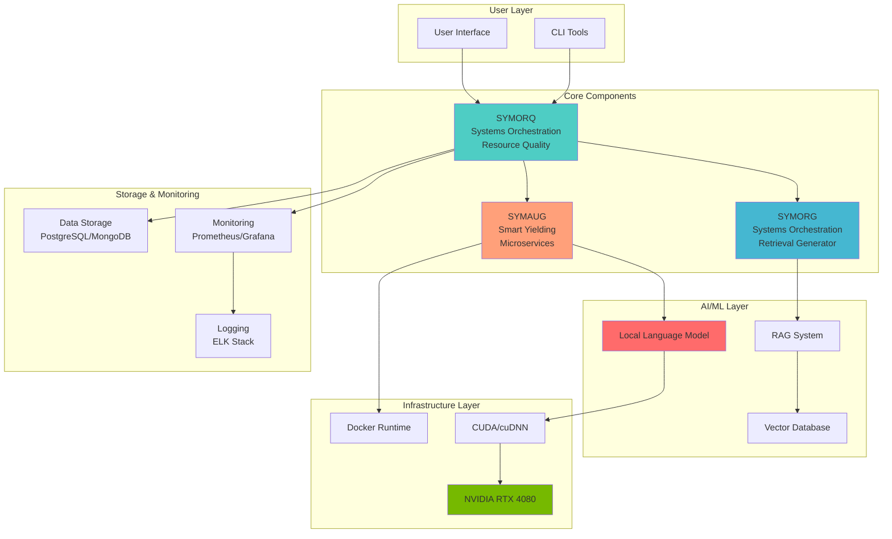
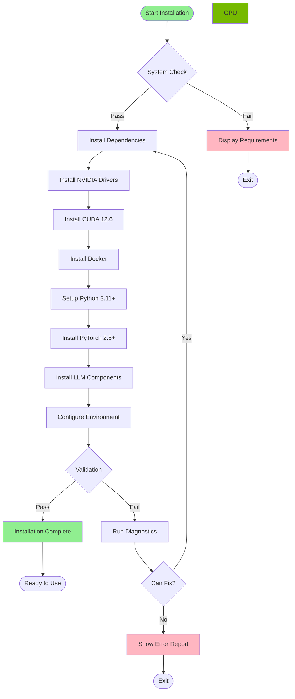

# GRYPHGEN Installation Suite


Comprehensive installation toolkit for deploying the GRYPHGEN (Grid Resource Prioritization in Heterogeneous Environments) framework on bare-metal Ubuntu Linux with NVIDIA GPU acceleration.

## Table of Contents

- [Overview](#overview)
- [System Requirements](#system-requirements)
- [Quick Start](#quick-start)
- [Installation Methods](#installation-methods)
- [Architecture](#architecture)
- [Components](#components)
- [Hardware Optimization](#hardware-optimization)
- [Troubleshooting](#troubleshooting)
- [Contributing](#contributing)

## Overview

GRYPHGEN is a next-generation framework for automated software production at scale using large language models (LLMs) with advanced orchestration, retrieval-augmented generation (RAG), and distributed microservices architecture.

### Key Features

- **GPU-Accelerated LLM Inference** - Optimized for NVIDIA RTX 4080 16GB
- **Containerized Deployment** - Docker and Kubernetes ready
- **Automated Installation** - Single-command setup with comprehensive validation
- **Production-Ready** - Monitoring, logging, and security built-in
- **Modular Architecture** - Easy to extend and customize

## System Requirements

### Hardware Requirements (Target: NVIDIA RTX 4080)

| Component | Minimum | Recommended |
|-----------|---------|-------------|
| **GPU** | NVIDIA RTX 3060 (12GB) | NVIDIA RTX 4080 (16GB) |
| **RAM** | 32GB | 64GB+ |
| **Storage** | 250GB SSD | 500GB+ NVMe SSD |
| **CPU** | 8-core AMD/Intel | 16-core Ryzen 9/i9 |

### Software Requirements

- **OS**: Ubuntu 22.04 LTS or 24.04 LTS
- **Kernel**: Linux 5.15+ (6.x recommended)
- **CUDA**: 12.6 or later
- **Python**: 3.11 or later
- **Docker**: 27.x or later
- **GPU Driver**: NVIDIA 560.x or later

## Quick Start

### One-Command Installation

```bash
# Clone the repository
git clone https://github.com/danindiana/GRYPHGEN.git
cd GRYPHGEN/install

# Run the automated installer
sudo bash scripts/install_base.sh

# Validate installation
bash tests/test_environment.py
```

### Docker Installation

```bash
# Build and run with Docker Compose
cd docker
docker-compose up -d

# Verify deployment
docker-compose ps
```

## Installation Methods

### Method 1: Automated Script Installation

The recommended method for bare-metal deployments:

```bash
# 1. Install base system dependencies
sudo bash scripts/install_base.sh

# 2. Install NVIDIA CUDA Toolkit (for RTX 4080)
sudo bash scripts/install_cuda.sh

# 3. Install Docker and NVIDIA Container Toolkit
sudo bash scripts/install_docker.sh

# 4. Install Python environment and dependencies
bash scripts/install_python.sh

# 5. Install LLM components
bash scripts/install_llm.sh

# 6. Validate the environment
bash scripts/validate_environment.sh
```

### Method 2: Docker Deployment

For containerized deployments:

```bash
cd docker
docker-compose up -d
```

### Method 3: Manual Installation

See [docs/installation-guide.md](docs/installation-guide.md) for detailed manual installation steps.

## Architecture

### System Architecture Diagram



### Installation Flow



## Components

### SYMORQ - Systems Orchestration for Resource Quality

Orchestrates and coordinates resources using ZeroMQ for efficient resource utilization.

**Key Features:**
- Dynamic resource allocation
- Load balancing
- Task scheduling and prioritization
- Real-time monitoring

### SYMORG - Systems Orchestration Retrieval Generator

Implements Retrieval-Augmented Generation (RAG) for enhanced LLM accuracy.

**Key Features:**
- Context-aware information retrieval
- Vector database integration
- Semantic search
- Document processing pipeline

### SYMAUG - Smart Yielding Microservices

Provides portable microservices architecture for multi-platform deployment.

**Key Features:**
- Docker containerization
- Kubernetes orchestration
- Service mesh integration
- Auto-scaling capabilities

## Hardware Optimization

### NVIDIA RTX 4080 Optimization

The installation is specifically optimized for NVIDIA RTX 4080 16GB:

#### CUDA Configuration

```bash
# CUDA Architecture: Ada Lovelace (sm_89)
export TORCH_CUDA_ARCH_LIST="8.9"
export CUDA_VISIBLE_DEVICES=0
```

#### Memory Optimization

```python
# PyTorch configuration for RTX 4080
torch.backends.cudnn.benchmark = True
torch.backends.cuda.matmul.allow_tf32 = True
torch.backends.cudnn.allow_tf32 = True
```

#### Performance Benchmarks

| Model | Batch Size | Tokens/sec | Memory Usage |
|-------|-----------|------------|--------------|
| LLaMA 2 7B | 1 | ~45 | 8.5 GB |
| LLaMA 2 13B | 1 | ~25 | 14.2 GB |
| Mistral 7B | 1 | ~50 | 7.8 GB |
| CodeLLaMA 7B | 1 | ~48 | 8.2 GB |

### Power and Thermal Management

```bash
# Set power limit (recommended: 320W)
sudo nvidia-smi -pl 320

# Monitor GPU temperature
watch -n 1 nvidia-smi
```

## Directory Structure

```
install/
├── README.md                    # This file
├── scripts/                     # Installation scripts
│   ├── install_base.sh         # Core dependencies
│   ├── install_cuda.sh         # NVIDIA CUDA toolkit
│   ├── install_docker.sh       # Docker & NVIDIA runtime
│   ├── install_python.sh       # Python environment
│   ├── install_llm.sh          # LLM components
│   ├── validate_environment.sh # Environment validation
│   └── utils/                  # Helper scripts
├── docker/                      # Docker configurations
│   ├── Dockerfile.base         # Base image
│   ├── Dockerfile.llm          # LLM runtime
│   ├── Dockerfile.gryphgen     # GRYPHGEN complete
│   ├── docker-compose.yml      # Compose configuration
│   └── .dockerignore
├── configs/                     # Configuration files
│   ├── requirements.txt        # Python packages
│   ├── requirements-gpu.txt    # GPU-specific packages
│   ├── environment.yml         # Conda environment
│   └── system-requirements.md  # System specs
├── docs/                        # Documentation
│   ├── installation-guide.md   # Detailed install guide
│   ├── cuda-setup.md          # CUDA configuration
│   ├── llm-deployment.md      # LLM deployment guide
│   ├── docker-guide.md        # Docker guide
│   ├── troubleshooting.md     # Common issues
│   ├── architecture.md        # System architecture
│   └── faq.md                 # FAQ
├── tests/                       # Validation tests
│   ├── test_cuda.py           # CUDA validation
│   ├── test_docker.py         # Docker validation
│   ├── test_environment.py    # Environment check
│   └── benchmark.py           # Performance tests
└── legacy/                      # Archived old files
    ├── readme.md               # Old README
    ├── install.sh              # Old install script
    └── ...                     # Other legacy files
```

## Troubleshooting

### Common Issues

#### CUDA Not Found

```bash
# Verify CUDA installation
nvcc --version
nvidia-smi

# Add to PATH if needed
echo 'export PATH=/usr/local/cuda/bin:$PATH' >> ~/.bashrc
echo 'export LD_LIBRARY_PATH=/usr/local/cuda/lib64:$LD_LIBRARY_PATH' >> ~/.bashrc
source ~/.bashrc
```

#### Docker Permission Denied

```bash
# Add user to docker group
sudo usermod -aG docker $USER
newgrp docker
```

#### PyTorch CUDA Mismatch

```bash
# Check PyTorch CUDA version
python -c "import torch; print(torch.version.cuda)"

# Reinstall matching version
pip install torch torchvision torchaudio --index-url https://download.pytorch.org/whl/cu126
```

For more issues, see [docs/troubleshooting.md](docs/troubleshooting.md)

## Environment Variables

```bash
# CUDA Configuration
export CUDA_HOME=/usr/local/cuda
export PATH=$CUDA_HOME/bin:$PATH
export LD_LIBRARY_PATH=$CUDA_HOME/lib64:$LD_LIBRARY_PATH

# PyTorch Optimization
export PYTORCH_CUDA_ALLOC_CONF=max_split_size_mb:512

# GRYPHGEN Configuration
export GRYPHGEN_HOME=/opt/gryphgen
export GRYPHGEN_DATA=/data/gryphgen
export GRYPHGEN_MODELS=/models/gryphgen
```

## Performance Tuning

### System Optimization

```bash
# Increase file descriptors
ulimit -n 65536

# Disable CPU frequency scaling
sudo cpupower frequency-set -g performance

# Enable huge pages
sudo sh -c 'echo 2048 > /proc/sys/vm/nr_hugepages'
```

### GPU Optimization

```bash
# Set persistence mode
sudo nvidia-smi -pm 1

# Set compute mode (exclusive process)
sudo nvidia-smi -c 3

# Enable MIG if needed (for A100/H100)
sudo nvidia-smi -mig 1
```

## Validation

After installation, run comprehensive validation:

```bash
# Run all validation tests
bash scripts/validate_environment.sh

# Run individual tests
python tests/test_cuda.py
python tests/test_docker.py
python tests/test_environment.py

# Run performance benchmarks
python tests/benchmark.py
```

Expected output:
```
✓ System requirements met
✓ NVIDIA Driver: 560.35.03
✓ CUDA: 12.6
✓ Docker: 27.3.1
✓ Python: 3.11.9
✓ PyTorch: 2.5.1+cu126
✓ GPU Memory: 16384 MB
✓ All tests passed
```

## Security Considerations

- Never run installation scripts without reviewing them first
- Use virtual environments for Python packages
- Keep CUDA and GPU drivers updated
- Enable firewall for Docker ports
- Use secrets management for API keys

See [docs/security.md](docs/security.md) for detailed security guidelines.

## Contributing

We welcome contributions! Please see:
- [CONTRIBUTING.md](../CONTRIBUTING.md) - Contribution guidelines
- [CODE_OF_CONDUCT.md](../CODE_OF_CONDUCT.md) - Code of conduct

## Support

- **Issues**: [GitHub Issues](https://github.com/danindiana/GRYPHGEN/issues)
- **Discussions**: [GitHub Discussions](https://github.com/danindiana/GRYPHGEN/discussions)
- **Documentation**: [Full Documentation](docs/)

## License

This project is licensed under the MIT License - see the [LICENSE](../LICENSE) file for details.

## Acknowledgments

- NVIDIA CUDA Toolkit
- PyTorch Team
- Docker Community
- LLAMA Framework Contributors
- Open-source LLM Community

---

**Version**: 2.0
**Last Updated**: 2025-11-19
**Maintained by**: GRYPHGEN Team
**Target Hardware**: NVIDIA RTX 4080 16GB
