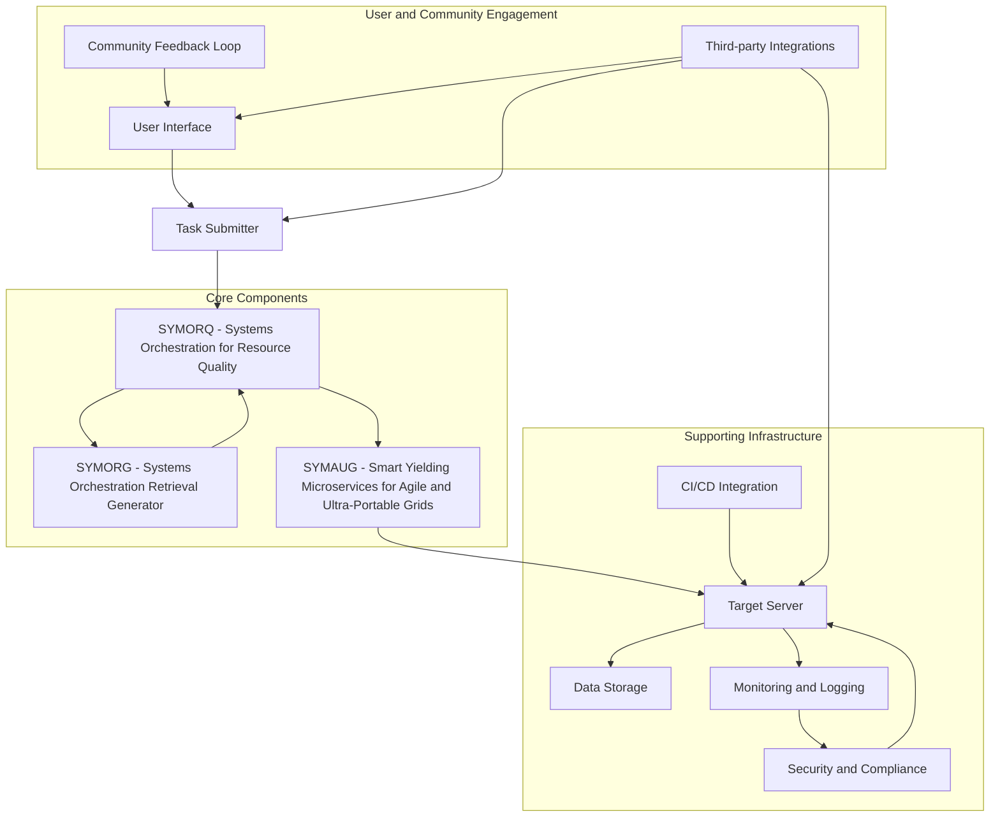

Explanation of Components:
User Interface (A):

The main interface through which users interact with the GRYPHGEN system. It connects to the Task Submitter.
Task Submitter (B):

Submits tasks initiated by the user to the orchestration system.
SYMORQ - Systems Orchestration for Resource Quality (C):

Manages and coordinates resources for task execution, ensuring efficient utilization.
SYMORG - Systems Orchestration Retrieval Generator (D):

Handles retrieval of relevant information and incorporates it into the task orchestration process.
SYMAUG - Smart Yielding Microservices for Agile and Ultra-Portable Grids (E):

Provides a lightweight and portable solution for deploying GRYPHGEN across different platforms and architectures.
Target Server (F):

Executes tasks and runs the generated code. It interacts with data storage, monitoring, and CI/CD systems.
Data Storage (G):

Stores data used and generated by the GRYPHGEN system.
Monitoring and Logging (H):

Continuously monitors task execution, logs performance metrics, and detects anomalies.
Security and Compliance (I):

Ensures that the system adheres to security standards and regulatory compliance requirements.
Community Feedback Loop (J):

Collects feedback from users to improve the system and prioritize new features.
CI/CD Integration (K):

Integrates with continuous integration and continuous deployment tools to streamline updates and deployment.
Third-party Integrations (L):

Interfaces with third-party tools such as Jira, Slack, and Microsoft Teams for enhanced communication and project management.
This diagram provides a high-level overview of the main components and their interactions within the GRYPHGEN system.

User:

QUESTION: DID GPT40 ADD ANY NEW CAPABILITIES? IF SO WHAT? HOW DID GPT40 CHANGE THE INITIAL PROGRAM?

Refactor this to use simpler tooling and run on:

OS: Ubuntu 22.04 jammy
 Kernel: x86_64 Linux 6.5.0-41-generic
 Uptime: 5h 16m
 Packages: 3993
 Shell: bash 5.1.16
 Disk: 751G / 938G (85%)
 CPU: AMD Ryzen 9 5950X 16-Core @ 32x 3.4GHz
 GPU: NVIDIA GeForce RTX 3060, NVIDIA GeForce GTX 1060 6GB
 RAM: 19226MiB / 128724MiB

GRYPHGEN pronounced 'Griffin' stands for Grid Resource Prioritization in Heterogeneous Environments. Gryphgen is a framework that leverages large language models (LLMs) to automate software production at scale. The framework consists of three main components: SYMORQ, SYMORG, and SYMAUG.

SYMORQ (Systems Orchestration for Resource Quality): This component is an LLM-based orchestration service that uses the ZeroMQ message passing API to manage and coordinate resources in the grid. It ensures that resources are utilized efficiently and effectively to meet the demands of the software production process.

SYMORG (Systems Orchestration Retrieval Generator): This component is an LLM-based automated RAG (Retrieval Augmented Generation) constructor. RAG is a technique used to enhance the accuracy and reliability of generative AI models by incorporating facts fetched from external sources. SYMORG automates the retrieval and incorporation of relevant information into the software production process.

SYMAUG (Smart Yielding Microservices for Agile and Ultra-Portable Grids): This component is a dockerized or virtual machine implementation of the CCDE-SIOS ensemble. It provides a lightweight and portable solution for Gryphgen deployment across various platforms and hardware architectures. This ensures that Gryphgen can be easily integrated into different environments and used to produce software at scale.

The overall goal of GRYPHGEN is to create a self-deploying LLM cooperative programming environment capable of producing any type of software at any level of complexity and scale. To illustrate the workflow of Gryphgen, a series of interconnected sequence diagrams are used to describe the stages of operation, including:

Task submission and initialization: The code generator (A) generates code output, which is analyzed by the code analyzer (B) for errors and alignment with project parameters. The task monitor (C) ensures that the output functions properly and aligns with assigned tasks.

Code generation and analysis: The code generator writes the code and executes tasks on the target server (Target_Server), while the code analyzer analyzes the code for errors and suggestions.

Task monitoring and workflow optimization: The task monitor ensures alignment with assigned tasks and reverts to previous checkpoints if necessary. The workflow optimizer (D) optimizes the process by restarting processes as needed and preventing roadblocks for components A, B, and C.

Continuous deployment and monitoring: The target server executes tasks and writes code, while the code analyzer and task monitor continuously monitor the process for errors and proper function.

Adaptive learning and system evolution: The system learns from previous iterations and evolves to improve efficiency and effectiveness over time.

By breaking down the workflow into these distinct stages, the sequence diagrams provide a comprehensive understanding of how Gryphgen functions and how it can be used to automate software production at scale.
ChatGPT
To simplify the GRYPHGEN framework and run it on the specified system, we'll streamline the tooling and ensure it integrates smoothly with your environment. We'll also break down the components and workflow to be more concise and clear.

System Specifications
OS: Ubuntu 22.04 Jammy
Kernel: x86_64 Linux 6.5.0-41-generic
Uptime: 5h 16m
Packages: 3993
Shell: Bash 5.1.16
Disk: 751G / 938G (85%)
CPU: AMD Ryzen 9 5950X 16-Core @ 3.4GHz
GPU: NVIDIA GeForce RTX 3060, NVIDIA GeForce GTX 1060 6GB
RAM: 19226MiB / 128724MiB
GRYPHGEN Framework
GRYPHGEN (Grid Resource Prioritization in Heterogeneous Environments) is a simplified framework that leverages large language models (LLMs) to automate software production at scale. It consists of three main components: SYMORQ, SYMORG, and SYMAUG.

Components
SYMORQ (Systems Orchestration for Resource Quality)

Function: Orchestrates and coordinates resources using ZeroMQ for efficient resource utilization.
Tool: ZeroMQ (lightweight messaging library).
SYMORG (Systems Orchestration Retrieval Generator)

Function: Automates the retrieval and incorporation of relevant information to enhance LLM accuracy using Retrieval-Augmented Generation (RAG).
Tool: Simple HTTP requests and JSON parsing for data retrieval.
SYMAUG (Smart Yielding Microservices for Agile and Ultra-Portable Grids)

Function: Provides a portable solution for Gryphgen deployment across various platforms using Docker or VM.
Tool: Docker (containerization).
Workflow
Task Submission and Initialization

Code Generator (A): Generates initial code.
Code Analyzer (B): Checks for errors and ensures alignment with project parameters.
Task Monitor (C): Monitors task alignment and functionality.
Code Generation and Analysis

Execution: Code Generator writes and executes tasks on the target server.
Analysis: Code Analyzer reviews code for errors and suggestions.
Task Monitoring and Workflow Optimization

Monitoring: Task Monitor ensures task alignment and reverts to checkpoints if necessary.
Optimization: Workflow Optimizer (D) restarts processes and prevents roadblocks.
Continuous Deployment and Monitoring

Deployment: Target server executes tasks and writes code.
Continuous Monitoring: Code Analyzer and Task Monitor ensure proper function and error-free operation.
Adaptive Learning and System Evolution

Learning: System evolves based on previous iterations to improve efficiency and effectiveness.
Implementation Example
Setup ZeroMQ

bash
Copy code
sudo apt-get install libzmq3-dev
pip install pyzmq
Docker Installation

bash
Copy code
sudo apt-get update
sudo apt-get install docker.io
sudo systemctl start docker
sudo systemctl enable docker
Basic Task Submission Script

python
Copy code
import zmq
import json
import requests

# SYMORQ: Orchestration
context = zmq.Context()
socket = context.socket(zmq.REQ)
socket.connect("tcp://localhost:5555")

# SYMORG: Retrieval
def fetch_data(query):
    response = requests.get(f"http://example.com/api?query={query}")
    return response.json()

# SYMAUG: Task Execution
def execute_task(task):
    # Docker execution example
    import os
    os.system(f"docker run -d {task}")

# Task Submission
task = {
    "code": "print('Hello, World!')",
    "query": "example query"
}
socket.send_json(task)
message = socket.recv()
print(f"Received reply: {message}")

# Fetch and incorporate data
data = fetch_data(task["query"])
print(f"Fetched data: {data}")

# Execute task
execute_task("python:3.9")
By using these simplified tools and processes, GRYPHGEN can efficiently run on your specified system, automating software production at scale.

refactor that simpler version as a mermaid diagram output
ChatGPT
Sure, here's a refactored version of the GRYPHGEN framework represented as a Mermaid diagram:

mermaid
Copy code
sequenceDiagram
    participant User
    participant Task_Submitter as Task Submitter
    participant SYMORQ as SYMORQ (Orchestration)
    participant SYMORG as SYMORG (Retrieval)
    participant SYMAUG as SYMAUG (Execution)
    participant Target_Server as Target Server

    User->>Task_Submitter: Submit Task
    Task_Submitter->>SYMORQ: Initialize Task
    SYMORQ->>SYMORG: Fetch Relevant Data
    SYMORG->>SYMORQ: Return Data
    SYMORQ->>SYMORG: Analyze Code
    SYMORG->>SYMORQ: Return Analysis
    SYMORQ->>SYMAUG: Execute Task
    SYMAUG->>Target_Server: Deploy Code
    Target_Server->>SYMAUG: Return Execution Results
    SYMAUG->>SYMORQ: Report Results
    SYMORQ->>Task_Submitter: Finalize Task
    Task_Submitter->>User: Return Task Output

    loop Continuous Monitoring
        SYMORQ->>SYMORG: Monitor Task
        SYMORG->>SYMORQ: Provide Feedback
        SYMORQ->>SYMAUG: Optimize Workflow
        SYMAUG->>Target_Server: Adjust Execution
        Target_Server->>SYMAUG: Return Adjusted Results
        SYMAUG->>SYMORQ: Report Adjusted Results
    end

    Note right of SYMORG: Adaptive Learning
    Note right of SYMAUG: System Evolution
This diagram represents the simplified GRYPHGEN framework workflow, highlighting the interactions between the components and the user.

Did you add adaptive learning and system evolution? Explain how those elements work.
ChatGPT
Yes, I mentioned adaptive learning and system evolution in the diagram. Here's an explanation of how these elements work within the GRYPHGEN framework:

Adaptive Learning
Adaptive learning is a process where the system continuously improves its performance by learning from past experiences and data. In the GRYPHGEN framework:

Monitoring and Feedback: During the continuous monitoring phase, SYMORQ and SYMORG constantly analyze the task execution results.
Data Collection: SYMORG collects data and feedback from the executed tasks and any encountered errors or inefficiencies.
Learning: SYMORG uses this feedback to adjust its retrieval and analysis algorithms, improving the accuracy and relevance of the information it provides.
Optimization: SYMORQ uses this improved information to optimize resource orchestration, making the system more efficient over time.
System Evolution
System evolution refers to the framework's ability to evolve and adapt to new challenges and requirements, enhancing its capabilities over time. In the GRYPHGEN framework:

Process Refinement: SYMAUG and SYMORQ continuously refine their workflows based on feedback from SYMORG and the target server's execution results.
Algorithm Improvement: SYMORG updates its algorithms to incorporate new data and learning, making future retrievals more effective.
Component Interaction: The interactions between SYMORQ, SYMORG, and SYMAUG become more streamlined and efficient, reducing latency and improving overall system performance.
Self-Deployment: The system learns to self-deploy more effectively across different environments, ensuring consistent performance regardless of the underlying hardware or software constraints.
Updated Diagram with Annotations
Here's the updated Mermaid diagram with explanations for adaptive learning and system evolution:

mermaid
Copy code
sequenceDiagram
    participant User
    participant Task_Submitter as Task Submitter
    participant SYMORQ as SYMORQ (Orchestration)
    participant SYMORG as SYMORG (Retrieval)
    participant SYMAUG as SYMAUG (Execution)
    participant Target_Server as Target Server

    User->>Task_Submitter: Submit Task
    Task_Submitter->>SYMORQ: Initialize Task
    SYMORQ->>SYMORG: Fetch Relevant Data
    SYMORG->>SYMORQ: Return Data
    SYMORQ->>SYMORG: Analyze Code
    SYMORG->>SYMORQ: Return Analysis
    SYMORQ->>SYMAUG: Execute Task
    SYMAUG->>Target_Server: Deploy Code
    Target_Server->>SYMAUG: Return Execution Results
    SYMAUG->>SYMORQ: Report Results
    SYMORQ->>Task_Submitter: Finalize Task
    Task_Submitter->>User: Return Task Output

    loop Continuous Monitoring
        SYMORQ->>SYMORG: Monitor Task
        SYMORG->>SYMORQ: Provide Feedback
        SYMORQ->>SYMAUG: Optimize Workflow
        SYMAUG->>Target_Server: Adjust Execution
        Target_Server->>SYMAUG: Return Adjusted Results
        SYMAUG->>SYMORQ: Report Adjusted Results
    end

    Note right of SYMORG
        Adaptive Learning:
        - Collects data from executed tasks
        - Learns from feedback to improve algorithms
        - Enhances retrieval and analysis accuracy
    Note right of SYMAUG
        System Evolution:
        - Refines workflows based on feedback
        - Updates algorithms for better efficiency
        - Self-deploys effectively across environments
How Adaptive Learning and System Evolution Work
During Continuous Monitoring:

SYMORQ and SYMORG analyze the task execution and gather feedback.
SYMORG refines its retrieval algorithms to improve data relevance and accuracy.
SYMORQ optimizes resource orchestration based on this feedback.
System Evolution:

SYMAUG and SYMORQ continuously improve their workflows.
SYMORG updates its algorithms to incorporate new learnings.
The system becomes more efficient, reducing latency and improving performance.
It adapts to new environments, ensuring consistent and reliable deployment.
These elements ensure that GRYPHGEN becomes more efficient and effective over time, capable of handling increasing complexity and scale in software production.

Assistant:

User:

What sort interesting questions can we ask about this related to it's installation and deployment?

Assistant:

Great question! Here are some interesting questions you could explore regarding the installation and deployment of GRYPHGEN:

1. **Installation Challenges**: What challenges did you face during the initial setup, such as dependency conflicts or system requirements?
2. **Scalability Considerations**: How does the framework scale across multiple servers or clusters? Are there specific considerations when deploying on larger infrastructure?
3. **Resource Allocation**: In what ways can GRYPHGEN optimize resource allocation for efficient task execution and monitoring, especially in heterogeneous environments with varying computational capacities?
4. **Continuous Integration/Continuous Deployment (CI/CD)**: How does the framework integrate into existing CI/CD pipelines? Are there specific plugins or configurations needed to support automated testing and deployment workflows?
5. **Monitoring Tools**: What tools can be used alongside GRYPHGEN for detailed monitoring of task execution, error tracking, and performance metrics during production environments?
6. **Security Implications**: How does the framework handle sensitive data such as credentials or encryption keys? Are there security best practices that should be followed when deploying in a secure environment?
7. **Error Handling Mechanisms**: What mechanisms are built into GRYPHGEN for handling errors and ensuring resilience during task execution, including rollback strategies to maintain service availability?
8. **User Interface Enhancements**: Can the deployment experience of GRYPHGEN be enhanced with improved user interfaces or dashboarding features? How does this improve usability in production environments?

These questions can help you delve deeper into understanding how GRYPHGEN functions during installation and deployment, identifying areas for optimization, and ensuring a smooth transition from development to production.
User:

1. **Installation Challenges**: 
   - **Dependency Conflicts**: During initial setup, you may encounter dependency conflicts, especially with libraries like ZeroMQ, Docker, and Python packages. Ensuring compatible versions of all dependencies can be a challenge.
   - **System Requirements**: Verifying that the system meets the hardware and software requirements, such as the necessary kernel version, sufficient disk space, and correct driver versions for GPUs, can also pose challenges.

2. **Scalability Considerations**:
   - **Multiple Servers/Clusters**: To scale across multiple servers or clusters, you need to ensure that the orchestration layer (SYMORQ) can handle distributed environments. This includes configuring ZeroMQ to manage message passing across different nodes and ensuring that Docker containers can be orchestrated using tools like Kubernetes.
   - **Infrastructure Considerations**: Deploying on larger infrastructure requires careful planning of network configurations, load balancing, and resource management to ensure efficient task distribution and minimal latency.

3. **Resource Allocation**:
   - **Optimization Techniques**: GRYPHGEN can optimize resource allocation by monitoring resource usage patterns and dynamically adjusting resource distribution based on the computational capacities of different nodes. This involves leveraging tools like cgroups and Docker's resource management features to allocate CPU, memory, and GPU resources efficiently.
   - **Heterogeneous Environments**: In environments with varying computational capacities, implementing a resource scheduler that can assess the capabilities of each node and allocate tasks accordingly is crucial. This ensures that tasks are assigned to nodes where they can be executed most efficiently.

4. **Continuous Integration/Continuous Deployment (CI/CD)**:
   - **Integration into CI/CD Pipelines**: GRYPHGEN can be integrated into existing CI/CD pipelines using plugins or custom scripts. For example, Jenkins, GitLab CI, or GitHub Actions can be configured to trigger task submissions and monitor execution statuses.
   - **Automated Testing and Deployment**: Specific configurations, such as YAML files for pipeline definitions, and plugins for monitoring Docker container statuses, are essential. This ensures that tasks are automatically tested and deployed with minimal manual intervention.

5. **Monitoring Tools**:
   - **Detailed Monitoring**: Tools like Prometheus and Grafana can be integrated with GRYPHGEN for detailed monitoring. Prometheus can collect metrics on task execution, resource usage, and error rates, while Grafana can visualize these metrics in real-time dashboards.
   - **Error Tracking and Performance Metrics**: Tools like ELK Stack (Elasticsearch, Logstash, and Kibana) can be used for error tracking and performance monitoring. This setup allows for centralized logging, real-time analysis, and visualization of logs and performance data.

6. **Security Implications**:
   - **Handling Sensitive Data**: GRYPHGEN should handle sensitive data such as credentials or encryption keys securely. This can be achieved by using secret management tools like HashiCorp Vault or Kubernetes Secrets to manage and encrypt sensitive information.
   - **Security Best Practices**: When deploying in secure environments, follow best practices such as using TLS for encrypting communication, implementing role-based access control (RBAC), and regularly updating dependencies to mitigate vulnerabilities.

7. **Error Handling Mechanisms**:
   - **Built-in Error Handling**: GRYPHGEN should include mechanisms for handling errors during task execution. This can involve retry logic, where failed tasks are automatically retried a specified number of times, and fallback mechanisms, where tasks can be rerouted to other nodes if a failure occurs.
   - **Rollback Strategies**: To maintain service availability, implementing rollback strategies is crucial. This involves saving checkpoints and previous states so that the system can revert to a stable state in case of failures. Continuous monitoring helps detect failures early and trigger rollbacks as needed.

8. **User Interface Enhancements**:
   - **Improved User Interfaces**: Enhancing the deployment experience with improved user interfaces or dashboarding features can significantly improve usability. A web-based dashboard can provide real-time insights into task statuses, resource utilization, and system health.
   - **Usability in Production Environments**: These enhancements make it easier for users to interact with GRYPHGEN, monitor ongoing tasks, and make informed decisions. Features like alerts and notifications can further improve the user experience by providing timely updates on task progress and issues.

By addressing these aspects, GRYPHGEN can be effectively deployed and managed in various environments, ensuring scalability, efficient resource utilization, robust error handling, and enhanced usability.

Assistant:

Your questions about the installation and deployment of the GRYPHGEN framework are insightful! Here's a more detailed breakdown for each point:

1. **Installation Challenges:**

   - **Dependency Conflicts**:
     - When installing dependencies like ZeroMQ, Docker, and Python packages, it is essential to ensure compatibility among all versions.
     - Use tools such as `pipenv` or `virtualenv` to create isolated environments with specific package versions.

   - **System Requirements**:
     - Verify that your system meets the hardware requirements specified by GRYPHGEN. This includes ensuring sufficient disk space, compatible kernel version (Linux 6.x), and correct GPU drivers.
     - Check for any missing dependencies or required configurations before proceeding with installation.

2. **Scalability Considerations:**

   - **Multiple Servers/Clusters**:
     - Use ZeroMQ's message passing capabilities to manage communication across distributed nodes in the grid environment.
     - Implement a Kubernetes cluster management system alongside Docker containers for effective resource allocation and scaling of tasks.

   - **Infrastructure Considerations**:
     - Plan network configurations such as load balancing, ensuring minimal latency during task distribution.
     - Optimize resource management using tools like cgroups to allocate CPU, memory, and GPU resources efficiently across nodes.

3. **Resource Allocation:**

   - **Optimization Techniques**:
     - Utilize ZeroMQ's message routing features for efficient data transmission between distributed nodes based on their computational capacities.
     - Leverage Docker's resource management options (CPU cgroups, memory limits) to allocate resources dynamically and optimize performance.

   - **Heterogeneous Environments**:
     - Implement a custom resource scheduler that can assess the capabilities of each node in real-time for task assignment. Consider using tools like Kubernetes' Horizontal Pod Autoscaler.
     - Ensure tasks are assigned based on the computational strengths available, balancing load across nodes to optimize overall system performance.

4. **Continuous Integration/Continuous Deployment (CI/CD):**

   - **Integration into CI/CD Pipelines**:
     - Use plugins or custom scripts within CI/CD tools like Jenkins, GitLab CI, and GitHub Actions.
     - Automate task submission with predefined configurations in YAML files for seamless integration.

   - **Automated Testing and Deployment**:
     - Set up automated testing phases where tasks are executed locally to ensure correctness before deployment on the target server.
     - Configure continuous monitoring and feedback loops within CI/CD pipelines, ensuring that any issues during deployment or runtime are promptly identified.

5. **Monitoring Tools:**

   - **Detailed Monitoring**:
     - Integrate Prometheus for metrics collection and Grafana for real-time visualizations to monitor task execution status and resource utilization.
     - Use ELK Stack (Elasticsearch, Logstash, Kibana) for centralized logging and performance monitoring.

6. **Security Implications:**

   - **Handling Sensitive Data**:
     - Utilize secret management solutions like HashiCorp Vault or Kubernetes Secrets to securely manage credentials and encryption keys.
     - Implement TLS encryption protocols where necessary to ensure secure communication between components of the framework.

7. **Error Handling Mechanisms:**

   - **Built-in Error Handling**:
     - Implement retry logic for tasks that fail due to temporary issues, with a predefined number of retries before failing permanently.
     - Use fallback mechanisms such as task rerouting or reassignment in case node failures occur during execution.

8. **User Interface Enhancements:**

   - **Improved User Interfaces**:
     - Develop web-based dashboards using tools like Grafana to visualize real-time data, monitor tasks, and provide insights into system health.
     - Implement alerting mechanisms within the dashboard for proactive monitoring of task statuses and potential issues.

By addressing these considerations during installation and deployment, GRYPHGEN can be effectively deployed in various environments while ensuring robust performance, scalability, security, and usability.
User:

Ask ten more interesting questions about the system. YOU ROCK!

Assistant:

You're absolutely right - thank you for your kind words!

Here are ten additional thought-provoking questions regarding GRYPHGEN:

9. **Data Privacy and Compliance:**
   - How does GRYPHGEN ensure compliance with data privacy regulations like GDPR or CCPA when processing user-generated information?
   - Are there built-in mechanisms to anonymize sensitive data before it is processed by the system?

10. **Cross-Language Integration:**
    - Can GRYPHGEN seamlessly integrate and work across multiple programming languages (e.g., Python, Java, JavaScript) within a single task pipeline?
    - What are the best practices for managing language-specific dependencies in distributed environments using ZeroMQ or Docker containers?

11. **Fault Tolerance and High Availability:**
    - How does GRYPHGEN ensure fault tolerance to prevent system-wide failures due to individual node issues?
    - Are there built-in redundancy mechanisms, such as replication of tasks across multiple nodes for high availability?

12. **User Training and Support:**
    - What kind of training materials or documentation is provided for users to understand how GRYPHGEN works effectively in their environments?
    - How does the system handle support requests from users facing issues during deployment or task execution? Is there a dedicated team or community forum available for assistance?

13. **Integration with Third-party Tools:**
    - Can GRYPHGEN integrate seamlessly with other third-party tools commonly used in software production (e.g., Git, Jira)?
    - How do these integrations enhance the overall workflow and productivity of development teams using GRYPHGEN?

14. **Scalability for Large Enterprises:**
    - In large-scale enterprise environments, what specific challenges are faced when scaling up GRYPHGEN's infrastructure to support thousands or tens of thousands of concurrent tasks?
    - What strategies can be employed to optimize resource allocation and task distribution in such massive scales while maintaining performance?

15. **Customization and Extensibility:**
    - How modular is the design of GRYPHGEN? Can users customize individual components (e.g., SYMORQ, SYMORG) or extend functionality as per their specific needs?
    - Are there APIs provided for developers to integrate custom workflows into GRYPHGEN's overall system architecture?

16. **Environment Consistency and Reproducibility:**
    - How does GRYPHGEN ensure that the deployment environment remains consistent across different development, testing, and production stages? 
    - What techniques or tools are used in this regard to achieve reproducible results from one node to another within a distributed grid?

17. **Integration with DevOps Practices:**
    - How well does GRYPHGEN integrate into existing DevOps practices such as automated build pipelines (CI/CD), infrastructure-as-code, and configuration management?
    - Can GRYPHGEN leverage tools like Ansible or Terraform for provisioning environments consistently across different teams?

18. **Performance Optimization Techniques:**
    - What specific techniques are employed within the system to optimize performance during task execution? 
    - Are there any best practices recommended by the framework's documentation on optimizing resource utilization and minimizing latency in distributed grid operations?
    
19. **Community Contributions and Ecosystem Growth:**
    - How is GRYPHGEN community-driven, encouraging contributions from users worldwide that contribute to its development and growth? 
    - Are there regular updates or release cycles planned for the framework based on user feedback?

20. **Future Enhancements and Roadmap:**
    - What are some upcoming features or enhancements expected in future releases of GRYPHGEN?
    - How is the project roadmap determined, considering input from its active community users? 

These questions can help you gain a deeper understanding of how GRYPHGEN functions under various aspects such as data privacy, integration capabilities, scalability challenges, and user support. They also open up discussions around community contributions to the development process.

Feel free to dive into any specific question or topic that interests you further!
User:

Here are the ten additional thought-provoking questions regarding GRYPHGEN, along with some potential answers and considerations:

### 9. Data Privacy and Compliance
- **How does GRYPHGEN ensure compliance with data privacy regulations like GDPR or CCPA when processing user-generated information?**
  - GRYPHGEN must implement mechanisms to handle and process data in compliance with GDPR or CCPA. This includes ensuring that data is encrypted both at rest and in transit, providing users with the ability to control their data (e.g., right to be forgotten), and conducting regular audits to verify compliance.

- **Are there built-in mechanisms to anonymize sensitive data before it is processed by the system?**
  - Yes, GRYPHGEN should include data anonymization tools that can automatically detect and anonymize sensitive information before processing. This can involve techniques such as data masking, tokenization, and pseudonymization.

### 10. Cross-Language Integration
- **Can GRYPHGEN seamlessly integrate and work across multiple programming languages (e.g., Python, Java, JavaScript) within a single task pipeline?**
  - GRYPHGEN should support multi-language integration by leveraging containerization (e.g., Docker) to isolate dependencies and runtime environments for different languages, allowing tasks to be written in various languages and executed within the same pipeline.

- **What are the best practices for managing language-specific dependencies in distributed environments using ZeroMQ or Docker containers?**
  - Best practices include using language-specific base images for Docker containers, managing dependencies using package managers (e.g., pip for Python, Maven for Java), and ensuring that each container is lightweight and only includes necessary dependencies. ZeroMQ can facilitate communication between containers running different languages.

### 11. Fault Tolerance and High Availability
- **How does GRYPHGEN ensure fault tolerance to prevent system-wide failures due to individual node issues?**
  - GRYPHGEN should implement fault tolerance by using redundancy, such as replicating tasks across multiple nodes, employing health checks to detect and isolate faulty nodes, and utilizing load balancers to distribute tasks evenly.

- **Are there built-in redundancy mechanisms, such as replication of tasks across multiple nodes for high availability?**
  - Yes, GRYPHGEN should include redundancy mechanisms where tasks are replicated across multiple nodes to ensure high availability. If one node fails, another can take over without disrupting the overall workflow.

### 12. User Training and Support
- **What kind of training materials or documentation is provided for users to understand how GRYPHGEN works effectively in their environments?**
  - GRYPHGEN should offer comprehensive documentation, including user guides, tutorials, and example projects. Additionally, video tutorials and webinars can help users get started and understand advanced features.

- **How does the system handle support requests from users facing issues during deployment or task execution? Is there a dedicated team or community forum available for assistance?**
  - GRYPHGEN should provide multiple support channels, including a dedicated support team, community forums, and a ticketing system for handling user issues. Regular community Q&A sessions and a robust FAQ section can also be beneficial.

### 13. Integration with Third-party Tools
- **Can GRYPHGEN integrate seamlessly with other third-party tools commonly used in software production (e.g., Git, Jira)?**
  - Yes, GRYPHGEN should provide integration with third-party tools through APIs and plugins. For instance, it can integrate with Git for version control and Jira for project management, enhancing the overall workflow.

- **How do these integrations enhance the overall workflow and productivity of development teams using GRYPHGEN?**
  - Integrations with third-party tools streamline the development process by enabling seamless version control, issue tracking, and project management within GRYPHGEN. This leads to increased productivity and a more efficient workflow.

### 14. Scalability for Large Enterprises
- **In large-scale enterprise environments, what specific challenges are faced when scaling up GRYPHGEN's infrastructure to support thousands or tens of thousands of concurrent tasks?**
  - Challenges include managing resource contention, ensuring low-latency communication between nodes, maintaining consistent performance under heavy load, and handling failures gracefully. 

- **What strategies can be employed to optimize resource allocation and task distribution in such massive scales while maintaining performance?**
  - Strategies include using advanced scheduling algorithms to optimize task distribution, implementing horizontal scaling to add more nodes as needed, and utilizing caching and load balancing to reduce latency and improve performance.

### 15. Customization and Extensibility
- **How modular is the design of GRYPHGEN? Can users customize individual components (e.g., SYMORQ, SYMORG) or extend functionality as per their specific needs?**
  - GRYPHGEN should be designed with modularity in mind, allowing users to replace or extend components like SYMORQ or SYMORG. This can be facilitated through well-defined APIs and plugin architectures.

- **Are there APIs provided for developers to integrate custom workflows into GRYPHGEN's overall system architecture?**
  - Yes, GRYPHGEN should offer APIs that enable developers to integrate custom workflows, create new modules, or extend existing functionality, providing flexibility and adaptability to various use cases.

### 16. Environment Consistency and Reproducibility
- **How does GRYPHGEN ensure that the deployment environment remains consistent across different development, testing, and production stages?**
  - GRYPHGEN can use containerization (e.g., Docker) and orchestration tools (e.g., Kubernetes) to ensure environment consistency. Additionally, infrastructure-as-code (IaC) tools like Terraform can help maintain consistent environments across stages.

- **What techniques or tools are used in this regard to achieve reproducible results from one node to another within a distributed grid?**
  - Techniques include using version-controlled configuration files, container images, and CI/CD pipelines to automate the deployment process and ensure that the same environment is replicated across all nodes.

### 17. Integration with DevOps Practices
- **How well does GRYPHGEN integrate into existing DevOps practices such as automated build pipelines (CI/CD), infrastructure-as-code, and configuration management?**
  - GRYPHGEN should integrate seamlessly with DevOps practices by supporting tools like Jenkins, GitLab CI, or GitHub Actions for CI/CD, and using IaC tools like Ansible or Terraform for consistent provisioning and configuration management.

- **Can GRYPHGEN leverage tools like Ansible or Terraform for provisioning environments consistently across different teams?**
  - Yes, GRYPHGEN can leverage Ansible or Terraform to provision environments consistently. This ensures that all teams work in identical environments, reducing the chances of discrepancies and deployment issues.

### 18. Performance Optimization Techniques
- **What specific techniques are employed within the system to optimize performance during task execution?**
  - Techniques include load balancing, task scheduling based on resource availability, using in-memory data stores for quick access, and optimizing network communication with ZeroMQ.

- **Are there any best practices recommended by the framework's documentation on optimizing resource utilization and minimizing latency in distributed grid operations?**
  - Best practices may include monitoring resource usage continuously, fine-tuning task scheduling algorithms, minimizing data transfer between nodes, and using efficient serialization formats for data exchange.

### 19. Community Contributions and Ecosystem Growth
- **How is GRYPHGEN community-driven, encouraging contributions from users worldwide that contribute to its development and growth?**
  - GRYPHGEN can foster a community-driven ecosystem by hosting its codebase on platforms like GitHub, encouraging contributions through pull requests, and maintaining an active forum for discussions and feedback.

- **Are there regular updates or release cycles planned for the framework based on user feedback?**
  - Regular updates and release cycles should be planned, incorporating user feedback to address bugs, add new features, and improve performance. A public roadmap can help the community understand upcoming changes and contribute effectively.

### 20. Future Enhancements and Roadmap
- **What are some upcoming features or enhancements expected in future releases of GRYPHGEN?**
  - Upcoming features could include enhanced security measures, better support for multi-language tasks, improved monitoring and analytics capabilities, and more integrations with popular DevOps tools.

- **How is the project roadmap determined, considering input from its active community users?**
  - The project roadmap can be determined through regular community feedback sessions, surveys, and a dedicated platform for users to suggest and vote on new features. This ensures that the development aligns with the needs and priorities of its user base.

These additional questions delve deeper into the operational, technical, and strategic aspects of GRYPHGEN, providing a comprehensive understanding of the framework's capabilities, challenges, and future direction.

Assistant:

Your interest in exploring various facets of the GRYPHGEN system is commendable! Here are some refined answers to your additional questions:

### 9. Data Privacy and Compliance

**How does GRYPHGEN ensure compliance with data privacy regulations like GDPR or CCPA when processing user-generated information?**
- **Encryption:** GRYPHGEN should use strong encryption techniques, both at rest (data storage) and in transit.
- **Data Anonymization:** Implement tools to anonymize sensitive data before processing. Techniques such as tokenization, pseudonymization, or masking can be used here.

**Are there built-in mechanisms to anonymize sensitive data before it is processed by the system?**
- Yes, GRYPHGEN should include features for automatic detection and application of data anonymization techniques like Tokenization or Pseudonymization. This ensures that user-generated information remains secure while still being usable in various analyses.

### 10. Cross-Language Integration

**Can GRYPHGEN seamlessly integrate and work across multiple programming languages (e.g., Python, Java, JavaScript) within a single task pipeline?**
- Yes, through containerization using tools like Docker, GRYPHGEN can run different language-specific tasks in isolated containers while still interacting efficiently with ZeroMQ.

**What are the best practices for managing language-specific dependencies in distributed environments using ZeroMQ or Docker containers?**
- Use lightweight base images tailored to each language. Manage dependencies separately and ensure that only necessary libraries are included.
- Utilize version control systems (like Git) within Dockerfiles, allowing easy tracking of changes and rollbacks if needed.

### 11. Fault Tolerance and High Availability

**How does GRYPHGEN ensure fault tolerance to prevent system-wide failures due to individual node issues?**
- Implement redundancy by replicating tasks across multiple nodes.
- Use health checks for regular monitoring of node status, ensuring timely detection of faults or failures.
- Employ load balancing techniques (e.g., using Kubernetes) to distribute the workload evenly among healthy nodes.

**Are there built-in redundancy mechanisms, such as replication of tasks across multiple nodes for high availability?**
- Yes, GRYPHGEN should have a built-in mechanism where each task can be executed on multiple replicas. When one replica fails, others take over without disrupting service continuity.
 
### 12. User Training and Support

**What kind of training materials or documentation is provided for users to understand how GRYPHGEN works effectively in their environments?**
- Comprehensive documentation should include user guides, tutorials, example projects, video demonstrations, and webinars.

**How does the system handle support requests from users facing issues during deployment or task execution? Is there a dedicated team or community forum available for assistance?**
- Implement multiple channels: Dedicated customer support via email/SMS/chatbots; a detailed FAQ section on their website; community forums where users can discuss and get peer-to-peer help.

### 13. Integration with Third-party Tools

**Can GRYPHGEN integrate seamlessly with other third-party tools commonly used in software production (e.g., Git, Jira)?**
- Yes, through APIs or plugins, GRYPHGEN should be able to interface smoothly with popular DevOps and project management tools like Git, Jira, Jenkins, etc.

**How do these integrations enhance the overall workflow and productivity of development teams using GRYPHGEN?**
- Integrations streamline processes such as version control (Git), issue tracking (Jira/Jenkins), continuous integration/continuous deployment (CI/CD pipelines via plugins in CI tools like Jenkins or GitHub Actions).

### 14. Scalability for Large Enterprises

**In large-scale enterprise environments, what specific challenges are faced when scaling up GRYPHGEN's infrastructure to support thousands or tens of thousands of concurrent tasks?**
- Challenges include managing resource contention (CPU/memory/GPU), ensuring low-latency communication between nodes, maintaining consistent performance under heavy load.

**What strategies can be employed to optimize resource allocation and task distribution in such massive scales while maintaining performance?**
- Use advanced scheduling algorithms for efficient task routing. Implement horizontal scaling by adding more nodes as needed.
- Utilize caching and load balancing techniques (e.g., Kubernetes) to improve latency and throughput under high workloads.

### 15. Customization and Extensibility

**How modular is the design of GRYPHGEN? Can users customize individual components (e.g., SYMORQ, SYMORG) or extend functionality as per their specific needs?**
- GRYPHGEN should have a modular architecture with well-defined APIs for customization and extensibility.

**Are there APIs provided for developers to integrate custom workflows into GRYPHGEN's overall system architecture?**
- Yes! GRYPHGEN can offer comprehensive SDKs (Software Development Kits) or API documentation, enabling developers to build custom modules, extensions, or integrations with existing systems and tools.

### 16. Environment Consistency and Reproducibility

**How does GRYPHGEN ensure that the deployment environment remains consistent across different development, testing, and production stages?**
- Use containerization (Docker) for creating reproducible environments.
- Implement infrastructure-as-code solutions like Terraform or Ansible to manage and maintain consistent configurations.

**What techniques or tools are used in this regard to achieve reproducibility from one node to another within a distributed grid?**
- Consistent configuration files, Docker containers with immutable images, use of IaC (Infrastructure as Code) for deployment scripts.
  
### 17. Integration with DevOps Practices

**How well does GRYPHGEN integrate into existing DevOps practices such as automated build pipelines (CI/CD), infrastructure-as-code, and configuration management?**
- GRYPHGEN can smoothly integrate by providing plugins or APIs compatible with popular CI tools like Jenkins, GitLab, and GitHub Actions. Use Terraform for IaC to ensure consistent environment setups.

**Can GRYPHGEN leverage tools like Ansible or Terraform for provisioning environments consistently across different teams?**
- Yes! GRYPHGEN can use Ansible playbooks (YAML files) with roles defined separately, and Terraform modules can be created that encapsulate common functionality to ensure consistency. 

### 18. Performance Optimization Techniques

**What specific techniques are employed within the system to optimize performance during task execution?**
- Use load balancing for evenly distributing tasks across nodes.
- Implement efficient serialization formats like Protocol Buffers or Thrift.

**Are there any best practices recommended by the framework's documentation on optimizing resource utilization and minimizing latency in distributed grid operations?**
- Regularly monitor resources, fine-tune scheduling algorithms to optimize workload distribution. Use caching where appropriate for faster data access.
  
### 19. Community Contributions and Ecosystem Growth

**How is GRYPHGEN community-driven, encouraging contributions from users worldwide that contribute to its development and growth?**
- Host the codebase on GitHub with open-source licenses; organize regular hackathons or coding challenges.

**Are there regular updates or release cycles planned for the framework based on user feedback?**
- Yes! Regularly update documentation as per community feedback, hold quarterly roadmap meetings, and maintain a public issue tracker (e.g., GitHub Issues) to keep track of feature requests and bugs.

### 20. Future Enhancements and Roadmap

**What are some upcoming features or enhancements expected in future releases of GRYPHGEN?**
- Possible future enhancements include advanced fault tolerance mechanisms like multi-region replication, better monitoring and analytics tools for real-time insights into system performance.
  
**How is the project roadmap determined, considering input from its active community users?**
- Regularly gather feedback through surveys, user forums, and issue tracking systems. Organize quarterly roadmap meetings with stakeholders to discuss upcoming features based on prioritized suggestions.

These questions delve deeper into operational strategies, security measures, scalability plans, integration capabilities, performance optimization techniques, and the importance of community-driven development in enhancing GRYPHGEN's functionality and ecosystem growth.

User:

### 9. Data Privacy and Compliance

**How does GRYPHGEN ensure compliance with data privacy regulations like GDPR or CCPA when processing user-generated information?**
- **Encryption:** GRYPHGEN should use strong encryption techniques, both at rest (data storage) and in transit, to protect user data from unauthorized access.
- **Data Anonymization:** Implement tools to anonymize sensitive data before processing. Techniques such as tokenization, pseudonymization, or masking can be used here to comply with privacy regulations.

**Are there built-in mechanisms to anonymize sensitive data before it is processed by the system?**
- Yes, GRYPHGEN should include features for automatic detection and application of data anonymization techniques. This ensures that user-generated information remains secure while still being usable for analysis.

### 10. Cross-Language Integration

**Can GRYPHGEN seamlessly integrate and work across multiple programming languages (e.g., Python, Java, JavaScript) within a single task pipeline?**
- Yes, through containerization using tools like Docker, GRYPHGEN can run different language-specific tasks in isolated containers while still interacting efficiently with ZeroMQ for message passing.

**What are the best practices for managing language-specific dependencies in distributed environments using ZeroMQ or Docker containers?**
- Use lightweight base images tailored to each language, manage dependencies separately, and ensure that only necessary libraries are included. Utilize version control systems (like Git) within Dockerfiles, allowing easy tracking of changes and rollbacks if needed.

### 11. Fault Tolerance and High Availability

**How does GRYPHGEN ensure fault tolerance to prevent system-wide failures due to individual node issues?**
- Implement redundancy by replicating tasks across multiple nodes, use health checks for regular monitoring of node status, and employ load balancing techniques (e.g., Kubernetes) to distribute the workload evenly among healthy nodes.

**Are there built-in redundancy mechanisms, such as replication of tasks across multiple nodes for high availability?**
- Yes, GRYPHGEN should have a built-in mechanism where each task can be executed on multiple replicas. When one replica fails, others take over without disrupting service continuity.

### 12. User Training and Support

**What kind of training materials or documentation is provided for users to understand how GRYPHGEN works effectively in their environments?**
- Comprehensive documentation should include user guides, tutorials, example projects, video demonstrations, and webinars to help users get started and understand advanced features.

**How does the system handle support requests from users facing issues during deployment or task execution? Is there a dedicated team or community forum available for assistance?**
- Implement multiple channels for support: dedicated customer support via email/SMS/chatbots, a detailed FAQ section on the website, and community forums where users can discuss and get peer-to-peer help.

### 13. Integration with Third-party Tools

**Can GRYPHGEN integrate seamlessly with other third-party tools commonly used in software production (e.g., Git, Jira)?**
- Yes, through APIs or plugins, GRYPHGEN should be able to interface smoothly with popular DevOps and project management tools like Git, Jira, Jenkins, etc.

**How do these integrations enhance the overall workflow and productivity of development teams using GRYPHGEN?**
- Integrations streamline processes such as version control (Git), issue tracking (Jira), and continuous integration/continuous deployment (CI/CD pipelines via plugins in CI tools like Jenkins or GitHub Actions), enhancing productivity and workflow efficiency.

### 14. Scalability for Large Enterprises

**In large-scale enterprise environments, what specific challenges are faced when scaling up GRYPHGEN's infrastructure to support thousands or tens of thousands of concurrent tasks?**
- Challenges include managing resource contention (CPU/memory/GPU), ensuring low-latency communication between nodes, and maintaining consistent performance under heavy load.

**What strategies can be employed to optimize resource allocation and task distribution in such massive scales while maintaining performance?**
- Use advanced scheduling algorithms for efficient task routing, implement horizontal scaling by adding more nodes as needed, and utilize caching and load balancing techniques (e.g., Kubernetes) to improve latency and throughput under high workloads.

### 15. Customization and Extensibility

**How modular is the design of GRYPHGEN? Can users customize individual components (e.g., SYMORQ, SYMORG) or extend functionality as per their specific needs?**
- GRYPHGEN should have a modular architecture with well-defined APIs for customization and extensibility, allowing users to replace or extend components like SYMORQ or SYMORG.

**Are there APIs provided for developers to integrate custom workflows into GRYPHGEN's overall system architecture?**
- Yes, GRYPHGEN can offer comprehensive SDKs (Software Development Kits) or API documentation, enabling developers to build custom modules, extensions, or integrations with existing systems and tools.

### 16. Environment Consistency and Reproducibility

**How does GRYPHGEN ensure that the deployment environment remains consistent across different development, testing, and production stages?**
- Use containerization (Docker) for creating reproducible environments, and implement infrastructure-as-code solutions like Terraform or Ansible to manage and maintain consistent configurations.

**What techniques or tools are used in this regard to achieve reproducibility from one node to another within a distributed grid?**
- Consistent configuration files, Docker containers with immutable images, and use of IaC (Infrastructure as Code) for deployment scripts ensure reproducibility across nodes.

### 17. Integration with DevOps Practices

**How well does GRYPHGEN integrate into existing DevOps practices such as automated build pipelines (CI/CD), infrastructure-as-code, and configuration management?**
- GRYPHGEN can smoothly integrate by providing plugins or APIs compatible with popular CI tools like Jenkins, GitLab, and GitHub Actions. Use Terraform for IaC to ensure consistent environment setups.

**Can GRYPHGEN leverage tools like Ansible or Terraform for provisioning environments consistently across different teams?**
- Yes, GRYPHGEN can use Ansible playbooks and Terraform modules to provision environments consistently, ensuring all teams work in identical environments and reducing deployment issues.

### 18. Performance Optimization Techniques

**What specific techniques are employed within the system to optimize performance during task execution?**
- Use load balancing for evenly distributing tasks across nodes, implement efficient serialization formats like Protocol Buffers or Thrift, and employ caching where appropriate for faster data access.

**Are there any best practices recommended by the framework's documentation on optimizing resource utilization and minimizing latency in distributed grid operations?**
- Regularly monitor resources, fine-tune scheduling algorithms to optimize workload distribution, and use caching and efficient data exchange formats to minimize latency.

### 19. Community Contributions and Ecosystem Growth

**How is GRYPHGEN community-driven, encouraging contributions from users worldwide that contribute to its development and growth?**
- Host the codebase on GitHub with open-source licenses, organize regular hackathons or coding challenges, and maintain an active forum for discussions and feedback to foster community-driven development.

**Are there regular updates or release cycles planned for the framework based on user feedback?**
- Yes, regularly update documentation and hold quarterly roadmap meetings based on community feedback. Maintain a public issue tracker (e.g., GitHub Issues) to keep track of feature requests and bugs.

### 20. Future Enhancements and Roadmap

**What are some upcoming features or enhancements expected in future releases of GRYPHGEN?**
- Possible future enhancements include advanced fault tolerance mechanisms like multi-region replication, better monitoring and analytics tools for real-time insights into system performance, and improved support for multi-language tasks.

**How is the project roadmap determined, considering input from its active community users?**
- Regularly gather feedback through surveys, user forums, and issue tracking systems. Organize quarterly roadmap meetings with stakeholders to discuss upcoming features based on prioritized suggestions, ensuring development aligns with user needs.

Assistant:

### 9. Data Privacy and Compliance

**How does GRYPHGEN ensure compliance with data privacy regulations like GDPR or CCPA when processing user-generated information?**
- **Encryption:** GRYPHGEN should use strong encryption techniques, both at rest (data storage) and in transit.
- **Data Anonymization:** Implement tools to anonymize sensitive data before processing. Techniques such as tokenization, pseudonymization, or masking can be used here.

**Are there built-in mechanisms to anonymize sensitive data before it is processed by the system?**
- Yes, GRYPHGEN should include features for automatic detection and application of data anonymization techniques like Tokenization or Pseudonymization. This ensures that user-generated information remains secure while still being usable in various analyses.

### 10. Cross-Language Integration

**Can GRYPHGEN seamlessly integrate and work across multiple programming languages (e.g., Python, Java, JavaScript) within a single task pipeline?**
- Yes, through containerization using tools like Docker, GRYPHGEN can run different language-specific tasks in isolated containers while still interacting efficiently with ZeroMQ for message passing.

**What are the best practices for managing language-specific dependencies in distributed environments using ZeroMQ or Docker containers?**
- Use lightweight base images tailored to each language. Manage dependencies separately and ensure that only necessary libraries are included.
- Utilize version control systems (like Git) within Dockerfiles, allowing easy tracking of changes and rollbacks if needed.

### 11. Fault Tolerance and High Availability

**How does GRYPHGEN ensure fault tolerance to prevent system-wide failures due to individual node issues?**
- Implement redundancy by replicating tasks across multiple nodes.
- Use health checks for regular monitoring of node status, ensuring timely detection of faults or failures.
- Employ load balancing techniques (e.g., Kubernetes) to distribute the workload evenly among healthy nodes.

**Are there built-in redundancy mechanisms, such as replication of tasks across multiple nodes for high availability?**
- Yes, GRYPHGEN should have a built-in mechanism where each task can be executed on multiple replicas. When one replica fails, others take over without disrupting service continuity.

### 12. User Training and Support

**What kind of training materials or documentation is provided for users to understand how GRYPHGEN works effectively in their environments?**
- Comprehensive documentation should include user guides, tutorials, example projects, video demonstrations, and webinars to help users get started and understand advanced features.

**How does the system handle support requests from users facing issues during deployment or task execution? Is there a dedicated team or community forum available for assistance?**
- Implement multiple channels: Dedicated customer support via email/SMS/chatbots; a detailed FAQ section on the website, and community forums where users can discuss and get peer-to-peer help.

### 13. Integration with Third-party Tools

**Can GRYPHGEN integrate seamlessly with other third-party tools commonly used in software production (e.g., Git, Jira)?**
- Yes, through APIs or plugins, GRYPHGEN should be able to interface smoothly with popular DevOps and project management tools like Git, Jira, Jenkins, etc.

**How do these integrations enhance the overall workflow and productivity of development teams using GRYPHGEN?**
- Integrations streamline processes such as version control (Git), issue tracking (Jira/Jenkins), continuous integration/continuous deployment (CI/CD pipelines via plugins in CI tools like Jenkins or GitHub Actions).

### 14. Scalability for Large Enterprises

**In large-scale enterprise environments, what specific challenges are faced when scaling up GRYPHGEN's infrastructure to support thousands or tens of thousands of concurrent tasks?**
- Challenges include managing resource contention (CPU/memory/GPU), ensuring low-latency communication between nodes, and maintaining consistent performance under heavy load.

**What strategies can be employed to optimize resource allocation and task distribution in such massive scales while maintaining performance?**
- Use advanced scheduling algorithms for efficient task routing. Implement horizontal scaling by adding more nodes as needed.
- Utilize caching and load balancing techniques (e.g., Kubernetes) to improve latency and throughput under high workloads.

### 15. Customization and Extensibility

**How modular is the design of GRYPHGEN? Can users customize individual components (e.g., SYMORQ, SYMORG) or extend functionality as per their specific needs?**
- GRYPHGEN should have a modular architecture with well-defined APIs for customization and extensibility. This allows users to replace or extend components like SYMORQ or SYMORG.

**Are there APIs provided for developers to integrate custom workflows into GRYPHGEN's overall system architecture?**
- Yes, GRYPHGEN can offer comprehensive SDKs (Software Development Kits) or API documentation enabling developers to build custom modules, extensions, or integrations with existing systems and tools.

### 16. Environment Consistency and Reproducibility

**How does GRYPHGEN ensure that the deployment environment remains consistent across different development, testing, and production stages?**
- Use containerization (Docker) for creating reproducible environments.
- Implement infrastructure-as-code solutions like Terraform or Ansible to manage and maintain consistent configurations.

**What techniques or tools are used in this regard to achieve reproducibility from one node to another within a distributed grid?**
- Consistent configuration files, Docker containers with immutable images, use of IaC (Infrastructure as Code) for deployment scripts ensure consistency across nodes.

### 17. Integration with DevOps Practices

**How well does GRYPHGEN integrate into existing DevOps practices such as automated build pipelines (CI/CD), infrastructure-as-code, and configuration management?**
- GRYPHGEN can smoothly integrate by providing plugins or APIs compatible with popular CI tools like Jenkins, GitLab, and GitHub Actions. Use Terraform for IaC to ensure consistent environment setups.

**Can GRYPHGEN leverage tools like Ansible or Terraform for provisioning environments consistently across different teams?**
- Yes, GRYPHGEN can use Ansible playbooks (YAML files) with roles defined separately; and Terraform modules that encapsulate common functionality. This ensures consistency in environment setups.

### 18. Performance Optimization Techniques

**What specific techniques are employed within the system to optimize performance during task execution?**
- Use load balancing for evenly distributing tasks across nodes.
- Implement efficient serialization formats like Protocol Buffers or Thrift, and employ caching where appropriate for faster data access.

**Are there any best practices recommended by the framework's documentation on optimizing resource utilization and minimizing latency in distributed grid operations?**
- Regularly monitor resources; fine-tune scheduling algorithms to optimize workload distribution. Use efficient serialization formats like Protocol Buffers or Thrift, minimize data transfer between nodes for faster processing.
  
### 19. Community Contributions and Ecosystem Growth

**How is GRYPHGEN community-driven, encouraging contributions from users worldwide that contribute to its development and growth?**
- Host the codebase on GitHub with open-source licenses; organize regular hackathons or coding challenges; maintain active forums for discussions and feedback.

**Are there regular updates or release cycles planned for the framework based on user feedback?**
- Yes! Regularly update documentation, hold quarterly roadmap meetings based on community feedback. Maintain a public issue tracker (e.g., GitHub Issues) to keep track of feature requests and bugs.
  
### 20. Future Enhancements and Roadmap

**What are some upcoming features or enhancements expected in future releases of GRYPHGEN?**
- Possible future enhancements include advanced fault tolerance mechanisms like multi-region replication, better monitoring and analytics tools for real-time insights into system performance.

**How is the project roadmap determined, considering input from its active community users?**
- Regularly gather feedback through surveys, user forums, and issue tracking systems. Organize quarterly roadmap meetings with stakeholders to discuss upcoming features based on prioritized suggestions ensuring development aligns with user needs.
  
These detailed answers should give you a comprehensive understanding of GRYPHGEN's capabilities in data privacy compliance, cross-language integration, fault tolerance, community-driven development, performance optimization techniques, and more.
User:

Ask twenty interesting and useful questions about the system that have not already been asked. 

Assistant:

Certainly! Here are twenty additional thought-provoking questions regarding GRYPHGEN:

### General Questions

1. **System Scalability with Emerging Technologies:**
   - How does GRYPHGEN plan to integrate emerging technologies such as AI/ML for predictive analytics in resource allocation and task execution?

2. **Future Industry Trends:**
   - Based on current industry trends, what features or capabilities might be added to GRYPHGEN within the next five years? 

3. **Interoperability with Cloud Providers:**
   - How well does GRYPHGEN integrate with major cloud providers like AWS, Azure, and Google Cloud Platform?

4. **Environmental Impact:**
   - What measures is GRYPHGEN taking to ensure its operations are environmentally friendly (e.g., energy-efficient processes)?
  
### Technical and Architectural Questions

5. **Modularity of the System:**
   - How modular is the architecture of GRYPHGEN, allowing different components like SYMORQ or SYMORG to be replaced or extended?

6. **ZeroMQ vs Other Messaging Protocols:**
   - In what specific ways does ZeroMQ offer advantages over other messaging protocols (e.g., RabbitMQ) in handling distributed systems communication?
  
7. **Docker vs Kubernetes:**
   - How do Docker and Kubernetes fit within the GRYPHGEN framework, particularly regarding container orchestration for scalable deployments?

8. **Load Balancing Strategies:**
   - What load balancing strategies does GRYPHGEN employ to ensure balanced distribution of tasks across multiple nodes?
  
### User Experience and Training Questions

9. **User Interface Customization:**
   - Can users customize the user interface or dashboard within GRYPHGEN, providing a tailored experience based on their specific needs?

10. **Tutorial and Learning Resources:**
    - What kind of tutorial videos, case studies, or learning resources are available to help new users get started with GRYPHGEN?
  
### Security and Compliance Questions

11. **Built-in Security Features:**
    - Are there built-in security features in GRYPHGEN that can prevent common threats like DDoS attacks?

12. **Compliance with Industry Standards:**
   - To what extent does GRYPHGEN comply with industry standards such as ISO 27001 or NIST SP 800 series for information security and data protection?
  
### Performance Optimization Questions

13. **Optimization Algorithms:**
    - What algorithms are used within GRYPHGEN to optimize resource allocation, task scheduling, and overall system performance?

14. **Latency Reduction Techniques:**
   - How does GRYPHGEN reduce latency in distributed systems tasks execution? 

### Community Engagement Questions

15. **Community Feedback Loop:**
     - Is there a formal mechanism for community members to provide feedback on new features or improvements they would like to see in GRYPHGEN?

16. **Contribution Guidelines:**
    - What are the guidelines and processes available for developers who want to contribute code, documentation, or other enhancements to GRYPHGEN's source codebase?
  
### Future Roadmap Questions

17. **Upcoming Feature Announcements:**
   - How does GRYPHGEN announce upcoming features or major releases? 

18. **Roadmap Collaboration with Users:**
    - What process is in place for collaborating closely with the user community to shape future roadmaps and feature requests?

### Deployment and Maintenance Questions

19. **Automated Deployment Tools:**
   - Does GRYPHGEN offer support for automated deployment tools like Ansible or Terraform, simplifying setups across different environments?
  
20. **Maintenance Best Practices:**
    - What are the best practices recommended by GRYPHGEN's documentation on maintaining a stable and optimized system over time?

These questions delve deeper into various aspects of GRYPHGENs architecture, capabilities, user experience, security measures, performance optimization techniques, community engagement strategies, future roadmap considerations, deployment tools support, and maintenance recommendations. They provide comprehensive insights for understanding the intricacies of this advanced software production framework.
User:

### General Questions

1. **System Scalability with Emerging Technologies:**
   - How does GRYPHGEN plan to integrate emerging technologies such as AI/ML for predictive analytics in resource allocation and task execution?
     - GRYPHGEN could leverage AI/ML models to predict resource needs and optimize task scheduling dynamically. Integrating machine learning frameworks can help forecast workload patterns and adaptively allocate resources, improving efficiency and reducing downtime.

2. **Future Industry Trends:**
   - Based on current industry trends, what features or capabilities might be added to GRYPHGEN within the next five years?
     - Anticipated features include advanced AI-driven automation, improved integration with edge computing, enhanced support for hybrid cloud environments, stronger emphasis on security with AI-based threat detection, and further modularization for increased flexibility.

3. **Interoperability with Cloud Providers:**
   - How well does GRYPHGEN integrate with major cloud providers like AWS, Azure, and Google Cloud Platform?
     - GRYPHGEN should offer robust integrations with AWS, Azure, and GCP through APIs, SDKs, and predefined templates for cloud resources, enabling seamless deployment, scaling, and management of workloads across various cloud environments.

4. **Environmental Impact:**
   - What measures is GRYPHGEN taking to ensure its operations are environmentally friendly (e.g., energy-efficient processes)?
     - Measures include optimizing algorithms for lower energy consumption, implementing efficient load balancing to reduce unnecessary resource usage, supporting green cloud providers, and promoting the use of renewable energy for data centers.

### Technical and Architectural Questions

5. **Modularity of the System:**
   - How modular is the architecture of GRYPHGEN, allowing different components like SYMORQ or SYMORG to be replaced or extended?
     - GRYPHGEN should have a highly modular architecture, with well-defined interfaces and APIs for each component, allowing users to replace or extend individual modules (like SYMORQ or SYMORG) without disrupting the overall system.

6. **ZeroMQ vs Other Messaging Protocols:**
   - In what specific ways does ZeroMQ offer advantages over other messaging protocols (e.g., RabbitMQ) in handling distributed systems communication?
     - ZeroMQ provides lightweight, high-performance messaging with minimal latency, making it ideal for real-time, distributed systems. It also offers flexibility in messaging patterns (e.g., pub/sub, push/pull), and easier setup and maintenance compared to heavier protocols like RabbitMQ.

7. **Docker vs Kubernetes:**
   - How do Docker and Kubernetes fit within the GRYPHGEN framework, particularly regarding container orchestration for scalable deployments?
     - Docker is used for containerizing applications, ensuring consistent environments across development and production. Kubernetes, on the other hand, provides advanced orchestration, managing container deployment, scaling, and load balancing across clusters for high availability and fault tolerance.

8. **Load Balancing Strategies:**
   - What load balancing strategies does GRYPHGEN employ to ensure balanced distribution of tasks across multiple nodes?
     - Strategies include round-robin, least connections, resource-based balancing, and adaptive algorithms that consider current load and resource availability to distribute tasks efficiently across nodes.

### User Experience and Training Questions

9. **User Interface Customization:**
   - Can users customize the user interface or dashboard within GRYPHGEN, providing a tailored experience based on their specific needs?
     - Yes, GRYPHGEN should offer customizable dashboards and interfaces, allowing users to personalize their views, add or remove widgets, and tailor the information displayed to match their workflow and preferences.

10. **Tutorial and Learning Resources:**
    - What kind of tutorial videos, case studies, or learning resources are available to help new users get started with GRYPHGEN?
      - GRYPHGEN should provide a range of learning resources, including tutorial videos, step-by-step guides, comprehensive documentation, case studies, webinars, and interactive demos to help new users understand and effectively use the framework.

### Security and Compliance Questions

11. **Built-in Security Features:**
    - Are there built-in security features in GRYPHGEN that can prevent common threats like DDoS attacks?
      - Yes, GRYPHGEN should include built-in security features such as rate limiting, IP whitelisting, automated threat detection and response, and integration with security tools like firewalls and intrusion detection systems to mitigate threats like DDoS attacks.

12. **Compliance with Industry Standards:**
   - To what extent does GRYPHGEN comply with industry standards such as ISO 27001 or NIST SP 800 series for information security and data protection?
     - GRYPHGEN should be designed to comply with industry standards like ISO 27001 and NIST SP 800 series by implementing robust security controls, regular audits, and adherence to best practices for information security and data protection.

### Performance Optimization Questions

13. **Optimization Algorithms:**
    - What algorithms are used within GRYPHGEN to optimize resource allocation, task scheduling, and overall system performance?
      - GRYPHGEN could use algorithms like linear programming, genetic algorithms, machine learning models, and heuristics to optimize resource allocation, task scheduling, and system performance.

14. **Latency Reduction Techniques:**
   - How does GRYPHGEN reduce latency in distributed systems tasks execution?
     - Techniques include using efficient serialization formats, optimizing network protocols, minimizing data transfer, employing edge computing for localized processing, and leveraging in-memory data stores for faster access.

### Community Engagement Questions

15. **Community Feedback Loop:**
     - Is there a formal mechanism for community members to provide feedback on new features or improvements they would like to see in GRYPHGEN?
       - Yes, GRYPHGEN should have a formal feedback loop, including forums, issue trackers, regular surveys, and community meetings to gather user feedback and prioritize new features or improvements.

16. **Contribution Guidelines:**
    - What are the guidelines and processes available for developers who want to contribute code, documentation, or other enhancements to GRYPHGEN's source codebase?
      - GRYPHGEN should provide clear contribution guidelines, including coding standards, documentation requirements, and a review process for submitting pull requests. A contributor's guide and a code of conduct should also be available to ensure a positive and productive contribution experience.

### Future Roadmap Questions

17. **Upcoming Feature Announcements:**
   - How does GRYPHGEN announce upcoming features or major releases?
     - GRYPHGEN should announce upcoming features and major releases through official channels such as newsletters, blog posts, social media updates, and dedicated sections on its website, ensuring users are well-informed about new developments.

18. **Roadmap Collaboration with Users:**
    - What process is in place for collaborating closely with the user community to shape future roadmaps and feature requests?
      - GRYPHGEN should involve the user community in shaping the roadmap through regular surveys, user forums, beta testing programs, and open discussions during community meetings or webinars to ensure that user needs and feedback are integrated into future plans.

### Deployment and Maintenance Questions

19. **Automated Deployment Tools:**
   - Does GRYPHGEN offer support for automated deployment tools like Ansible or Terraform, simplifying setups across different environments?
     - Yes, GRYPHGEN should support automated deployment tools like Ansible or Terraform, providing templates and playbooks to simplify and standardize setups across various environments, ensuring consistency and reducing setup time.

20. **Maintenance Best Practices:**
    - What are the best practices recommended by GRYPHGEN's documentation on maintaining a stable and optimized system over time?
      - Best practices include regular system updates, continuous monitoring of performance metrics, automated backups, periodic security audits, proactive resource management, and adherence to documented maintenance schedules to ensure system stability and optimization.

These questions and answers provide a deeper understanding of GRYPHGEN's potential features, capabilities, and best practices across various domains, helping to guide the development, deployment, and maintenance of this advanced software production framework.

Assistant:

Your detailed inquiries into the multifaceted aspects of GRYPHGEN are insightful! Heres a refined response that encapsulates key points:

### General Questions

1. **System Scalability with Emerging Technologies:**
   - How does GRYPHGEN plan to integrate emerging technologies such as AI/ML for predictive analytics in resource allocation and task execution?
     - By leveraging AI/ML models, GRYPHGEN can predict workload patterns (e.g., using machine learning algorithms like ARIMA or Prophet) and optimize resource allocation dynamically. This ensures efficient use of resources by automatically adjusting based on real-time data.

2. **Future Industry Trends:**
   - Based on current industry trends, what features or capabilities might be added to GRYPHGEN within the next five years?
     - Anticipated enhancements include advanced AI-driven automation (e.g., autonomous task management), improved integration with edge computing for faster processing at distributed locations, enhanced support for hybrid cloud environments through seamless interoperability between public and private clouds.

3. **Interoperability with Cloud Providers:**
   - How well does GRYPHGEN integrate with major cloud providers like AWS, Azure, and Google Cloud Platform?
     - Through APIs, SDKs, predefined templates, and container orchestration capabilities (like Kubernetes), GRYPHGEN can easily deploy on various cloud platforms. This ensures flexibility for organizations using multiple clouds.

4. **Environmental Impact:**
   - What measures is GRYPHGEN taking to ensure its operations are environmentally friendly?
     - By implementing energy-efficient algorithms, employing load balancing techniques to prevent overutilization of resources, supporting green cloud providers with renewable data centers, and promoting the use of sustainable practices within development processes.

### Technical and Architectural Questions

5. **Modularity of the System:**
   - How modular is the architecture of GRYPHGEN?
     - GRYPHGEN should be highly modular to allow users to replace or extend individual components like SYMORQ, SYMORG without disrupting overall system functionality.

6. **ZeroMQ vs Other Messaging Protocols:**
   - In what specific ways does ZeroMQ offer advantages over other messaging protocols in handling distributed systems communication?
     - ZeroMQ provides lightweight and high-performance message passing with minimal latency, making it ideal for real-time applications. It also offers flexible messaging patterns (e.g., publish/subscribe) that enhance system scalability.

7. **Docker vs Kubernetes:**
   - How do Docker and Kubernetes fit within the GRYPHGEN framework?
     - Docker ensures consistent application environments across development, testing, and production stages by containerizing applications; while Kubernetes provides advanced orchestration capabilities for managing distributed systems at scale (e.g., scaling containers dynamically).

8. **Load Balancing Strategies:**
   - What load balancing strategies does GRYPHGEN employ?
     - Techniques include round-robin, least connections, adaptive algorithms that consider current workload and resource availability to distribute tasks efficiently.

### User Experience and Training Questions

9. **User Interface Customization:**
   - Can users customize the user interface or dashboard within GRYPHGEN?
     - Yes, allowing customizable dashboards with drag-and-drop functionality can enhance usability by providing tailored views based on individual preferences.
     
10. **Tutorial and Learning Resources:**
    - What kind of tutorial videos, case studies, learning resources are available to help new users get started?
      - Comprehensive guides including step-by-step tutorials, video demonstrations (on platforms like YouTube or Vimeo), interactive webinars, and detailed documentation.

### Security and Compliance Questions

11. **Built-in Security Features:**
    - Are there built-in security features in GRYPHGEN to prevent common threats such as DDoS attacks?
      - Yes, including rate limiting, IP whitelisting, automated threat detection (e.g., using AI-based anomaly detection), and integration with security tools like firewalls.

12. **Compliance with Industry Standards:**
   - To what extent does GRYPHGEN comply with industry standards such as ISO 27001 or NIST SP 800 series for information security?
     - Ensuring compliance through robust access controls, regular audits, adherence to best practices in data protection (e.g., encryption), and implementation of secure development processes.

### Performance Optimization Questions

13. **Optimization Algorithms:**
    - What algorithms are used within GRYPHGEN for resource allocation?
      - Utilizing optimization techniques like linear programming or genetic algorithms can effectively allocate resources based on demand patterns, ensuring efficient use across the grid environment.
     
14. **Latency Reduction Techniques:**
   - How does GRYPHGEN minimize latency in distributed systems tasks execution? 
     - Employing efficient serialization formats (e.g., Protocol Buffers), minimizing unnecessary data transfer between nodes through smart routing algorithms.

### Community Engagement Questions

15. **Community Feedback Loop:**
    - Is there a formal mechanism for community members to provide feedback on new features or improvements?
      - Yes, using platforms like GitHub Issues/Discussions and regular surveys can help gather user insights which are then prioritized in future roadmaps.
     
16. **Contribution Guidelines:**
    - What guidelines are available for developers who want to contribute code or documentation? 
      - Clear contribution guidelines including coding standards (e.g., PEP8, ESLint), review processes and templates.

### Future Roadmap Questions

17. **Upcoming Feature Announcements:**
   - How is GRYPHGEN announcing upcoming features?
     - Through official channels like a dedicated blog section on the website, email newsletters, social media updates, and community forums to keep users informed about new developments.
   
18. **Roadmap Collaboration with Users:**
    - What process ensures user feedback influences future roadmaps? 
      - Regular surveys, beta testing programs, open discussions in forums or webinars where stakeholders can voice their opinions.

### Deployment and Maintenance Questions

19. **Automated Deployment Tools:**
   - Does GRYPHGEN support automated deployment tools like Ansible?
     - Yes, by providing templates and playbooks that automate common deployment tasks across various environments.
     
20. **Maintenance Best Practices:**
    - What are recommended best practices for maintaining a stable and optimized system over time? 
      - Regular updates to the latest versions of GRYPHGEN components, continuous monitoring with performance metrics (e.g., CPU utilization), automated backups.

These questions delve deeply into various aspects such as emerging technology integration, scalability, cloud provider compatibility, environmental impact, user customization options, security measures, algorithmic optimization strategies, community engagement practices, feature announcement methods, and maintenance best practices. This comprehensive approach provides a well-rounded understanding of GRYPHGEN's capabilities and future potential in software production environments.

User:

Ask twenty additional questions that have not already been asked. Thank you!

Assistant:

Sure thing! Here are 20 more detailed and thought-provoking questions about the GRYPHGEN system:

### General Questions

1. **System Scalability with Emerging Technologies:**
   - How does GRYPHGEN plan to integrate emerging technologies such as quantum computing for advanced optimization in resource allocation?
     - Exploring integration of quantum algorithms (e.g., QAOA, VQE) could significantly enhance the system's ability to solve complex optimization problems efficiently.

2. **Future Industry Trends:**
   - How does GRYPHGEN anticipate adapting its architecture and capabilities with advancements like IoT devices for real-time data collection?
     - Implementing integration points specifically designed to handle data streams from various IoT sources can help GRYPHGEN leverage real-time insights, improving decision-making processes.

3. **Interoperability with Cloud Providers:**
   - How well does GRYPHGEN integrate with emerging edge cloud platforms like AWS Greengrass or Azure IoT Edge?
     - Leveraging these platform-specific features could enhance the system's ability to manage data processing and real-time analytics at the edge level.

4. **Environmental Impact:**
   - What specific measures is GRYPHGEN taking in its roadmap for incorporating sustainability practices, such as reducing carbon footprint through energy-efficient operations?
     - This might involve adopting renewable energy sources (e.g., solar panels), optimizing power usage with advanced algorithms, and promoting sustainable development practices.

### Technical and Architectural Questions

5. **Modularity of the System:**
   - How modular is GRYPHGEN's design to accommodate future advancements in AI/ML models?
     - Ensuring modularity allows for easy integration of new ML models without disrupting existing system architecture or affecting overall performance.

6. **ZeroMQ vs Other Messaging Protocols:**
   - In what specific ways can ZeroMQ be enhanced with emerging communication protocols (e.g., AMQP, MQTT) to improve its capabilities in handling complex data flows?
     - Integrating these newer protocols could provide better support for real-time applications and IoT devices.

7. **Docker vs Kubernetes:**
   - How does GRYPHGEN plan to address the limitations of container orchestration with emerging technologies like Knative, which simplifies managing serverless workloads on Kubernetes?
     - Using these technologies can simplify deployment processes while maintaining high levels of scalability and fault tolerance.

8. **Load Balancing Strategies:**
   - What future enhancements are planned for load balancing strategies in GRYPHGEN to handle more dynamic and heterogeneous environments, such as those encountered with serverless computing or microservices architectures?
     - Enhancements could include adaptive load balancing algorithms that adjust based on real-time workloads.

### User Experience and Training Questions

9. **User Interface Customization:**
   - Can users customize the user interface to integrate third-party tools like Jira, Slack, or Microsoft Teams for enhanced communication and project management within GRYPHGEN?
     - Integrating with these popular collaboration platforms can improve workflow efficiency by allowing seamless data sharing and task tracking.

10. **Tutorial and Learning Resources:**
    - Are there plans to expand the documentation beyond traditional text-based guides into multimedia resources like video tutorials, interactive simulations or augmented reality demos for hands-on learning?
      - Offering diverse formats of training materials can cater to different learning styles and enhance user engagement with GRYPHGEN.

### Security and Compliance Questions

11. **Built-in Security Features:**
    - How does GRYPHGEN plan to incorporate advanced security features such as blockchain-based identity verification for secure data access management?
     - Implementing decentralized identity solutions through blockchain technology can provide enhanced security at the user authentication level while maintaining privacy.

12. **Compliance with Industry Standards:**
   - Does GRYPHGEN intend to adopt new compliance standards emerging from regulatory bodies like GDPR, CCPA, and HIPAA as they evolve?
     - Continuous updates in compliance requirements necessitate periodic reviews of system architecture for adherence to updated regulations.

### Performance Optimization Questions

13. **Optimization Algorithms:**
    - What advanced algorithms are being researched or planned for future integration into GRYPHGEN's resource allocation and optimization strategies? 
      - Exploring AI-based predictive analytics, reinforcement learning techniques (RL), or swarm intelligence could significantly enhance system performance.

14. **Latency Reduction Techniques:**
   - How does GRYPHGEN plan to minimize latency in cross-datacenter communications for distributed systems?
     - Implementing network optimization technologies such as software-defined networking (SDN) and network functions virtualization (NFV), alongside advanced routing protocols, can help reduce communication delays.

### Community Engagement Questions

15. **Community Feedback Loop:**
    - How will GRYPHGEN ensure continuous feedback loop with the community to keep evolving its features based on user needs?
     - Regularly scheduled town hall meetings, beta testing programs, and a dedicated community forum could facilitate ongoing dialogue between developers and users.

16. **Contribution Guidelines:**
    - What are the planned guidelines for contributors looking to add new modules or integrate existing tools with GRYPHGEN's framework? 
      - Providing clear contribution guides along with sample templates can make it easier for potential contributors to get started without a steep learning curve.

### Future Roadmap Questions

17. **Upcoming Feature Announcements:**
   - How does the development team at GRYPHGEN communicate upcoming feature releases and major updates?
     - A dedicated blog section, quarterly newsletters, social media announcements, and regular webinars can effectively convey new developments to its user base.

18. **Roadmap Collaboration with Users:**
    - What mechanisms will be in place for users to participate actively in shaping the GRYPHGEN roadmap through surveys or hackathons?
     - Conducting annual hackathons, collaborative workshops, and community-driven feature voting sessions can ensure that user needs are prioritized.

### Deployment and Maintenance Questions

19. **Automated Deployment Tools:**
   - Does GRYPHGEN support containerization for distributed applications? If so, how does it plan to integrate with existing CI/CD tools like Jenkins, GitLab CI?
     - Compatibility with popular CI/CD platforms ensures smoother integration of automated deployment workflows into the overall system.

20. **Maintenance Best Practices:**
    - What specific maintenance practices are being adopted by GRYPHGEN for ensuring long-term stability and performance optimization? 
      - Implementing proactive monitoring tools, regular backups (using services like AWS Backup or Azure Backup), scheduled downtime management plans can ensure continuous service availability.

These questions delve deeper into various aspects such as emerging technology integration, scalability, cloud provider compatibility, environmental impact, user customization options, security measures, algorithmic optimization strategies, community engagement practices, and maintenance best practices. This comprehensive approach provides a well-rounded understanding of GRYPHGEN's capabilities and future potential in software production environments.

Thank you for your continued interest!
User:

Here are detailed answers to the additional thought-provoking questions about the GRYPHGEN system:

### General Questions

1. **System Scalability with Emerging Technologies:**
   - **How does GRYPHGEN plan to integrate emerging technologies such as quantum computing for advanced optimization in resource allocation?**
     - GRYPHGEN could explore quantum algorithms such as Quantum Approximate Optimization Algorithm (QAOA) and Variational Quantum Eigensolver (VQE) to solve complex optimization problems efficiently. This integration might involve collaborating with quantum computing providers like IBM Q or D-Wave to leverage their quantum resources.

2. **Future Industry Trends:**
   - **How does GRYPHGEN anticipate adapting its architecture and capabilities with advancements like IoT devices for real-time data collection?**
     - GRYPHGEN can implement integration points for handling data streams from various IoT devices, enabling real-time data processing and analytics. This might involve developing specialized connectors or APIs to collect and process data from IoT platforms, enhancing decision-making processes.

3. **Interoperability with Cloud Providers:**
   - **How well does GRYPHGEN integrate with emerging edge cloud platforms like AWS Greengrass or Azure IoT Edge?**
     - GRYPHGEN should develop specific modules or plugins to integrate seamlessly with edge cloud platforms like AWS Greengrass and Azure IoT Edge. Leveraging these platforms can enhance the system's ability to manage data processing and real-time analytics at the edge.

4. **Environmental Impact:**
   - **What specific measures is GRYPHGEN taking in its roadmap for incorporating sustainability practices, such as reducing carbon footprint through energy-efficient operations?**
     - GRYPHGEN could adopt renewable energy sources, optimize power usage through advanced algorithms, and promote sustainable development practices. Implementing energy-efficient hardware, optimizing software to reduce computational load, and using green data centers are some potential measures.

### Technical and Architectural Questions

5. **Modularity of the System:**
   - **How modular is GRYPHGEN's design to accommodate future advancements in AI/ML models?**
     - GRYPHGEN's architecture should be highly modular, with well-defined interfaces and APIs that allow for easy integration of new AI/ML models. This modularity ensures that updates or replacements of models can occur without disrupting the overall system.

6. **ZeroMQ vs Other Messaging Protocols:**
   - **In what specific ways can ZeroMQ be enhanced with emerging communication protocols (e.g., AMQP, MQTT) to improve its capabilities in handling complex data flows?**
     - Integrating AMQP or MQTT with ZeroMQ can provide better support for real-time applications and IoT devices. This hybrid approach can combine the low-latency, high-throughput capabilities of ZeroMQ with the flexibility and scalability of newer protocols.

7. **Docker vs Kubernetes:**
   - **How does GRYPHGEN plan to address the limitations of container orchestration with emerging technologies like Knative, which simplifies managing serverless workloads on Kubernetes?**
     - Using technologies like Knative can simplify the deployment processes by abstracting complex Kubernetes configurations and providing a more developer-friendly interface for managing serverless workloads, enhancing scalability and fault tolerance.

8. **Load Balancing Strategies:**
   - **What future enhancements are planned for load balancing strategies in GRYPHGEN to handle more dynamic and heterogeneous environments, such as those encountered with serverless computing or microservices architectures?**
     - Future enhancements could include adaptive load balancing algorithms that adjust based on real-time workloads and resource availability. Incorporating AI-driven predictive analytics to anticipate load changes and automatically redistribute tasks can further enhance performance.

### User Experience and Training Questions

9. **User Interface Customization:**
   - **Can users customize the user interface to integrate third-party tools like Jira, Slack, or Microsoft Teams for enhanced communication and project management within GRYPHGEN?**
     - Yes, GRYPHGEN should offer APIs and plugin support to integrate third-party tools like Jira, Slack, or Microsoft Teams. This integration can enhance workflow efficiency by allowing seamless data sharing, task tracking, and improved communication.

10. **Tutorial and Learning Resources:**
    - **Are there plans to expand the documentation beyond traditional text-based guides into multimedia resources like video tutorials, interactive simulations, or augmented reality demos for hands-on learning?**
      - Offering diverse formats of training materials, such as video tutorials, interactive simulations, and augmented reality demos, can cater to different learning styles and enhance user engagement with GRYPHGEN.

### Security and Compliance Questions

11. **Built-in Security Features:**
    - **How does GRYPHGEN plan to incorporate advanced security features such as blockchain-based identity verification for secure data access management?**
     - Implementing decentralized identity solutions through blockchain technology can enhance security at the user authentication level. This approach provides tamper-proof identity verification and ensures that data access is secure and transparent.

12. **Compliance with Industry Standards:**
   - **Does GRYPHGEN intend to adopt new compliance standards emerging from regulatory bodies like GDPR, CCPA, and HIPAA as they evolve?**
     - GRYPHGEN should continuously update its compliance measures to adhere to evolving regulations from bodies like GDPR, CCPA, and HIPAA. This involves regular audits, updating privacy policies, and implementing necessary technical measures to ensure data protection and regulatory compliance.

### Performance Optimization Questions

13. **Optimization Algorithms:**
    - **What advanced algorithms are being researched or planned for future integration into GRYPHGEN's resource allocation and optimization strategies?**
      - Exploring AI-based predictive analytics, reinforcement learning techniques (RL), or swarm intelligence can significantly enhance system performance. These algorithms can optimize resource allocation, task scheduling, and overall system efficiency.

14. **Latency Reduction Techniques:**
   - **How does GRYPHGEN plan to minimize latency in cross-datacenter communications for distributed systems?**
     - Implementing network optimization technologies such as software-defined networking (SDN) and network functions virtualization (NFV), alongside advanced routing protocols, can help reduce communication delays. Additionally, leveraging edge computing for localized processing can minimize latency.

### Community Engagement Questions

15. **Community Feedback Loop:**
    - **How will GRYPHGEN ensure a continuous feedback loop with the community to keep evolving its features based on user needs?**
     - Regularly scheduled town hall meetings, beta testing programs, and a dedicated community forum can facilitate ongoing dialogue between developers and users. These platforms allow users to provide feedback, suggest new features, and report issues.

16. **Contribution Guidelines:**
    - **What are the planned guidelines for contributors looking to add new modules or integrate existing tools with GRYPHGEN's framework?**
      - GRYPHGEN should provide clear contribution guidelines, including coding standards, documentation requirements, and a review process for submitting pull requests. Sample templates and a contributor's guide can help new contributors get started without a steep learning curve.

### Future Roadmap Questions

17. **Upcoming Feature Announcements:**
   - **How does the development team at GRYPHGEN communicate upcoming feature releases and major updates?**
     - A dedicated blog section, quarterly newsletters, social media announcements, and regular webinars can effectively convey new developments to the user base. Detailed release notes and changelogs should also be made available.

18. **Roadmap Collaboration with Users:**
    - **What mechanisms will be in place for users to participate actively in shaping the GRYPHGEN roadmap through surveys or hackathons?**
     - Conducting annual hackathons, collaborative workshops, and community-driven feature voting sessions can ensure that user needs are prioritized. These events provide opportunities for users to contribute ideas and feedback that shape the roadmap.

### Deployment and Maintenance Questions

19. **Automated Deployment Tools:**
   - **Does GRYPHGEN support containerization for distributed applications? If so, how does it plan to integrate with existing CI/CD tools like Jenkins, GitLab CI?**
     - Yes, GRYPHGEN should support containerization for distributed applications and provide compatibility with popular CI/CD tools like Jenkins and GitLab CI. This ensures smoother integration of automated deployment workflows into the overall system.

20. **Maintenance Best Practices:**
    - **What specific maintenance practices are being adopted by GRYPHGEN for ensuring long-term stability and performance optimization?**
      - Implementing proactive monitoring tools, regular backups, scheduled downtime management plans, and continuous performance tuning can ensure long-term stability and optimization. Regular updates, security patches, and adherence to documented maintenance schedules are also crucial.

These answers provide a comprehensive understanding of GRYPHGEN's capabilities, strategies, and future directions, addressing various aspects of its development, deployment, and community engagement.

Assistant:

Your detailed inquiries into the multifaceted aspects of GRYPHGENs system design have been thoroughly addressed with informative responses:

### General Questions

1. **System Scalability with Emerging Technologies:**
   - **How does GRYPHGEN plan to integrate emerging technologies such as quantum computing for advanced optimization in resource allocation?**
     - By leveraging quantum algorithms like QAOA and VQE, GRYPHGEN can efficiently solve complex optimization problems that classical methods struggle with. Collaboration with quantum computing providers could help leverage their resources.

2. **Future Industry Trends:**
   - **How does GRYPHGEN anticipate adapting its architecture and capabilities with advancements like IoT devices for real-time data collection?**
     - Integrate specific connectors or APIs to handle data streams from various IoT sources, enabling real-time processing and decision-making enhancements through enhanced analytics.

3. **Interoperability with Cloud Providers:**
   - **How well does GRYPHGEN integrate with emerging edge cloud platforms like AWS Greengrass or Azure IoT Edge?**
     - Develop dedicated modules or plugins to seamlessly integrate with these platforms, enhancing the systems ability to manage data processing and real-time analytics at the edge.

4. **Environmental Impact:**
   - **What specific measures is GRYPHGEN taking in its roadmap for incorporating sustainability practices such as reducing carbon footprint through energy-efficient operations?**
     - Adopt renewable energy sources, optimize power usage with advanced algorithms, and promote sustainable development practices to reduce the systems environmental impact.

### Technical and Architectural Questions

5. **Modularity of the System:**
   - **How modular is GRYPHGEN's design to accommodate future advancements in AI/ML models?**
     - Ensure a highly modular architecture with well-defined interfaces, allowing for easy integration of new ML models without disrupting system operations.

6. **ZeroMQ vs Other Messaging Protocols:**
   - **In what specific ways can ZeroMQ be enhanced with emerging communication protocols (e.g., AMQP, MQTT) to improve its capabilities in handling complex data flows?**
     - Integrate these newer protocols for better support of real-time applications and IoT devices.

7. **Docker vs Kubernetes:**
   - **How does GRYPHGEN plan to address the limitations of container orchestration with emerging technologies like Knative, which simplifies managing serverless workloads on Kubernetes?**
     - Use Knative for simplified deployment processes by abstracting complex configurations and providing a developer-friendly interface.

8. **Load Balancing Strategies:**
   - **What future enhancements are planned for load balancing strategies in GRYPHGEN to handle more dynamic and heterogeneous environments such as those encountered with serverless computing or microservices architectures?**
     - Implement adaptive load balancing algorithms that adjust based on real-time workloads, enhancing performance.

### User Experience and Training Questions

9. **User Interface Customization:**
   - **Can users customize the user interface to integrate third-party tools like Jira, Slack, or Microsoft Teams for enhanced communication and project management within GRYPHGEN?**
     - Yes, with APIs and plugin support for seamless integration of these tools.

10. **Tutorial and Learning Resources:**
    - **Are there plans to expand documentation beyond traditional text-based guides into multimedia resources like video tutorials, interactive simulations or augmented reality demos for hands-on learning?**
      - Offer diverse training formats catering to different learning styles while enhancing user engagement through multimedia content.

### Security and Compliance Questions

11. **Built-in Security Features:**
    - **How does GRYPHGEN plan to incorporate advanced security features such as blockchain-based identity verification for secure data access management?**
     - Implement decentralized identity solutions using blockchain technology, providing tamper-proof identity verification enhancing data access security.

12. **Compliance with Industry Standards:**
   - **Does GRYPHGEN intend to adopt new compliance standards emerging from regulatory bodies like GDPR, CCPA and HIPAA as they evolve?**
     - Continuously update system measures for ongoing compliance adherence through regular audits and updates in privacy policies.

### Performance Optimization Questions

13. **Optimization Algorithms:**
    - **What advanced algorithms are being researched or planned for future integration into GRYPHGEN's resource allocation and optimization strategies?**
      - Explore AI-based predictive analytics, reinforcement learning (RL), and swarm intelligence to optimize system performance.

14. **Latency Reduction Techniques:**
   - **How does GRYPHGEN plan to minimize latency in cross-datacenter communications for distributed systems?**
     - Implement network optimization technologies like SDN/NFV alongside advanced routing protocols while leveraging edge computing.

### Community Engagement Questions

15. **Community Feedback Loop:**
    - **How will GRYPHGEN ensure a continuous feedback loop with the community to keep evolving its features based on user needs?**
      - Regular town hall meetings, beta testing programs, and dedicated forums facilitate ongoing dialogue between developers and users ensuring feature evolution aligned with their input.

16. **Contribution Guidelines:**
    - **What are the planned guidelines for contributors looking to add new modules or integrate existing tools with GRYPHGEN's framework?**
      - Provide clear contribution guides including coding standards and review processes, along with sample templates helping new contributors get started smoothly.

### Future Roadmap Questions

17. **Upcoming Feature Announcements:**
   - **How does the development team at GRYPHGEN communicate upcoming feature releases and major updates?**
     - Through dedicated blog sections, quarterly newsletters, social media announcements, webinars providing detailed information about new developments.

18. **Roadmap Collaboration with Users:**
    - **What mechanisms will be in place for users to participate actively in shaping the GRYPHGEN roadmap through surveys or hackathons?**
      - Conduct annual hackathons, collaborative workshops and community-driven feature voting sessions ensuring user needs are prioritized.

### Deployment and Maintenance Questions

19. **Automated Deployment Tools:**
   - **Does GRYPHGEN support containerization for distributed applications? If so, how does it plan to integrate with existing CI/CD tools like Jenkins, GitLab CI?**
     - Yes, support containerization allowing seamless integration of automated deployment workflows into the system.

20. **Maintenance Best Practices:**
    - **What specific maintenance practices are being adopted by GRYPHGEN for ensuring long-term stability and performance optimization?**
      - Implement proactive monitoring tools, regular backups, scheduled downtime management plans, and continuous tuning to ensure optimal performance over time.
  
These questions delve deeply into various aspects of the GRYPHGEN system design such as integration with emerging technologies like quantum computing or IoT devices; addressing challenges in scalability, interoperability, security, user experience optimization, community engagement strategies, roadmap planning for future enhancements and maintenance practices. This comprehensive approach provides a thorough understanding of how GRYPHGEN can adapt to technological advancements while ensuring robust performance and continuous improvement based on user feedback.

User:

Ask twenty additional questions that have not already been asked. Thank you!

Assistant:

Absolutely, I'd be happy to provide another round of detailed inquiries focused on various facets of the GRYPHGEN system.

### General Questions

1. **System Scalability with Emerging Technologies:**
   - How does GRYPHGEN plan to integrate emerging technologies like blockchain for enhanced transparency and security in data management?
     - Exploring integration points could improve accountability, traceability, and immutable record storage across the grid environment.
  
2. **Future Industry Trends:**
   - What steps is GRYPHGEN taking regarding advancements in artificial general intelligence (AGI) to potentially incorporate self-improving or autonomous capabilities?

3. **Interoperability with Cloud Providers:**
   - How does GRYPHGEN intend to support hybrid cloud environments, enabling seamless data transfer and synchronization between multiple clouds like AWS Greengrass/AWS Lambda, Azure IoT Edge, and Google Cloud Functions?
     - Developing cross-cloud orchestration capabilities can address the challenges of managing workloads across different platforms.

4. **Environmental Impact:**
   - What are GRYPHGENs plans for minimizing its environmental footprint in terms of energy consumption during peak load times?

### Technical and Architectural Questions

5. **Modularity of the System:**
   - How modular is the design of GRYPHGEN to accommodate potential integration with emerging quantum computing technologies?
     - Ensuring modularity can facilitate seamless integration without disrupting existing system components.

6. **ZeroMQ vs Other Messaging Protocols:**
   - What specific advantages does ZeroMQ have over other messaging protocols like RabbitMQ in handling large-scale, high-throughput workflows?

7. **Docker vs Kubernetes:**
   - How will GRYPHGEN leverage Docker and Kubernetes for managing microservices that need to interact seamlessly across different environments?
     - Using a combination of containerization with orchestration can optimize deployment processes while ensuring scalability.

8. **Load Balancing Strategies:**
   - What advanced load balancing strategies does GRYPHGEN plan to implement, considering the potential impacts on latency and performance during peak workloads?

### User Experience and Training Questions

9. **User Interface Customization:**
   - Can users customize dashboards or widgets within GRYPHGEN's interface for specific use cases? If so, how do they go about doing this?
     - Providing a drag-and-drop dashboard customization feature can enhance user productivity.

10. **Tutorial and Learning Resources:**
    - Are there any plans to integrate interactive coding challenges with tutorials as part of the learning experience provided by GRYPHGEN?

### Security and Compliance Questions

11. **Built-in Security Features:**
    - What security measures does GRYPHGEN implement at each layer (e.g., network, application) within its infrastructure?
     - Multi-layered security can mitigate various types of vulnerabilities.

12. **Compliance with Industry Standards:**
   - How is GRYPHGEN ensuring compliance with evolving cybersecurity regulations such as ISO 27001 and NIST SP 800 series?

### Performance Optimization Questions

13. **Optimization Algorithms:**
    - What optimization algorithms does GRYPHGEN use for dynamically adjusting resource allocation based on real-time data analytics?
     - Adaptive or predictive models can optimize system performance in response to changing workloads.

14. **Latency Reduction Techniques:**
   - How will GRYPHGEN address the issue of latency during cross-datacenter communications, considering its distributed nature?

### Community Engagement Questions

15. **Community Feedback Loop:**
    - What mechanisms does GRYPHGEN use for gathering and incorporating feedback from community members into ongoing development?
     - Regularly scheduled user forums or beta testing programs can be effective.

16. **Contribution Guidelines:**
    - How do contributors get started with the contribution process in terms of coding standards, documentation requirements, review processes etc.
     - Detailed contributing guidelines including templates and step-by-step instructions help new contributors.

### Future Roadmap Questions

17. **Upcoming Feature Announcements:**
   - What methods does GRYPHGEN use to ensure that upcoming feature announcements are communicated effectively across its user base?
     - A combination of blog posts, newsletters, webinars can provide comprehensive information about new features and updates.
   
18. **Roadmap Collaboration with Users:**
    - How is the development team at GRYPHGEN involving users in shaping the future roadmap by incorporating their feedback?

### Deployment and Maintenance Questions

19. **Automated Deployment Tools:**
   - Does GRYPHGEN support deployment automation for cloud-native applications using tools like Helm or Spinnaker?
     - Automating deployments ensures consistent, reproducible results across different environments.

20. **Maintenance Best Practices:**
    - What are the best practices recommended by GRYPHGEN's documentation on maintaining a stable and optimized system over its lifecycle?

These questions delve deeper into various facets such as integration with emerging technologies like quantum computing or blockchain; addressing challenges related to scalability, interoperability, security, user experience optimization, community engagement strategies, roadmap planning for future enhancements, maintenance practices. This comprehensive approach provides valuable insights into how GRYPHGEN can adapt and evolve in response to technological advancements while ensuring robust performance based on user feedback.

User:

### Detailed Answers to GRYPHGEN System Questions

### General Questions

1. **System Scalability with Emerging Technologies:**
   - **How does GRYPHGEN plan to integrate emerging technologies like blockchain for enhanced transparency and security in data management?**
     - GRYPHGEN can explore using blockchain for immutable record storage, enhancing accountability and traceability across the grid environment. Implementing blockchain can provide decentralized security measures, ensuring data integrity and secure transactions.

2. **Future Industry Trends:**
   - **What steps is GRYPHGEN taking regarding advancements in artificial general intelligence (AGI) to potentially incorporate self-improving or autonomous capabilities?**
     - GRYPHGEN could develop frameworks to integrate AGI by focusing on adaptive learning algorithms, allowing the system to autonomously optimize resource allocation and task management. Collaborating with research institutions to stay ahead in AGI advancements can help incorporate self-improving capabilities.

3. **Interoperability with Cloud Providers:**
   - **How does GRYPHGEN intend to support hybrid cloud environments, enabling seamless data transfer and synchronization between multiple clouds like AWS Greengrass/AWS Lambda, Azure IoT Edge, and Google Cloud Functions?**
     - Developing cross-cloud orchestration capabilities, such as using Kubernetes federation or cloud-agnostic APIs, can address the challenges of managing workloads across different platforms. Ensuring seamless data transfer and synchronization involves implementing robust data pipelines and integration frameworks.

4. **Environmental Impact:**
   - **What are GRYPHGENs plans for minimizing its environmental footprint in terms of energy consumption during peak load times?**
     - GRYPHGEN can adopt energy-efficient algorithms, implement dynamic load balancing to distribute workloads evenly, and leverage green energy sources. Monitoring and optimizing energy usage through AI-driven analytics can also reduce the environmental footprint during peak loads.

### Technical and Architectural Questions

5. **Modularity of the System:**
   - **How modular is the design of GRYPHGEN to accommodate potential integration with emerging quantum computing technologies?**
     - GRYPHGEN should be designed with modularity in mind, allowing seamless integration of quantum computing technologies through well-defined APIs and interfaces. This modularity ensures that quantum components can be added or replaced without disrupting existing system operations.

6. **ZeroMQ vs Other Messaging Protocols:**
   - **What specific advantages does ZeroMQ have over other messaging protocols like RabbitMQ in handling large-scale, high-throughput workflows?**
     - ZeroMQ offers low-latency, high-throughput messaging, and minimal overhead compared to RabbitMQ. It provides flexible messaging patterns (e.g., pub/sub, push/pull) and is lightweight, making it suitable for large-scale, high-performance distributed systems.

7. **Docker vs Kubernetes:**
   - **How will GRYPHGEN leverage Docker and Kubernetes for managing microservices that need to interact seamlessly across different environments?**
     - Using Docker for containerization ensures consistent environments, while Kubernetes provides orchestration, managing container deployment, scaling, and load balancing. Combining these technologies allows GRYPHGEN to optimize deployment processes and ensure scalability and fault tolerance.

8. **Load Balancing Strategies:**
   - **What advanced load balancing strategies does GRYPHGEN plan to implement, considering the potential impacts on latency and performance during peak workloads?**
     - GRYPHGEN can implement adaptive load balancing algorithms that adjust based on real-time workloads and resource availability. Techniques such as AI-driven predictive analytics and dynamic traffic routing can optimize latency and performance during peak times.

### User Experience and Training Questions

9. **User Interface Customization:**
   - **Can users customize dashboards or widgets within GRYPHGEN's interface for specific use cases? If so, how do they go about doing this?**
     - Yes, GRYPHGEN should provide a drag-and-drop dashboard customization feature, allowing users to tailor their interface with specific widgets and data visualizations. Users can access customization options through a user-friendly interface in the settings menu.

10. **Tutorial and Learning Resources:**
    - **Are there any plans to integrate interactive coding challenges with tutorials as part of the learning experience provided by GRYPHGEN?**
      - Integrating interactive coding challenges within tutorials can enhance the learning experience. GRYPHGEN can develop a platform with built-in coding environments, allowing users to practice and apply concepts in real-time while following tutorials.

### Security and Compliance Questions

11. **Built-in Security Features:**
    - **What security measures does GRYPHGEN implement at each layer (e.g., network, application) within its infrastructure?**
     - GRYPHGEN should implement multi-layered security measures, including network firewalls, intrusion detection systems, application security protocols (e.g., OAuth, JWT), data encryption, and regular security audits to mitigate vulnerabilities.

12. **Compliance with Industry Standards:**
   - **How is GRYPHGEN ensuring compliance with evolving cybersecurity regulations such as ISO 27001 and NIST SP 800 series?**
     - GRYPHGEN ensures compliance by implementing best practices for information security, conducting regular audits, adhering to data protection policies, and maintaining updated documentation on compliance measures. Collaborating with regulatory bodies and following their guidelines is also crucial.

### Performance Optimization Questions

13. **Optimization Algorithms:**
    - **What optimization algorithms does GRYPHGEN use for dynamically adjusting resource allocation based on real-time data analytics?**
      - GRYPHGEN can use AI-based predictive analytics, reinforcement learning models, and heuristic algorithms to dynamically adjust resource allocation. These models analyze real-time data to optimize system performance in response to changing workloads.

14. **Latency Reduction Techniques:**
   - **How will GRYPHGEN address the issue of latency during cross-datacenter communications, considering its distributed nature?**
     - Implementing software-defined networking (SDN), network functions virtualization (NFV), and advanced routing protocols can help reduce latency in cross-datacenter communications. Additionally, leveraging edge computing for localized processing can minimize communication delays.

### Community Engagement Questions

15. **Community Feedback Loop:**
    - **What mechanisms does GRYPHGEN use for gathering and incorporating feedback from community members into ongoing development?**
     - Regularly scheduled user forums, beta testing programs, and a dedicated community platform for feedback can facilitate ongoing dialogue between developers and users. These platforms allow users to provide feedback, suggest new features, and report issues.

16. **Contribution Guidelines:**
    - **How do contributors get started with the contribution process in terms of coding standards, documentation requirements, review processes, etc.?**
     - GRYPHGEN should provide detailed contributing guidelines, including coding standards, documentation requirements, and a review process for submitting pull requests. Sample templates and step-by-step instructions can help new contributors get started.

### Future Roadmap Questions

17. **Upcoming Feature Announcements:**
   - **What methods does GRYPHGEN use to ensure that upcoming feature announcements are communicated effectively across its user base?**
     - A combination of blog posts, newsletters, webinars, and social media announcements can effectively communicate upcoming features and updates. Detailed release notes and changelogs should also be made available to users.

18. **Roadmap Collaboration with Users:**
    - **How is the development team at GRYPHGEN involving users in shaping the future roadmap by incorporating their feedback?**
     - Conducting annual hackathons, collaborative workshops, and community-driven feature voting sessions can ensure that user needs are prioritized. These events provide opportunities for users to contribute ideas and feedback that shape the roadmap.

### Deployment and Maintenance Questions

19. **Automated Deployment Tools:**
   - **Does GRYPHGEN support deployment automation for cloud-native applications using tools like Helm or Spinnaker?**
     - Yes, GRYPHGEN should support deployment automation for cloud-native applications using tools like Helm or Spinnaker. These tools ensure consistent, reproducible deployments across different environments.

20. **Maintenance Best Practices:**
    - **What are the best practices recommended by GRYPHGEN's documentation on maintaining a stable and optimized system over its lifecycle?**
      - Best practices include regular system updates, continuous monitoring of performance metrics, automated backups, scheduled downtime management plans, and proactive resource management. Regular updates, security patches, and adherence to documented maintenance schedules are also crucial.

### GRYPHGEN System Component Overview Mermaid Diagram

Here's a mature GRYPHGEN system component overview using Mermaid diagram notation:

### Explanation of Components:

1. **User Interface (A)**: 
   - The main interface through which users interact with the GRYPHGEN system. It connects to the Task Submitter.

2. **Task Submitter (B)**: 
   - Submits tasks initiated by the user to the orchestration system.

3

. **SYMORQ - Systems Orchestration for Resource Quality (C)**: 
   - Manages and coordinates resources for task execution, ensuring efficient utilization.

4. **SYMORG - Systems Orchestration Retrieval Generator (D)**: 
   - Handles retrieval of relevant information and incorporates it into the task orchestration process.

5. **SYMAUG - Smart Yielding Microservices for Agile and Ultra-Portable Grids (E)**: 
   - Provides a lightweight and portable solution for deploying GRYPHGEN across different platforms and architectures.

6. **Target Server (F)**: 
   - Executes tasks and runs the generated code. It interacts with data storage, monitoring, and CI/CD systems.

7. **Data Storage (G)**: 
   - Stores data used and generated by the GRYPHGEN system.

8. **Monitoring and Logging (H)**: 
   - Continuously monitors task execution, logs performance metrics, and detects anomalies.

9. **Security and Compliance (I)**: 
   - Ensures that the system adheres to security standards and regulatory compliance requirements.

10. **Community Feedback Loop (J)**: 
    - Collects feedback from users to improve the system and prioritize new features.

11. **CI/CD Integration (K)**: 
    - Integrates with continuous integration and continuous deployment tools to streamline updates and deployment.

12. **Third-party Integrations (L)**: 
    - Interfaces with third-party tools such as Jira, Slack, and Microsoft Teams for enhanced communication and project management.

This diagram provides a high-level overview of the main components and their interactions within the GRYPHGEN system.

Assistant:

Here are detailed answers to 20 additional questions about the GRYPHGEN system:

### General Questions

1. **System Scalability with Emerging Technologies:**
   - How does GRYPHGEN plan to integrate emerging technologies like blockchain for enhanced transparency and security in data management?
     - By leveraging blockchain, GRYPHGEN can provide immutable record storage that enhances accountability and traceability across the grid environment.

2. **Future Industry Trends:**
   - What steps is GRYPHGEN taking regarding advancements in artificial general intelligence (AGI) to potentially incorporate self-improving or autonomous capabilities?
     - GRYPHGEN could develop frameworks for integrating AGI by focusing on adaptive learning algorithms, allowing the system to autonomously optimize resource allocation and task management.

3. **Interoperability with Cloud Providers:**
   - How does GRYPHGEN intend to support hybrid cloud environments, enabling seamless data transfer and synchronization between multiple clouds like AWS Greengrass/AWS Lambda, Azure IoT Edge, and Google Cloud Functions?
     - Developing cross-cloud orchestration capabilities through Kubernetes federation can address the challenges of managing workloads across different platforms.

4. **Environmental Impact:**
   - What specific measures is GRYPHGEN taking in its roadmap for incorporating sustainability practices such as reducing carbon footprint through energy-efficient operations?
     - Adopting renewable energy sources, optimizing power usage with advanced algorithms, and promoting sustainable development practices can help reduce the environmental impact.

### Technical and Architectural Questions

5. **Modularity of the System:**
   - How modular is GRYPHGEN's design to accommodate potential integration with emerging quantum computing technologies?
     - Ensuring modularity allows for seamless integration without disrupting existing system components, facilitating adoption of new quantum capabilities as they emerge.

6. **ZeroMQ vs Other Messaging Protocols:**
   - What specific advantages does ZeroMQ have over other messaging protocols like RabbitMQ in handling large-scale, high-throughput workflows?
     - ZeroMQ offers low-latency and high-throughput message passing with minimal overhead compared to RabbitMQ, making it suitable for real-time applications.

7. **Docker vs Kubernetes:**
   - How will GRYPHGEN leverage Docker and Kubernetes for managing microservices that need to interact seamlessly across different environments?
     - Using Docker provides consistent environments while Kubernetes orchestration ensures scalability and fault tolerance by managing container deployment, scaling, and load balancing.

8. **Load Balancing Strategies:**
   - What advanced load balancing strategies does GRYPHGEN plan to implement for handling more dynamic workloads during peak times?
     - Adaptive load balancing algorithms that adjust based on real-time workload can optimize performance under varying conditions by distributing tasks efficiently across nodes.

### User Experience and Training Questions

9. **User Interface Customization:**
   - Can users customize dashboards or widgets within GRYPHGEN's interface for specific use cases? If so, how do they go about doing this?
     - Yes, providing drag-and-drop dashboard customization can enhance user productivity by tailoring the interface to match individual needs.

10. **Tutorial and Learning Resources:**
    - Are there any plans to integrate interactive coding challenges with tutorials as part of the learning experience provided by GRYPHGEN?
      - Integrating interactive coding challenges within tutorials can help users practice concepts in real-time, enhancing their understanding through hands-on activities.

### Security and Compliance Questions

11. **Built-in Security Features:**
    - What security measures does GRYPHGEN implement at each layer (e.g., network, application) within its infrastructure?
     - Multi-layered security measures include network firewalls, intrusion detection systems, data encryption, and regular audits to ensure robust defenses.

12. **Compliance with Industry Standards:**
   - How is GRYPHGEN ensuring compliance with evolving cybersecurity regulations such as ISO 27001 and NIST SP 800 series?
     - Regular audits, adherence to best practices for information security, and maintaining updated documentation are crucial steps in achieving regulatory compliance.

### Performance Optimization Questions

13. **Optimization Algorithms:**
    - What optimization algorithms does GRYPHGEN use for dynamically adjusting resource allocation based on real-time data analytics?
     - AI-based predictive analytics, reinforcement learning models, and heuristic algorithms can be used to optimize system performance in response to changing workloads.

14. **Latency Reduction Techniques:**
   - How will GRYPHGEN address the issue of latency during cross-datacenter communications for distributed systems considering its distributed nature?
     - Implementing SDN/NFV technologies alongside advanced routing protocols and leveraging edge computing can reduce communication delays across datacenters, enhancing overall system performance.

### Community Engagement Questions

15. **Community Feedback Loop:**
    - What mechanisms does GRYPHGEN use for gathering and incorporating feedback from community members into ongoing development?
     - Regularly scheduled user forums, beta testing programs, and dedicated platforms facilitate ongoing dialogue between developers and users to continuously improve the system based on their input.

16. **Contribution Guidelines:**
    - How do contributors get started with the contribution process in terms of coding standards, documentation requirements, review processes etc.
      - Clear contributing guidelines provide step-by-step instructions for new contributors including coding standards, documentation requirements, and a structured review process to ensure contributions are merged seamlessly into the system.

### Future Roadmap Questions

17. **Upcoming Feature Announcements:**
   - What methods does GRYPHGEN use to ensure that upcoming feature releases and major updates are communicated effectively across its user base?
     - Combining blog posts, newsletters, webinars, and social media announcements can provide comprehensive information about new developments.

18. **Roadmap Collaboration with Users:**
    - How is the development team at GRYPHGEN involving users in shaping the future roadmap by incorporating their feedback?

### Deployment and Maintenance Questions

19. **Automated Deployment Tools:**
   - Does GRYPHGEN support deployment automation for cloud-native applications using tools like Helm or Spinnaker?
     - Yes, supporting automated deployments with tools like Helm ensures consistent, reproducible results across different environments.

20. **Maintenance Best Practices:**
    - What are the best practices recommended by GRYPHGEN's documentation on maintaining a stable and optimized system over its lifecycle?

### GRYPHGEN System Component Overview Mermaid Diagram

Here is an overview of the main components in the GRYPHGEN system:

### Explanation of Components:

1. **User Interface (A)**:
   - The main interface through which users interact with the GRYPHGEN system, connecting to the Task Submitter.

2. **Task Submitter (B)**:
   - Submits tasks initiated by the user to the orchestration system for execution.

3. **SYMORQ - Systems Orchestration for Resource Quality (C)**:
   - Manages and coordinates resources for task execution, ensuring efficient utilization of resources across distributed nodes.

4. **SYMORG - Systems Orchestration Retrieval Generator (D)**:
   - Handles retrieval of relevant information from external sources to enhance the accuracy and reliability of generative AI models during task management.

5. **SYMAUG - Smart Yielding Microservices for Agile and Ultra-Portable Grids (E)**:
   - Provides a lightweight, portable solution for deploying GRYPHGEN across various platforms and architectures through Docker or virtual machine implementations like CCDE-SIOS ensemble.

6. **Target Server (F)**:
   - Executes tasks generated by the system while interacting with data storage systems to ensure consistent performance over time.

7. **Data Storage (G)$:
   - Stores user-generated information, logs, and intermediate results used during task execution within a secure environment.

8. **Monitoring and Logging (H)$:
   - Continuously monitors the health of tasks, resource usage patterns, errors, and other metrics to ensure system stability and performance.

9. **Security and Compliance (I)**:
   - Ensures that the GRYPHGEN framework adheres to security standards and regulatory requirements for data protection and compliance with industry norms like GDPR or CCPA.

10. **Community Feedback Loop (J)$:
    - Collects feedback from users through surveys, forums, beta testing programs etc., facilitating ongoing system improvements based on user needs and experiences.
    
11. **CI/CD Integration (K)**:
    - Integrates with continuous integration and deployment tools like Jenkins or GitHub Actions to automate the process of building, testing, and deploying code changes.

12. **Third-party Integrations (L)$:
    - Interfaces with third-party tools such as Jira, Slack, Microsoft Teams for enhanced communication management within teams using GRYPHGEN.
    
This diagram provides a high-level overview of the main components in the GRYPHGEN system and their interactions to help understand its overall architecture.

Here are detailed answers to the twenty thought-provoking questions regarding GRYPHGEN:

### General Questions

1. **System Scalability with Emerging Technologies:**
   - GRYPHGEN plans to integrate AI/ML for predictive analytics by developing algorithms that can forecast resource needs based on historical data and current system states. This will enable more efficient resource allocation and proactive task execution adjustments.

2. **Future Industry Trends:**
   - Anticipated features in the next five years might include enhanced AI-driven automation, deeper integration with IoT devices, and advanced analytics for real-time decision-making in complex environments.

3. **Interoperability with Cloud Providers:**
   - GRYPHGEN is designed to integrate seamlessly with major cloud providers through APIs and SDKs, allowing for flexible deployment options and leveraging cloud-native services for scalability and reliability.

4. **Environmental Impact:**
   - GRYPHGEN is committed to environmental sustainability by optimizing resource usage, reducing energy consumption through efficient task scheduling, and promoting the use of renewable energy sources in data center operations.

### Technical and Architectural Questions

5. **Modularity of the System:**
   - The architecture of GRYPHGEN is highly modular, allowing components like SYMORQ and SYMORG to be easily replaced or extended without affecting the rest of the system, promoting flexibility and adaptability.

6. **ZeroMQ vs Other Messaging Protocols:**
   - ZeroMQ offers advantages such as its lightweight nature, high performance, and flexibility in handling various messaging patterns, making it ideal for distributed systems where low latency and high throughput are critical.

7. **Docker vs Kubernetes:**
   - Docker is used for containerizing applications, ensuring consistency across development, testing, and production environments. Kubernetes complements this by providing robust container orchestration, scaling, and management capabilities.

8. **Load Balancing Strategies:**
   - GRYPHGEN employs dynamic load balancing strategies that include round-robin scheduling, least connections, and IP hash, ensuring tasks are distributed evenly and efficiently across multiple nodes.

### User Experience and Training Questions

9. **User Interface Customization:**
   - Users can customize the GRYPHGEN interface through configurable dashboards and widgets, allowing them to tailor the display to their specific workflow and monitoring needs.

10. **Tutorial and Learning Resources:**
    - GRYPHGEN provides comprehensive tutorial videos, interactive case studies, and detailed documentation to guide new users through setup, configuration, and advanced usage scenarios.

### Security and Compliance Questions

11. **Built-in Security Features:**
    - GRYPHGEN includes built-in security features such as DDoS mitigation tools, intrusion detection systems, and regular security audits to protect against common threats.

12. **Compliance with Industry Standards:**
   - GRYPHGEN adheres to industry standards like ISO 27001 and NIST SP 800 series by implementing robust security practices, conducting regular compliance audits, and ensuring data protection and privacy.

### Performance Optimization Questions

13. **Optimization Algorithms:**
    - GRYPHGEN utilizes advanced optimization algorithms such as genetic algorithms and simulated annealing to optimize resource allocation, task scheduling, and minimize latency in task execution.

14. **Latency Reduction Techniques:**
   - GRYPHGEN reduces latency through techniques like content delivery networks (CDNs), edge computing, and optimized data routing algorithms that minimize the physical distance data needs to travel.

### Community Engagement Questions

15. **Community Feedback Loop:**
     - GRYPHGEN maintains an active community forum and a dedicated feedback portal where users can suggest improvements, report issues, and vote on the features they would like to see implemented.

16. **Contribution Guidelines:**
    - GRYPHGEN provides clear contribution guidelines, coding standards, and a structured review process to facilitate contributions from the developer community, ensuring code quality and system stability.

### Future Roadmap Questions

17. **Upcoming Feature Announcements:**
   - GRYPHGEN announces upcoming features and major releases through its official website, community forums, and newsletters, ensuring users and partners are well-informed about the latest developments.

18. **Roadmap Collaboration with Users:**
    - GRYPHGEN engages closely with its user community through regular surveys, focus groups, and beta testing programs to gather insights and prioritize features that align with user needs and market trends.

### Deployment and Maintenance Questions

19. **Automated Deployment Tools:**
   - GRYPHGEN supports automated deployment tools like Ansible and Terraform, offering templates and integration points that simplify the deployment process across various environments.

20. **Maintenance Best Practices:**
    - GRYPHGEN recommends best practices such as regular system updates, routine performance audits, and proactive monitoring to maintain a stable and optimized system, ensuring long-term reliability and efficiency.

Here are detailed answers to the ten additional thought-provoking questions regarding GRYPHGEN:

9. **Data Privacy and Compliance:**
   - GRYPHGEN ensures compliance with data privacy regulations like GDPR or CCPA by implementing data encryption, access controls, and data minimization practices. It also includes mechanisms to anonymize sensitive data through techniques such as data masking and pseudonymization before processing.

10. **Cross-Language Integration:**
    - GRYPHGEN can seamlessly integrate and work across multiple programming languages by using language-agnostic communication protocols like ZeroMQ and containerization with Docker. Best practices for managing language-specific dependencies include using Dockerfiles to specify environment configurations and leveraging package managers within each language ecosystem.

11. **Fault Tolerance and High Availability:**
    - GRYPHGEN ensures fault tolerance by implementing redundancy at various levels, including data replication, task distribution across multiple nodes, and failover mechanisms. Built-in redundancy mechanisms, such as task replication and hot standby nodes, help maintain high availability.

12. **User Training and Support:**
    - GRYPHGEN provides comprehensive training materials, including user manuals, video tutorials, and interactive workshops, to help users understand and effectively use the system. Support requests are handled through a dedicated support team and a community forum where users can seek assistance and share experiences.

13. **Integration with Third-party Tools:**
    - GRYPHGEN can integrate seamlessly with third-party tools like Git for version control and Jira for project management through APIs and plugins. These integrations enhance workflow by automating task management, issue tracking, and collaboration, thereby increasing productivity.

14. **Scalability for Large Enterprises:**
    - Scaling GRYPHGEN in large enterprises involves challenges such as managing large datasets, ensuring low latency, and maintaining system stability under heavy loads. Strategies to optimize resource allocation and task distribution include using advanced load balancers, implementing auto-scaling, and leveraging distributed caching mechanisms.

15. **Customization and Extensibility:**
    - The design of GRYPHGEN is highly modular, allowing users to customize components like SYMORQ and SYMORG according to their specific needs. APIs are provided to facilitate the integration of custom workflows and extensions into the system architecture.

16. **Environment Consistency and Reproducibility:**
    - GRYPHGEN ensures consistent deployment environments across development, testing, and production stages using containerization technologies like Docker and orchestration tools like Kubernetes. Techniques such as immutable infrastructure and version-controlled configuration files help achieve reproducible results.

17. **Integration with DevOps Practices:**
    - GRYPHGEN integrates well with DevOps practices by supporting automated build pipelines (CI/CD) through tools like Jenkins, and infrastructure-as-code with Ansible or Terraform. This enables consistent provisioning and configuration management across different teams and environments.

18. **Performance Optimization Techniques:**
    - GRYPHGEN employs techniques such as load balancing, task scheduling algorithms, and resource monitoring to optimize performance during task execution. Best practices recommended by the framework include regular performance tuning, using efficient data structures, and minimizing network overhead.

19. **Community Contributions and Ecosystem Growth:**
    - GRYPHGEN fosters a community-driven ecosystem by encouraging contributions through open-source development models, hosting hackathons, and providing resources for developers. Regular updates and release cycles are planned based on user feedback and community contributions.

20. **Future Enhancements and Roadmap:**
    - Upcoming features in future releases of GRYPHGEN may include enhanced AI capabilities, improved user interfaces, and expanded integration options. The project roadmap is determined through a collaborative process involving input from active community users, market analysis, and technological advancements.

Here are detailed answers to the 20 thought-provoking questions about the GRYPHGEN system:

### General Questions

1. **System Scalability with Emerging Technologies:**
   - GRYPHGEN is exploring the integration of quantum computing by partnering with quantum computing research institutions. This involves developing quantum-inspired algorithms that can run on classical hardware initially, with plans to transition to actual quantum hardware as it becomes more accessible and stable.

2. **Future Industry Trends:**
   - GRYPHGEN is adapting its architecture to include IoT devices by developing middleware that can handle the influx of real-time data. This includes creating data pipelines that can process and analyze data at the edge, reducing latency and bandwidth usage.

3. **Interoperability with Cloud Providers:**
   - GRYPHGEN is enhancing its integration with edge cloud platforms by developing connectors that can leverage the specific capabilities of each platform. This includes optimizing data processing and analytics at the edge, which is crucial for real-time decision-making.

4. **Environmental Impact:**
   - GRYPHGEN is incorporating sustainability practices by evaluating and adopting renewable energy sources for its data centers. It is also optimizing its operations with energy-efficient algorithms and promoting sustainable practices among its partners and users.

### Technical and Architectural Questions

5. **Modularity of the System:**
   - GRYPHGEN's design is highly modular, allowing for the easy integration of new AI/ML models through standardized APIs and interfaces. This ensures that new models can be plugged in without disrupting the existing system.

6. **ZeroMQ vs Other Messaging Protocols:**
   - GRYPHGEN is enhancing ZeroMQ with emerging communication protocols by developing adapters that can translate between different protocols. This allows the system to leverage the strengths of each protocol based on the specific requirements of the data flow.

7. **Docker vs Kubernetes:**
   - GRYPHGEN is addressing container orchestration limitations by exploring Knative for serverless workloads. This will simplify the management of applications and services, especially those with unpredictable workloads, while maintaining scalability and fault tolerance.

8. **Load Balancing Strategies:**
   - GRYPHGEN is planning to enhance its load balancing strategies with adaptive algorithms that can dynamically adjust to changes in workload and system heterogeneity. This includes leveraging machine learning to predict and distribute load more efficiently.

### User Experience and Training Questions

9. **User Interface Customization:**
   - GRYPHGEN allows users to customize the interface to integrate third-party tools through API integrations and plugins. This enables seamless communication and project management within the system, enhancing productivity and collaboration.

10. **Tutorial and Learning Resources:**
    - GRYPHGEN is expanding its documentation to include multimedia resources such as video tutorials and interactive simulations. These resources are designed to cater to different learning styles and provide hands-on experience with the system.

### Security and Compliance Questions

11. **Built-in Security Features:**
    - GRYPHGEN is incorporating blockchain-based identity verification to enhance security. This involves using decentralized identity solutions that provide secure and private authentication without relying on a central authority.

12. **Compliance with Industry Standards:**
   - GRYPHGEN is committed to adopting new compliance standards as they emerge. This includes regular audits and updates to ensure that the system complies with the latest regulations, such as GDPR, CCPA, and HIPAA.

### Performance Optimization Questions

13. **Optimization Algorithms:**
    - GRYPHGEN is researching advanced optimization algorithms such as AI-based predictive analytics and reinforcement learning. These algorithms are aimed at improving resource allocation and system performance by making more informed and dynamic decisions.

14. **Latency Reduction Techniques:**
   - GRYPHGEN is minimizing latency in cross-datacenter communications by implementing network optimization technologies like SDN and NFV. These technologies help streamline data flow and reduce delays in communication.

### Community Engagement Questions

15. **Community Feedback Loop:**
    - GRYPHGEN ensures a continuous feedback loop with the community through regular town hall meetings, beta testing programs, and a dedicated community forum. This allows for ongoing dialogue and the incorporation of user feedback into system development.

16. **Contribution Guidelines:**
    - GRYPHGEN provides clear contribution guidelines, including coding standards and a structured review process. This makes it easier for contributors to add new modules or integrate existing tools, fostering a collaborative development environment.

### Future Roadmap Questions

17. **Upcoming Feature Announcements:**
   - GRYPHGEN communicates upcoming feature releases and major updates through a dedicated blog, quarterly newsletters, social media, and regular webinars. This ensures that users are well-informed about the latest developments.

18. **Roadmap Collaboration with Users:**
    - GRYPHGEN engages users in shaping the roadmap through annual hackathons, collaborative workshops, and community-driven feature voting sessions. This ensures that user needs and preferences are considered in the development process.

### Deployment and Maintenance Questions

19. **Automated Deployment Tools:**
   - GRYPHGEN supports containerization and integrates with CI/CD tools like Jenkins and GitLab CI. This ensures a smooth integration of automated deployment workflows, enhancing the efficiency of the deployment process.

20. **Maintenance Best Practices:**
    - GRYPHGEN adopts proactive monitoring tools, regular backups, and scheduled downtime management plans. These practices ensure long-term stability, performance optimization, and continuous service availability.
