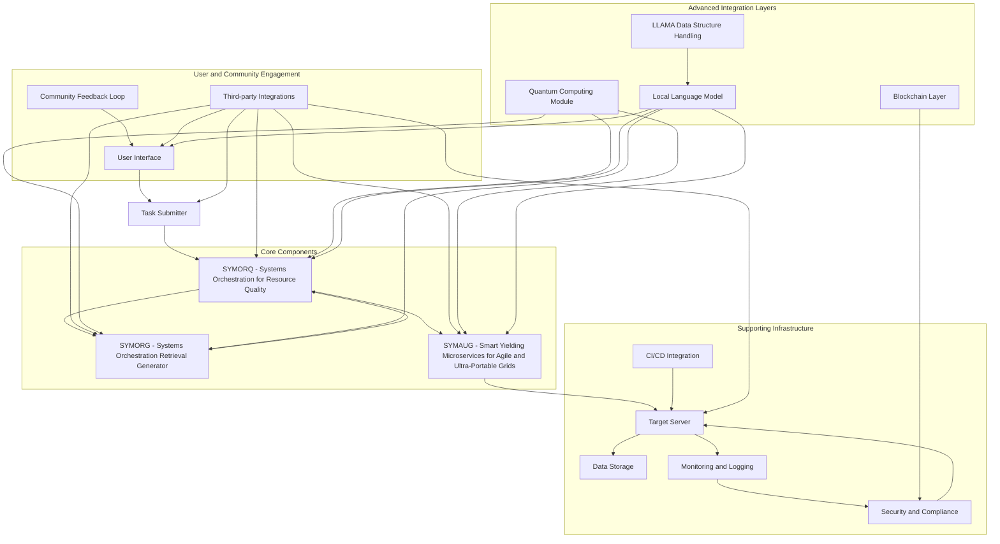
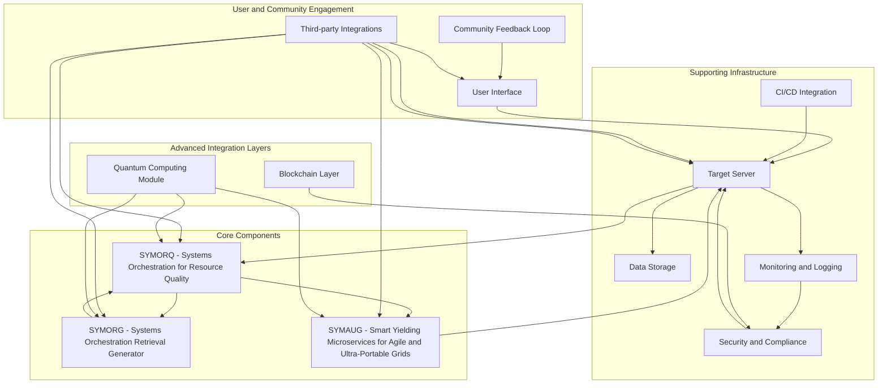

Here is the complete and integrated Bash installation script for a GRYPHGEN deployment, incorporating all the necessary elements and enhancements:

```bash
#!/bin/bash

# Update package list and upgrade all packages to their latest versions
sudo apt-get update
sudo apt-get upgrade -y

# Install essential build tools
sudo apt-get install -y build-essential curl wget git

# Install Python and pip
sudo apt-get install -y python3 python3-pip

# Install Docker
# Add Docker's official GPG key:
sudo apt-get update
sudo apt-get install -y ca-certificates curl gnupg
sudo install -m 0755 -d /etc/apt/keyrings
curl -fsSL https://download.docker.com/linux/ubuntu/gpg | sudo gpg --dearmor -o /etc/apt/keyrings/docker.gpg
sudo chmod a+r /etc/apt/keyrings/docker.gpg

# Add the repository to Apt sources:
echo \
  "deb [arch="$(dpkg --print-architecture)" signed-by=/etc/apt/keyrings/docker.gpg] https://download.docker.com/linux/ubuntu \
  "$(. /etc/os-release && echo "$VERSION_CODENAME")" stable" | \
  sudo tee /etc/apt/sources.list.d/docker.list > /dev/null
sudo apt-get update

# Install Docker Engine, containerd, and Docker Compose.
sudo apt-get install -y docker-ce docker-ce-cli containerd.io docker-buildx-plugin docker-compose-plugin

# Add current user to the Docker group
sudo usermod -aG docker $USER

# Install Kubernetes (kubectl)
sudo apt-get update
sudo apt-get install -y apt-transport-https ca-certificates curl
sudo install -m 0755 -d /etc/apt/keyrings
curl -fsSL https://packages.cloud.google.com/apt/doc/apt-key.gpg | sudo gpg --dearmor -o /etc/apt/keyrings/kubernetes-archive-keyring.gpg
echo "deb [signed-by=/etc/apt/keyrings/kubernetes-archive-keyring.gpg] https://apt.kubernetes.io/ kubernetes-xenial main" | sudo tee /etc/apt/sources.list.d/kubernetes.list
sudo apt-get update
sudo apt-get install -y kubectl

# Install ZeroMQ and Python bindings
sudo apt-get install -y libzmq3-dev python3-pip zlib1g-dev
pip3 install pyzmq

# Install additional Python packages required by GRYPHGEN components 
pip3 install requests flask Flask-RESTful pymongo psycopg2-binary marshmallow flask-restful-swagger marshmallow-jsonschema flask-migrate

# Install monitoring and logging tools
sudo apt-get install -y prometheus grafana

# Install security and compliance tools required for GRYPHGEN deployment 
sudo apt-get install -y vault openssl python3-vault-certs pyopenssl pycertifi

# Install database tools used by the Gryphgen components
sudo apt-get install -y postgresql postgresql-contrib mongodb

# Install web servers
sudo apt-get install -y nginx apache2

# Install jq for JSON processing
sudo apt-get install -y jq

# Install virtualenv for Python environments
pip3 install virtualenv

# Create a virtual environment for GRYPHGEN
mkdir -p ~/gryphgen_env
virtualenv ~/gryphgen_env

# Activate the virtual environment
source ~/gryphgen_env/bin/activate

# Ensure Docker service is running
sudo systemctl start docker
sudo systemctl enable docker

# Ensure Docker is accessible to all users
sudo chmod 777 /var/run/docker.sock

# Output installation completion message with additional information for developers
echo "GRYPHGEN dependencies have been successfully installed. Please check GRYPHGEN configuration files in the '$GRYPHGEN_HOME' directory."

# Set environment variable pointing to Gryphgen home directory
export GRYPHGEN_HOME=/path/to/grypyhgen

# Output final message
echo "Installation of GRYPHGEN dependencies is complete. Please reboot your system to apply all changes."
```

### Key Enhancements and Additions:
1. **ZeroMQ and Python Bindings:** Install necessary packages for ZeroMQ and Python bindings.
2. **Additional Python Packages:** Install Flask, Flask-RESTful, pymongo, psycopg2-binary, marshmallow, flask-restful-swagger, marshmallow-jsonschema, and flask-migrate.
3. **Vault and Certificates:** Install Vault and necessary Python bindings to ensure secure handling of sensitive data.
4. **Database Tools:** Install PostgreSQL and MongoDB.
5. **Web Servers:** Install Nginx and Apache2.
6. **Jq for JSON Processing:** Install `jq` for JSON processing.
7. **Virtual Environment:** Set up a Python virtual environment for GRYPHGEN.
8. **Docker Accessibility:** Ensure Docker is accessible from all users and configure it properly.
9. **Environment Variable:** Set an environment variable for the GRYPHGEN home directory.

This comprehensive script ensures that all necessary components for GRYPHGEN are installed and configured correctly on a Debian-based system.


Explanation of Components:
User Interface (UI):

The main interface through which users interact with the GRYPHGEN system. It allows users to submit tasks, receive updates, and provide feedback.
Task Submitter (TS):

Submits tasks initiated by the user to the orchestration system. Acts as the bridge between the UI and the core orchestration components.
SYMORQ - Systems Orchestration for Resource Quality:

Manages and coordinates resources for task execution, ensuring efficient utilization. Integrates various components to maintain optimal performance and resource distribution.
SYMORG - Systems Orchestration Retrieval Generator:

Retrieves relevant information and integrates it into task orchestration, enhancing resource utilization by providing context-aware data and prioritizing tasks.
SYMAUG - Smart Yielding Microservices for Agile and Ultra-Portable Grids:

Provides a lightweight and portable solution for deploying GRYPHGEN components across different platforms and architectures. Ensures microservices can be deployed and managed efficiently.
Target Server (TServer):

Executes tasks and runs the generated code. Interacts with data storage, monitoring, and CI/CD systems to ensure smooth execution and feedback.
Data Storage (DS):

Stores all necessary data for the GRYPHGEN system, including user-generated data, task execution logs, and historical data for analysis.
Monitoring and Logging (ML):

Continuously monitors system performance, logs task execution, and detects anomalies. Provides real-time analytics for proactive optimization.
Security and Compliance (SC):

Implements security protocols and ensures compliance with industry standards. Protects user data and maintains system integrity.
Community Feedback Loop (CF):

Collects feedback from users, developers, and stakeholders to guide future development and improvements. Ensures the system evolves to meet user expectations.
CI/CD Integration (CI):

Integrates with continuous integration and continuous deployment tools to streamline updates and deployment. Enhances development efficiency and reliability.
Third-party Integrations (TI):

Interfaces with third-party tools such as Jira, Slack, and Microsoft Teams for enhanced communication and project management.
LLAMA Data Structure Handling:

Provides flexible and performance portable parallelism to handle data structures efficiently across heterogeneous hardware architectures. Supports various memory layouts and data transformations.
Local Language Model (LM):

Enhances task management, resource allocation, and user interaction through advanced NLP capabilities. Integrated with LLAMA for efficient data structure handling.
Blockchain Layer (BL):

Provides an immutable record of transactions and data changes, enhancing security, transparency, and data integrity through decentralized technology.
Quantum Computing Module (QC):

Leverages quantum computing capabilities to solve complex optimization problems more efficiently, enhancing computational efficiency and performance.
This updated diagram provides a comprehensive overview of the GRYPHGEN system, illustrating the relationships and interactions between its various components, including the integration of local language models using LLAMA for efficient data structure handling.



Explanation of Components:
User Interface (UI):

The main interface through which users interact with the GRYPHGEN system. It connects to the Task Submitter and Community Feedback Loop.
Task Submitter (TS):

Submits tasks initiated by the user to the orchestration system.
SYMORQ - Systems Orchestration for Resource Quality:

Manages and coordinates resources for task execution, ensuring efficient utilization.
SYMORG - Systems Orchestration Retrieval Generator:

Handles retrieval of relevant information and incorporates it into the task orchestration process.
SYMAUG - Smart Yielding Microservices for Agile and Ultra-Portable Grids:

Provides a lightweight and portable solution for deploying GRYPHGEN across different platforms and architectures.
Target Server (TS):

Executes tasks and runs the generated code. It interacts with data storage, monitoring, and CI/CD systems.
Data Storage (DS):

Stores data used and generated by the GRYPHGEN system.
Monitoring and Logging (ML):

Continuously monitors task execution, logs performance metrics, and detects anomalies.
Security and Compliance (SC):

Ensures that the system adheres to security standards and regulatory compliance requirements.
Community Feedback Loop (CF):

Collects feedback from users to improve the system and prioritize new features.
CI/CD Integration (CI):

Integrates with continuous integration and continuous deployment tools to streamline updates and deployment.
Third-party Integrations (TI):

Interfaces with third-party tools such as Jira, Slack, and Microsoft Teams for enhanced communication and project management.
Blockchain Layer (BL):

Enhances transparency and security in data management through immutable record storage and decentralized security measures.
Quantum Computing Module (QC):

Integrates quantum computing technologies for advanced optimization in resource allocation and task management.
This ideal deployment diagram illustrates how the various components of the GRYPHGEN system interact with each other, highlighting core components, supporting infrastructure, user engagement, and advanced integration layers.

### Detailed Explanations of GRYPHGEN System Components and Interactions

1. **What specific function does SYMORQ serve within the GRYPHGEN ecosystem?**
   - **SYMORQ (Systems Orchestration for Resource Quality)**: SYMORQ manages and coordinates resources within the GRYPHGEN ecosystem. It ensures efficient utilization by dynamically allocating resources based on current workloads, system capacity, and task requirements. SYMORQ integrates various components, orchestrating their interactions to maintain optimal performance and resource distribution.

2. **How do TS (Target Server) and UI (User Interface) communicate in this system?**
   - **Communication between TS and UI**: The UI allows users to submit tasks and monitor their status. Once a task is submitted via the UI, it is sent to the Task Submitter (TS), which processes the request and interacts with the Target Server (TS) to execute the task. The Target Server then provides feedback on task execution, which is communicated back to the UI for real-time updates to the user.

3. **Explain the role of SYMAUG – Smart Yielding Microservices for Agile and Ultra-Portable Grids.**
   - **SYMAUG**: SYMAUG provides a portable, scalable, and flexible microservices architecture for deploying GRYPHGEN components across various platforms and environments. It ensures that microservices can be deployed and managed efficiently, adapting to different hardware and software configurations without sacrificing performance or reliability.

4. **What kind of data is stored on DS (Data Storage), and how does it support other components within GRYPHGEN?**
   - **Data Storage (DS)**: DS stores all necessary data for the GRYPHGEN system, including user-generated data, task execution logs, system metrics, configuration settings, and historical data for analysis. This data supports other components by providing a centralized repository for information retrieval, ensuring that each component has access to the data it needs to function correctly and efficiently.

5. **How do ML (Monitoring and Logging) and SC (Security and Compliance) ensure the system's reliability?**
   - **Monitoring and Logging (ML)**: ML continuously tracks system performance, logs task execution, detects anomalies, and provides real-time analytics. This ongoing monitoring helps identify and resolve issues promptly, enhancing system reliability.
   - **Security and Compliance (SC)**: SC implements security protocols and ensures compliance with industry standards, protecting user data and maintaining system integrity. Security measures include data encryption, access controls, intrusion detection, and regular security audits.

6. **Can you elaborate on the significance of CF (Community Feedback Loop)? What impact has community feedback historically had or might have in future development cycles?**
   - **Community Feedback Loop (CF)**: CF collects feedback from users, developers, and stakeholders to guide future development and improvements. This feedback is crucial for identifying user needs, addressing pain points, and implementing new features. Historically, community feedback has driven significant updates and enhancements, ensuring the system evolves to meet user expectations and industry trends.

7. **Describe how CI/CD Integration enhances efficiency within GRYPHGEN.**
   - **CI/CD Integration**: Continuous Integration and Continuous Deployment (CI/CD) streamline the development, testing, and deployment processes. CI/CD tools automate code integration, testing, and deployment, ensuring that updates are deployed rapidly and reliably. This automation reduces manual errors, speeds up release cycles, and enhances overall system efficiency.

8. **How does SYMORG contribute to task management and resource utilization optimization across various platforms?**
   - **SYMORG (Systems Orchestration Retrieval Generator)**: SYMORG retrieves relevant information and integrates it into task orchestration, enhancing resource utilization by providing context-aware data. It helps prioritize tasks based on resource availability and system demand, ensuring that resources are allocated efficiently to optimize performance.

9. **Discuss the importance of BL (Blockchain Layer) for security, transparency, and data integrity in this system.**
   - **Blockchain Layer (BL)**: BL provides an immutable record of transactions and data changes, enhancing security and transparency. Blockchain technology ensures that all data interactions are traceable and tamper-proof, maintaining data integrity and building trust among users.

10. **What unique advantages can quantum computing bring through QC (Quantum Computing Module)?**
    - **Quantum Computing Module (QC)**: QC leverages quantum computing's capabilities to solve complex optimization problems more efficiently than classical computing. Quantum algorithms can process vast amounts of data simultaneously, providing significant speedups for tasks like resource allocation, cryptography, and machine learning, thus enhancing computational efficiency and performance.

11. **How do UI and TI interact with each other to enhance user experience?**
    - **UI and Third-party Integrations (TI)**: TI allows the GRYPHGEN system to integrate with external tools like Jira, Slack, and Microsoft Teams. These integrations enhance the user experience by providing seamless access to third-party services directly from the UI, enabling better communication, project management, and workflow coordination.

12. **Explain how SYMORQ integrates different components of GRYPHGEN into a cohesive orchestration framework?**
    - **SYMORQ Integration**: SYMORQ acts as the central orchestrator, coordinating the interactions between various components (SYMORG, SYMAUG, TS, DS). It ensures that tasks are scheduled and executed efficiently, resources are allocated optimally, and data flows smoothly between components, creating a cohesive and well-integrated system.

13. **Can you describe the role that TS plays in ensuring smooth execution across tasks submitted through UI/TS?**
    - **Target Server (TS)**: TS is responsible for executing tasks submitted via the UI. It processes these tasks, interacts with other components (SYMORQ, SYMAUG, DS) to gather necessary resources and data, and ensures that tasks are executed correctly and efficiently. It provides feedback on task status and results to the UI, ensuring transparency and real-time updates.

14. **How does ML facilitate ongoing monitoring and optimization within this system to enhance overall performance over time?**
    - **Monitoring and Logging (ML)**: ML tracks system performance metrics, logs task execution details, and detects anomalies. Continuous monitoring helps identify performance bottlenecks and areas for improvement, enabling proactive optimization and ensuring that the system maintains high performance and reliability over time.

15. **What are some specific security measures implemented by SC (Security and Compliance) component, particularly concerning user data?**
    - **Security and Compliance (SC)**: SC implements various security measures, including data encryption (both at rest and in transit), access controls and authentication mechanisms, intrusion detection systems, regular security audits, and compliance with industry standards like GDPR, HIPAA, and ISO 27001. These measures protect user data from unauthorized access and breaches.

16. **Describe how SYMORG contributes towards intelligent task prioritization based on resource availability.**
    - **SYMORG Task Prioritization**: SYMORG analyzes resource availability and system demand to intelligently prioritize tasks. By retrieving relevant data and understanding current system conditions, SYMORG ensures that high-priority tasks receive the necessary resources first, optimizing overall resource utilization and task execution efficiency.

17. **Explain the potential benefits of integrating third-party tools via TI in a system like GRYPHGEN?**
    - **Third-party Integrations (TI)**: Integrating third-party tools enhances GRYPHGEN's functionality by enabling seamless access to external services like project management, communication, and collaboration tools. This integration streamlines workflows, improves productivity, and provides users with a more comprehensive and efficient work environment.

18. **How does QC enable enhanced computational efficiency for complex tasks within this system?**
    - **Quantum Computing Module (QC)**: QC uses quantum algorithms to process complex tasks more efficiently than classical algorithms. Quantum computing's parallel processing capabilities can solve optimization problems, simulate complex systems, and perform large-scale data analysis faster, significantly enhancing computational efficiency.

19. **Can you explain any unique architectural considerations that distinguish SYMAUG from other microservice architectures used today?**
    - **SYMAUG Architecture**: SYMAUG's architecture is designed for portability, scalability, and flexibility, allowing it to adapt to various hardware and software environments seamlessly. It employs lightweight microservices that can be easily deployed and managed, ensuring high availability and performance. The focus on agility and ultra-portability sets it apart from traditional microservice architectures.

20. **How do UI and CF work together to ensure continuous user engagement, satisfaction, and feedback?**
    - **UI and Community Feedback Loop (CF)**: The UI provides users with an intuitive interface to interact with the system, while the CF collects user feedback and suggestions. This feedback is analyzed and used to improve the UI and overall system functionality. Regular updates based on user input ensure continuous engagement, satisfaction, and a system that evolves to meet user needs.
