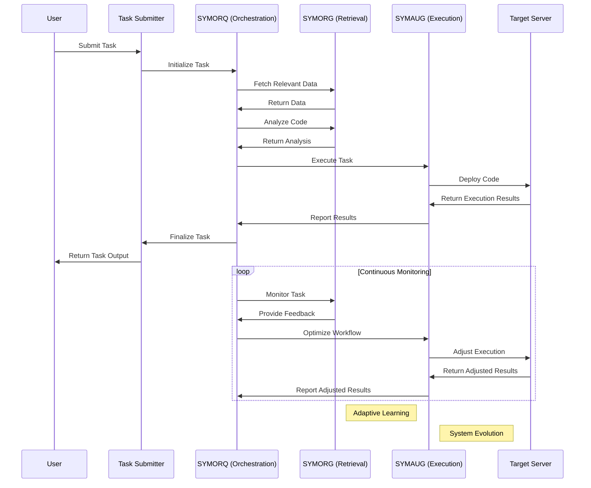

To simplify the GRYPHGEN framework and run it on the specified system, we'll streamline the tooling and ensure it integrates smoothly with your environment. We'll also break down the components and workflow to be more concise and clear.

### System Specifications
- **OS**: Ubuntu 22.04 Jammy
- **Kernel**: x86_64 Linux 6.5.0-41-generic
- **Uptime**: 5h 16m
- **Packages**: 3993
- **Shell**: Bash 5.1.16
- **Disk**: 751G / 938G (85%)
- **CPU**: AMD Ryzen 9 5950X 16-Core @ 3.4GHz
- **GPU**: NVIDIA GeForce RTX 3060, NVIDIA GeForce GTX 1060 6GB
- **RAM**: 19226MiB / 128724MiB

### GRYPHGEN Framework

**GRYPHGEN** (Grid Resource Prioritization in Heterogeneous Environments) is a simplified framework that leverages large language models (LLMs) to automate software production at scale. It consists of three main components: SYMORQ, SYMORG, and SYMAUG.

#### Components

1. **SYMORQ (Systems Orchestration for Resource Quality)**
   - **Function**: Orchestrates and coordinates resources using ZeroMQ for efficient resource utilization.
   - **Tool**: ZeroMQ (lightweight messaging library).

2. **SYMORG (Systems Orchestration Retrieval Generator)**
   - **Function**: Automates the retrieval and incorporation of relevant information to enhance LLM accuracy using Retrieval-Augmented Generation (RAG).
   - **Tool**: Simple HTTP requests and JSON parsing for data retrieval.

3. **SYMAUG (Smart Yielding Microservices for Agile and Ultra-Portable Grids)**
   - **Function**: Provides a portable solution for Gryphgen deployment across various platforms using Docker or VM.
   - **Tool**: Docker (containerization).

### Workflow

1. **Task Submission and Initialization**
   - **Code Generator (A)**: Generates initial code.
   - **Code Analyzer (B)**: Checks for errors and ensures alignment with project parameters.
   - **Task Monitor (C)**: Monitors task alignment and functionality.

2. **Code Generation and Analysis**
   - **Execution**: Code Generator writes and executes tasks on the target server.
   - **Analysis**: Code Analyzer reviews code for errors and suggestions.

3. **Task Monitoring and Workflow Optimization**
   - **Monitoring**: Task Monitor ensures task alignment and reverts to checkpoints if necessary.
   - **Optimization**: Workflow Optimizer (D) restarts processes and prevents roadblocks.

4. **Continuous Deployment and Monitoring**
   - **Deployment**: Target server executes tasks and writes code.
   - **Continuous Monitoring**: Code Analyzer and Task Monitor ensure proper function and error-free operation.

5. **Adaptive Learning and System Evolution**
   - **Learning**: System evolves based on previous iterations to improve efficiency and effectiveness.

### Implementation Example

1. **Setup ZeroMQ**
   ```bash
   sudo apt-get install libzmq3-dev
   pip install pyzmq
   ```

2. **Docker Installation**
   ```bash
   sudo apt-get update
   sudo apt-get install docker.io
   sudo systemctl start docker
   sudo systemctl enable docker
   ```

3. **Basic Task Submission Script**
   ```python
   import zmq
   import json
   import requests

   # SYMORQ: Orchestration
   context = zmq.Context()
   socket = context.socket(zmq.REQ)
   socket.connect("tcp://localhost:5555")

   # SYMORG: Retrieval
   def fetch_data(query):
       response = requests.get(f"http://example.com/api?query={query}")
       return response.json()

   # SYMAUG: Task Execution
   def execute_task(task):
       # Docker execution example
       import os
       os.system(f"docker run -d {task}")

   # Task Submission
   task = {
       "code": "print('Hello, World!')",
       "query": "example query"
   }
   socket.send_json(task)
   message = socket.recv()
   print(f"Received reply: {message}")

   # Fetch and incorporate data
   data = fetch_data(task["query"])
   print(f"Fetched data: {data}")

   # Execute task
   execute_task("python:3.9")
   ```

By using these simplified tools and processes, GRYPHGEN can efficiently run on your specified system, automating software production at scale.


Yes, I mentioned adaptive learning and system evolution in the diagram. Here's an explanation of how these elements work within the GRYPHGEN framework:

### Adaptive Learning
Adaptive learning is a process where the system continuously improves its performance by learning from past experiences and data. In the GRYPHGEN framework:

1. **Monitoring and Feedback**: During the continuous monitoring phase, SYMORQ and SYMORG constantly analyze the task execution results.
2. **Data Collection**: SYMORG collects data and feedback from the executed tasks and any encountered errors or inefficiencies.
3. **Learning**: SYMORG uses this feedback to adjust its retrieval and analysis algorithms, improving the accuracy and relevance of the information it provides.
4. **Optimization**: SYMORQ uses this improved information to optimize resource orchestration, making the system more efficient over time.

### System Evolution
System evolution refers to the framework's ability to evolve and adapt to new challenges and requirements, enhancing its capabilities over time. In the GRYPHGEN framework:

1. **Process Refinement**: SYMAUG and SYMORQ continuously refine their workflows based on feedback from SYMORG and the target server's execution results.
2. **Algorithm Improvement**: SYMORG updates its algorithms to incorporate new data and learning, making future retrievals more effective.
3. **Component Interaction**: The interactions between SYMORQ, SYMORG, and SYMAUG become more streamlined and efficient, reducing latency and improving overall system performance.
4. **Self-Deployment**: The system learns to self-deploy more effectively across different environments, ensuring consistent performance regardless of the underlying hardware or software constraints.

### How Adaptive Learning and System Evolution Work

1. **During Continuous Monitoring**:
   - SYMORQ and SYMORG analyze the task execution and gather feedback.
   - SYMORG refines its retrieval algorithms to improve data relevance and accuracy.
   - SYMORQ optimizes resource orchestration based on this feedback.

2. **System Evolution**:
   - SYMAUG and SYMORQ continuously improve their workflows.
   - SYMORG updates its algorithms to incorporate new learnings.
   - The system becomes more efficient, reducing latency and improving performance.
   - It adapts to new environments, ensuring consistent and reliable deployment.

These elements ensure that GRYPHGEN becomes more efficient and effective over time, capable of handling increasing complexity and scale in software production.


1. **Installation Challenges**: 
   - **Dependency Conflicts**: During initial setup, you may encounter dependency conflicts, especially with libraries like ZeroMQ, Docker, and Python packages. Ensuring compatible versions of all dependencies can be a challenge.
   - **System Requirements**: Verifying that the system meets the hardware and software requirements, such as the necessary kernel version, sufficient disk space, and correct driver versions for GPUs, can also pose challenges.

2. **Scalability Considerations**:
   - **Multiple Servers/Clusters**: To scale across multiple servers or clusters, you need to ensure that the orchestration layer (SYMORQ) can handle distributed environments. This includes configuring ZeroMQ to manage message passing across different nodes and ensuring that Docker containers can be orchestrated using tools like Kubernetes.
   - **Infrastructure Considerations**: Deploying on larger infrastructure requires careful planning of network configurations, load balancing, and resource management to ensure efficient task distribution and minimal latency.

3. **Resource Allocation**:
   - **Optimization Techniques**: GRYPHGEN can optimize resource allocation by monitoring resource usage patterns and dynamically adjusting resource distribution based on the computational capacities of different nodes. This involves leveraging tools like cgroups and Docker's resource management features to allocate CPU, memory, and GPU resources efficiently.
   - **Heterogeneous Environments**: In environments with varying computational capacities, implementing a resource scheduler that can assess the capabilities of each node and allocate tasks accordingly is crucial. This ensures that tasks are assigned to nodes where they can be executed most efficiently.

4. **Continuous Integration/Continuous Deployment (CI/CD)**:
   - **Integration into CI/CD Pipelines**: GRYPHGEN can be integrated into existing CI/CD pipelines using plugins or custom scripts. For example, Jenkins, GitLab CI, or GitHub Actions can be configured to trigger task submissions and monitor execution statuses.
   - **Automated Testing and Deployment**: Specific configurations, such as YAML files for pipeline definitions, and plugins for monitoring Docker container statuses, are essential. This ensures that tasks are automatically tested and deployed with minimal manual intervention.

5. **Monitoring Tools**:
   - **Detailed Monitoring**: Tools like Prometheus and Grafana can be integrated with GRYPHGEN for detailed monitoring. Prometheus can collect metrics on task execution, resource usage, and error rates, while Grafana can visualize these metrics in real-time dashboards.
   - **Error Tracking and Performance Metrics**: Tools like ELK Stack (Elasticsearch, Logstash, and Kibana) can be used for error tracking and performance monitoring. This setup allows for centralized logging, real-time analysis, and visualization of logs and performance data.

6. **Security Implications**:
   - **Handling Sensitive Data**: GRYPHGEN should handle sensitive data such as credentials or encryption keys securely. This can be achieved by using secret management tools like HashiCorp Vault or Kubernetes Secrets to manage and encrypt sensitive information.
   - **Security Best Practices**: When deploying in secure environments, follow best practices such as using TLS for encrypting communication, implementing role-based access control (RBAC), and regularly updating dependencies to mitigate vulnerabilities.

7. **Error Handling Mechanisms**:
   - **Built-in Error Handling**: GRYPHGEN should include mechanisms for handling errors during task execution. This can involve retry logic, where failed tasks are automatically retried a specified number of times, and fallback mechanisms, where tasks can be rerouted to other nodes if a failure occurs.
   - **Rollback Strategies**: To maintain service availability, implementing rollback strategies is crucial. This involves saving checkpoints and previous states so that the system can revert to a stable state in case of failures. Continuous monitoring helps detect failures early and trigger rollbacks as needed.

8. **User Interface Enhancements**:
   - **Improved User Interfaces**: Enhancing the deployment experience with improved user interfaces or dashboarding features can significantly improve usability. A web-based dashboard can provide real-time insights into task statuses, resource utilization, and system health.
   - **Usability in Production Environments**: These enhancements make it easier for users to interact with GRYPHGEN, monitor ongoing tasks, and make informed decisions. Features like alerts and notifications can further improve the user experience by providing timely updates on task progress and issues.

By addressing these aspects, GRYPHGEN can be effectively deployed and managed in various environments, ensuring scalability, efficient resource utilization, robust error handling, and enhanced usability.

Here's a more detailed breakdown for each point:

1. **Installation Challenges:**

   - **Dependency Conflicts**:
     - When installing dependencies like ZeroMQ, Docker, and Python packages, it is essential to ensure compatibility among all versions.
     - Use tools such as `pipenv` or `virtualenv` to create isolated environments with specific package versions.

   - **System Requirements**:
     - Verify that your system meets the hardware requirements specified by GRYPHGEN. This includes ensuring sufficient disk space, compatible kernel version (Linux 6.x), and correct GPU drivers.
     - Check for any missing dependencies or required configurations before proceeding with installation.

2. **Scalability Considerations:**

   - **Multiple Servers/Clusters**:
     - Use ZeroMQ's message passing capabilities to manage communication across distributed nodes in the grid environment.
     - Implement a Kubernetes cluster management system alongside Docker containers for effective resource allocation and scaling of tasks.

   - **Infrastructure Considerations**:
     - Plan network configurations such as load balancing, ensuring minimal latency during task distribution.
     - Optimize resource management using tools like cgroups to allocate CPU, memory, and GPU resources efficiently across nodes.

3. **Resource Allocation:**

   - **Optimization Techniques**:
     - Utilize ZeroMQ's message routing features for efficient data transmission between distributed nodes based on their computational capacities.
     - Leverage Docker's resource management options (CPU cgroups, memory limits) to allocate resources dynamically and optimize performance.

   - **Heterogeneous Environments**:
     - Implement a custom resource scheduler that can assess the capabilities of each node in real-time for task assignment. Consider using tools like Kubernetes' Horizontal Pod Autoscaler.
     - Ensure tasks are assigned based on the computational strengths available, balancing load across nodes to optimize overall system performance.

4. **Continuous Integration/Continuous Deployment (CI/CD):**

   - **Integration into CI/CD Pipelines**:
     - Use plugins or custom scripts within CI/CD tools like Jenkins, GitLab CI, and GitHub Actions.
     - Automate task submission with predefined configurations in YAML files for seamless integration.

   - **Automated Testing and Deployment**:
     - Set up automated testing phases where tasks are executed locally to ensure correctness before deployment on the target server.
     - Configure continuous monitoring and feedback loops within CI/CD pipelines, ensuring that any issues during deployment or runtime are promptly identified.

5. **Monitoring Tools:**

   - **Detailed Monitoring**:
     - Integrate Prometheus for metrics collection and Grafana for real-time visualizations to monitor task execution status and resource utilization.
     - Use ELK Stack (Elasticsearch, Logstash, Kibana) for centralized logging and performance monitoring.

6. **Security Implications:**

   - **Handling Sensitive Data**:
     - Utilize secret management solutions like HashiCorp Vault or Kubernetes Secrets to securely manage credentials and encryption keys.
     - Implement TLS encryption protocols where necessary to ensure secure communication between components of the framework.

7. **Error Handling Mechanisms:**

   - **Built-in Error Handling**:
     - Implement retry logic for tasks that fail due to temporary issues, with a predefined number of retries before failing permanently.
     - Use fallback mechanisms such as task rerouting or reassignment in case node failures occur during execution.

8. **User Interface Enhancements:**

   - **Improved User Interfaces**:
     - Develop web-based dashboards using tools like Grafana to visualize real-time data, monitor tasks, and provide insights into system health.
     - Implement alerting mechanisms within the dashboard for proactive monitoring of task statuses and potential issues.

By addressing these considerations during installation and deployment, GRYPHGEN can be effectively deployed in various environments while ensuring robust performance, scalability, security, and usability.


Here are the ten additional thought-provoking questions regarding GRYPHGEN, along with some potential answers and considerations:

### 9. Data Privacy and Compliance
- **How does GRYPHGEN ensure compliance with data privacy regulations like GDPR or CCPA when processing user-generated information?**
  - GRYPHGEN must implement mechanisms to handle and process data in compliance with GDPR or CCPA. This includes ensuring that data is encrypted both at rest and in transit, providing users with the ability to control their data (e.g., right to be forgotten), and conducting regular audits to verify compliance.

- **Are there built-in mechanisms to anonymize sensitive data before it is processed by the system?**
  - Yes, GRYPHGEN should include data anonymization tools that can automatically detect and anonymize sensitive information before processing. This can involve techniques such as data masking, tokenization, and pseudonymization.

### 10. Cross-Language Integration
- **Can GRYPHGEN seamlessly integrate and work across multiple programming languages (e.g., Python, Java, JavaScript) within a single task pipeline?**
  - GRYPHGEN should support multi-language integration by leveraging containerization (e.g., Docker) to isolate dependencies and runtime environments for different languages, allowing tasks to be written in various languages and executed within the same pipeline.

- **What are the best practices for managing language-specific dependencies in distributed environments using ZeroMQ or Docker containers?**
  - Best practices include using language-specific base images for Docker containers, managing dependencies using package managers (e.g., pip for Python, Maven for Java), and ensuring that each container is lightweight and only includes necessary dependencies. ZeroMQ can facilitate communication between containers running different languages.

### 11. Fault Tolerance and High Availability
- **How does GRYPHGEN ensure fault tolerance to prevent system-wide failures due to individual node issues?**
  - GRYPHGEN should implement fault tolerance by using redundancy, such as replicating tasks across multiple nodes, employing health checks to detect and isolate faulty nodes, and utilizing load balancers to distribute tasks evenly.

- **Are there built-in redundancy mechanisms, such as replication of tasks across multiple nodes for high availability?**
  - Yes, GRYPHGEN should include redundancy mechanisms where tasks are replicated across multiple nodes to ensure high availability. If one node fails, another can take over without disrupting the overall workflow.

### 12. User Training and Support
- **What kind of training materials or documentation is provided for users to understand how GRYPHGEN works effectively in their environments?**
  - GRYPHGEN should offer comprehensive documentation, including user guides, tutorials, and example projects. Additionally, video tutorials and webinars can help users get started and understand advanced features.

- **How does the system handle support requests from users facing issues during deployment or task execution? Is there a dedicated team or community forum available for assistance?**
  - GRYPHGEN should provide multiple support channels, including a dedicated support team, community forums, and a ticketing system for handling user issues. Regular community Q&A sessions and a robust FAQ section can also be beneficial.

### 13. Integration with Third-party Tools
- **Can GRYPHGEN integrate seamlessly with other third-party tools commonly used in software production (e.g., Git, Jira)?**
  - Yes, GRYPHGEN should provide integration with third-party tools through APIs and plugins. For instance, it can integrate with Git for version control and Jira for project management, enhancing the overall workflow.

- **How do these integrations enhance the overall workflow and productivity of development teams using GRYPHGEN?**
  - Integrations with third-party tools streamline the development process by enabling seamless version control, issue tracking, and project management within GRYPHGEN. This leads to increased productivity and a more efficient workflow.

### 14. Scalability for Large Enterprises
- **In large-scale enterprise environments, what specific challenges are faced when scaling up GRYPHGEN's infrastructure to support thousands or tens of thousands of concurrent tasks?**
  - Challenges include managing resource contention, ensuring low-latency communication between nodes, maintaining consistent performance under heavy load, and handling failures gracefully. 

- **What strategies can be employed to optimize resource allocation and task distribution in such massive scales while maintaining performance?**
  - Strategies include using advanced scheduling algorithms to optimize task distribution, implementing horizontal scaling to add more nodes as needed, and utilizing caching and load balancing to reduce latency and improve performance.

### 15. Customization and Extensibility
- **How modular is the design of GRYPHGEN? Can users customize individual components (e.g., SYMORQ, SYMORG) or extend functionality as per their specific needs?**
  - GRYPHGEN should be designed with modularity in mind, allowing users to replace or extend components like SYMORQ or SYMORG. This can be facilitated through well-defined APIs and plugin architectures.

- **Are there APIs provided for developers to integrate custom workflows into GRYPHGEN's overall system architecture?**
  - Yes, GRYPHGEN should offer APIs that enable developers to integrate custom workflows, create new modules, or extend existing functionality, providing flexibility and adaptability to various use cases.

### 16. Environment Consistency and Reproducibility
- **How does GRYPHGEN ensure that the deployment environment remains consistent across different development, testing, and production stages?**
  - GRYPHGEN can use containerization (e.g., Docker) and orchestration tools (e.g., Kubernetes) to ensure environment consistency. Additionally, infrastructure-as-code (IaC) tools like Terraform can help maintain consistent environments across stages.

- **What techniques or tools are used in this regard to achieve reproducible results from one node to another within a distributed grid?**
  - Techniques include using version-controlled configuration files, container images, and CI/CD pipelines to automate the deployment process and ensure that the same environment is replicated across all nodes.

### 17. Integration with DevOps Practices
- **How well does GRYPHGEN integrate into existing DevOps practices such as automated build pipelines (CI/CD), infrastructure-as-code, and configuration management?**
  - GRYPHGEN should integrate seamlessly with DevOps practices by supporting tools like Jenkins, GitLab CI, or GitHub Actions for CI/CD, and using IaC tools like Ansible or Terraform for consistent provisioning and configuration management.

- **Can GRYPHGEN leverage tools like Ansible or Terraform for provisioning environments consistently across different teams?**
  - Yes, GRYPHGEN can leverage Ansible or Terraform to provision environments consistently. This ensures that all teams work in identical environments, reducing the chances of discrepancies and deployment issues.

### 18. Performance Optimization Techniques
- **What specific techniques are employed within the system to optimize performance during task execution?**
  - Techniques include load balancing, task scheduling based on resource availability, using in-memory data stores for quick access, and optimizing network communication with ZeroMQ.

- **Are there any best practices recommended by the framework's documentation on optimizing resource utilization and minimizing latency in distributed grid operations?**
  - Best practices may include monitoring resource usage continuously, fine-tuning task scheduling algorithms, minimizing data transfer between nodes, and using efficient serialization formats for data exchange.

### 19. Community Contributions and Ecosystem Growth
- **How is GRYPHGEN community-driven, encouraging contributions from users worldwide that contribute to its development and growth?**
  - GRYPHGEN can foster a community-driven ecosystem by hosting its codebase on platforms like GitHub, encouraging contributions through pull requests, and maintaining an active forum for discussions and feedback.

- **Are there regular updates or release cycles planned for the framework based on user feedback?**
  - Regular updates and release cycles should be planned, incorporating user feedback to address bugs, add new features, and improve performance. A public roadmap can help the community understand upcoming changes and contribute effectively.

### 20. Future Enhancements and Roadmap
- **What are some upcoming features or enhancements expected in future releases of GRYPHGEN?**
  - Upcoming features could include enhanced security measures, better support for multi-language tasks, improved monitoring and analytics capabilities, and more integrations with popular DevOps tools.

- **How is the project roadmap determined, considering input from its active community users?**
  - The project roadmap can be determined through regular community feedback sessions, surveys, and a dedicated platform for users to suggest and vote on new features. This ensures that the development aligns with the needs and priorities of its user base.

These additional questions delve deeper into the operational, technical, and strategic aspects of GRYPHGEN, providing a comprehensive understanding of the framework's capabilities, challenges, and future direction.
