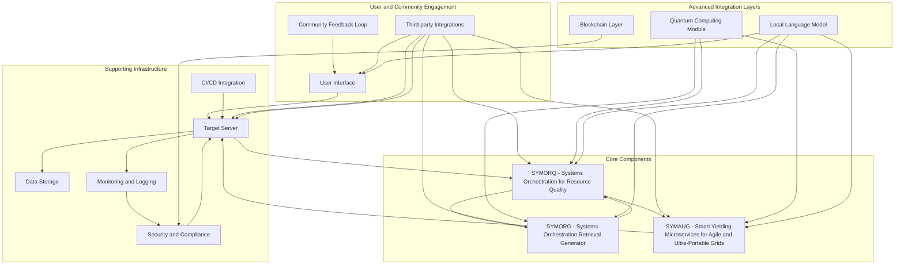

### Local Language Model Deployment Proposal for GRYPHGEN

#### Executive Summary
This proposal outlines the deployment of local language models within the GRYPHGEN system. The objective is to enhance task management, resource allocation, and user interaction using advanced language models. This deployment will focus on ensuring data privacy, reducing latency, and improving overall system performance by leveraging local computation resources.

#### Goals and Objectives
1. **Enhance Task Management**: Utilize language models to improve task interpretation, prioritization, and execution.
2. **Improve Resource Allocation**: Optimize resource allocation using predictive analytics and natural language processing.
3. **Strengthen User Interaction**: Provide a more intuitive and efficient user interface with natural language understanding and generation capabilities.
4. **Ensure Data Privacy**: Maintain data privacy by processing information locally, minimizing reliance on external servers.
5. **Reduce Latency**: Achieve lower latency by leveraging local computational resources for real-time processing.

#### Deployment Architecture
The deployment architecture integrates local language models into the existing GRYPHGEN system components, ensuring seamless interaction and enhanced capabilities.

#### Components and Interactions

1. **Local Language Model (LM)**:
   - **Function**: Enhances task management, resource allocation, and user interaction through advanced NLP capabilities.
   - **Integration**: Interacts with UI, SYMORQ, SYMORG, and SYMAUG to process natural language inputs and outputs, optimizing system performance and user experience.

2. **User Interface (UI)**:
   - **Enhanced with LM**: Allows users to interact with the system using natural language, improving usability and accessibility.
   - **Task Submission**: Users submit tasks in natural language, which are processed by the LM for interpretation and execution.

3. **SYMORQ - Systems Orchestration for Resource Quality**:
   - **Resource Allocation**: Utilizes LM for predictive analytics and optimization of resource allocation based on natural language inputs and historical data.

4. **SYMORG - Systems Orchestration Retrieval Generator**:
   - **Data Retrieval**: Employs LM to understand and retrieve relevant information, ensuring context-aware task execution.

5. **SYMAUG - Smart Yielding Microservices for Agile and Ultra-Portable Grids**:
   - **Microservice Interaction**: Integrates LM for seamless communication and coordination between microservices, enhancing scalability and adaptability.

6. **Monitoring and Logging (ML)**:
   - **Performance Tracking**: Monitors the performance of language models and logs their interactions for continuous improvement and optimization.

7. **Security and Compliance (SC)**:
   - **Data Privacy**: Ensures that all data processed by the LM is secure and complies with data protection regulations, maintaining user trust.

8. **Community Feedback Loop (CF)**:
   - **User Feedback**: Collects feedback on the language model's performance and usability, guiding future improvements and updates.

9. **CI/CD Integration (CI)**:
   - **Deployment**: Facilitates the continuous integration and deployment of language model updates, ensuring the system remains up-to-date with the latest advancements.

10. **Third-party Integrations (TI)**:
    - **Extended Capabilities**: Leverages LM for integrating third-party tools, providing enhanced functionalities like automated project management and real-time communication.

11. **Blockchain Layer (BL)**:
    - **Transparency**: Utilizes blockchain for secure and transparent record-keeping of language model interactions and data transactions.

12. **Quantum Computing Module (QC)**:
    - **Optimization**: Enhances the efficiency and performance of language models by leveraging quantum computing for complex computations.

#### Implementation Plan

1. **Environment Setup**:
   - Install necessary dependencies, including Docker, Kubernetes, and required Python libraries for language model deployment.

2. **Model Integration**:
   - Integrate pre-trained language models into the GRYPHGEN system, ensuring compatibility and seamless interaction with existing components.

3. **Testing and Validation**:
   - Conduct extensive testing to validate the performance and accuracy of language models in handling various tasks and interactions.

4. **Security Measures**:
   - Implement robust security protocols to protect data processed by language models, ensuring compliance with industry standards.

5. **Deployment**:
   - Deploy language models within the GRYPHGEN infrastructure using CI/CD pipelines to automate updates and maintenance.

6. **Monitoring and Optimization**:
   - Continuously monitor the performance of language models and optimize their interactions with other components to enhance overall system efficiency.

7. **User Training**:
   - Provide training resources and documentation to help users understand and effectively utilize the new language model capabilities.

8. **Community Engagement**:
   - Engage with the community to gather feedback and incorporate suggestions into future updates, ensuring continuous improvement.

#### Conclusion
The deployment of local language models within GRYPHGEN will significantly enhance task management, resource allocation, and user interaction. By leveraging local computation resources, the system will achieve lower latency, improved performance, and stronger data privacy. This deployment aligns with GRYPHGEN's goals of creating a scalable, efficient, and user-friendly ecosystem.
